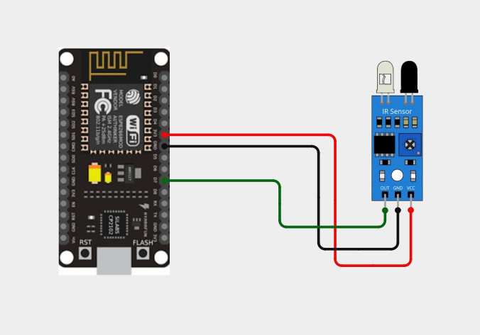
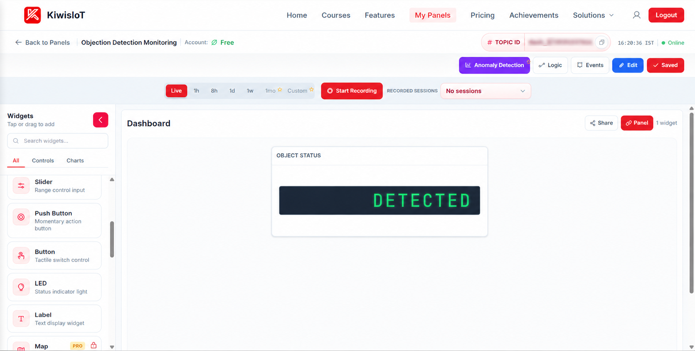
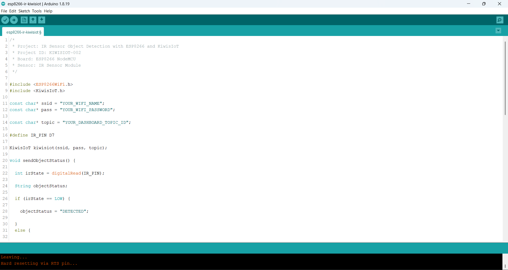
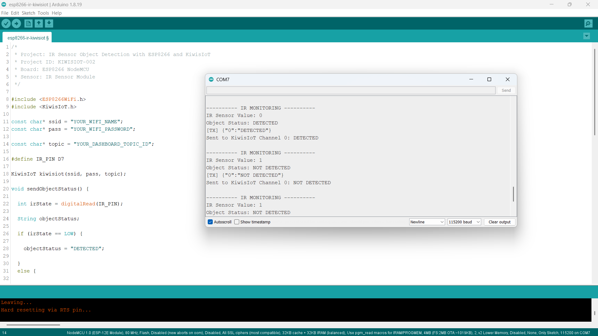

# ESP8266 IR Sensor IoT Project with KiwisIoT 📡

Build an **ESP8266 IR sensor IoT project** to detect objects in real time using an **IR sensor, ESP8266 NodeMCU, Arduino, and KiwisIoT**.

In this project, the ESP8266 reads the digital output of an IR sensor module, determines whether an object is **DETECTED** or **NOT DETECTED**, and sends the detection status to a **KiwisIoT IoT dashboard** over Wi-Fi.

The project demonstrates how a simple IR sensor can be connected to an ESP8266 and used for remote object monitoring through an IoT dashboard.

---

## 🚀 Project Highlights

- ESP8266-based object detection
- IR sensor digital input
- Real-time object detection
- DETECTED and NOT DETECTED status
- KiwisIoT IoT dashboard integration
- Wi-Fi-based IoT monitoring
- Arduino-based IoT project
- Suitable for student and engineering IoT projects

---

## 📋 Project Overview

An **IR (Infrared) sensor module** can detect objects by using infrared light.

The IR sensor module is connected to a digital GPIO pin of the ESP8266 NodeMCU. The ESP8266 reads the digital state of the sensor and determines whether an object is detected.

In this project, a **LOW** signal indicates that an object has been detected, while a **HIGH** signal indicates that no object is detected.

The detected status is then sent to the KiwisIoT platform using Channel 0.

The project flow is:

```text
IR Sensor
     ↓
ESP8266 NodeMCU
     ↓
Digital Reading
     ↓
Object Detection
     ↓
DETECTED / NOT DETECTED
     ↓
Wi-Fi
     ↓
KiwisIoT
     ↓
IoT Dashboard
```

---

## 💡 Why This Project?

This project demonstrates how a simple IR sensor can be connected to an ESP8266 and integrated with an IoT platform.

Instead of checking the sensor locally, the ESP8266 sends the detection status to KiwisIoT, allowing the status to be monitored through an IoT dashboard.

The same concept can be used as a starting point for applications such as:

* Object detection
* Entry monitoring
* Object counting systems
* Smart parking concepts
* Obstacle detection
* Automation projects
* IoT-based monitoring systems

---

## 🎓 What You'll Learn

By building this project, you will learn how to:

* Connect an IR sensor module to an ESP8266
* Read a digital sensor using `digitalRead()`
* Detect objects using an IR sensor
* Convert a digital sensor state into a readable status
* Send object detection data from ESP8266 to KiwisIoT
* Use a KiwisIoT channel for sensor status
* Display object detection status on an IoT dashboard
* Monitor object detection remotely over Wi-Fi

---

## 🔧 Components Required

| Component        | Quantity    |
| ---------------- | ----------- |
| ESP8266 NodeMCU  | 1           |
| IR Sensor Module | 1           |
| Jumper Wires     | As required |
| USB Cable        | 1           |
| Computer         | 1           |

---

## 💻 Software Requirements

* Arduino IDE
* ESP8266 board package
* KiwisIoT Arduino library
* KiwisIoT account
* Wi-Fi connection

### Common KiwisIoT Setup

Before starting this project, complete the common **KiwisIoT Arduino Setup Guide**.

The setup guide covers:

* Arduino IDE installation
* ESP8266 board installation
* ESP8266 board selection
* KiwisIoT Arduino library installation
* KiwisIoT account setup
* Panel creation
* Topic ID
* Dashboard widgets
* Widget configuration

The common setup guide is available in the parent `esp8266` directory:

[Open the KiwisIoT Arduino Setup Guide](../kiwisiot-arduino-setup/)

---

## 🛠️ Technologies Used

* ESP8266 NodeMCU
* IR Sensor Module
* Arduino IDE
* KiwisIoT Arduino Library
* KiwisIoT IoT Dashboard
* Wi-Fi
* C++ / Arduino

---

## 🔌 Circuit Connection

The IR sensor module provides a digital output that is read by the ESP8266.

Connect the sensor as follows:

| IR Sensor Module | ESP8266 NodeMCU |
| ---------------- | --------------- |
| VCC              | 3.3V            |
| GND              | GND             |
| OUT              | D7              |

This project uses the **digital OUT pin** of the IR sensor because the objective is to determine whether an object is detected.



---

## 🔍 How the IR Sensor Works

An **IR (Infrared) sensor** uses infrared light to detect objects in front of the sensor.

The sensor module provides a digital output that changes depending on whether an object is detected.

In this project, the ESP8266 reads the sensor output using:

```cpp
int irState = digitalRead(IR_PIN);
```

The IR sensor is connected to:

```text
D7
```

The project uses the following logic:

| IR Sensor State | Object Status |
| --------------- | ------------- |
| `LOW`           | DETECTED      |
| `HIGH`          | NOT DETECTED  |

The detection logic is implemented using:

```cpp
if (irState == LOW) {
    objectStatus = "DETECTED";
}
else {
    objectStatus = "NOT DETECTED";
}
```

> **Note:** The LOW/HIGH behavior can vary between IR sensor modules. This project is configured for the sensor behavior used during testing.

---

## ⚙️ Object Detection Logic

The ESP8266 continuously monitors the digital output of the IR sensor.

The process is:

```text
Read IR Sensor
      ↓
Is the value LOW?
      ↓
   YES       NO
    ↓         ↓
DETECTED   NOT DETECTED
```

The sensor reading is stored in:

```cpp
int irState = digitalRead(IR_PIN);
```

The resulting status is stored as a text value:

```cpp
String objectStatus;
```

When the sensor output is LOW:

```text
IR Sensor Value: 0
Object Status: DETECTED
```

When the sensor output is HIGH:

```text
IR Sensor Value: 1
Object Status: NOT DETECTED
```

---

## 📊 KiwisIoT Dashboard

The ESP8266 sends the object detection status to KiwisIoT using **Channel 0**.

| Channel | Data          | Example        |
| ------- | ------------- | -------------- |
| `0`     | Object Status | `DETECTED`     |
| `0`     | Object Status | `NOT DETECTED` |

The data flow is:

```text
ESP8266
    │
    └── Channel 0 → Object Status
                         ↓
                    KiwisIoT
                         ↓
                  Label Widget
```

The dashboard can display the current object detection status received from the ESP8266.



---

## ⚙️ Dashboard Configuration

Create a KiwisIoT panel for the project and add a **Label** widget suitable for displaying text or status information.

### Object Status Widget

Configure the widget to use:

```text
Name: Object Status
Channel ID: 0
```

The widget receives the status sent by:

```cpp
kiwisiot.send("0", objectStatus);
```

The possible values are:

```text
DETECTED
NOT DETECTED
```

For example:

```text
Object Status: DETECTED
```

or:

```text
Object Status: NOT DETECTED
```

> **Important:** The Channel ID configured in the dashboard must match the Channel ID used in the ESP8266 code.

---

## 💻 Arduino Code

The complete Arduino code is available here:

[View the Arduino Code](code/esp8266-ir-kiwisiot.ino)

The program uses the ESP8266 Wi-Fi library and the KiwisIoT Arduino library:

```cpp
#include <ESP8266WiFi.h>
#include <KiwisIoT.h>
```



---

## 🔐 Configure Wi-Fi and KiwisIoT

Before uploading the program, update these values:

```cpp
const char* ssid = "YOUR_WIFI_NAME";
const char* pass = "YOUR_WIFI_PASSWORD";

const char* topic = "YOUR_DASHBOARD_TOPIC_ID";
```

Replace:

```text
YOUR_WIFI_NAME
```

with your Wi-Fi network name.

Replace:

```text
YOUR_WIFI_PASSWORD
```

with your Wi-Fi password.

Replace:

```text
YOUR_DASHBOARD_TOPIC_ID
```

with the Topic ID of the KiwisIoT panel created for this project.

For example:

```cpp
const char* topic = "dash_xxxxxxxxxxxxx";
```

> **Security:** Never publish your actual Wi-Fi password or private credentials in a public GitHub repository.

---

## 🧾 Complete Arduino Code

```cpp
/*
 * Project: IR Sensor Object Detection with ESP8266 and KiwisIoT
 * Project ID: KIWISIOT-002
 * Board: ESP8266 NodeMCU
 * Sensor: IR Sensor Module
 */

#include <ESP8266WiFi.h>
#include <KiwisIoT.h>

const char* ssid = "YOUR_WIFI_NAME";
const char* pass = "YOUR_WIFI_PASSWORD";

const char* topic = "YOUR_DASHBOARD_TOPIC_ID";

#define IR_PIN D7

KiwisIoT kiwisiot(ssid, pass, topic);

void sendObjectStatus() {

  int irState = digitalRead(IR_PIN);

  String objectStatus;

  if (irState == LOW) {

    objectStatus = "DETECTED";

  }
  else {

    objectStatus = "NOT DETECTED";
  }

  Serial.println();
  Serial.println("---------- IR MONITORING ----------");

  Serial.print("IR Sensor Value: ");
  Serial.println(irState);

  Serial.print("Object Status: ");
  Serial.println(objectStatus);

  kiwisiot.send("0", objectStatus);

  Serial.print("Sent to KiwisIoT Channel 0: ");
  Serial.println(objectStatus);
}

void setup() {

  Serial.begin(115200);

  Serial.println();
  Serial.println("     IR OBJECT MONITORING     ");

  pinMode(IR_PIN, INPUT);

  Serial.println("IR sensor initialized");

  Serial.println("Connecting to KiwisIoT...");

  kiwisiot.begin();

  Serial.println("KiwisIoT initialized");
  Serial.println("Starting object monitoring...");
}

void loop() {

  kiwisiot.run();

  static unsigned long lastSend = 0;

  if (millis() - lastSend >= 2000) {

    lastSend = millis();

    sendObjectStatus();
  }

  delay(100);
}
```

---

## ⬆️ Upload the Program

After configuring the code:

1. Connect the ESP8266 NodeMCU to your computer.
2. Open `esp8266-ir-kiwisiot.ino` in Arduino IDE.
3. Select the appropriate ESP8266 board.
4. Verify the program.
5. Upload the code to the ESP8266.
6. Open the Serial Monitor.
7. Set the baud rate to:

```text
115200
```

Once the ESP8266 connects to KiwisIoT, it will begin sending the object detection status to the configured dashboard.

---

## 🖥️ Serial Monitor Output

The ESP8266 prints the IR sensor reading and object detection status to the Serial Monitor.

When an object is detected, a typical output is:

```text
---------- IR MONITORING ----------

IR Sensor Value: 0
Object Status: DETECTED
Sent to KiwisIoT Channel 0: DETECTED
```

When an object is not detected:

```text
---------- IR MONITORING ----------

IR Sensor Value: 1
Object Status: NOT DETECTED
Sent to KiwisIoT Channel 0: NOT DETECTED
```

The project checks and sends the object status approximately every two seconds.



---

## 🔄 Understanding the Data Flow

The project processes the IR sensor data in several stages.

### 1. Read the IR Sensor

```cpp
int irState = digitalRead(IR_PIN);
```

### 2. Determine the Object Status

```cpp
if (irState == LOW) {
    objectStatus = "DETECTED";
}
else {
    objectStatus = "NOT DETECTED";
}
```

### 3. Send the Status to KiwisIoT

```cpp
kiwisiot.send("0", objectStatus);
```

The complete flow is:

```text
IR Sensor
    ↓
Digital Reading
    ↓
Object Detection Logic
    ↓
DETECTED / NOT DETECTED
    ↓
KiwisIoT Channel 0
    ↓
Dashboard
```

---

## 🧪 Testing the Project

You can test the IR sensor by placing and removing an object in front of the sensor.

### Object Detected

Place an object within the detection range of the IR sensor.

The sensor should produce:

```text
IR Sensor Value: 0
Object Status: DETECTED
```

The KiwisIoT dashboard should then display:

```text
DETECTED
```

### No Object Detected

Remove the object from the sensor's detection area.

The sensor should produce:

```text
IR Sensor Value: 1
Object Status: NOT DETECTED
```

The KiwisIoT dashboard should then display:

```text
NOT DETECTED
```

> **Note:** The actual detection range and sensor behavior can vary depending on the IR sensor module, its potentiometer setting, object surface, lighting conditions, and environment.

---

## 🌐 Why Use KiwisIoT for IR Monitoring?

An IR sensor can provide a simple digital signal, but connecting it to an IoT platform makes the status available through a dashboard.

With this project:

```text
IR Sensor
    ↓
ESP8266
    ↓
Wi-Fi
    ↓
KiwisIoT
    ↓
Dashboard
```

The object detection state can be monitored remotely instead of relying only on the local Serial Monitor.

This approach can be extended to other ESP8266 IoT projects that require digital sensor monitoring.

---

## 🛠️ Troubleshooting

### IR Sensor Does Not Detect Objects

Check:

* VCC connection
* GND connection
* OUT connection to D7
* IR sensor alignment
* Sensor detection range
* Sensor potentiometer, if available
* Object distance
* Object surface and color

### IR Sensor Logic Appears Reversed

This project uses:

```cpp
if (irState == LOW) {
    objectStatus = "DETECTED";
}
else {
    objectStatus = "NOT DETECTED";
}
```

If your IR sensor module behaves differently, check the sensor's digital output and adjust the detection logic accordingly.

### Dashboard Does Not Receive Data

Check:

* Wi-Fi name
* Wi-Fi password
* Internet connection
* KiwisIoT Topic ID
* Channel ID
* Dashboard widget configuration
* KiwisIoT Arduino library
* ESP8266 connection

### Widget Shows No Status

Make sure the dashboard widget uses:

```text
Channel ID: 0
```

The ESP8266 sends the status using:

```cpp
kiwisiot.send("0", objectStatus);
```

Therefore:

```text
ESP8266 Code
     ↓
Channel 0
     ↓
KiwisIoT
     ↓
Object Status Widget
     ↓
Channel 0
```

The Channel ID must match on both sides.

### Detection Is Unstable

If the sensor repeatedly changes between DETECTED and NOT DETECTED, check:

* Sensor positioning
* Detection distance
* Sensor potentiometer
* Power supply
* Object movement
* Ambient lighting
* Sensor module quality

---

## 🔒 Security

Never publish sensitive credentials in a public GitHub repository.

Do not commit:

* Wi-Fi passwords
* API keys
* Access tokens
* Account passwords
* Private credentials

Use placeholders such as:

```text
YOUR_WIFI_NAME
YOUR_WIFI_PASSWORD
YOUR_DASHBOARD_TOPIC_ID
```

Enter your actual credentials only in your local Arduino project.

---

## 💡 Possible Applications

An ESP8266 IR object detection system can be used as a starting point for:

* Object detection systems
* Entry monitoring
* Object presence monitoring
* Smart parking concepts
* Obstacle detection
* Automated counters
* Smart automation projects
* IoT sensor monitoring
* Engineering and college IoT projects

The project can also be extended by adding counters, actuators, alerts, additional sensors, or automation logic.

---

## 📁 Project Structure

```text
002-ir-sensor-kiwisiot/
│
├── README.md
├── LICENSE
├── .gitignore
│
├── code/
│   └── esp8266-ir-kiwisiot.ino
│
└── images/
    ├── circuit.png
    ├── code.png
    ├── serial-monitor.png
    └── dashboard-output.png
```

---

## 🔗 Related KiwisIoT Projects

This project is part of the **KiwisIoT ESP8266 project collection**.

The common setup guide is available here:

[Open the KiwisIoT Arduino Setup Guide](../kiwisiot-arduino-setup/)

Other ESP8266 IoT projects can be found in the parent directory.

---

## ❓ Frequently Asked Questions

### What is an IR sensor?

An IR sensor is an electronic sensor that uses infrared light to detect the presence of an object.

### Can I connect an IR sensor to an ESP8266?

Yes. An IR sensor module with a digital output can be connected to an ESP8266 GPIO pin.

### Which ESP8266 pin is used in this project?

The IR sensor digital output is connected to:

```text
D7
```

### Which KiwisIoT channel is used?

This project uses:

```text
Channel 0 → Object Status
```

### What does LOW mean in this project?

In this project, a LOW signal from the IR sensor is interpreted as:

```text
DETECTED
```

### What does HIGH mean in this project?

A HIGH signal is interpreted as:

```text
NOT DETECTED
```

> **Note:** This behavior depends on the IR sensor module. The code should be adjusted if your particular module uses opposite logic.

### How often does the ESP8266 send the status?

The project sends the object status approximately every two seconds.

### Can the detection range be changed?

Many IR sensor modules include an adjustment potentiometer that can be used to change the detection range or sensitivity.

The available adjustment depends on the specific IR sensor module.

### Can this project be extended?

Yes. You can add counters, additional sensors, actuators, alerts, automation logic, and other KiwisIoT dashboard features to build a larger IoT application.

---

## 📝 Summary

This project demonstrates a simple **ESP8266 IR sensor IoT monitoring system** using KiwisIoT.

The ESP8266 reads the digital output of the IR sensor, determines whether an object is detected, and sends the resulting status to a KiwisIoT dashboard over Wi-Fi.

The final dashboard provides:

```text
Object Status → DETECTED / NOT DETECTED
```

It provides a practical example of how an ESP8266 can connect a digital sensor to an IoT platform for remote object monitoring.

---

## 📄 License

This project is licensed under the MIT License. See the `LICENSE` file for details.
