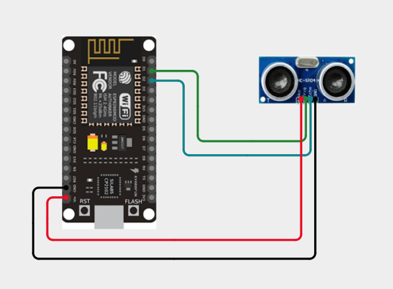
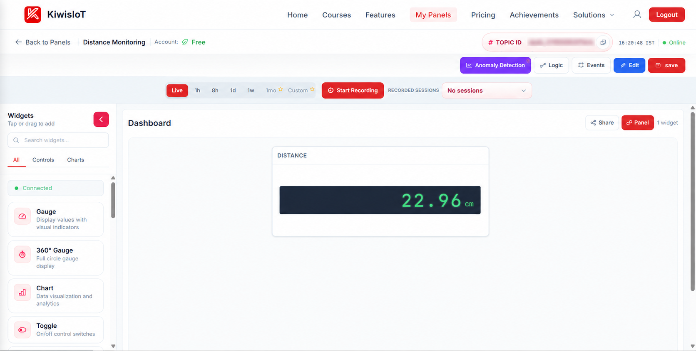
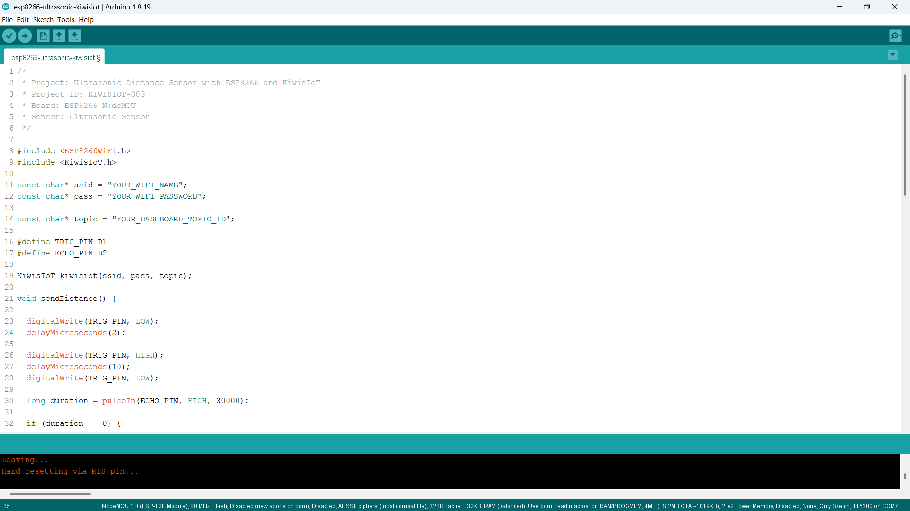
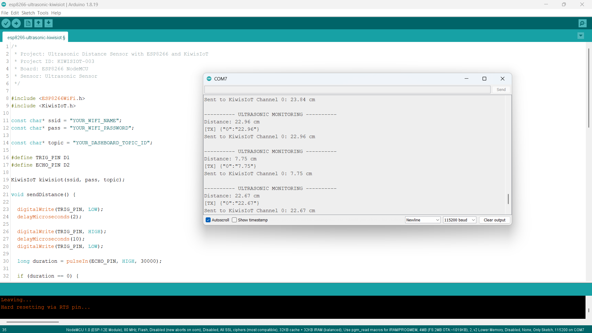

# ESP8266 Ultrasonic Sensor IoT Project: Monitor Distance with KiwisIoT 📏

Build an **ESP8266 ultrasonic sensor IoT project** to monitor distance in real time using an **ultrasonic sensor, ESP8266 NodeMCU, Arduino, and KiwisIoT**.

In this project, the ESP8266 measures the distance to an object using an ultrasonic sensor, calculates the distance in **centimeters**, and sends the measurement to a **KiwisIoT IoT dashboard** over Wi-Fi.

The dashboard displays the measured distance with the unit **cm**, providing a simple example of real-time IoT distance monitoring.

---

## 🚀 Project Highlights

- ESP8266-based distance monitoring
- Ultrasonic sensor distance measurement
- Real-time distance visualization
- Distance measurement in centimeters
- KiwisIoT IoT dashboard integration
- Wi-Fi-based IoT monitoring
- Arduino-based IoT project
- Suitable for student and engineering IoT projects

---

## 📋 Project Overview

An **ultrasonic sensor** measures distance by transmitting an ultrasonic pulse and measuring the time required for the reflected signal to return.

The ESP8266 triggers the ultrasonic sensor, measures the duration of the returned echo, calculates the distance, and sends the result to KiwisIoT.

The project flow is:

```text
Ultrasonic Sensor
        ↓
ESP8266 NodeMCU
        ↓
Trigger Pulse
        ↓
Echo Measurement
        ↓
Distance Calculation
        ↓
Distance in cm
        ↓
Wi-Fi
        ↓
KiwisIoT
        ↓
IoT Dashboard
```

---

## 💡 Why This Project?

This project demonstrates how an ESP8266 can be used to measure physical distance and send the measurement to an IoT platform.

Instead of viewing the distance only through the Serial Monitor, the ESP8266 sends the measurement to KiwisIoT, where it can be displayed on a dashboard.

The same concept can be used as a starting point for applications such as:

* Distance monitoring
* Object proximity monitoring
* Parking assistance concepts
* Tank-level monitoring concepts
* Obstacle detection
* Smart automation
* IoT-based monitoring systems

---

## 🎓 What You'll Learn

By building this project, you will learn how to:

* Connect an ultrasonic sensor to an ESP8266
* Generate a trigger pulse
* Measure an echo pulse using `pulseIn()`
* Calculate distance from echo duration
* Display distance in centimeters
* Send sensor data from ESP8266 to KiwisIoT
* Use a KiwisIoT channel for distance data
* Display distance measurements on an IoT dashboard
* Monitor distance remotely over Wi-Fi

---

## 🔧 Components Required

| Component         | Quantity    |
| ----------------- | ----------- |
| ESP8266 NodeMCU   | 1           |
| Ultrasonic Sensor | 1           |
| Jumper Wires      | As required |
| USB Cable         | 1           |
| Computer          | 1           |

> **Note:** No resistor or voltage-divider circuit is included in this project's wiring because the sensor was directly connected to the ESP8266 during testing. Electrical compatibility depends on the specific ultrasonic sensor module being used. Check the sensor's voltage and logic-level requirements before reproducing the circuit.

---

## 💻 Software Requirements

* Arduino IDE
* ESP8266 board package
* KiwisIoT Arduino library
* KiwisIoT account
* Wi-Fi connection

### Common KiwisIoT Setup

Before starting this project, complete the common **KiwisIoT Arduino Setup Guide**.

The setup guide covers:

* Arduino IDE installation
* ESP8266 board installation
* ESP8266 board selection
* KiwisIoT Arduino library installation
* KiwisIoT account setup
* Panel creation
* Topic ID
* Dashboard widgets
* Widget configuration

The common setup guide is available in the parent `esp8266` directory:

[Open the KiwisIoT Arduino Setup Guide](../kiwisiot-arduino-setup/)

---

## 🛠️ Technologies Used

* ESP8266 NodeMCU
* Ultrasonic Sensor
* Arduino IDE
* KiwisIoT Arduino Library
* KiwisIoT IoT Dashboard
* Wi-Fi
* C++ / Arduino

---

## 🔌 Circuit Connection

The ultrasonic sensor uses two signal pins:

* **TRIG** – Sends the ultrasonic trigger pulse
* **ECHO** – Receives the returning ultrasonic signal

For this project, the connections are:

| Ultrasonic Sensor | ESP8266 NodeMCU |
| ----------------- | --------------- |
| VCC               | 3.3V            |
| GND               | GND             |
| TRIG              | D1              |
| ECHO              | D2              |

The project uses:

```text
TRIG → D1
ECHO → D2
```



> **Important:** The wiring shown above reflects the hardware configuration used for this project. Ultrasonic sensor modules can have different electrical requirements. For modules whose ECHO output exceeds ESP8266 GPIO voltage limits, appropriate level shifting should be used.

---

## 📏 How the Ultrasonic Sensor Works

An ultrasonic sensor measures distance by sending a short ultrasonic pulse through its **TRIG** pin.

When the pulse reaches an object, it is reflected back toward the sensor.

The sensor produces an **ECHO** signal whose duration represents the time taken for the ultrasonic pulse to travel to the object and return.

The ESP8266 measures this duration using:

```cpp
long duration = pulseIn(ECHO_PIN, HIGH, 30000);
```

The distance is then calculated using:

```cpp
float distance = duration * 0.0343 / 2;
```

The value `0.0343` represents the approximate speed of sound in centimeters per microsecond.

The division by `2` is required because the ultrasonic pulse travels:

```text
Sensor → Object
      +
Object → Sensor
```

Therefore, the measured time represents the complete round trip.

---

## ⚙️ Distance Calculation

The project calculates the distance using:

```cpp
float distance = duration * 0.0343 / 2;
```

The result is stored as a floating-point value so that the dashboard can display measurements with decimal precision.

For example:

```text
Distance: 15.42 cm
```

The value is then converted to a string before being sent to KiwisIoT:

```cpp
String distanceData = String(distance, 2);
```

This keeps two decimal places in the transmitted value.

---

## 📊 KiwisIoT Dashboard

The ESP8266 sends the measured distance to KiwisIoT using **Channel 0**.

| Channel | Data     | Example |
| ------- | -------- | ------- |
| `0`     | Distance | `15.42` |

The data flow is:

```text
ESP8266
    │
    └── Channel 0 → Distance
                         ↓
                    KiwisIoT
                         ↓
                    Label Widget
```

The dashboard displays the measured distance using the unit:

```text
cm
```



---

## ⚙️ Dashboard Configuration

Create a KiwisIoT panel for the project and add a **Label** widget to display the measured distance.

### Distance Widget

Suggested configuration:

```text
Name: Distance
Channel ID: 0
Unit: cm
```

Set the minimum and maximum values according to the expected measurement range of your project.

For example:

```text
Minimum Value: 0
Maximum Value: 400
```

The actual maximum value can be adjusted according to the ultrasonic sensor and application.

The widget receives the value sent by:

```cpp
kiwisiot.send("0", distanceData);
```

For example:

```text
Distance: 15.42 cm
```

> **Important:** The Channel ID configured in the dashboard must match the Channel ID used in the ESP8266 code.

---

## 💻 Arduino Code

The complete Arduino code is available here:

[View the Arduino Code](code/esp8266-ultrasonic-kiwisiot.ino)

The program uses the ESP8266 Wi-Fi library and the KiwisIoT Arduino library:

```cpp
#include <ESP8266WiFi.h>
#include <KiwisIoT.h>
```



---

## 🔐 Configure Wi-Fi and KiwisIoT

Before uploading the program, update these values:

```cpp
const char* ssid = "YOUR_WIFI_NAME";
const char* pass = "YOUR_WIFI_PASSWORD";

const char* topic = "YOUR_DASHBOARD_TOPIC_ID";
```

Replace:

```text
YOUR_WIFI_NAME
```

with your Wi-Fi network name.

Replace:

```text
YOUR_WIFI_PASSWORD
```

with your Wi-Fi password.

Replace:

```text
YOUR_DASHBOARD_TOPIC_ID
```

with the Topic ID of the KiwisIoT panel created for this project.

For example:

```cpp
const char* topic = "dash_xxxxxxxxxxxxx";
```

> **Security:** Never publish your actual Wi-Fi password or private credentials in a public GitHub repository.

---

## 🧾 Complete Arduino Code

```cpp
/*
 * Project: Ultrasonic Distance Sensor with ESP8266 and KiwisIoT
 * Project ID: KIWISIOT-003
 * Board: ESP8266 NodeMCU
 * Sensor: Ultrasonic Sensor
 */

#include <ESP8266WiFi.h>
#include <KiwisIoT.h>

const char* ssid = "YOUR_WIFI_NAME";
const char* pass = "YOUR_WIFI_PASSWORD";

const char* topic = "YOUR_DASHBOARD_TOPIC_ID";

#define TRIG_PIN D1
#define ECHO_PIN D2

KiwisIoT kiwisiot(ssid, pass, topic);

void sendDistance() {

  digitalWrite(TRIG_PIN, LOW);
  delayMicroseconds(2);

  digitalWrite(TRIG_PIN, HIGH);
  delayMicroseconds(10);
  digitalWrite(TRIG_PIN, LOW);

  long duration = pulseIn(ECHO_PIN, HIGH, 30000);

  if (duration == 0) {

    Serial.println();
    Serial.println("Ultrasonic: No echo received");

    return;
  }

  float distance = duration * 0.0343 / 2;

  Serial.println();
  Serial.println("---------- ULTRASONIC MONITORING ----------");

  Serial.print("Distance: ");
  Serial.print(distance, 2);
  Serial.println(" cm");

  String distanceData = String(distance, 2);

  kiwisiot.send("0", distanceData);

  Serial.print("Sent to KiwisIoT Channel 0: ");
  Serial.print(distanceData);
  Serial.println(" cm");
}

void setup() {

  Serial.begin(115200);
  Serial.println("   ULTRASONIC DISTANCE MONITOR   ");

  pinMode(TRIG_PIN, OUTPUT);
  pinMode(ECHO_PIN, INPUT);

  digitalWrite(TRIG_PIN, LOW);

  Serial.println("Ultrasonic sensor initialized");

  Serial.println("Connecting to KiwisIoT...");

  kiwisiot.begin();

  Serial.println("KiwisIoT initialized");
  Serial.println("Starting distance monitoring...");
}

void loop() {

  kiwisiot.run();

  static unsigned long lastSend = 0;

  if (millis() - lastSend >= 2000) {

    lastSend = millis();

    sendDistance();
  }

  delay(100);
}
```

---

## ⬆️ Upload the Program

After configuring the code:

1. Connect the ESP8266 NodeMCU to your computer.
2. Open `esp8266-ultrasonic-kiwisiot.ino` in Arduino IDE.
3. Select the appropriate ESP8266 board.
4. Verify the program.
5. Upload the code to the ESP8266.
6. Open the Serial Monitor.
7. Set the baud rate to:

```text
115200
```

Once the ESP8266 connects to KiwisIoT, it will begin sending distance measurements to the configured dashboard.

---

## 🖥️ Serial Monitor Output

The ESP8266 prints the measured distance and KiwisIoT transmission information to the Serial Monitor.

A typical output looks like:

```text
---------- ULTRASONIC MONITORING ----------

Distance: 15.42 cm
Sent to KiwisIoT Channel 0: 15.42 cm
```

The project sends an updated distance measurement approximately every two seconds.



---

## 🔄 Understanding the Data Flow

The project processes the ultrasonic sensor data in several stages.

### 1. Send the Trigger Pulse

```cpp
digitalWrite(TRIG_PIN, LOW);
delayMicroseconds(2);

digitalWrite(TRIG_PIN, HIGH);
delayMicroseconds(10);
digitalWrite(TRIG_PIN, LOW);
```

This generates the short trigger pulse required to start the ultrasonic measurement.

### 2. Measure the Echo

```cpp
long duration = pulseIn(ECHO_PIN, HIGH, 30000);
```

The ESP8266 measures how long the ECHO signal remains HIGH.

### 3. Calculate the Distance

```cpp
float distance = duration * 0.0343 / 2;
```

The measured time is converted into centimeters.

### 4. Send the Distance to KiwisIoT

```cpp
kiwisiot.send("0", distanceData);
```

The distance is sent through Channel 0.

The complete flow is:

```text
Ultrasonic Sensor
       ↓
Trigger Pulse
       ↓
Echo Pulse
       ↓
Echo Duration
       ↓
Distance Calculation
       ↓
Distance in cm
       ↓
KiwisIoT Channel 0
       ↓
Dashboard
```

---

## 🧪 Testing the Project

You can test the ultrasonic sensor by placing an object at different distances from the sensor.

### Short Distance

Place an object close to the ultrasonic sensor.

The Serial Monitor should display a smaller distance value.

For example:

```text
Distance: 10.25 cm
```

The KiwisIoT dashboard should display approximately:

```text
10.25 cm
```

### Medium Distance

Move the object farther away from the sensor.

For example:

```text
Distance: 25.60 cm
```

The dashboard should update with the new measurement.

### Longer Distance

Move the object farther away.

The measured value should increase as the distance between the sensor and object increases.

> **Note:** Actual readings can vary depending on the ultrasonic sensor, object surface, angle, environmental conditions, and measurement distance.

---

## 🚫 No Echo Received

The code includes a timeout when waiting for the ECHO signal:

```cpp
long duration = pulseIn(ECHO_PIN, HIGH, 30000);
```

If no echo is received within the timeout period, the function returns `0`.

The code then prints:

```text
Ultrasonic: No echo received
```

This prevents an invalid distance calculation when the sensor does not receive a valid echo.

---

## 🌐 Why Use KiwisIoT for Distance Monitoring?

An ultrasonic sensor can measure distance locally, but connecting the ESP8266 to KiwisIoT makes the measurement available through an IoT dashboard.

With this project:

```text
Ultrasonic Sensor
       ↓
ESP8266
       ↓
Wi-Fi
       ↓
KiwisIoT
       ↓
Dashboard
       ↓
Distance Monitoring
```

The measured distance can therefore be viewed remotely instead of relying only on the Serial Monitor.

This approach can be extended to other ESP8266 IoT applications that require distance or proximity monitoring.

---

## 🛠️ Troubleshooting

### Distance Reading Does Not Change

Check:

* VCC connection
* GND connection
* TRIG connection to D1
* ECHO connection to D2
* Sensor orientation
* Object position
* Sensor wiring

### Serial Monitor Shows "No Echo Received"

Check:

* ECHO connection
* TRIG connection
* Sensor power
* Object distance
* Object position
* Sensor orientation
* Sensor operating range

### Distance Reading Is Unstable

Unstable readings can be caused by:

* Angled object surfaces
* Soft or irregular surfaces
* Objects that are too close
* Objects that are too far away
* Environmental noise
* Sensor positioning
* Wiring issues

Try placing a flat object directly in front of the sensor.

### Dashboard Does Not Receive Data

Check:

* Wi-Fi name
* Wi-Fi password
* Internet connection
* KiwisIoT Topic ID
* Channel ID
* Dashboard widget configuration
* KiwisIoT Arduino library
* ESP8266 connection

### Widget Shows No Distance

Make sure the dashboard widget uses:

```text
Channel ID: 0
```

The ESP8266 sends the distance using:

```cpp
kiwisiot.send("0", distanceData);
```

Therefore:

```text
ESP8266 Code
     ↓
Channel 0
     ↓
KiwisIoT
     ↓
Distance Widget
     ↓
Channel 0
```

The Channel ID must match on both sides.

### Dashboard Unit Is Incorrect

Configure the dashboard widget with:

```text
Unit: cm
```

The Arduino code sends the numerical distance value, while the KiwisIoT dashboard displays the configured unit.

---

## 🔒 Security

Never publish sensitive credentials in a public GitHub repository.

Do not commit:

* Wi-Fi passwords
* API keys
* Access tokens
* Account passwords
* Private credentials

Use placeholders such as:

```text
YOUR_WIFI_NAME
YOUR_WIFI_PASSWORD
YOUR_DASHBOARD_TOPIC_ID
```

Enter your actual credentials only in your local Arduino project.

---

## 💡 Possible Applications

An ESP8266 ultrasonic distance monitoring system can be used as a starting point for:

* Distance monitoring
* Object proximity monitoring
* Smart parking concepts
* Obstacle detection
* Tank-level monitoring concepts
* Object position monitoring
* IoT distance measurement
* Automation projects
* Engineering and college IoT projects

The project can also be extended by adding additional sensors, alerts, actuators, automation logic, or other KiwisIoT dashboard features.

---

## 📁 Project Structure

```text
003-ultrasonic-kiwisiot/
│
├── README.md
│
├── code/
│   └── esp8266-ultrasonic-kiwisiot.ino
│
└── images/
    ├── circuit.png
    ├── code.png
    ├── serial-monitor.png
    └── dashboard-output.png
```

---

## 🔗 Related KiwisIoT ESP8266 Projects

This project is part of the **KiwisIoT ESP8266 IoT project collection**.

- [ESP8266 LDR Sensor IoT Project](../001-ldr-kiwisiot/)
- [ESP8266 IR Sensor IoT Project](../002-ir-kiwisiot/)
- [ESP8266 DHT11 Temperature & Humidity IoT Project](../004-dht11-kiwisiot/)
- [ESP8266 PIR Motion Sensor IoT Project](../005-pir-kiwisiot/)
- [ESP8266 Gas Sensor IoT Project](../006-gas-kiwisiot/)
- [ESP8266 Flame Sensor IoT Project](../007-flame-kiwisiot/)
- [ESP8266 Soil Moisture IoT Project](../008-soil-moisture-kiwisiot/)

For the common Arduino and KiwisIoT setup, see the:

[**KiwisIoT Arduino Setup Guide**](../kiwisiot-arduino-setup/)

---

## ❓ Frequently Asked Questions

### What is an ultrasonic sensor?

An ultrasonic sensor is a distance-measuring sensor that uses ultrasonic sound waves to detect the distance between the sensor and an object.

### Can I connect an ultrasonic sensor to an ESP8266?

Yes, an ultrasonic sensor can be interfaced with an ESP8266 when the sensor's electrical and logic-level requirements are compatible with the ESP8266.

### Which ESP8266 pins are used in this project?

The project uses:

```text
TRIG → D1
ECHO → D2
```

### Which KiwisIoT channel is used?

This project uses:

```text
Channel 0 → Distance
```

### What unit is used for the distance?

The project calculates and displays distance in:

```text
cm
```

The KiwisIoT dashboard widget is configured with:

```text
Unit: cm
```

### Why is the distance calculation divided by 2?

The ultrasonic signal travels from the sensor to the object and then back to the sensor.

Therefore, the measured echo time represents the complete round trip.

Dividing by 2 gives the approximate one-way distance.

### How often does the ESP8266 send the distance?

The project sends the distance approximately every two seconds.

### What happens when no echo is received?

The program detects a zero-duration result and prints:

```text
Ultrasonic: No echo received
```

It does not send an invalid distance value to the dashboard for that measurement.

### Does this project use a resistor?

No. The hardware configuration documented in this project does not include a resistor.

The ultrasonic sensor was directly connected to the ESP8266 during testing.

However, the electrical requirements of the specific ultrasonic sensor should always be checked before making a direct connection.

### Can this project be extended?

Yes. You can add alerts, distance thresholds, additional sensors, automation logic, actuators, charts, and other KiwisIoT dashboard features to create a larger IoT application.

---

## 📝 Summary

This project demonstrates a simple **ESP8266 ultrasonic sensor IoT monitoring system** using KiwisIoT.

The ESP8266 triggers the ultrasonic sensor, measures the returning echo, calculates the distance, and sends the measurement to a KiwisIoT dashboard over Wi-Fi.

The final dashboard provides:

```text
Distance → Numerical value in cm
```

It provides a practical example of how an ESP8266 can connect an ultrasonic sensor to an IoT platform for remote distance monitoring.

---

## 📄 License

This project is licensed under the MIT License. See the `LICENSE` file for details.
