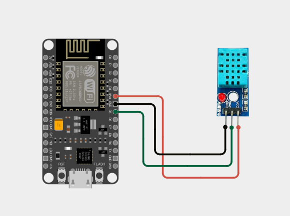
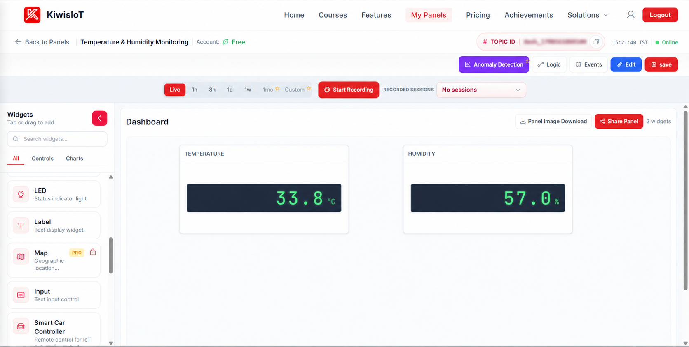
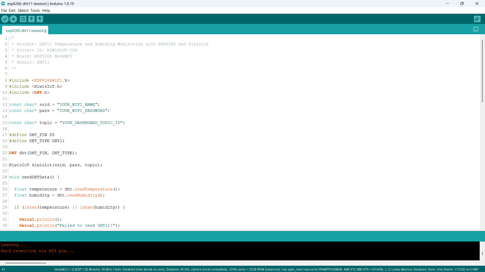
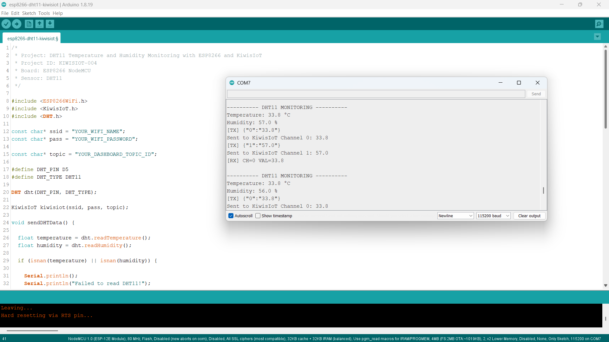

# ESP8266 DHT11 IoT Project: Monitor Temperature and Humidity with KiwisIoT 🌡️

Monitor **temperature and humidity in real time** using a **DHT11 sensor, ESP8266 NodeMCU, and KiwisIoT**.

In this project, the ESP8266 reads temperature and humidity data from the DHT11 sensor and sends both values to the **KiwisIoT IoT dashboard** over Wi-Fi.

The dashboard provides a simple way to monitor environmental conditions remotely.

---

## 🚀 Project Highlights

* ESP8266-based temperature and humidity monitoring
* DHT11 digital temperature and humidity sensor
* Real-time temperature measurement
* Real-time humidity measurement
* KiwisIoT dashboard integration
* Wi-Fi-based IoT monitoring
* Separate dashboard channels for temperature and humidity
* Beginner-friendly Arduino IoT project
* Suitable for engineering and college IoT projects

---

## 📋 Project Overview

The **DHT11** is a digital sensor that measures temperature and relative humidity.

In this project, the DHT11 sensor is connected to the ESP8266 NodeMCU. The ESP8266 reads the temperature and humidity values and sends them to KiwisIoT using two separate channels.

The project uses:

```text
Channel 0 → Temperature
Channel 1 → Humidity
```

The complete project flow is:

```text
DHT11 Sensor
     ↓
ESP8266 NodeMCU
     ↓
Temperature + Humidity
     ↓
Wi-Fi
     ↓
KiwisIoT
     ↓
IoT Dashboard
```

---

## 💡 Why This Project?

Temperature and humidity are two of the most commonly measured environmental parameters in IoT systems.

This project demonstrates how a simple DHT11 sensor can be connected to an ESP8266 and integrated with an IoT platform for remote monitoring.

Instead of viewing the sensor readings only through the Serial Monitor, the ESP8266 sends the data to KiwisIoT, where the values can be displayed on a dashboard.

The same concept can be extended to applications such as:

* Environmental monitoring
* Room monitoring
* Weather monitoring
* Greenhouse monitoring
* Smart agriculture
* Indoor climate monitoring
* IoT-based temperature monitoring
* Automation projects

---

## 🎓 What You'll Learn

By building this project, you will learn how to:

* Connect a DHT11 sensor to an ESP8266
* Read temperature using the DHT11 sensor
* Read humidity using the DHT11 sensor
* Use the DHT sensor library with Arduino
* Handle invalid sensor readings
* Send multiple sensor values to KiwisIoT
* Use multiple KiwisIoT channels
* Configure dashboard widgets
* Monitor temperature and humidity remotely over Wi-Fi

---

## 🔧 Components Required

| Component           | Quantity    |
| ------------------- | ----------- |
| ESP8266 NodeMCU     | 1           |
| DHT11 Sensor Module | 1           |
| Jumper Wires        | As required |
| USB Cable           | 1           |
| Computer            | 1           |

> **Note:** This project uses the DHT11 sensor module shown in the circuit. The sensor is connected directly to the ESP8266 without adding a separate external resistor.

---

## 💻 Software Requirements

* Arduino IDE
* ESP8266 board package
* KiwisIoT Arduino library
* DHT sensor library
* Adafruit Unified Sensor library
* KiwisIoT account
* Wi-Fi connection

### DHT11 Library

Install the required DHT library through:

```text
Arduino IDE
    ↓
Sketch
    ↓
Include Library
    ↓
Manage Libraries
```

Search for:

```text
DHT sensor library
```

Install the **DHT sensor library by Adafruit**.

If prompted for the dependency, also install:

```text
Adafruit Unified Sensor
```

### Common KiwisIoT Setup

Before starting this project, complete the common KiwisIoT Arduino setup.

The setup covers:

* Arduino IDE installation
* ESP8266 board installation
* ESP8266 board selection
* KiwisIoT Arduino library installation
* KiwisIoT account setup
* Panel creation
* Topic ID
* Dashboard widgets
* Widget configuration

---

## 🛠️ Technologies Used

* ESP8266 NodeMCU
* DHT11 Sensor
* Arduino IDE
* KiwisIoT Arduino Library
* KiwisIoT IoT Dashboard
* Wi-Fi
* C++ / Arduino

---

## 🔌 Circuit Connection

The DHT11 sensor provides temperature and humidity readings through its digital data pin.

Connect the DHT11 sensor module to the ESP8266 NodeMCU as follows:

| DHT11 Sensor | ESP8266 NodeMCU |
| ------------ | --------------- |
| VCC          | 3.3V            |
| DATA         | D5              |
| GND          | GND             |

The project uses:

```text
D5 → DHT11 DATA
```

The sensor is powered from the ESP8266 3.3V pin.

No separate external resistor is added in this project setup.



---

## 🌡️ How the DHT11 Sensor Works

The **DHT11** is a digital temperature and humidity sensor.

It provides two measurements:

```text
Temperature
Humidity
```

The ESP8266 reads these values using the DHT sensor library.

The sensor is initialized using:

```cpp
DHT dht(DHT_PIN, DHT_TYPE);
```

The temperature is read using:

```cpp
float temperature = dht.readTemperature();
```

The humidity is read using:

```cpp
float humidity = dht.readHumidity();
```

The project uses:

```text
DHT Pin  → D5
DHT Type → DHT11
```

---

## 📊 Temperature and Humidity Data

The ESP8266 sends the two sensor values to separate KiwisIoT channels.

| Channel | Data        | Example |
| ------- | ----------- | ------- |
| `0`     | Temperature | `33.8`  |
| `1`     | Humidity    | `57.0`  |

The data flow is:

```text
DHT11
  │
  ├── Temperature → Channel 0
  │
  └── Humidity → Channel 1
```

The values are then displayed on the KiwisIoT dashboard.

---

## 📊 KiwisIoT Dashboard

The KiwisIoT dashboard uses two widgets to display the sensor readings.

### Temperature Widget

Configure the temperature widget with:

```text
Name: TEMPERATURE
Channel ID: 0
Unit: °C
```

### Humidity Widget

Configure the humidity widget with:

```text
Name: HUMIDITY
Channel ID: 1
Unit: %
```

The dashboard displays the two values separately.

For example:

```text
TEMPERATURE
33.8 °C

HUMIDITY
57.0 %
```

The ESP8266 sends the temperature using:

```cpp
kiwisiot.send("0", temperatureData);
```

The humidity is sent using:

```cpp
kiwisiot.send("1", humidityData);
```



> **Important:** The Channel IDs configured in the dashboard must match the Channel IDs used in the ESP8266 code.

---

## ⚙️ Dashboard Configuration

Create a KiwisIoT panel for the project and add two display widgets.

### Temperature

Configure:

```text
Widget Name: TEMPERATURE
Channel ID: 0
Unit: °C
```

### Humidity

Configure:

```text
Widget Name: HUMIDITY
Channel ID: 1
Unit: %
```

The final dashboard contains:

```text
┌─────────────────────┐
│     TEMPERATURE     │
│       33.8 °C       │
└─────────────────────┘

┌─────────────────────┐
│       HUMIDITY      │
│        57.0 %       │
└─────────────────────┘
```

The ESP8266 sends the data approximately every two seconds.

> **Note:** After configuring or updating a widget, use the dashboard's **Save** option to save the changes.

---

## 💻 Arduino Code

The complete Arduino code is available here:

View the Arduino Code

The program uses the ESP8266 Wi-Fi library, KiwisIoT Arduino library, and DHT library:

```cpp
#include <ESP8266WiFi.h>
#include <KiwisIoT.h>
#include <DHT.h>
```



---

## 🔐 Configure Wi-Fi and KiwisIoT

Before uploading the program, update these values:

```cpp
const char* ssid = "YOUR_WIFI_NAME";
const char* pass = "YOUR_WIFI_PASSWORD";

const char* topic = "YOUR_DASHBOARD_TOPIC_ID";
```

Replace:

```text
YOUR_WIFI_NAME
```

with your Wi-Fi network name.

Replace:

```text
YOUR_WIFI_PASSWORD
```

with your Wi-Fi password.

Replace:

```text
YOUR_DASHBOARD_TOPIC_ID
```

with the Topic ID of the KiwisIoT panel created for this project.

For example:

```cpp
const char* topic = "dash_xxxxxxxxxxxxx";
```

> **Security:** Never publish your actual Wi-Fi password or private credentials in a public GitHub repository.

---

## 🧾 Complete Arduino Code

```cpp
/*
 * Project: DHT11 Temperature and Humidity Monitoring with ESP8266 and KiwisIoT
 * Project ID: KIWISIOT-004
 * Board: ESP8266 NodeMCU
 * Sensor: DHT11
 */

#include <ESP8266WiFi.h>
#include <KiwisIoT.h>
#include <DHT.h>

const char* ssid = "YOUR_WIFI_NAME";
const char* pass = "YOUR_WIFI_PASSWORD";

const char* topic = "YOUR_DASHBOARD_TOPIC_ID";

#define DHT_PIN D5
#define DHT_TYPE DHT11

DHT dht(DHT_PIN, DHT_TYPE);

KiwisIoT kiwisiot(ssid, pass, topic);

void sendDHTData() {

  float temperature = dht.readTemperature();
  float humidity = dht.readHumidity();

  if (isnan(temperature) || isnan(humidity)) {

    Serial.println();
    Serial.println("Failed to read DHT11!");

    return;
  }

  Serial.println();
  Serial.println("---------- DHT11 MONITORING ----------");

  Serial.print("Temperature: ");
  Serial.print(temperature, 1);
  Serial.println(" °C");

  Serial.print("Humidity: ");
  Serial.print(humidity, 1);
  Serial.println(" %");

  String temperatureData = String(temperature, 1);

  kiwisiot.send("0", temperatureData);

  Serial.print("Sent to KiwisIoT Channel 0: ");
  Serial.println(temperatureData);

  String humidityData = String(humidity, 1);

  kiwisiot.send("1", humidityData);

  Serial.print("Sent to KiwisIoT Channel 1: ");
  Serial.println(humidityData);
}

void setup() {

  Serial.begin(115200);

  Serial.println("     DHT11 MONITORING     ");

  dht.begin();

  Serial.println("DHT11 initialized");

  Serial.println("Connecting to KiwisIoT...");

  kiwisiot.begin();

  Serial.println("KiwisIoT initialized");
  Serial.println("Starting temperature and humidity monitoring...");
}

void loop() {

  kiwisiot.run();

  static unsigned long lastSend = 0;

  if (millis() - lastSend >= 2000) {

    lastSend = millis();

    sendDHTData();
  }

  delay(100);
}
```

---

## ⬆️ Upload the Program

After configuring the code:

1. Connect the ESP8266 NodeMCU to your computer.
2. Open `esp8266-dht11-kiwisiot.ino` in Arduino IDE.
3. Select the appropriate ESP8266 board.
4. Verify the program.
5. Upload the code to the ESP8266.
6. Open the Serial Monitor.
7. Set the baud rate to:

```text
115200
```

Once the ESP8266 connects to KiwisIoT, it will begin reading the DHT11 sensor and sending temperature and humidity values to the dashboard.

---

## 🖥️ Serial Monitor Output

The ESP8266 prints the temperature and humidity readings to the Serial Monitor.

A typical output is:

```text
---------- DHT11 MONITORING ----------
Temperature: 33.8 °C
Humidity: 57.0 %
[TX] {"0":"33.8"}
Sent to KiwisIoT Channel 0: 33.8
[TX] {"1":"57.0"}
Sent to KiwisIoT Channel 1: 57.0
```

The project continues reading and sending updated values approximately every two seconds.



---

## 🔄 Understanding the Data Flow

The project processes the DHT11 readings in several stages.

### 1. Initialize the DHT11

The sensor is initialized using:

```cpp
dht.begin();
```

### 2. Read Temperature

The ESP8266 reads temperature using:

```cpp
float temperature = dht.readTemperature();
```

### 3. Read Humidity

Humidity is read using:

```cpp
float humidity = dht.readHumidity();
```

### 4. Check the Sensor Reading

The program checks whether the sensor returned valid values:

```cpp
if (isnan(temperature) || isnan(humidity)) {
    Serial.println("Failed to read DHT11!");
    return;
}
```

### 5. Send Temperature

Temperature is sent through Channel 0:

```cpp
kiwisiot.send("0", temperatureData);
```

### 6. Send Humidity

Humidity is sent through Channel 1:

```cpp
kiwisiot.send("1", humidityData);
```

The complete data flow is:

```text
DHT11 Sensor
      ↓
Read Temperature + Humidity
      ↓
ESP8266 NodeMCU
      ↓
      ├── Channel 0 → Temperature
      │
      └── Channel 1 → Humidity
                ↓
             Wi-Fi
                ↓
             KiwisIoT
                ↓
           IoT Dashboard
```

---

## 🧪 Testing the Project

After uploading the program, allow the DHT11 sensor to operate for a few seconds.

Open the Serial Monitor at:

```text
115200 baud
```

You should see temperature and humidity readings such as:

```text
Temperature: 33.8 °C
Humidity: 57.0 %
```

The same values should appear on the KiwisIoT dashboard.

For example:

```text
Temperature → 33.8 °C
Humidity    → 57.0 %
```

The values may change depending on the surrounding environment.

---

## 📈 Example Sensor Output

During testing, the sensor produced readings similar to:

```text
Temperature: 33.8 °C
Humidity: 57.0 %
```

Another reading may look like:

```text
Temperature: 33.8 °C
Humidity: 56.0 %
```

DHT11 readings can change depending on:

* Room temperature
* Humidity level
* Air movement
* Sensor location
* Surrounding environment

The displayed values are therefore expected to vary during operation.

---

## 🌐 Why Use KiwisIoT for DHT11 Monitoring?

A DHT11 sensor can provide temperature and humidity measurements locally through the ESP8266.

By connecting the ESP8266 to KiwisIoT, these values can also be displayed on an IoT dashboard.

The complete system becomes:

```text
DHT11
  ↓
ESP8266
  ↓
Wi-Fi
  ↓
KiwisIoT
  ↓
Dashboard
```

This makes the project useful as a basic example of **remote environmental monitoring using IoT**.

---

## 🛠️ Troubleshooting

### DHT11 Is Not Reading Data

Check:

* DHT11 VCC connection
* DHT11 GND connection
* DHT11 DATA connection
* DATA connection to D5
* Sensor orientation
* DHT11 sensor module
* DHT sensor library installation

The wiring should be:

```text
DHT11 VCC  → 3.3V
DHT11 DATA → D5
DHT11 GND  → GND
```

### Serial Monitor Shows "Failed to read DHT11!"

Make sure:

* The DHT11 is connected correctly.
* The DATA pin is connected to D5.
* `DHT_TYPE` is set to `DHT11`.
* The DHT library is installed.
* The sensor has stable power.

The code uses:

```cpp
#define DHT_PIN D5
#define DHT_TYPE DHT11
```

### Dashboard Does Not Receive Temperature

Check:

* Wi-Fi name
* Wi-Fi password
* Internet connection
* KiwisIoT Topic ID
* Temperature widget configuration
* Channel ID

Temperature is sent using:

```cpp
kiwisiot.send("0", temperatureData);
```

Therefore the temperature widget must use:

```text
Channel ID: 0
```

### Dashboard Does Not Receive Humidity

Humidity is sent using:

```cpp
kiwisiot.send("1", humidityData);
```

Therefore the humidity widget must use:

```text
Channel ID: 1
```

Check that the dashboard configuration is:

```text
Temperature → Channel 0
Humidity    → Channel 1
```

### Temperature or Humidity Values Look Unusual

Sensor readings can vary depending on the environment.

Check:

* Sensor placement
* Power supply
* Wiring
* Sensor condition
* Air movement
* Nearby heat sources
* Sensor exposure to moisture

---

## 🔒 Security

Never publish sensitive credentials in a public GitHub repository.

Do not commit:

* Wi-Fi passwords
* API keys
* Access tokens
* Account passwords
* Private credentials

Use placeholders such as:

```text
YOUR_WIFI_NAME
YOUR_WIFI_PASSWORD
YOUR_DASHBOARD_TOPIC_ID
```

Enter your actual credentials only in your local Arduino project.

---

## 💡 Possible Applications

An ESP8266 DHT11 monitoring system can be used as a starting point for:

* Room temperature monitoring
* Environmental monitoring
* Greenhouse monitoring
* Smart agriculture
* Weather monitoring
* Indoor climate monitoring
* IoT environmental sensing
* Server room monitoring concepts
* Smart home projects
* Engineering and college IoT projects

The project can also be extended by adding additional sensors, alerts, actuators, data logging, or automation logic.

---

## 📁 Project Structure

```text
004-dht11-kiwisiot/
│
├── README.md
│
├── code/
│   └── esp8266-dht11-kiwisiot.ino
│
└── images/
    ├── circuit.png
    ├── code.png
    ├── serial-monitor.png
    └── dashboard-output.png
```

---

## 🔗 Related KiwisIoT Projects

This project is part of the **KiwisIoT ESP8266 IoT project collection**.

Other projects in the collection demonstrate how different sensors can be connected to an ESP8266 and monitored through KiwisIoT.

---

## ❓ Frequently Asked Questions

### What is a DHT11 sensor?

The DHT11 is a digital sensor used to measure temperature and relative humidity.

### Can I connect a DHT11 to an ESP8266?

Yes. The DHT11 data pin can be connected to an ESP8266 GPIO pin.

This project uses:

```text
D5
```

### Which pin is used for the DHT11?

The DHT11 DATA pin is connected to:

```text
D5
```

### Which KiwisIoT channel is used for temperature?

Temperature is sent through:

```text
Channel 0
```

### Which KiwisIoT channel is used for humidity?

Humidity is sent through:

```text
Channel 1
```

### What unit is used for temperature?

Temperature is displayed in:

```text
°C
```

### What unit is used for humidity?

Humidity is displayed in:

```text
%
```

### How often does the ESP8266 send the readings?

The project sends the temperature and humidity readings approximately every two seconds.

### What happens if the DHT11 reading fails?

The program checks for invalid readings using:

```cpp
if (isnan(temperature) || isnan(humidity))
```

If the reading fails, the program prints:

```text
Failed to read DHT11!
```

and does not send invalid data to KiwisIoT.

### Can this project be extended?

Yes. You can add additional sensors, alerts, data logging, automation, actuators, and other KiwisIoT dashboard features.

---

## 📝 Summary

This project demonstrates a simple **ESP8266 DHT11 IoT monitoring system** using KiwisIoT.

The ESP8266 reads temperature and humidity from the DHT11 sensor and sends the values to two separate KiwisIoT channels.

```text
Channel 0 → Temperature
Channel 1 → Humidity
```

The final KiwisIoT dashboard provides real-time environmental monitoring:

```text
Temperature → 33.8 °C
Humidity    → 57.0 %
```

This project provides a practical example of how an ESP8266 can connect a temperature and humidity sensor to an IoT platform for remote monitoring.

---

## 📄 License

This project is licensed under the MIT License. See the `LICENSE` file for details.
