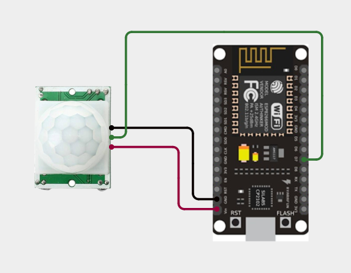
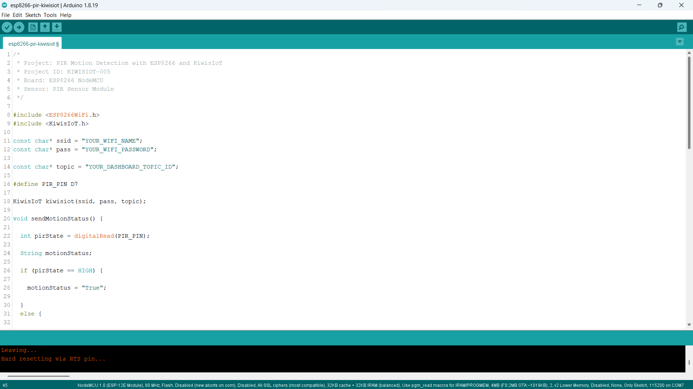
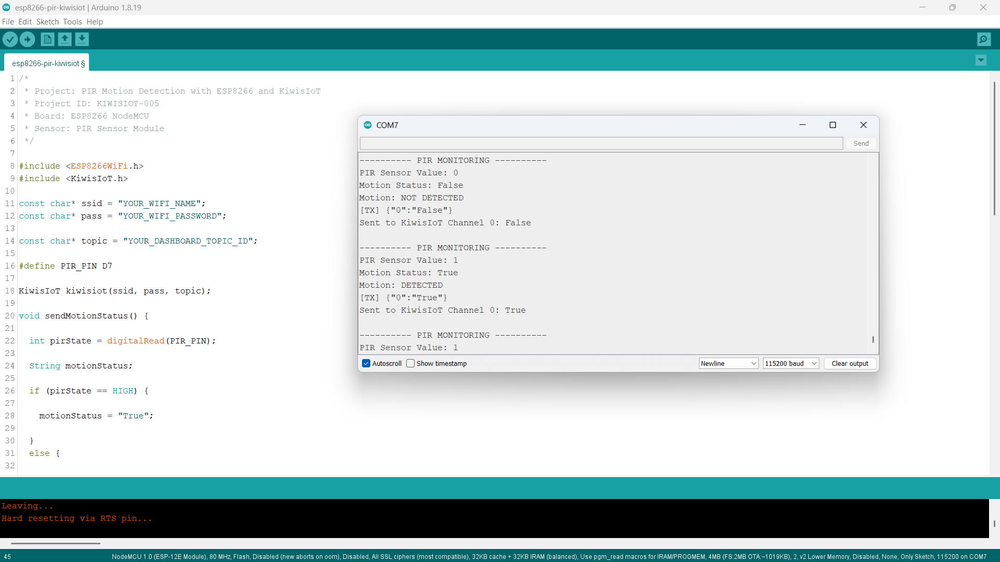

# PIR Sensor ESP8266 IoT Project: Build a Real-Time Motion Detection System with KiwisIoT 🚶

Build a real-time motion detection system using a **PIR sensor, ESP8266 NodeMCU, and KiwisIoT**.

In this project, the ESP8266 reads the digital output of the PIR sensor and determines whether motion is detected. The motion status is then sent to the **KiwisIoT IoT dashboard** over Wi-Fi.

The dashboard displays the motion status as **True** or **False**, allowing the sensor activity to be monitored remotely.

---

## 🚀 Project Highlights

* ESP8266-based motion detection
* PIR sensor digital input
* Real-time motion detection
* True / False motion status
* KiwisIoT dashboard integration
* Wi-Fi-based IoT monitoring
* Serial Monitor status display
* Beginner-friendly ESP8266 IoT project
* Suitable for engineering and college IoT projects

---

## 📋 Project Overview

A **PIR (Passive Infrared) sensor** detects changes in infrared radiation caused by moving objects, such as people.

The PIR sensor provides a digital output to the ESP8266 NodeMCU. The ESP8266 reads this signal and determines whether motion is detected.

In this project:

* `HIGH` means motion is detected.
* `LOW` means motion is not detected.

The resulting motion status is sent to **KiwisIoT Channel 0**.

The project flow is:

```text
PIR Sensor
     ↓
ESP8266 NodeMCU
     ↓
Digital Reading
     ↓
Motion Detection
     ↓
True / False
     ↓
Wi-Fi
     ↓
KiwisIoT
     ↓
IoT Dashboard
```

---

## 💡 Why This Project?

A PIR sensor provides a simple way to detect movement in an area.

By connecting the PIR sensor to an ESP8266 and sending its status to KiwisIoT, the motion information can be monitored through an IoT dashboard instead of relying only on the local sensor output.

This project can be used as a starting point for applications such as:

* Motion monitoring
* Room occupancy detection
* Security monitoring concepts
* Smart lighting systems
* Entry monitoring
* Smart home automation
* IoT-based motion detection

---

## 🎓 What You'll Learn

By building this project, you will learn how to:

* Connect a PIR sensor to an ESP8266
* Read a digital sensor using `digitalRead()`
* Detect motion using a PIR sensor
* Convert a digital sensor state into a True / False status
* Send motion data from ESP8266 to KiwisIoT
* Use a KiwisIoT channel for sensor data
* Display motion status on an IoT dashboard
* Monitor motion remotely over Wi-Fi

---

## 🔧 Components Required

| Component | Quantity |
| --------- | -------- |
| ESP8266 NodeMCU | 1 |
| PIR Sensor Module | 1 |
| Jumper Wires | As required |
| USB Cable | 1 |
| Computer | 1 |

> **Note:** No external resistor is used in this project. The PIR sensor is directly connected to the ESP8266 NodeMCU.

---

## 💻 Software Requirements

* Arduino IDE
* ESP8266 board package
* KiwisIoT Arduino library
* KiwisIoT account
* Wi-Fi connection

### Common KiwisIoT Setup

Before starting this project, complete the common **KiwisIoT Arduino Setup Guide**.

The setup guide covers:

* Arduino IDE installation
* ESP8266 board installation
* ESP8266 board selection
* KiwisIoT Arduino library installation
* KiwisIoT account setup
* Panel creation
* Topic ID
* Dashboard widgets
* Widget configuration

The common setup guide is available in the parent `esp8266` directory:

[Open the KiwisIoT Arduino Setup Guide](../kiwisiot-arduino-setup/)

---

## 🛠️ Technologies Used

* ESP8266 NodeMCU
* PIR Sensor Module
* Arduino IDE
* KiwisIoT Arduino Library
* KiwisIoT IoT Dashboard
* Wi-Fi
* C++ / Arduino

---

## 🔌 Circuit Connection

The PIR sensor is connected directly to the ESP8266 NodeMCU.

Use the following connections:

| PIR Sensor | ESP8266 NodeMCU |
| ---------- | --------------- |
| VCC | 3.3V |
| GND | GND |
| OUT | D7 |

The PIR sensor's **OUT** pin is connected to **D7**, which is configured as a digital input in the Arduino code.

The circuit does not require an external resistor.



---

## 🔍 How the PIR Sensor Works

A PIR sensor detects changes in infrared radiation caused by movement in its detection area.

The sensor provides a digital output that can be read by the ESP8266.

In this project, the sensor is connected to:

```text
D7
```

The ESP8266 reads the sensor using:

```cpp
int pirState = digitalRead(PIR_PIN);
```

The motion detection logic is:

| PIR Sensor State | Motion Status |
| ---------------- | ------------- |
| `HIGH` | `True` |
| `LOW` | `False` |

The code uses:

```cpp
if (pirState == HIGH) {
    motionStatus = "True";
}
else {
    motionStatus = "False";
}
```

Therefore:

```text
HIGH → Motion Detected
LOW  → Motion Not Detected
```

> **Note:** PIR sensor behavior can vary depending on the specific module and its configuration. This project uses the behavior observed during testing.

---

## ⚙️ Motion Detection Logic

The ESP8266 continuously reads the digital output of the PIR sensor.

The process is:

```text
Read PIR Sensor
       ↓
Is the value HIGH?
       ↓
    YES       NO
     ↓         ↓
  True       False
     ↓         ↓
Motion      No Motion
Detected    Detected
```

The sensor value is stored in:

```cpp
int pirState = digitalRead(PIR_PIN);
```

The resulting status is stored as:

```cpp
String motionStatus;
```

When motion is detected:

```text
PIR Sensor Value: 1
Motion Status: True
Motion: DETECTED
```

When motion is not detected:

```text
PIR Sensor Value: 0
Motion Status: False
Motion: NOT DETECTED
```

---

## 📊 KiwisIoT Dashboard

The ESP8266 sends the motion status to **KiwisIoT Channel 0**.

| Channel | Data | Example |
| ------- | ---- | ------- |
| `0` | Motion Status | `True` |
| `0` | Motion Status | `False` |

The data flow is:

```text
ESP8266
    │
    └── Channel 0 → Motion Status
                         ↓
                    KiwisIoT
                         ↓
                   Label Widget
```

The dashboard displays the current motion status received from the ESP8266.


---

## ⚙️ Dashboard Configuration

Create a KiwisIoT panel for the project and add a **Label** widget for displaying the motion status.

### Motion Detection Widget

Configure the widget to use:

```text
Name: Motion Detection
Channel ID: 0
```

The widget receives the status sent by:

```cpp
kiwisiot.send("0", motionStatus);
```

The possible values are:

```text
True
False
```

For example:

```text
Motion Detection: True
```

or:

```text
Motion Detection: False
```

> **Important:** The Channel ID configured in the dashboard must match the Channel ID used in the ESP8266 code.

---

## 💻 Arduino Code

The complete Arduino code is available here:

[View the Arduino Code](code/esp8266-pir-kiwisiot.ino)

The program uses the ESP8266 Wi-Fi library and the KiwisIoT Arduino library:

```cpp
#include <ESP8266WiFi.h>
#include <KiwisIoT.h>
```



---

## 🔐 Configure Wi-Fi and KiwisIoT

Before uploading the program, update these values:

```cpp
const char* ssid = "YOUR_WIFI_NAME";
const char* pass = "YOUR_WIFI_PASSWORD";

const char* topic = "YOUR_DASHBOARD_TOPIC_ID";
```

Replace:

```text
YOUR_WIFI_NAME
```

with your Wi-Fi network name.

Replace:

```text
YOUR_WIFI_PASSWORD
```

with your Wi-Fi password.

Replace:

```text
YOUR_DASHBOARD_TOPIC_ID
```

with the Topic ID of the KiwisIoT panel created for this project.

For example:

```cpp
const char* topic = "dash_xxxxxxxxxxxxx";
```

> **Security:** Never publish your actual Wi-Fi password or private credentials in a public GitHub repository.

---

## 🧾 Complete Arduino Code

```cpp
/*
 * Project: PIR Motion Detection with ESP8266 and KiwisIoT
 * Project ID: KIWISIOT-005
 * Board: ESP8266 NodeMCU
 * Sensor: PIR Sensor Module
 */

#include <ESP8266WiFi.h>
#include <KiwisIoT.h>

const char* ssid = "YOUR_WIFI_NAME";
const char* pass = "YOUR_WIFI_PASSWORD";

const char* topic = "YOUR_DASHBOARD_TOPIC_ID";

#define PIR_PIN D7

KiwisIoT kiwisiot(ssid, pass, topic);

void sendMotionStatus() {

  int pirState = digitalRead(PIR_PIN);

  String motionStatus;

  if (pirState == HIGH) {

    motionStatus = "True";

  }
  else {

    motionStatus = "False";
  }

  Serial.println();
  Serial.println("---------- PIR MONITORING ----------");

  Serial.print("PIR Sensor Value: ");
  Serial.println(pirState);

  Serial.print("Motion Status: ");
  Serial.println(motionStatus);

  if (pirState == HIGH) {

    Serial.println("Motion: DETECTED");

  }
  else {

    Serial.println("Motion: NOT DETECTED");
  }

  kiwisiot.send("0", motionStatus);

  Serial.print("Sent to KiwisIoT Channel 0: ");
  Serial.println(motionStatus);
}

void setup() {

  Serial.begin(115200);
  Serial.println("     PIR MOTION MONITORING    ");

  pinMode(PIR_PIN, INPUT);

  Serial.println("PIR sensor initialized");

  Serial.println("Connecting to KiwisIoT...");

  kiwisiot.begin();

  Serial.println("KiwisIoT initialized");
  Serial.println("Starting motion monitoring...");
}

void loop() {

  kiwisiot.run();

  static unsigned long lastSend = 0;

  if (millis() - lastSend >= 2000) {

    lastSend = millis();

    sendMotionStatus();
  }

  delay(100);
}
```

---

## ⬆️ Upload the Program

After configuring the code:

1. Connect the ESP8266 NodeMCU to your computer.
2. Open `esp8266-pir-kiwisiot.ino` in Arduino IDE.
3. Select the appropriate ESP8266 board.
4. Verify the program.
5. Upload the code to the ESP8266.
6. Open the Serial Monitor.
7. Set the baud rate to:

```text
115200
```

Once the ESP8266 connects to KiwisIoT, it will begin reading the PIR sensor and sending the motion status to the configured dashboard.

---

## 🖥️ Serial Monitor Output

The ESP8266 displays the PIR sensor value, motion status, and KiwisIoT transmission status in the Serial Monitor.

When motion is not detected, a typical output is:

```text
---------- PIR MONITORING ----------

PIR Sensor Value: 0
Motion Status: False
Motion: NOT DETECTED
Sent to KiwisIoT Channel 0: False
```

When motion is detected:

```text
---------- PIR MONITORING ----------

PIR Sensor Value: 1
Motion Status: True
Motion: DETECTED
Sent to KiwisIoT Channel 0: True
```

The project checks the PIR sensor and sends the motion status approximately every two seconds.



---

## 🔄 Understanding the Data Flow

The project processes the PIR sensor signal in several stages.

### 1. Read the PIR Sensor

```cpp
int pirState = digitalRead(PIR_PIN);
```

The ESP8266 reads the digital output from the PIR sensor connected to D7.

### 2. Determine the Motion Status

```cpp
if (pirState == HIGH) {
    motionStatus = "True";
}
else {
    motionStatus = "False";
}
```

The digital value is converted into a readable motion status.

### 3. Send the Status to KiwisIoT

```cpp
kiwisiot.send("0", motionStatus);
```

The status is sent through Channel 0.

The complete flow is:

```text
PIR Sensor
     ↓
Digital Reading
     ↓
Motion Detection Logic
     ↓
True / False
     ↓
KiwisIoT Channel 0
     ↓
Dashboard
```

---

## 🧪 Testing the Project

You can test the PIR sensor by moving in front of the sensor.

### Motion Detected

Move in front of the PIR sensor.

The sensor should produce:

```text
PIR Sensor Value: 1
Motion Status: True
Motion: DETECTED
```

The KiwisIoT dashboard should then display:

```text
True
```

### No Motion Detected

Move away from the PIR sensor and remain outside its detection area.

The sensor should produce:

```text
PIR Sensor Value: 0
Motion Status: False
Motion: NOT DETECTED
```

The KiwisIoT dashboard should then display:

```text
False
```

> **Note:** PIR sensors may require a short initialization or stabilization period after power-up. Detection behavior can also depend on the sensor's sensitivity, delay settings, mounting position, and surrounding environment.

---

## 🌐 Why Use KiwisIoT for PIR Monitoring?

A PIR sensor can detect motion locally, but connecting it to an IoT platform makes the motion status available through a dashboard.

With this project:

```text
PIR Sensor
     ↓
ESP8266
     ↓
Wi-Fi
     ↓
KiwisIoT
     ↓
Dashboard
```

The motion state can be monitored remotely instead of relying only on the local Serial Monitor.

This approach can also be extended with other sensors, actuators, alerts, and automation features.

---

## 🛠️ Troubleshooting

### PIR Sensor Does Not Detect Motion

Check:

* VCC connection
* GND connection
* OUT connection to D7
* PIR sensor orientation
* Sensor detection range
* Sensor sensitivity settings
* Sensor initialization time
* Power supply
* Movement within the sensor's detection area

### Motion Status Appears Reversed

This project uses:

```cpp
if (pirState == HIGH) {
    motionStatus = "True";
}
else {
    motionStatus = "False";
}
```

Therefore:

```text
HIGH → True
LOW  → False
```

If your particular PIR module behaves differently, check its digital output and adjust the logic accordingly.

### Dashboard Does Not Receive Data

Check:

* Wi-Fi name
* Wi-Fi password
* Internet connection
* KiwisIoT Topic ID
* Channel ID
* Dashboard widget configuration
* KiwisIoT Arduino library
* ESP8266 connection

### Widget Shows No Motion Status

Make sure the dashboard widget uses:

```text
Channel ID: 0
```

The ESP8266 sends the motion status using:

```cpp
kiwisiot.send("0", motionStatus);
```

Therefore:

```text
ESP8266 Code
     ↓
Channel 0
     ↓
KiwisIoT
     ↓
Motion Detection Widget
     ↓
Channel 0
```

The Channel ID must match on both sides.

### PIR Detection Is Unstable

If the PIR sensor repeatedly changes between `True` and `False`, check:

* Sensor positioning
* Detection range
* Sensitivity adjustment
* Delay adjustment
* Power supply
* Sensor initialization time
* Movement near the sensor
* Environmental conditions

---

## 🔒 Security

Never publish sensitive credentials in a public GitHub repository.

Do not commit:

* Wi-Fi passwords
* API keys
* Access tokens
* Account passwords
* Private credentials

Use placeholders such as:

```text
YOUR_WIFI_NAME
YOUR_WIFI_PASSWORD
YOUR_DASHBOARD_TOPIC_ID
```

Enter your actual credentials only in your local Arduino project.

---

## 💡 Possible Applications

An ESP8266 PIR motion detection system can be used as a starting point for:

* Motion monitoring systems
* Room occupancy monitoring
* Entry monitoring
* Smart lighting concepts
* Security monitoring concepts
* Smart home automation
* Motion-triggered systems
* IoT monitoring applications
* Engineering and college IoT projects

The project can be extended by adding LEDs, buzzers, relays, counters, alerts, additional sensors, or automation logic.

---

## 📁 Project Structure

```text
005-pir-sensor-kiwisiot/
│
├── README.md
├── LICENSE
├── .gitignore
│
├── code/
│   └── esp8266-pir-kiwisiot.ino
│
└── images/
    ├── circuit.png
    ├── code.png
    ├── serial-monitor.png
    └── dashboard-output.png
```

---

## 🔗 Related KiwisIoT Projects

This project is part of the **KiwisIoT ESP8266 project collection**.

The common setup guide is available here:

[Open the KiwisIoT Arduino Setup Guide](../kiwisiot-arduino-setup/)

Other ESP8266 IoT projects can be found in the parent directory.

---

## ❓ Frequently Asked Questions

### What is a PIR sensor?

A PIR (Passive Infrared) sensor is a sensor used to detect movement by sensing changes in infrared radiation in its detection area.

### Can I connect a PIR sensor to an ESP8266?

Yes. A PIR sensor module with a digital output can be connected to an ESP8266 GPIO pin.

### Which ESP8266 pin is used in this project?

The PIR sensor's digital OUT pin is connected to:

```text
D7
```

### Which KiwisIoT channel is used?

This project uses:

```text
Channel 0 → Motion Status
```

### What does HIGH mean in this project?

A HIGH signal from the PIR sensor is interpreted as:

```text
True → Motion Detected
```

### What does LOW mean in this project?

A LOW signal is interpreted as:

```text
False → Motion Not Detected
```

### How often does the ESP8266 send the motion status?

The project sends the motion status approximately every two seconds.

### Is a resistor required for this project?

No external resistor is used in this project. The PIR sensor is directly connected to the ESP8266 NodeMCU as shown in the circuit.

### Can the PIR sensor detection range be adjusted?

Many PIR sensor modules provide sensitivity and delay adjustments. The available controls depend on the specific PIR module being used.

### Can this project be extended?

Yes. You can add LEDs, buzzers, relays, counters, alerts, additional sensors, and automation logic to build a larger IoT application.

---

## 📝 Summary

This project demonstrates a simple **ESP8266 PIR motion detection system with KiwisIoT**.

The ESP8266 reads the digital output of the PIR sensor, determines whether motion is detected, and sends the resulting `True` or `False` status to a KiwisIoT dashboard over Wi-Fi.

The final dashboard provides:

```text
Motion Status → True / False
```

It provides a practical example of how an ESP8266 can connect a digital motion sensor to an IoT platform for remote monitoring.

---

## 📄 License

This project is licensed under the MIT License. See the `LICENSE` file for details.
