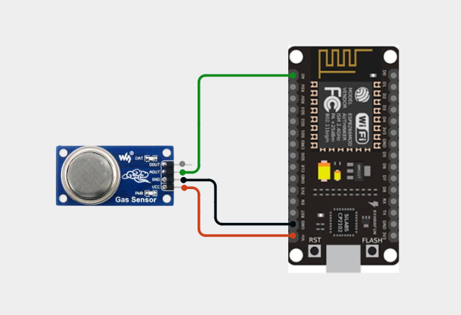
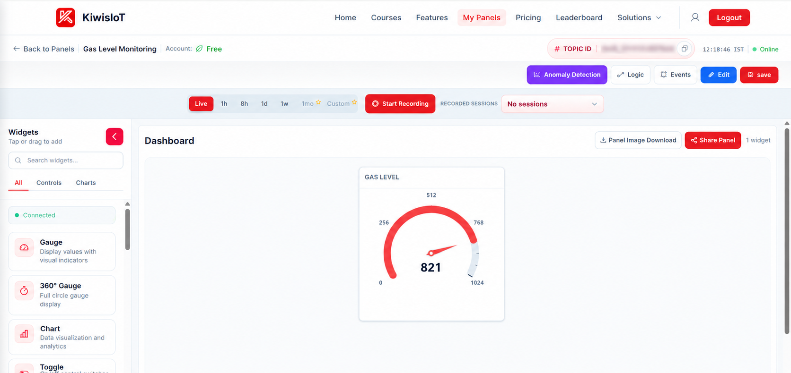
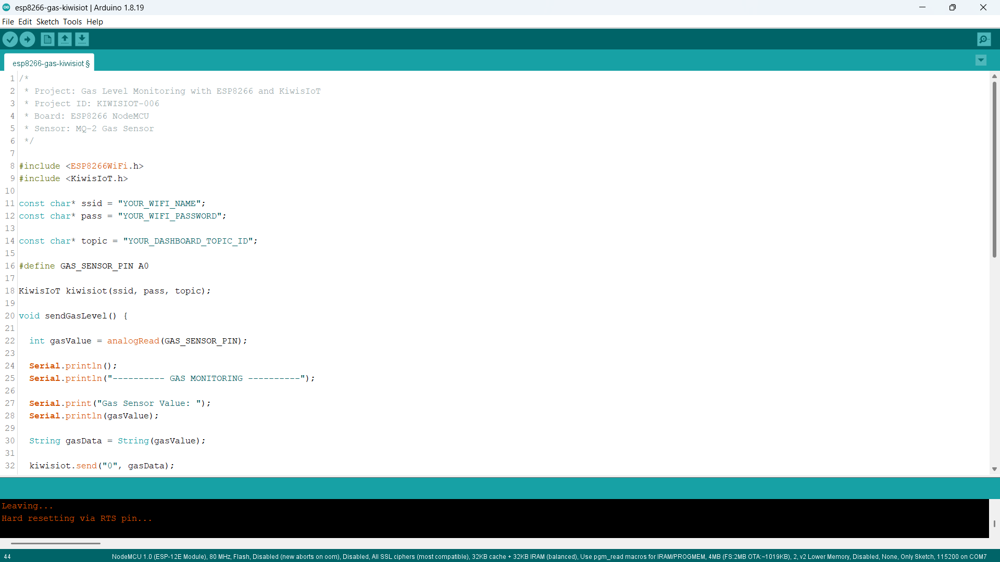
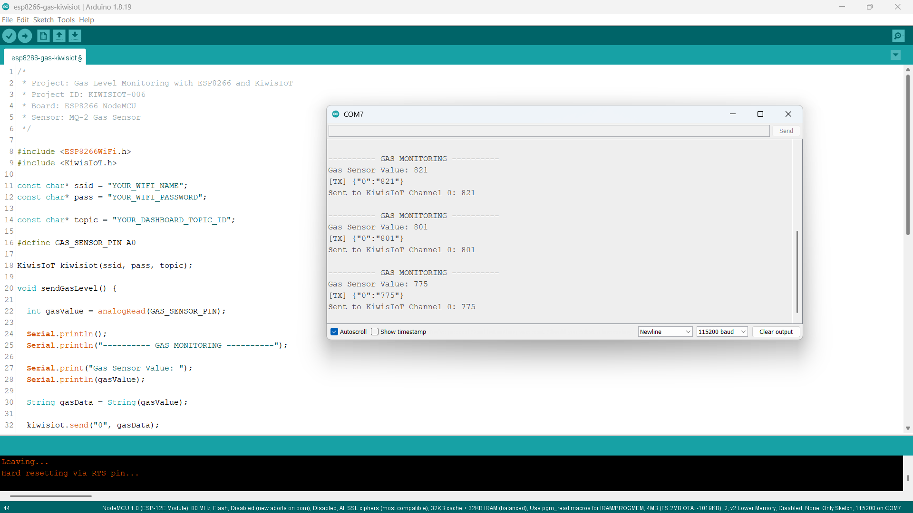

# Gas Sensor ESP8266 IoT Project: Monitor Gas Levels with KiwisIoT 🔥

Build a gas level monitoring system using an **MQ-2 gas sensor, ESP8266 NodeMCU, and KiwisIoT**.

In this project, the ESP8266 reads the analog output of the MQ-2 gas sensor and sends the sensor value to the **KiwisIoT IoT dashboard** over Wi-Fi.

The dashboard displays the gas sensor reading using a **Gauge widget**, allowing the sensor value to be monitored remotely.

---

## 🚀 Project Highlights

* ESP8266-based gas monitoring
* MQ-2 gas sensor
* Analog gas sensor reading
* Real-time sensor monitoring
* KiwisIoT dashboard integration
* Wi-Fi-based IoT monitoring
* Gauge widget visualization
* Serial Monitor output
* Beginner-friendly ESP8266 IoT project
* Suitable for engineering and college IoT projects

---

## 📋 Project Overview

The **MQ-2 gas sensor** provides an analog output that changes according to the sensing conditions.

In this project, the analog output of the MQ-2 sensor is connected to the **A0 analog input** of the ESP8266 NodeMCU.

The ESP8266 reads the sensor using `analogRead()` and sends the resulting value to **KiwisIoT Channel 0**.

The project flow is:

```text
MQ-2 Gas Sensor
       ↓
ESP8266 NodeMCU
       ↓
Analog Reading
       ↓
Gas Sensor Value
       ↓
Wi-Fi
       ↓
KiwisIoT
       ↓
IoT Dashboard
       ↓
Gauge Widget
```

> **Note:** The value displayed in this project is the raw analog sensor reading. It is not a calibrated gas concentration or ppm measurement.

---

## 💡 Why This Project?

Gas sensors can be used to monitor changes in environmental conditions and detect changes in the presence of combustible gases or smoke.

By connecting an MQ-2 sensor to an ESP8266 and sending its reading to KiwisIoT, the sensor value can be monitored through an IoT dashboard instead of relying only on the local Serial Monitor.

This project can be used as a starting point for applications such as:

* Gas level monitoring
* Smoke monitoring concepts
* Indoor environmental monitoring
* IoT-based sensor monitoring
* Safety monitoring concepts
* Smart home projects
* Industrial monitoring concepts
* Engineering and college IoT projects

---

## 🎓 What You'll Learn

By building this project, you will learn how to:

* Connect an MQ-2 gas sensor to an ESP8266
* Read an analog sensor using `analogRead()`
* Monitor changing gas sensor values
* Convert sensor readings into data for transmission
* Send sensor data from ESP8266 to KiwisIoT
* Use a KiwisIoT channel for sensor data
* Display sensor readings using a Gauge widget
* Monitor sensor data remotely over Wi-Fi

---

## 🔧 Components Required

| Component              | Quantity    |
| ---------------------- | ----------- |
| ESP8266 NodeMCU        | 1           |
| MQ-2 Gas Sensor Module | 1           |
| Jumper Wires           | As required |
| USB Cable              | 1           |
| Computer               | 1           |

> **Note:** The circuit shown in this project uses the analog output of the MQ-2 sensor connected to the ESP8266 analog input A0.

---

## 💻 Software Requirements

* Arduino IDE
* ESP8266 board package
* KiwisIoT Arduino library
* KiwisIoT account
* Wi-Fi connection

### Common KiwisIoT Setup

Before starting this project, complete the common **KiwisIoT Arduino Setup Guide**.

The setup guide covers:

* Arduino IDE installation
* ESP8266 board installation
* ESP8266 board selection
* KiwisIoT Arduino library installation
* KiwisIoT account setup
* Panel creation
* Topic ID
* Dashboard widgets
* Widget configuration

The common setup guide is available in the parent `esp8266` directory:

[Open the KiwisIoT Arduino Setup Guide](../kiwisiot-arduino-setup/)

---

## 🛠️ Technologies Used

* ESP8266 NodeMCU
* MQ-2 Gas Sensor
* Arduino IDE
* KiwisIoT Arduino Library
* KiwisIoT IoT Dashboard
* Wi-Fi
* C++ / Arduino

---

## 🔌 Circuit Connection

The MQ-2 gas sensor module is connected to the ESP8266 NodeMCU.

Use the following connections:

| MQ-2 Gas Sensor | ESP8266 NodeMCU |
| --------------- | --------------- |
| VCC             | 3.3V            |
| GND             | GND             |
| AO              | A0              |

The sensor's **analog output (AO)** is connected to **A0** of the ESP8266.

The ESP8266 reads this analog signal using:

```cpp
analogRead(GAS_SENSOR_PIN);
```



---

## 🔍 How the Gas Sensor Works

The MQ-2 gas sensor module provides an analog output that can be read by a microcontroller.

In this project, the analog output is connected to:

```text
A0
```

The ESP8266 reads the sensor value using:

```cpp
int gasValue = analogRead(GAS_SENSOR_PIN);
```

The resulting value is stored in the `gasValue` variable.

For the ESP8266 analog input, the reading is represented as a numeric sensor value.

The project does not convert this reading into ppm.

```text
MQ-2 Sensor
     ↓
Analog Output
     ↓
ESP8266 A0
     ↓
analogRead()
     ↓
Gas Sensor Value
```

For example, during testing, values such as:

```text
821
801
775
```

were displayed in the Serial Monitor.

> **Important:** The raw analog value depends on the sensor module, operating conditions, environment, and sensor characteristics. It should not be treated as a calibrated gas concentration.

---

## ⚙️ Gas Monitoring Logic

The ESP8266 periodically reads the analog output from the MQ-2 sensor.

The process is:

```text
Read MQ-2 Sensor
       ↓
Analog Reading
       ↓
Store Sensor Value
       ↓
Convert Value to String
       ↓
Send to KiwisIoT
       ↓
Display on Dashboard
```

The sensor value is read using:

```cpp
int gasValue = analogRead(GAS_SENSOR_PIN);
```

The value is then converted into a string:

```cpp
String gasData = String(gasValue);
```

The sensor value is sent to KiwisIoT using:

```cpp
kiwisiot.send("0", gasData);
```

Therefore:

```text
MQ-2 Analog Value
        ↓
    Channel 0
        ↓
     KiwisIoT
        ↓
   Gauge Widget
```

---

## 📊 KiwisIoT Dashboard

The ESP8266 sends the gas sensor reading to **KiwisIoT Channel 0**.

| Channel | Parameter        | Example Value | Dashboard Widget |
| ------- | ---------------- | ------------- | ---------------- |
| `0`     | Gas Sensor Value | `821`         | Gauge            |

The data flow is:

```text
ESP8266
   │
   └── Channel 0 → Gas Sensor Value
                       ↓
                   KiwisIoT
                       ↓
                  Gauge Widget
```

The dashboard displays the current sensor value received from the ESP8266.



---

## ⚙️ Dashboard Configuration

Create a KiwisIoT panel for the project and add a **Gauge** widget for displaying the gas sensor value.

### Gas Level Widget

Configure the widget to use:

```text
Name: Gas Level
Channel ID: 0
```

The widget receives the sensor value sent by:

```cpp
kiwisiot.send("0", gasData);
```

Example values may look like:

```text
821
801
775
```

The Gauge widget provides a visual representation of the sensor reading.

> **Important:** The Channel ID configured in the dashboard must match the Channel ID used in the ESP8266 code.

---

## 💻 Arduino Code

The complete Arduino code is available here:

View the Arduino Code

The program uses the ESP8266 Wi-Fi library and the KiwisIoT Arduino library:

```cpp
#include <ESP8266WiFi.h>
#include <KiwisIoT.h>
```



---

## 🔐 Configure Wi-Fi and KiwisIoT

Before uploading the program, update these values:

```cpp
const char* ssid = "YOUR_WIFI_NAME";
const char* pass = "YOUR_WIFI_PASSWORD";

const char* topic = "YOUR_DASHBOARD_TOPIC_ID";
```

Replace:

```text
YOUR_WIFI_NAME
```

with your Wi-Fi network name.

Replace:

```text
YOUR_WIFI_PASSWORD
```

with your Wi-Fi password.

Replace:

```text
YOUR_DASHBOARD_TOPIC_ID
```

with the Topic ID of the KiwisIoT panel created for this project.

For example:

```cpp
const char* topic = "dash_xxxxxxxxxxxxx";
```

> **Security:** Never publish your actual Wi-Fi password or private credentials in a public GitHub repository.

---

## 🧾 Complete Arduino Code

```cpp
/*
 * Project: Gas Level Monitoring with ESP8266 and KiwisIoT
 * Project ID: KIWISIOT-006
 * Board: ESP8266 NodeMCU
 * Sensor: MQ-2 Gas Sensor
 */

#include <ESP8266WiFi.h>
#include <KiwisIoT.h>

const char* ssid = "YOUR_WIFI_NAME";
const char* pass = "YOUR_WIFI_PASSWORD";

const char* topic = "YOUR_DASHBOARD_TOPIC_ID";

#define GAS_SENSOR_PIN A0

KiwisIoT kiwisiot(ssid, pass, topic);

void sendGasLevel() {

  int gasValue = analogRead(GAS_SENSOR_PIN);

  Serial.println();
  Serial.println("---------- GAS MONITORING ----------");

  Serial.print("Gas Sensor Value: ");
  Serial.println(gasValue);

  String gasData = String(gasValue);

  kiwisiot.send("0", gasData);

  Serial.print("Sent to KiwisIoT Channel 0: ");
  Serial.println(gasData);
}

void setup() {

  Serial.begin(115200);

  Serial.println("       GAS MONITORING       ");

  pinMode(GAS_SENSOR_PIN, INPUT);

  Serial.println("Gas sensor initialized");

  Serial.println("Connecting to KiwisIoT...");

  kiwisiot.begin();

  Serial.println("KiwisIoT initialized");
  Serial.println("Starting gas monitoring...");
}

void loop() {

  kiwisiot.run();

  static unsigned long lastSend = 0;

  if (millis() - lastSend >= 2000) {

    lastSend = millis();

    sendGasLevel();
  }

  delay(100);
}
```

---

## ⬆️ Upload the Program

After configuring the code:

1. Connect the ESP8266 NodeMCU to your computer.
2. Open `esp8266-gas-kiwisiot.ino` in Arduino IDE.
3. Select the appropriate ESP8266 board.
4. Verify the program.
5. Upload the code to the ESP8266.
6. Open the Serial Monitor.
7. Set the baud rate to:

```text
115200
```

Once the ESP8266 connects to KiwisIoT, it will begin reading the MQ-2 sensor and sending the sensor value to the configured dashboard.

---

## 🖥️ Serial Monitor Output

The ESP8266 displays the gas sensor value and KiwisIoT transmission status in the Serial Monitor.

A typical output during testing is:

```text
---------- GAS MONITORING ----------
Gas Sensor Value: 821
Sent to KiwisIoT Channel 0: 821

---------- GAS MONITORING ----------
Gas Sensor Value: 801
Sent to KiwisIoT Channel 0: 801

---------- GAS MONITORING ----------
Gas Sensor Value: 775
Sent to KiwisIoT Channel 0: 775
```

The project reads the sensor and sends the value approximately every two seconds.



---

## 🔄 Understanding the Data Flow

The project processes the MQ-2 sensor reading in several stages.

### 1. Read the Gas Sensor

```cpp
int gasValue = analogRead(GAS_SENSOR_PIN);
```

The ESP8266 reads the analog output of the MQ-2 sensor through A0.

### 2. Convert the Sensor Value

```cpp
String gasData = String(gasValue);
```

The numerical sensor value is converted into a string for transmission.

### 3. Send the Value to KiwisIoT

```cpp
kiwisiot.send("0", gasData);
```

The sensor reading is sent through Channel 0.

The complete flow is:

```text
MQ-2 Gas Sensor
       ↓
Analog Reading
       ↓
ESP8266 A0
       ↓
Gas Sensor Value
       ↓
KiwisIoT Channel 0
       ↓
Gauge Widget
       ↓
Dashboard
```

---

## 🧪 Testing the Project

After uploading the program, open the Serial Monitor and observe the sensor values.

### Sensor Reading

The Serial Monitor should display a value similar to:

```text
Gas Sensor Value: 821
```

The same value is sent to KiwisIoT:

```text
Sent to KiwisIoT Channel 0: 821
```

The KiwisIoT dashboard should then display the value using the Gauge widget.

For example:

```text
Gas Level
   821
```

### Observing Changes

Allow the sensor to operate and observe how the analog reading changes under different environmental conditions.

The dashboard will update as new sensor readings are received.

> **Important:** Changes in the raw sensor value indicate changes in the sensor output. They should not be interpreted directly as a specific gas concentration without appropriate calibration.

---

## 🌐 Why Use KiwisIoT for Gas Monitoring?

An MQ-2 sensor can provide a local analog reading, but connecting it to an IoT platform makes the sensor data available through a dashboard.

With this project:

```text
MQ-2 Sensor
     ↓
ESP8266
     ↓
Wi-Fi
     ↓
KiwisIoT
     ↓
Dashboard
```

The gas sensor value can be monitored remotely instead of relying only on the local Serial Monitor.

This approach can also be extended with additional sensors, alerts, actuators, and automation features.

---

## 🛠️ Troubleshooting

### Gas Sensor Value Does Not Appear

Check:

* VCC connection
* GND connection
* AO connection to A0
* Sensor power supply
* Sensor module
* ESP8266 board selection
* Arduino IDE configuration
* Serial Monitor baud rate

### Sensor Value Remains Unchanged

Check:

* AO connection
* Sensor power supply
* Sensor module
* Wiring
* Sensor operating conditions
* Serial Monitor output

Allow the sensor to operate and stabilize before interpreting changes in its readings.

### Dashboard Does Not Receive Data

Check:

* Wi-Fi name
* Wi-Fi password
* Internet connection
* KiwisIoT Topic ID
* Channel ID
* Dashboard widget configuration
* KiwisIoT Arduino library
* ESP8266 connection

### Gauge Shows No Value

Make sure the Gauge widget uses:

```text
Channel ID: 0
```

The ESP8266 sends the sensor value using:

```cpp
kiwisiot.send("0", gasData);
```

Therefore:

```text
ESP8266 Code
     ↓
Channel 0
     ↓
KiwisIoT
     ↓
Gauge Widget
     ↓
Channel 0
```

The Channel ID must match on both sides.

### Sensor Values Change Frequently

MQ-2 sensor readings can vary depending on the sensor, environment, power conditions, and surrounding conditions.

Check:

* Sensor wiring
* Power supply
* Sensor placement
* Environmental conditions
* Sensor stabilization
* Analog connection

> **Note:** The raw analog reading is intended for monitoring in this project. It is not a calibrated measurement of gas concentration.

---

## 🔒 Security

Never publish sensitive credentials in a public GitHub repository.

Do not commit:

* Wi-Fi passwords
* API keys
* Access tokens
* Account passwords
* Private credentials

Use placeholders such as:

```text
YOUR_WIFI_NAME
YOUR_WIFI_PASSWORD
YOUR_DASHBOARD_TOPIC_ID
```

Enter your actual credentials only in your local Arduino project.

---

## 💡 Possible Applications

An ESP8266 MQ-2 gas monitoring system can be used as a starting point for:

* Gas monitoring systems
* Smoke monitoring concepts
* Indoor monitoring
* Environmental monitoring
* Safety monitoring concepts
* Smart home projects
* Industrial monitoring concepts
* IoT sensor monitoring
* Engineering and college IoT projects

The project can be extended by adding LEDs, buzzers, relays, alerts, additional sensors, threshold-based logic, or automation features.

---

## 📁 Project Structure

```text
006-gas-kiwisiot/
│
├── README.md
│
├── code/
│   └── esp8266-gas-kiwisiot.ino
│
└── images/
    ├── circuit.png
    ├── code.png
    ├── serial-monitor.png
    └── dashboard-output.png
```

---

## 🔗 Related KiwisIoT Projects

This project is part of the **KiwisIoT ESP8266 project collection**.

The common setup guide is available here:

[Open the KiwisIoT Arduino Setup Guide](../kiwisiot-arduino-setup/)

Other ESP8266 IoT projects can be found in the parent directory.

---

## ❓ Frequently Asked Questions

### What is an MQ-2 gas sensor?

The MQ-2 is a gas sensor module commonly used for detecting changes associated with combustible gases and smoke.

### Can I connect an MQ-2 sensor to an ESP8266?

Yes. The analog output of the sensor module can be connected to an ESP8266 analog input, subject to the electrical limits of the specific module and ESP8266 board.

### Which ESP8266 pin is used in this project?

The MQ-2 sensor's analog output is connected to:

```text
A0
```

### Which KiwisIoT channel is used?

This project uses:

```text
Channel 0 → Gas Sensor Value
```

### What does the project display?

The project displays the raw analog reading obtained from the MQ-2 sensor.

For example:

```text
Gas Sensor Value: 821
```

### Does this project measure gas concentration in ppm?

No.

The project sends the raw analog sensor value to KiwisIoT. A calibrated gas concentration measurement would require appropriate sensor calibration and additional processing.

### How often does the ESP8266 send the gas sensor value?

The project sends the sensor reading approximately every two seconds.

### Which KiwisIoT widget is used?

The project uses a:

```text
Gauge
```

widget connected to Channel 0.

### Can this project be extended?

Yes. You can add LEDs, buzzers, relays, alerts, thresholds, additional sensors, and automation logic to build a larger IoT monitoring system.

---

## 📝 Summary

This project demonstrates a simple **ESP8266 gas sensor IoT monitoring system** using KiwisIoT.

The ESP8266 reads the analog output of the MQ-2 gas sensor and sends the sensor reading to a KiwisIoT dashboard over Wi-Fi.

The final KiwisIoT dashboard provides:

```text
Gas Level → Numerical sensor value
```

It provides a practical example of how an ESP8266 can connect an analog gas sensor to an IoT platform for remote gas level monitoring.

**Note:** The value shown is the **raw sensor reading from the MQ-2**, not a calibrated gas concentration such as ppm.

---

## 📄 License

This project is licensed under the MIT License. See the `LICENSE` file for details.
