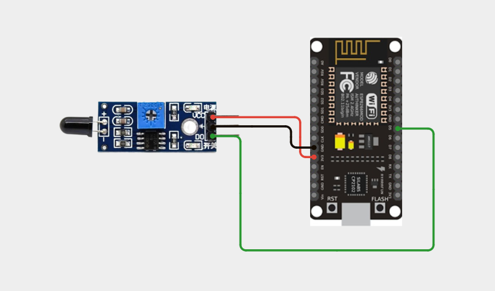
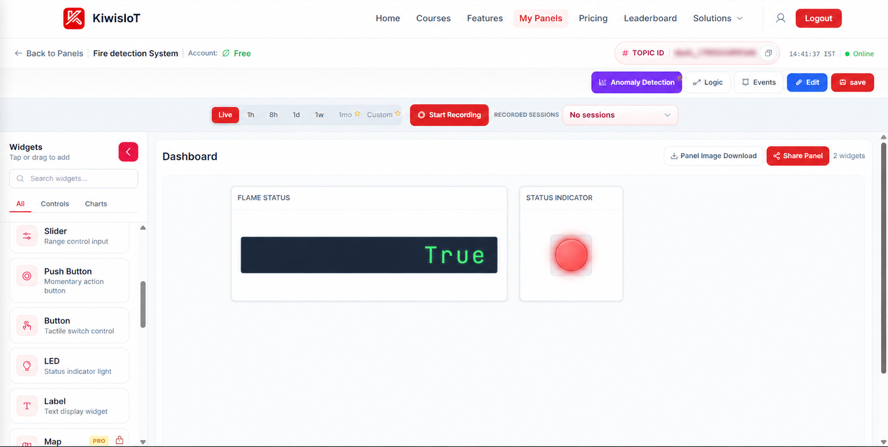
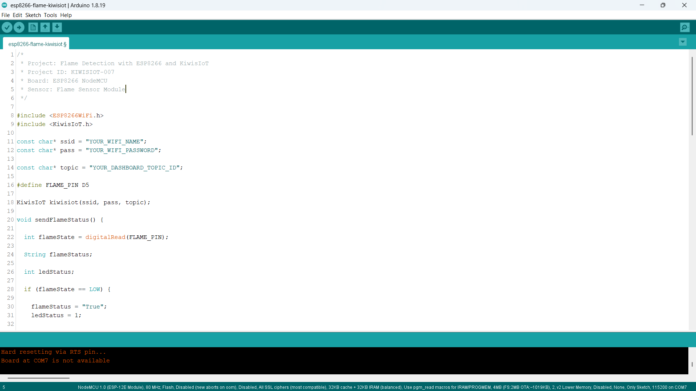
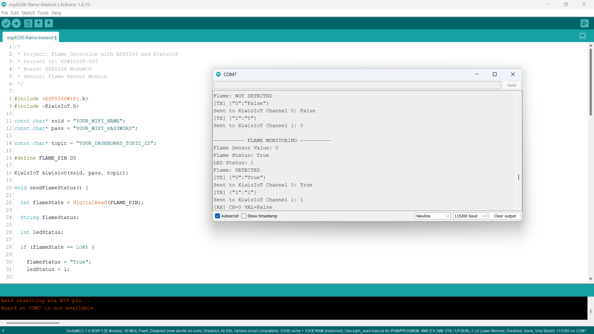

# ESP8266 Flame Sensor IoT Project: Build a Real-Time Fire Detection System with KiwisIoT 🔥

Monitor **flame detection status in real time** using a **flame sensor, ESP8266 NodeMCU, and KiwisIoT**.

In this project, the ESP8266 reads the digital output of a flame sensor, determines whether a flame is detected, and sends the flame status to a **KiwisIoT IoT dashboard** over Wi-Fi.

The project also sends an additional LED status value to **Channel 1**, which can be displayed using a **LED Status Indicator** widget.

---

## 🚀 Project Highlights

* ESP8266-based flame detection
* Digital flame sensor input
* Real-time flame detection
* Flame DETECTED / NOT DETECTED status
* LED status indication
* Two-channel KiwisIoT dashboard integration
* Wi-Fi-based IoT monitoring
* Beginner-friendly Arduino IoT project
* Suitable for engineering and college IoT projects

---

## 📋 Project Overview

A **flame sensor module** can detect the presence of a flame and provide a digital output based on the detected condition.

In this project, the flame sensor is connected to a digital GPIO pin of the ESP8266 NodeMCU. The ESP8266 reads the sensor state and determines whether a flame is detected.

The project uses:

```text
LOW  → Flame Detected
HIGH → Flame Not Detected
```

The flame status is sent to **KiwisIoT Channel 0**.

An additional LED status value is generated based on the flame detection state and sent to **Channel 1**.

The project flow is:

```text
Flame Sensor
      ↓
ESP8266 NodeMCU
      ↓
Digital Reading
      ↓
Flame Detection Logic
      ↓
Flame Status
      ↓
      ├── Channel 0 → Flame Status
      │
      └── Channel 1 → LED Status
                ↓
             KiwisIoT
                ↓
          IoT Dashboard
```

---

## 💡 Why This Project?

This project demonstrates how a digital flame sensor can be connected to an ESP8266 and integrated with an IoT platform.

Instead of checking the flame sensor only through the local Serial Monitor, the ESP8266 sends the detection status to KiwisIoT, where it can be monitored through a dashboard.

The project also demonstrates how one sensor condition can be used to provide multiple dashboard outputs.

The same concept can be used as a starting point for applications such as:

* Flame detection
* Fire monitoring concepts
* Safety monitoring systems
* Heat-source detection concepts
* Alert systems
* Automation projects
* IoT-based safety monitoring

---

## 🎓 What You'll Learn

By building this project, you will learn how to:

* Connect a flame sensor to an ESP8266
* Read a digital sensor using `digitalRead()`
* Detect a flame using a digital sensor
* Convert a digital sensor state into a readable status
* Generate an LED status value
* Send data to multiple KiwisIoT channels
* Configure a KiwisIoT status widget
* Configure a KiwisIoT LED Status Indicator widget
* Monitor flame detection remotely over Wi-Fi

---

## 🔧 Components Required

| Component           | Quantity    |
| ------------------- | ----------- |
| ESP8266 NodeMCU     | 1           |
| Flame Sensor Module | 1           |
| Jumper Wires        | As required |
| USB Cable           | 1           |
| Computer            | 1           |

---

## 💻 Software Requirements

* Arduino IDE
* ESP8266 board package
* KiwisIoT Arduino library
* KiwisIoT account
* Wi-Fi connection

### Common KiwisIoT Setup

Before starting this project, complete the common **KiwisIoT Arduino Setup Guide**.

The setup guide covers:

* Arduino IDE installation
* ESP8266 board installation
* ESP8266 board selection
* KiwisIoT Arduino library installation
* KiwisIoT account setup
* Panel creation
* Topic ID
* Dashboard widgets
* Widget configuration

The common setup guide is available in the parent `esp8266` directory:

[Open the KiwisIoT Arduino Setup Guide](../kiwisiot-arduino-setup/)

---

## 🛠️ Technologies Used

* ESP8266 NodeMCU
* Flame Sensor Module
* Arduino IDE
* KiwisIoT Arduino Library
* KiwisIoT IoT Dashboard
* Wi-Fi
* C++ / Arduino

---

## 🔌 Circuit Connection

The flame sensor module provides a digital output that is read by the ESP8266.

Connect the sensor as follows:

| Flame Sensor Module | ESP8266 NodeMCU |
| ------------------- | --------------- |
| VCC                 | 3.3V            |
| GND                 | GND             |
| DO / OUT            | D5              |

The project uses:

```text
Flame Sensor OUT → D5
```



> **Note:** The wiring shown above reflects the hardware configuration used for this project.

---

## 🔥 How the Flame Sensor Works

A flame sensor module detects infrared radiation associated with a flame and provides a digital output.

The ESP8266 reads this digital output using:

```cpp
int flameState = digitalRead(FLAME_PIN);
```

The flame sensor is connected to:

```text
D5
```

In this project, the sensor logic is:

| Flame Sensor State | Flame Status       |
| ------------------ | ------------------ |
| `LOW`              | Flame Detected     |
| `HIGH`             | Flame Not Detected |

The detection logic is implemented using:

```cpp
if (flameState == LOW) {

    flameStatus = "True";

}
else {

    flameStatus = "False";

}
```

> **Note:** The LOW/HIGH behavior can vary between flame sensor modules. This project is configured according to the sensor behavior used during testing.

---

## ⚙️ Fire Detection Logic

The ESP8266 continuously reads the digital output of the flame sensor.

The process is:

```text
Read Flame Sensor
       ↓
Is the value LOW?
       ↓
    YES       NO
     ↓         ↓
Flame       No Flame
Detected    Detected
```

The flame state is stored in:

```cpp
int flameState = digitalRead(FLAME_PIN);
```

The resulting flame status is stored as:

```cpp
String flameStatus;
```

When a flame is detected:

```text
Flame Sensor Value: 0
Flame Status: True
```

When a flame is not detected:

```text
Flame Sensor Value: 1
Flame Status: False
```

---

## 💡 LED Status Logic

This project also generates a separate LED status value based on the flame detection state.

The code uses:

```cpp
int ledStatus;
```

When a flame is detected:

```cpp
ledStatus = 1;
```

When a flame is not detected:

```cpp
ledStatus = 0;
```

Therefore:

| Flame Condition    | LED Status |
| ------------------ | ---------- |
| Flame Detected     | `1`        |
| Flame Not Detected | `0`        |

The LED status is sent to **KiwisIoT Channel 1**.

```cpp
kiwisiot.send("1", String(ledStatus));
```

This allows a **LED Status Indicator** widget to visually represent the flame detection condition.

---

## 📊 KiwisIoT Dashboard

The ESP8266 sends two different values to KiwisIoT.

| Channel | Data         | Example          |
| ------- | ------------ | ---------------- |
| `0`     | Flame Status | `True` / `False` |
| `1`     | LED Status   | `1` / `0`        |

The data flow is:

```text
ESP8266
   │
   ├── Channel 0 → Flame Status
   │                    ↓
   │               KiwisIoT
   │
   └── Channel 1 → LED Status
                        ↓
                   KiwisIoT
                        ↓
                   Dashboard
```

The dashboard can therefore display both the flame status and its corresponding LED indication.



---

## ⚙️ Dashboard Configuration

Create a KiwisIoT panel for the project and configure two widgets.

### 🔥 Flame Status Widget

Configure the widget to receive the flame status.

```text
Name: Flame Status
Channel ID: 0
```

The widget receives the value sent by:

```cpp
kiwisiot.send("0", flameStatus);
```

Possible values are:

```text
True
False
```

---

### 💡 LED Status Indicator

Add an **LED Status Indicator** widget for the second channel.

Configure it to use:

```text
Name: LED Status
Channel ID: 1
```

The widget receives:

```cpp
kiwisiot.send("1", String(ledStatus));
```

The values are:

```text
1 → Flame Detected
0 → Flame Not Detected
```

This provides a visual indication on the KiwisIoT dashboard.

> **Important:** The Channel IDs configured in the dashboard must match the Channel IDs used in the ESP8266 code.


---

## 💻 Arduino Code

The complete Arduino code is available here:

[View the Arduino Code](code/esp8266-flame-kiwisiot.ino)

The program uses the ESP8266 Wi-Fi library and the KiwisIoT Arduino library:

```cpp
#include <ESP8266WiFi.h>
#include <KiwisIoT.h>
```



---

## 🔐 Configure Wi-Fi and KiwisIoT

Before uploading the program, update these values:

```cpp
const char* ssid = "YOUR_WIFI_NAME";
const char* pass = "YOUR_WIFI_PASSWORD";

const char* topic = "YOUR_DASHBOARD_TOPIC_ID";
```

Replace:

```text
YOUR_WIFI_NAME
```

with your Wi-Fi network name.

Replace:

```text
YOUR_WIFI_PASSWORD
```

with your Wi-Fi password.

Replace:

```text
YOUR_DASHBOARD_TOPIC_ID
```

with the Topic ID of the KiwisIoT panel created for this project.

For example:

```cpp
const char* topic = "dash_xxxxxxxxxxxxx";
```

> **Security:** Never publish your actual Wi-Fi password or private credentials in a public GitHub repository.

---

## 🧾 Complete Arduino Code

```cpp
/*
 * Project: Flame Sensor Fire Detection with ESP8266 and KiwisIoT
 * Project ID: KIWISIOT-007
 * Board: ESP8266 NodeMCU
 * Sensor: Flame Sensor Module
 */

#include <ESP8266WiFi.h>
#include <KiwisIoT.h>

const char* ssid = "YOUR_WIFI_NAME";
const char* pass = "YOUR_WIFI_PASSWORD";

const char* topic = "YOUR_DASHBOARD_TOPIC_ID";

#define FLAME_PIN D5

KiwisIoT kiwisiot(ssid, pass, topic);

void sendFlameStatus() {

  int flameState = digitalRead(FLAME_PIN);

  String flameStatus;

  int ledStatus;

  if (flameState == LOW) {

    flameStatus = "True";
    ledStatus = 1;

  }

  else {

    flameStatus = "False";
    ledStatus = 0;

  }

  Serial.println();
  Serial.println("---------- FLAME MONITORING ----------");

  Serial.print("Flame Sensor Value: ");
  Serial.println(flameState);

  Serial.print("Flame Status: ");
  Serial.println(flameStatus);

  Serial.print("LED Status: ");
  Serial.println(ledStatus);

  if (flameState == LOW) {

    Serial.println("Flame: DETECTED");

  }

  else {

    Serial.println("Flame: NOT DETECTED");
  }

  kiwisiot.send("0", flameStatus);

  Serial.print("Sent to KiwisIoT Channel 0: ");
  Serial.println(flameStatus);

  kiwisiot.send("1", String(ledStatus));

  Serial.print("Sent to KiwisIoT Channel 1: ");
  Serial.println(ledStatus);
}

void setup() {

  Serial.begin(115200);

  Serial.println("     FLAME MONITORING     ");

  pinMode(FLAME_PIN, INPUT);

  Serial.println("Flame sensor initialized");

  Serial.println("Connecting to KiwisIoT...");

  kiwisiot.begin();

  Serial.println("KiwisIoT initialized");

  Serial.println("Starting flame monitoring...");
}

void loop() {

  kiwisiot.run();

  static unsigned long lastSend = 0;

  if (millis() - lastSend >= 2000) {

    lastSend = millis();

    sendFlameStatus();
  }

  delay(100);
}
```

---

## ⬆️ Upload the Program

After configuring the code:

1. Connect the ESP8266 NodeMCU to your computer.
2. Open `esp8266-flame-kiwisiot.ino` in Arduino IDE.
3. Select the appropriate ESP8266 board.
4. Verify the program.
5. Upload the code to the ESP8266.
6. Open the Serial Monitor.
7. Set the baud rate to:

```text
115200
```

Once the ESP8266 connects to KiwisIoT, it will begin sending flame detection data to the configured dashboard.

---

## 🖥️ Serial Monitor Output

The ESP8266 prints the flame sensor value, flame status, and LED status to the Serial Monitor.

When a flame is detected, a typical output is:

```text
---------- FLAME MONITORING ----------

Flame Sensor Value: 0
Flame Status: True
LED Status: 1
Flame: DETECTED
Sent to KiwisIoT Channel 0: True
Sent to KiwisIoT Channel 1: 1
```

When a flame is not detected:

```text
---------- FLAME MONITORING ----------

Flame Sensor Value: 1
Flame Status: False
LED Status: 0
Flame: NOT DETECTED
Sent to KiwisIoT Channel 0: False
Sent to KiwisIoT Channel 1: 0
```

The project sends the flame and LED status approximately every two seconds.



---

## 🔄 Understanding the Data Flow

The project processes the flame sensor data in several stages.

### 1. Read the Flame Sensor

```cpp
int flameState = digitalRead(FLAME_PIN);
```

### 2. Determine the Flame Status

```cpp
if (flameState == LOW) {

    flameStatus = "True";

}
else {

    flameStatus = "False";

}
```

### 3. Generate LED Status

```cpp
if (flameState == LOW) {

    ledStatus = 1;

}
else {

    ledStatus = 0;

}
```

### 4. Send Flame Status

```cpp
kiwisiot.send("0", flameStatus);
```

### 5. Send LED Status

```cpp
kiwisiot.send("1", String(ledStatus));
```

The complete flow is:

```text
Flame Sensor
      ↓
Digital Reading
      ↓
Flame Detection Logic
      ↓
      ├── Flame Status → Channel 0
      │
      └── LED Status → Channel 1
                ↓
             KiwisIoT
                ↓
            Dashboard
```

---

## 🧪 Testing the Project

You can test the flame sensor by carefully introducing a suitable flame source within the sensor's detection range.

### 🔥 Flame Detected

When the sensor detects a flame:

```text
Flame Sensor Value: 0
Flame Status: True
LED Status: 1
Flame: DETECTED
```

The KiwisIoT dashboard should display:

```text
Flame Status → True
LED Status   → 1
```

The LED Status Indicator should indicate the active state.

### No Flame Detected

When no flame is detected:

```text
Flame Sensor Value: 1
Flame Status: False
LED Status: 0
Flame: NOT DETECTED
```

The dashboard should display:

```text
Flame Status → False
LED Status   → 0
```

> **Safety:** Use extreme caution when testing flame-detection hardware. Keep flames away from electronics, wiring, combustible materials, and people, and use an appropriate controlled test environment.

> **Note:** Actual sensor behavior and detection range can vary depending on the flame sensor module, sensor adjustment, flame distance, lighting conditions, and environment.

---

## 🌐 Why Use KiwisIoT for Flame Monitoring?

A flame sensor can provide a local digital signal, but connecting the ESP8266 to KiwisIoT makes the sensor status available through an IoT dashboard.

With this project:

```text
Flame Sensor
      ↓
ESP8266
      ↓
Wi-Fi
      ↓
KiwisIoT
      ↓
Dashboard
      ↓
Flame + LED Status
```

The flame detection condition can therefore be monitored through the dashboard instead of relying only on the local Serial Monitor.

The second channel also demonstrates how the same sensor condition can be represented using a separate dashboard indicator.

---

## 🛠️ Troubleshooting

### Flame Sensor Does Not Detect a Flame

Check:

* VCC connection
* GND connection
* OUT connection to D5
* Sensor orientation
* Sensor detection range
* Sensor adjustment, if available
* Testing environment

### Flame Sensor Logic Appears Reversed

This project uses:

```cpp
if (flameState == LOW) {
    flameStatus = "True";
}
else {
    flameStatus = "False";
}
```

If your sensor module behaves differently, check its digital output and adjust the detection logic accordingly.

### Dashboard Does Not Receive Data

Check:

* Wi-Fi name
* Wi-Fi password
* Internet connection
* KiwisIoT Topic ID
* Channel IDs
* Dashboard widget configuration
* KiwisIoT Arduino library
* ESP8266 connection

### Flame Status Widget Shows No Data

Make sure the widget uses:

```text
Channel ID: 0
```

The ESP8266 sends the flame status using:

```cpp
kiwisiot.send("0", flameStatus);
```

### LED Status Indicator Does Not Change

Make sure the LED Status Indicator uses:

```text
Channel ID: 1
```

The ESP8266 sends the LED value using:

```cpp
kiwisiot.send("1", String(ledStatus));
```

The expected values are:

```text
1 → Flame Detected
0 → Flame Not Detected
```

### LED Status Appears Reversed

Check the flame detection logic and the LED Status Indicator configuration.

The code uses:

```text
Flame Detected     → 1
Flame Not Detected → 0
```

---

## 🔒 Security

Never publish sensitive credentials in a public GitHub repository.

Do not commit:

* Wi-Fi passwords
* API keys
* Access tokens
* Account passwords
* Private credentials

Use placeholders such as:

```text
YOUR_WIFI_NAME
YOUR_WIFI_PASSWORD
YOUR_DASHBOARD_TOPIC_ID
```

Enter your actual credentials only in your local Arduino project.

---

## 💡 Possible Applications

An ESP8266 flame detection system can be used as a starting point for:

* Flame detection systems
* Fire monitoring concepts
* Safety monitoring
* Alert systems
* Industrial safety concepts
* Smart building safety concepts
* IoT-based monitoring
* Automation projects
* Engineering and college IoT projects

The project can also be extended by adding additional sensors, alerts, actuators, notifications, automation logic, or other KiwisIoT dashboard features.

---

## 📁 Project Structure

```text
007-flame-sensor-kiwisiot/
│
├── README.md
│
├── code/
│   └── esp8266-flame-kiwisiot.ino
│
└── images/
    ├── circuit.png
    ├── code.png
    ├── serial-monitor.png
    └── dashboard-output.png
```

---

## 🔗 Related KiwisIoT ESP8266 Projects

This project is part of the **KiwisIoT ESP8266 IoT project collection**.

Explore other projects in the collection:

- [ESP8266 LDR Sensor IoT Project](../001-ldr-kiwisiot/)
- [ESP8266 IR Sensor IoT Project](../002-ir-kiwisiot/)
- [ESP8266 Ultrasonic Sensor IoT Project](../003-ultrasonic-kiwisiot/)
- [ESP8266 DHT11 Temperature & Humidity IoT Project](../004-dht11-kiwisiot/)
- [ESP8266 PIR Motion Sensor IoT Project](../005-pir-sensor-kiwisiot/)
- [ESP8266 Gas Sensor IoT Project](../006-gas-kiwisiot/)
- [ESP8266 Soil Moisture IoT Project](../008-soil-moisture-kiwisiot/)

For the common Arduino and KiwisIoT setup, see the:

[**KiwisIoT Arduino Setup Guide**](../kiwisiot-arduino-setup/)

---

## ❓ Frequently Asked Questions

### What is a flame sensor?

A flame sensor is a sensor module designed to detect infrared radiation associated with a flame and provide a corresponding sensor output.

### Can I connect a flame sensor to an ESP8266?

Yes. A flame sensor module with a compatible digital output can be connected to an ESP8266 GPIO pin.

### Which ESP8266 pin is used in this project?

The flame sensor output is connected to:

```text
D5
```

### Which KiwisIoT channels are used?

This project uses two channels:

```text
Channel 0 → Flame Status
Channel 1 → LED Status
```

### What does LOW mean in this project?

A LOW sensor signal is interpreted as:

```text
Flame Detected
```

### What does HIGH mean in this project?

A HIGH sensor signal is interpreted as:

```text
Flame Not Detected
```

> **Note:** This behavior depends on the flame sensor module. The code should be adjusted if your particular module uses opposite logic.

### What does Channel 1 represent?

Channel 1 carries the LED status value:

```text
1 → Flame Detected
0 → Flame Not Detected
```

It can be displayed using the KiwisIoT **LED Status Indicator** widget.

### How often does the ESP8266 send the status?

The project sends the flame and LED status approximately every two seconds.

### Can this project be extended?

Yes. You can add alerts, additional sensors, actuators, notifications, automation logic, and other KiwisIoT dashboard features to build a larger IoT safety-monitoring application.

---

## 📝 Summary

This project demonstrates a simple **ESP8266 flame sensor IoT monitoring system** using KiwisIoT.

The ESP8266 reads the digital output of the flame sensor, determines whether a flame is detected, generates a corresponding LED status, and sends both values to a KiwisIoT dashboard over Wi-Fi.

The final dashboard provides:

```text
Flame Status → True / False
LED Status   → 1 / 0
```

It provides a practical example of how an ESP8266 can connect a digital flame sensor to an IoT platform for remote flame monitoring and visual status indication.

---

## 📄 License

This project is licensed under the MIT License. See the `LICENSE` file for details.
