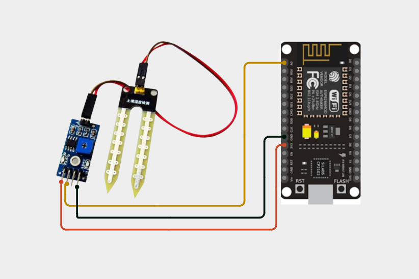
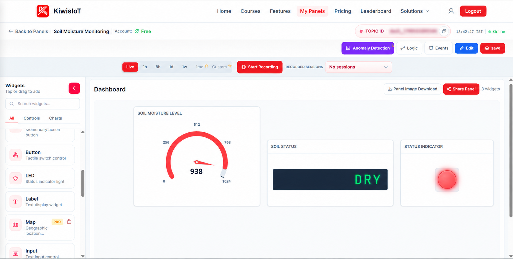
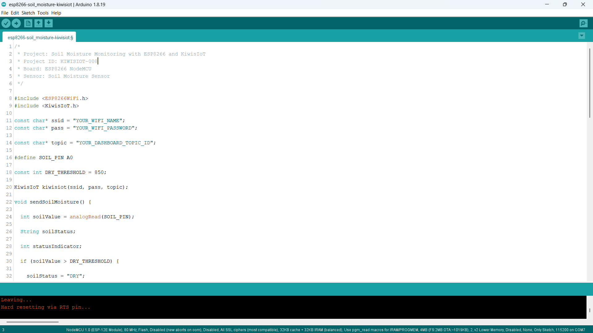
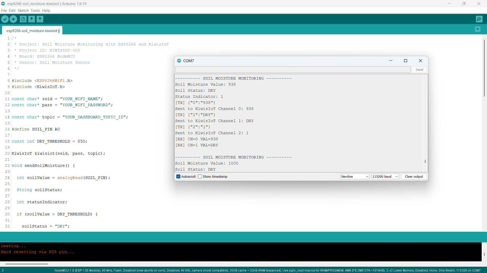

# ESP8266 Soil Moisture IoT Project: Monitor Soil Moisture with KiwisIoT 🌱

Monitor **soil moisture levels in real time** using a **soil moisture sensor, ESP8266 NodeMCU, and KiwisIoT**.

In this project, the ESP8266 reads the analog value from the soil moisture sensor, determines whether the soil is **DRY or WET**, and sends the readings and status information to the **KiwisIoT IoT dashboard** over Wi-Fi.

The dashboard displays the soil moisture value, soil condition, and a status indicator, making it easy to monitor soil conditions remotely.

---

## 🚀 Project Highlights

* ESP8266-based soil moisture monitoring
* Analog soil moisture measurement
* DRY / WET soil classification
* Real-time soil condition visualization
* Status indicator for dry soil detection
* KiwisIoT dashboard integration
* Wi-Fi-based IoT monitoring
* Beginner-friendly Arduino IoT project
* Suitable for engineering and college IoT projects

---

## 📋 Project Overview

A **soil moisture sensor** provides an analog reading that changes according to the moisture condition of the soil.

The ESP8266 reads this analog value through its **A0** pin and compares it with a predefined threshold.

In this project:

```text
Soil Value > 850 → DRY
Soil Value ≤ 850 → WET
```

The ESP8266 sends the soil moisture value, soil status, and status indicator to different KiwisIoT channels.

The project flow is:

```text
Soil Moisture Sensor
        ↓
ESP8266 NodeMCU
        ↓
Analog Reading
        ↓
Soil Moisture Value
        ↓
DRY / WET Classification
        ↓
Wi-Fi
        ↓
KiwisIoT
        ↓
IoT Dashboard
```

---

## 💡 Why This Project?

This project demonstrates how an ESP8266 can collect analog sensor data and convert it into meaningful information for IoT monitoring.

Instead of checking the sensor reading only through the Serial Monitor, the ESP8266 sends the data to KiwisIoT, where the soil condition can be viewed on a dashboard.

The same concept can be used as a starting point for applications such as:

* Soil condition monitoring
* Plant monitoring
* Smart gardening concepts
* Agriculture monitoring
* Greenhouse monitoring
* Irrigation system concepts
* Smart farming projects
* IoT-based environmental monitoring

---

## 🎓 What You'll Learn

By building this project, you will learn how to:

* Connect a soil moisture sensor to an ESP8266
* Read analog sensor values using `analogRead()`
* Set a threshold for sensor classification
* Determine whether soil is DRY or WET
* Send numerical sensor data to KiwisIoT
* Send text status data to KiwisIoT
* Send a numerical status indicator to KiwisIoT
* Configure multiple KiwisIoT channels
* Display sensor data on an IoT dashboard
* Monitor soil conditions remotely over Wi-Fi

---

## 🔧 Components Required

| Component            | Quantity    |
| -------------------- | ----------- |
| ESP8266 NodeMCU      | 1           |
| Soil Moisture Sensor | 1           |
| Soil Moisture Probe  | 1           |
| Jumper Wires         | As required |
| USB Cable            | 1           |
| Computer             | 1           |

---

## 💻 Software Requirements

* Arduino IDE
* ESP8266 board package
* KiwisIoT Arduino library
* KiwisIoT account
* Wi-Fi connection

### Common KiwisIoT Setup

Before starting this project, complete the common **KiwisIoT Arduino Setup Guide**.

The setup guide covers:

* Arduino IDE installation
* ESP8266 board installation
* ESP8266 board selection
* KiwisIoT Arduino library installation
* KiwisIoT account setup
* Panel creation
* Topic ID
* Dashboard widgets
* Widget configuration

The common setup guide is available in the parent `esp8266` directory:

[Open the KiwisIoT Arduino Setup Guide](../kiwisiot-arduino-setup/)

---

## 🛠️ Technologies Used

* ESP8266 NodeMCU
* Soil Moisture Sensor
* Arduino IDE
* KiwisIoT Arduino Library
* KiwisIoT IoT Dashboard
* Wi-Fi
* C++ / Arduino

---

## 🔌 Circuit Connection

The soil moisture sensor module provides an analog output that is connected to the ESP8266 analog input.

For this project, the connections are:

| Soil Moisture Sensor | ESP8266 NodeMCU |
| -------------------- | --------------- |
| VCC                  | 3.3V            |
| GND                  | GND             |
| AO                   | A0              |

The soil moisture probe is connected to the sensor module.

The main signal connection is:

```text
AO → A0
```



> **Note:** The wiring shown reflects the hardware configuration used for this project.

---

## 🌱 How the Soil Moisture Sensor Works

The soil moisture sensor detects changes in the electrical characteristics of the soil.

The sensor module provides an analog output that can be read by the ESP8266.

The ESP8266 reads this value using:

```cpp
int soilValue = analogRead(SOIL_PIN);
```

The sensor value is then compared with the configured threshold:

```cpp
const int DRY_THRESHOLD = 850;
```

The classification logic is:

```text
Soil Value > 850
       ↓
      DRY
```

and:

```text
Soil Value ≤ 850
       ↓
      WET
```

The actual sensor readings can vary depending on the sensor, soil condition, probe position, and environment.

---

## ⚙️ Soil Moisture Detection Logic

The project uses a threshold-based method to determine the soil condition.

The code checks:

```cpp
if (soilValue > DRY_THRESHOLD) {

  soilStatus = "DRY";
  statusIndicator = 1;

}
else {

  soilStatus = "WET";
  statusIndicator = 0;
}
```

The threshold is:

```cpp
const int DRY_THRESHOLD = 850;
```

Therefore:

| Soil Value       | Soil Status | Status Indicator |
| ---------------- | ----------- | ---------------- |
| Greater than 850 | DRY         | 1                |
| 850 or below     | WET         | 0                |

The threshold can be adjusted according to the sensor and the conditions in which it is being used.

---

## 📊 KiwisIoT Dashboard

This project sends three different values to KiwisIoT.

| Channel | Parameter           | Data Type | Example Value | Dashboard Widget |
| ------- | ------------------- | --------- | ------------- | ---------------- |
| `0`     | Soil Moisture Value | Integer   | `938`         | Gauge            |
| `1`     | Soil Status         | Text      | `DRY`         | Label            |
| `2`     | Status Indicator    | Integer   | `1`           | LED              |

The data flow is:

```text
ESP8266
   │
   ├── Channel 0 → Soil Moisture Value
   │
   ├── Channel 1 → DRY / WET
   │
   └── Channel 2 → Status Indicator
                         ↓
                    KiwisIoT
                         ↓
                    Dashboard
```



The dashboard provides:

```text
Soil Moisture Level → Numerical value
Soil Status         → DRY / WET
Status Indicator    → 1 / 0
```

---

## ⚙️ Dashboard Configuration

Configure the KiwisIoT dashboard with three widgets.

### 1. Soil Moisture Level

Use a **Gauge** widget.

Suggested configuration:

```text
Name: Soil Moisture Level
Channel ID: 0
Minimum Value: 0
Maximum Value: 1024
```

The widget receives the value using:

```cpp
kiwisiot.send("0", soilData);
```

For example:

```text
Soil Moisture Value: 938
```

---

### 2. Soil Status

Use a **Label** widget.

Suggested configuration:

```text
Name: Soil Status
Channel ID: 1
```

The widget displays:

```text
DRY
```

or:

```text
WET
```

The value is sent using:

```cpp
kiwisiot.send("1", soilStatus);
```

---

### 3. Status Indicator

Use the **LED** status indicator widget.

Suggested configuration:

```text
Name: Status Indicator
Channel ID: 2
```

The project sends:

```text
1 → DRY
0 → WET
```

The value is sent using:

```cpp
kiwisiot.send("2", String(statusIndicator));
```

This provides a visual indication of the soil condition.

> **Important:** The Channel IDs configured in the KiwisIoT dashboard must match the Channel IDs used in the ESP8266 code.

---

## 💻 Arduino Code

The complete Arduino code is available here:

[View the Arduino Code](code/esp8266-soil_moisture-kiwisiot.ino)

The program uses the ESP8266 Wi-Fi library and KiwisIoT Arduino library:

```cpp
#include <ESP8266WiFi.h>
#include <KiwisIoT.h>
```



---

## 🔐 Configure Wi-Fi and KiwisIoT

Before uploading the program, update these values:

```cpp
const char* ssid = "YOUR_WIFI_NAME";
const char* pass = "YOUR_WIFI_PASSWORD";

const char* topic = "YOUR_DASHBOARD_TOPIC_ID";
```

Replace:

```text
YOUR_WIFI_NAME
```

with your Wi-Fi network name.

Replace:

```text
YOUR_WIFI_PASSWORD
```

with your Wi-Fi password.

Replace:

```text
YOUR_DASHBOARD_TOPIC_ID
```

with the Topic ID of the KiwisIoT panel created for this project.

For example:

```cpp
const char* topic = "dash_xxxxxxxxxxxxx";
```

> **Security:** Never publish your actual Wi-Fi password or private credentials in a public GitHub repository.

---

## 🧾 Complete Arduino Code

```cpp
/*
 * Project: Soil Moisture Monitoring with ESP8266 and KiwisIoT
 * Project ID: KIWISIOT-008
 * Board: ESP8266 NodeMCU
 * Sensor: Soil Moisture Sensor
 */

#include <ESP8266WiFi.h>
#include <KiwisIoT.h>

const char* ssid = "YOUR_WIFI_NAME";
const char* pass = "YOUR_WIFI_PASSWORD";

const char* topic = "YOUR_DASHBOARD_TOPIC_ID";

#define SOIL_PIN A0

const int DRY_THRESHOLD = 850;

KiwisIoT kiwisiot(ssid, pass, topic);

void sendSoilMoisture() {

  int soilValue = analogRead(SOIL_PIN);

  String soilStatus;

  int statusIndicator;

  if (soilValue > DRY_THRESHOLD) {

    soilStatus = "DRY";
    statusIndicator = 1;

  }
  else {

    soilStatus = "WET";
    statusIndicator = 0;
  }

  Serial.println();
  Serial.println("---------- SOIL MOISTURE MONITORING ----------");

  Serial.print("Soil Moisture Value: ");
  Serial.println(soilValue);

  Serial.print("Soil Status: ");
  Serial.println(soilStatus);

  Serial.print("Status Indicator: ");
  Serial.println(statusIndicator);

  String soilData = String(soilValue);

  kiwisiot.send("0", soilData);

  Serial.print("Sent to KiwisIoT Channel 0: ");
  Serial.println(soilData);

  kiwisiot.send("1", soilStatus);

  Serial.print("Sent to KiwisIoT Channel 1: ");
  Serial.println(soilStatus);

  kiwisiot.send("2", String(statusIndicator));

  Serial.print("Sent to KiwisIoT Channel 2: ");
  Serial.println(statusIndicator);
}

void setup() {

  Serial.begin(115200);

  Serial.println();
  Serial.println("     SOIL MOISTURE MONITORING     ");

  pinMode(SOIL_PIN, INPUT);

  Serial.println("Soil moisture sensor initialized");

  Serial.println("Connecting to KiwisIoT...");

  kiwisiot.begin();

  Serial.println("KiwisIoT initialized");
  Serial.println("Starting soil moisture monitoring...");
}

void loop() {

  kiwisiot.run();

  static unsigned long lastSend = 0;

  if (millis() - lastSend >= 2000) {

    lastSend = millis();

    sendSoilMoisture();
  }

  delay(100);
}
```

---

## ⬆️ Upload the Program

After configuring the code:

1. Connect the ESP8266 NodeMCU to your computer.
2. Open `esp8266-soil-moisture-kiwisiot.ino` in Arduino IDE.
3. Select the appropriate ESP8266 board.
4. Verify the program.
5. Upload the code to the ESP8266.
6. Open the Serial Monitor.
7. Set the baud rate to:

```text
115200
```

Once the ESP8266 connects to KiwisIoT, it will begin sending soil moisture readings and status information to the configured dashboard.

---

## 🖥️ Serial Monitor Output

The ESP8266 prints the soil moisture value, soil status, status indicator, and KiwisIoT transmission information to the Serial Monitor.

A typical output looks like:

```text
---------- SOIL MOISTURE MONITORING ----------
Soil Moisture Value: 938
Soil Status: DRY
Status Indicator: 1

[TX] {"0":"938"}
Sent to KiwisIoT Channel 0: 938

[TX] {"1":"DRY"}
Sent to KiwisIoT Channel 1: DRY

[TX] {"2":"1"}
Sent to KiwisIoT Channel 2: 1
```

The project sends updated values approximately every two seconds.



---

## 🔄 Understanding the Data Flow

The project processes the soil moisture data in several stages.

### 1. Read the Soil Moisture Value

The ESP8266 reads the analog value from A0:

```cpp
int soilValue = analogRead(SOIL_PIN);
```

### 2. Compare with the Threshold

The value is compared with:

```cpp
const int DRY_THRESHOLD = 850;
```

### 3. Determine the Soil Status

If the value is greater than 850:

```text
DRY
```

Otherwise:

```text
WET
```

### 4. Generate the Status Indicator

The project assigns:

```text
DRY → 1
WET → 0
```

### 5. Send the Data to KiwisIoT

Three channels are updated:

```cpp
kiwisiot.send("0", soilData);
kiwisiot.send("1", soilStatus);
kiwisiot.send("2", String(statusIndicator));
```

The complete flow is:

```text
Soil Moisture Sensor
        ↓
Analog Reading
        ↓
Soil Moisture Value
        ↓
Threshold Comparison
        ↓
DRY / WET
        ↓
Status Indicator 1 / 0
        ↓
KiwisIoT
        ↓
Dashboard
```

---

## 🧪 Testing the Project

You can test the sensor by changing the moisture condition around the soil moisture probe.

### Dry Condition

When the sensor reading is greater than the configured threshold:

```text
Soil Value > 850
```

The project reports:

```text
Soil Status: DRY
Status Indicator: 1
```

The dashboard displays:

```text
Soil Status → DRY
Status Indicator → 1
```

### Wet Condition

When the sensor reading is 850 or below:

```text
Soil Value ≤ 850
```

The project reports:

```text
Soil Status: WET
Status Indicator: 0
```

The dashboard displays:

```text
Soil Status → WET
Status Indicator → 0
```

> **Note:** Actual sensor readings can vary depending on the soil moisture sensor, probe position, soil type, and environmental conditions.

---

## 🎯 Adjusting the Dry Threshold

The project currently uses:

```cpp
const int DRY_THRESHOLD = 850;
```

This means:

```text
Value > 850 → DRY
Value ≤ 850 → WET
```

If your sensor produces different readings for dry and wet soil, the threshold can be adjusted.

For example:

```cpp
const int DRY_THRESHOLD = 800;
```

or:

```cpp
const int DRY_THRESHOLD = 900;
```

The appropriate threshold depends on the sensor and the conditions in which it is being used.

---

## 🌐 Why Use KiwisIoT for Soil Moisture Monitoring?

A soil moisture sensor can provide a local analog reading, but connecting the ESP8266 to KiwisIoT makes the information available through an IoT dashboard.

With this project:

```text
Soil Moisture Sensor
        ↓
ESP8266
        ↓
Wi-Fi
        ↓
KiwisIoT
        ↓
Dashboard
        ↓
Soil Monitoring
```

The dashboard provides three different views of the sensor data:

```text
Soil Moisture Level → Numerical value
Soil Status         → DRY / WET
Status Indicator    → 1 / 0
```

This makes the project a useful starting point for larger IoT-based agriculture and plant-monitoring applications.

---

## 🛠️ Troubleshooting

### Soil Reading Does Not Change

Check:

* VCC connection
* GND connection
* AO connection to A0
* Soil moisture probe connection
* Sensor module wiring
* Probe position
* Sensor power supply

### Soil Status Is Always DRY

Check:

* Soil moisture probe
* Sensor wiring
* Analog output connection
* Current sensor reading
* `DRY_THRESHOLD` value

The current threshold is:

```cpp
const int DRY_THRESHOLD = 850;
```

If your sensor produces lower or higher readings than expected, the threshold may need to be adjusted.

### Soil Status Is Always WET

Check:

* Analog sensor output
* Probe connection
* Sensor module
* Current sensor reading
* `DRY_THRESHOLD` value

### Dashboard Does Not Receive Data

Check:

* Wi-Fi name
* Wi-Fi password
* Internet connection
* KiwisIoT Topic ID
* Channel IDs
* Dashboard widget configuration
* KiwisIoT Arduino library
* ESP8266 connection

### Soil Moisture Widget Shows No Value

Make sure the Gauge widget uses:

```text
Channel ID: 0
```

The ESP8266 sends the soil moisture value using:

```cpp
kiwisiot.send("0", soilData);
```

### Soil Status Widget Shows No Value

Make sure the Label widget uses:

```text
Channel ID: 1
```

The ESP8266 sends the soil status using:

```cpp
kiwisiot.send("1", soilStatus);
```

### Status Indicator Does Not Update

Make sure the LED widget uses:

```text
Channel ID: 2
```

The ESP8266 sends:

```text
1 → DRY
0 → WET
```

using:

```cpp
kiwisiot.send("2", String(statusIndicator));
```

---

## 🔒 Security

Never publish sensitive credentials in a public GitHub repository.

Do not commit:

* Wi-Fi passwords
* API keys
* Access tokens
* Account passwords
* Private credentials

Use placeholders such as:

```text
YOUR_WIFI_NAME
YOUR_WIFI_PASSWORD
YOUR_DASHBOARD_TOPIC_ID
```

Enter your actual credentials only in your local Arduino project.

---

## 💡 Possible Applications

An ESP8266 soil moisture monitoring system can be used as a starting point for:

* Plant monitoring
* Soil condition monitoring
* Smart gardening concepts
* Agriculture monitoring
* Greenhouse monitoring
* Smart farming projects
* Irrigation system concepts
* Automated plant watering
* IoT environmental monitoring
* Engineering and college IoT projects

The project can be extended by adding a relay, water pump, additional environmental sensors, alerts, automation logic, or other KiwisIoT dashboard features.

---

## 📁 Project Structure

```text
008-soil-moisture-kiwisiot/
│
├── README.md
│
├── code/
│   └── esp8266-soil_moisture-kiwisiot.ino
│
└── images/
    ├── circuit.png
    ├── code.png
    ├── serial-monitor.png
    └── dashboard-output.png
```

---

## 🔗 Related KiwisIoT ESP8266 Projects

This project is part of the **KiwisIoT ESP8266 IoT project collection**.

Explore related projects:

- [ESP8266 LDR Sensor IoT Project](../001-ldr-kiwisiot/)
- [ESP8266 IR Sensor IoT Project](../002-ir-kiwisiot/)
- [ESP8266 Ultrasonic Sensor IoT Project](../003-ultrasonic-kiwisiot/)
- [ESP8266 DHT11 Temperature & Humidity IoT Project](../004-dht11-kiwisiot/)
- [ESP8266 PIR Motion Sensor IoT Project](../005-pir-kiwisiot/)
- [ESP8266 Gas Sensor IoT Project](../006-gas-kiwisiot/)
- [ESP8266 Flame Sensor IoT Project](../007-flame-sensor-kiwisiot/)

For the common Arduino and KiwisIoT setup, see the:

[**KiwisIoT Arduino Setup Guide**](../kiwisiot-arduino-setup/)

---

## ❓ Frequently Asked Questions

### What is a soil moisture sensor?

A soil moisture sensor detects changes related to the moisture condition of soil and provides an electrical output that can be read by a microcontroller.

### Can I connect a soil moisture sensor to an ESP8266?

Yes. In this project, the sensor's analog output is connected to the ESP8266 A0 pin.

### Which ESP8266 pin is used?

The project uses:

```text
AO → A0
```

for reading the analog soil moisture value.

### Which KiwisIoT channels are used?

This project uses three channels:

```text
Channel 0 → Soil Moisture Value
Channel 1 → Soil Status
Channel 2 → Status Indicator
```

### What does the soil status indicate?

The project uses a threshold to classify the soil:

```text
Value > 850 → DRY
Value ≤ 850 → WET
```

### What does the status indicator value mean?

The status indicator uses:

```text
1 → DRY
0 → WET
```

It is displayed using the KiwisIoT LED status indicator widget.

### How often does the ESP8266 send the readings?

The project sends the soil moisture value and status information approximately every two seconds.

### Can I change the dry threshold?

Yes. Change:

```cpp
const int DRY_THRESHOLD = 850;
```

according to the readings from your sensor and the conditions in which it is being used.

### Can this project control a water pump?

The current project only monitors soil moisture and sends the data to KiwisIoT. A relay and pump can be added later to create an automated irrigation system.

### Can this project be extended?

Yes. You can add a relay, water pump, temperature and humidity sensors, alerts, automation logic, charts, and other KiwisIoT dashboard features.

---

## 📝 Summary

This project demonstrates a simple **ESP8266 soil moisture IoT monitoring system** using KiwisIoT.

The ESP8266 reads the analog value from the soil moisture sensor, determines whether the soil is **DRY or WET**, and sends the soil moisture value and status information to a KiwisIoT dashboard over Wi-Fi.

The final dashboard provides:

```text
Soil Moisture Level → Numerical value
Soil Status         → DRY / WET
Status Indicator    → 1 / 0
```

It provides a practical example of how an ESP8266 can connect a soil moisture sensor to an IoT platform for remote soil condition monitoring.

---

## 📄 License

This project is licensed under the MIT License. See the `LICENSE` file for details.
