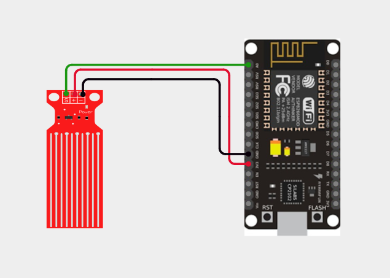
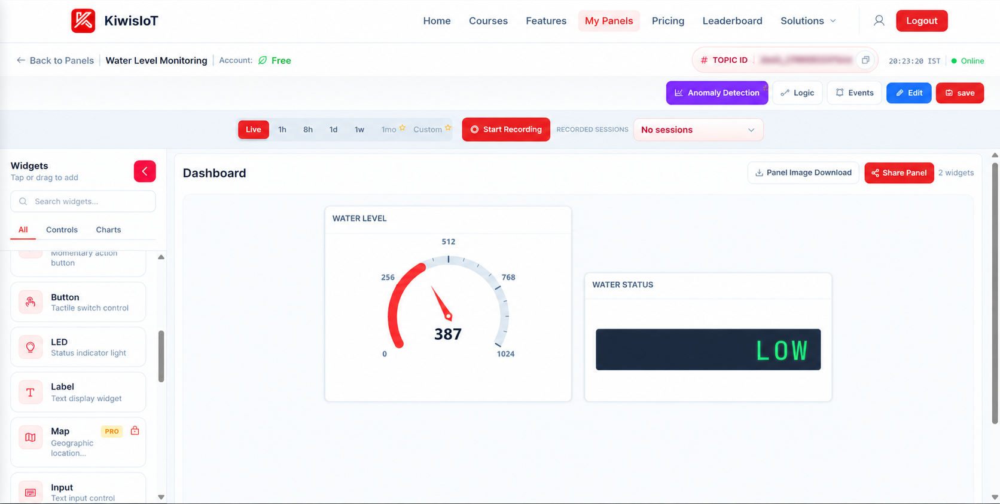
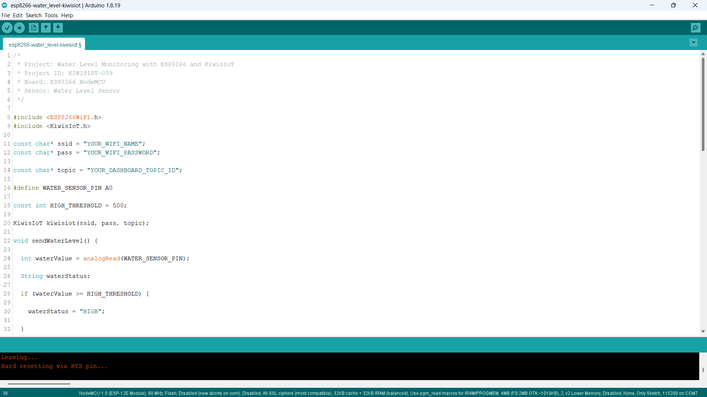
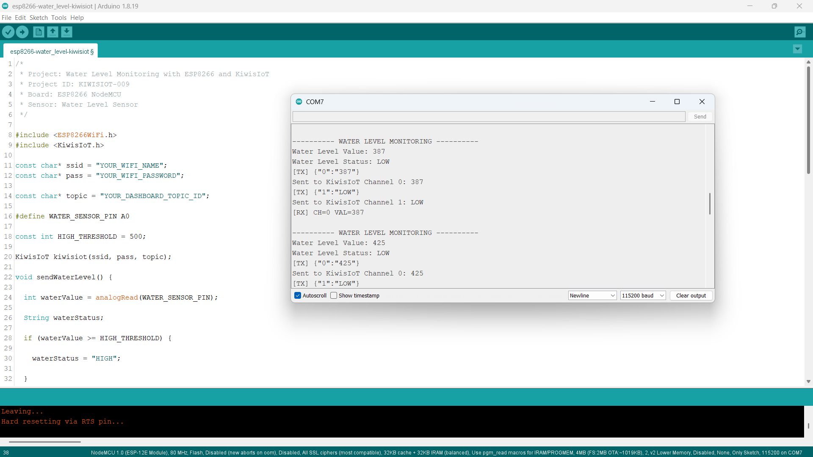

# ESP8266 Water Level Sensor IoT Project: Monitor Water Levels with KiwisIoT 💧

Monitor **water levels in real time** using a **water level sensor, ESP8266 NodeMCU, Arduino, and KiwisIoT**.

In this project, the ESP8266 reads the analog output from the water level sensor, compares the reading with a predefined threshold, determines whether the water level is **LOW or HIGH**, and sends the data to a **KiwisIoT IoT dashboard** over Wi-Fi.

The dashboard displays both the **water level value** and **water level status**, providing a simple example of real-time IoT water level monitoring.

---

## 🚀 Project Highlights

* ESP8266-based water level monitoring
* Analog water level sensor reading
* Real-time water level visualization
* LOW and HIGH water level classification
* KiwisIoT IoT dashboard integration
* Wi-Fi-based sensor monitoring
* Arduino-based IoT project
* Suitable for student and engineering IoT projects

---

## 📋 Project Overview

A **water level sensor** detects the presence or level of water and provides an electrical output that can be read by a microcontroller.

In this project, the analog output of the water level sensor is connected to the **A0 analog input** of the ESP8266 NodeMCU.

The ESP8266 reads the sensor value, compares it with a predefined threshold, determines the water level status, and sends the information to KiwisIoT.

The project flow is:

```text
Water Level Sensor
        ↓
ESP8266 NodeMCU
        ↓
Analog Reading
        ↓
Water Level Value
        ↓
LOW / HIGH Classification
        ↓
Wi-Fi
        ↓
KiwisIoT
        ↓
IoT Dashboard
```

---

## 💡 Why This Project?

This project demonstrates how an analog water level sensor can be connected to an ESP8266 and integrated with an IoT platform.

Instead of monitoring the sensor only through the Serial Monitor, the ESP8266 sends the water level information to KiwisIoT, where the value and status can be viewed remotely through an IoT dashboard.

The same concept can be used as a starting point for applications such as:

* Water tank monitoring
* Water level monitoring
* Container level monitoring
* Smart water management
* Water storage monitoring
* IoT-based monitoring systems
* Engineering and college IoT projects

---

## 🎓 What You'll Learn

By building this project, you will learn how to:

* Connect a water level sensor to an ESP8266
* Read an analog sensor value using `analogRead()`
* Process water level sensor readings
* Set a threshold for water level classification
* Determine whether the water level is LOW or HIGH
* Send numerical sensor data to KiwisIoT
* Send text status data to KiwisIoT
* Configure multiple KiwisIoT channels
* Display water level information on an IoT dashboard
* Monitor water levels remotely over Wi-Fi

---

## 🔧 Components Required

| Component          | Quantity    |
| ------------------ | ----------- |
| ESP8266 NodeMCU    | 1           |
| Water Level Sensor | 1           |
| Jumper Wires       | As required |
| USB Cable          | 1           |
| Computer           | 1           |

---

## 💻 Software Requirements

* Arduino IDE
* ESP8266 board package
* KiwisIoT Arduino library
* KiwisIoT account
* Wi-Fi connection

### Common KiwisIoT Setup

Before starting this project, complete the common **KiwisIoT Arduino Setup Guide**.

The setup guide covers:

* Arduino IDE installation
* ESP8266 board installation
* ESP8266 board selection
* KiwisIoT Arduino library installation
* KiwisIoT account setup
* Panel creation
* Topic ID
* Dashboard widgets
* Widget configuration

The common setup guide is available in the parent `esp8266` directory:

[Open the KiwisIoT Arduino Setup Guide](../kiwisiot-arduino-setup/)

---

## 🛠️ Technologies Used

* ESP8266 NodeMCU
* Water Level Sensor
* Arduino IDE
* KiwisIoT Arduino Library
* KiwisIoT IoT Dashboard
* Wi-Fi
* C++ / Arduino

---

## 🔌 Circuit Connection

The water level sensor provides an analog output that is connected to the ESP8266 analog input.

Connect the sensor as follows:

| Water Level Sensor | ESP8266 NodeMCU |
| ------------------ | --------------- |
| VCC                | 3.3V            |
| GND                | GND             |
| AO                 | A0              |

The main signal connection is:

```text
AO → A0
```



> **Note:** The wiring shown reflects the hardware configuration used for this project.

---

## 💧 How the Water Level Sensor Works

A **water level sensor** detects water through conductive sensing traces on the sensor surface.

When water comes into contact with the sensing area, the electrical characteristics of the sensor change. The sensor module provides an analog output that can be read by the ESP8266.

The ESP8266 reads the analog signal using:

```cpp
int waterValue = analogRead(WATER_SENSOR_PIN);
```

The sensor is connected to:

```text
A0
```

The raw sensor value depends on factors such as:

* Amount of water covering the sensor
* Sensor design
* Water conductivity
* Sensor position
* Power supply
* Environmental conditions

Therefore, the readings may vary between different sensor modules and setups.

---

## ⚙️ Water Level Detection Logic

The project uses a threshold-based method to classify the water level.

The configured threshold is:

```cpp
const int HIGH_THRESHOLD = 500;
```

The classification logic is:

```cpp
if (waterValue >= HIGH_THRESHOLD) {
    waterStatus = "HIGH";
}
else {
    waterStatus = "LOW";
}
```

Therefore:

| Water Sensor Value | Water Level Status |
| ------------------ | ------------------ |
| `500` and above    | HIGH               |
| Below `500`        | LOW                |

The threshold is defined for this project and can be adjusted according to the sensor readings obtained from your setup.

---

## 📊 KiwisIoT Dashboard

This project sends two values to KiwisIoT.

| Channel | Parameter          | Data Type | Example Value | Dashboard Widget |
| ------- | ------------------ | --------- | ------------- | ---------------- |
| `0`     | Water Level Value  | Integer   | `650`         | Gauge            |
| `1`     | Water Level Status | Text      | `HIGH`        | Label            |

The data flow is:

```text
ESP8266
   │
   ├── Channel 0 → Water Level Value
   │                  ↓
   │              KiwisIoT Gauge
   │
   └── Channel 1 → Water Level Status
                      ↓
                  KiwisIoT Label
```



The dashboard provides:

```text
Water Level Value   → Numerical sensor value
Water Level Status  → LOW / HIGH
```

---

## ⚙️ Dashboard Configuration

Configure the KiwisIoT dashboard with two widgets.

### 1. Water Level Value

Use a **Gauge** widget to display the numerical water level sensor reading.

Suggested configuration:

```text
Name: Water Level
Channel ID: 0
Minimum Value: 0
Maximum Value: 1023
Unit: Water Level
```

The widget receives the value using:

```cpp
kiwisiot.send("0", String(waterValue));
```

For example:

```text
Water Level Value: 650
```

---

### 2. Water Level Status

Use a **Label** widget to display the water level condition.

Suggested configuration:

```text
Name: Water Level Status
Channel ID: 1
```

The widget displays:

```text
LOW
```

or:

```text
HIGH
```

The status is sent using:

```cpp
kiwisiot.send("1", waterStatus);
```

> **Important:** The Channel IDs configured in the KiwisIoT dashboard must match the Channel IDs used in the ESP8266 code.

---

## 💻 Arduino Code

The complete Arduino code is available here:

[View the Arduino Code](code/esp8266-water-level-kiwisiot.ino)

The program uses the ESP8266 Wi-Fi library and KiwisIoT Arduino library:

```cpp
#include <ESP8266WiFi.h>
#include <KiwisIoT.h>
```



---

## 🔐 Configure Wi-Fi and KiwisIoT

Before uploading the program, update these values:

```cpp
const char* ssid = "YOUR_WIFI_NAME";
const char* pass = "YOUR_WIFI_PASSWORD";

const char* topic = "YOUR_DASHBOARD_TOPIC_ID";
```

Replace:

```text
YOUR_WIFI_NAME
```

with your Wi-Fi network name.

Replace:

```text
YOUR_WIFI_PASSWORD
```

with your Wi-Fi password.

Replace:

```text
YOUR_DASHBOARD_TOPIC_ID
```

with the Topic ID of the KiwisIoT panel created for this project.

For example:

```cpp
const char* topic = "dash_xxxxxxxxxxxxx";
```

> **Security:** Never publish your actual Wi-Fi password or private credentials in a public GitHub repository.

---

## 🧾 Complete Arduino Code

```cpp
/*
 * Project: Water Level Monitoring with ESP8266 and KiwisIoT
 * Project ID: KIWISIOT-009
 * Board: ESP8266 NodeMCU
 * Sensor: Water Level Sensor
 */

#include <ESP8266WiFi.h>
#include <KiwisIoT.h>

const char* ssid = "YOUR_WIFI_NAME";
const char* pass = "YOUR_WIFI_PASSWORD";

const char* topic = "YOUR_DASHBOARD_TOPIC_ID";

#define WATER_SENSOR_PIN A0

const int HIGH_THRESHOLD = 500;

KiwisIoT kiwisiot(ssid, pass, topic);

void sendWaterLevel() {

  int waterValue = analogRead(WATER_SENSOR_PIN);

  String waterStatus;

  if (waterValue >= HIGH_THRESHOLD) {

    waterStatus = "HIGH";

  }
  else {

    waterStatus = "LOW";
  }

  Serial.println();
  Serial.println("---------- WATER LEVEL MONITORING ----------");

  Serial.print("Water Level Value: ");
  Serial.println(waterValue);

  Serial.print("Water Level Status: ");
  Serial.println(waterStatus);

  kiwisiot.send("0", String(waterValue));

  Serial.print("Sent to KiwisIoT Channel 0: ");
  Serial.println(waterValue);

  kiwisiot.send("1", waterStatus);

  Serial.print("Sent to KiwisIoT Channel 1: ");
  Serial.println(waterStatus);
}

void setup() {

  Serial.begin(115200);

  Serial.println();
  Serial.println("     WATER LEVEL MONITORING     ");

  pinMode(WATER_SENSOR_PIN, INPUT);

  Serial.println("Water level sensor initialized");

  Serial.println("Connecting to KiwisIoT...");

  kiwisiot.begin();

  Serial.println("KiwisIoT initialized");
  Serial.println("Starting water level monitoring...");
}

void loop() {

  kiwisiot.run();

  static unsigned long lastSend = 0;

  if (millis() - lastSend >= 2000) {

    lastSend = millis();

    sendWaterLevel();
  }

  delay(100);
}
```

---

## ⬆️ Upload the Program

After configuring the code:

1. Connect the ESP8266 NodeMCU to your computer.
2. Open `esp8266-water-level-kiwisiot.ino` in Arduino IDE.
3. Select the appropriate ESP8266 board.
4. Verify the program.
5. Upload the code to the ESP8266.
6. Open the Serial Monitor.
7. Set the baud rate to:

```text
115200
```

Once the ESP8266 connects to KiwisIoT, it will begin sending the water level value and status to the configured dashboard.

---

## 🖥️ Serial Monitor Output

The ESP8266 prints the water level sensor reading, water level status, and KiwisIoT transmission information to the Serial Monitor.

A typical output when the water level is high looks like:

```text
---------- WATER LEVEL MONITORING ----------

Water Level Value: 650
Water Level Status: HIGH

Sent to KiwisIoT Channel 0: 650
Sent to KiwisIoT Channel 1: HIGH
```

When the water level is low:

```text
---------- WATER LEVEL MONITORING ----------

Water Level Value: 320
Water Level Status: LOW

Sent to KiwisIoT Channel 0: 320
Sent to KiwisIoT Channel 1: LOW
```

The project sends updated water level information approximately every two seconds.



---

## 🔄 Understanding the Data Flow

The project processes the water level data in several stages.

### 1. Read the Water Level Sensor

The ESP8266 reads the analog value from A0:

```cpp
int waterValue = analogRead(WATER_SENSOR_PIN);
```

### 2. Compare with the Threshold

The value is compared with:

```cpp
const int HIGH_THRESHOLD = 500;
```

### 3. Determine the Water Level Status

If the value is 500 or higher:

```text
HIGH
```

Otherwise:

```text
LOW
```

### 4. Send the Water Level Value

```cpp
kiwisiot.send("0", String(waterValue));
```

### 5. Send the Water Level Status

```cpp
kiwisiot.send("1", waterStatus);
```

The complete flow is:

```text
Water Level Sensor
        ↓
Analog Reading
        ↓
Water Level Value
        ↓
Threshold Comparison
        ↓
LOW / HIGH
        ↓
KiwisIoT
        ↓
Dashboard
```

---

## 🧪 Testing the Project

You can test the water level sensor by changing the amount of water covering the sensor.

### 💧 Low Water Level

When the sensor value is below the configured threshold:

```text
Water Value < 500
```

The project reports:

```text
Water Level Status: LOW
```

The dashboard displays:

```text
Water Level → LOW
```

### 💦 High Water Level

When the sensor value reaches or exceeds the configured threshold:

```text
Water Value >= 500
```

The project reports:

```text
Water Level Status: HIGH
```

The dashboard displays:

```text
Water Level → HIGH
```

> **Note:** Actual sensor readings can vary depending on the water level sensor, amount of water covering the sensor, water conductivity, sensor position, power supply, and environment.

---

## 🎯 Adjusting the High-Level Threshold

The project currently uses:

```cpp
const int HIGH_THRESHOLD = 500;
```

This means:

```text
Value >= 500 → HIGH
Value < 500  → LOW
```

If your sensor produces different readings, the threshold can be adjusted.

For example:

```cpp
const int HIGH_THRESHOLD = 450;
```

or:

```cpp
const int HIGH_THRESHOLD = 600;
```

The appropriate threshold depends on the readings obtained from your particular sensor and setup.

---

## 🌐 Why Use KiwisIoT for Water Level Monitoring?

A water level sensor can provide a local analog reading, but connecting the ESP8266 to KiwisIoT makes the information available through an IoT dashboard.

With this project:

```text
Water Level Sensor
        ↓
ESP8266
        ↓
Wi-Fi
        ↓
KiwisIoT
        ↓
Dashboard
        ↓
Water Level Monitoring
```

The dashboard provides two different views of the sensor data:

```text
Water Level Value  → Numerical value
Water Level Status → LOW / HIGH
```

This provides a simple foundation for IoT-based water monitoring applications.

---

## 🛠️ Troubleshooting

### Water Level Reading Does Not Change

Check:

* VCC connection
* GND connection
* AO connection to A0
* Sensor wiring
* Sensor position
* Sensor contact with water
* Power supply

### Water Level Status Is Always LOW

Check:

* Analog sensor output
* Sensor wiring
* Sensor position
* Current sensor reading
* `HIGH_THRESHOLD` value

The current threshold is:

```cpp
const int HIGH_THRESHOLD = 500;
```

If your sensor produces lower or higher readings than expected, the threshold may need to be adjusted.

### Water Level Status Is Always HIGH

Check:

* Sensor output
* Sensor wiring
* Amount of water covering the sensor
* Current sensor reading
* `HIGH_THRESHOLD` value

### Dashboard Does Not Receive Data

Check:

* Wi-Fi name
* Wi-Fi password
* Internet connection
* KiwisIoT Topic ID
* Channel IDs
* Dashboard widget configuration
* KiwisIoT Arduino library
* ESP8266 connection

### Water Level Widget Shows No Value

Make sure the Gauge widget uses:

```text
Channel ID: 0
```

The ESP8266 sends the water level value using:

```cpp
kiwisiot.send("0", String(waterValue));
```

### Water Level Status Widget Shows No Value

Make sure the Label widget uses:

```text
Channel ID: 1
```

The ESP8266 sends the water level status using:

```cpp
kiwisiot.send("1", waterStatus);
```

The Channel ID must match on both sides.

---

## 🔒 Security

Never publish sensitive credentials in a public GitHub repository.

Do not commit:

* Wi-Fi passwords
* API keys
* Access tokens
* Account passwords
* Private credentials

Use placeholders such as:

```text
YOUR_WIFI_NAME
YOUR_WIFI_PASSWORD
YOUR_DASHBOARD_TOPIC_ID
```

Enter your actual credentials only in your local Arduino project.

---

## 💡 Possible Applications

An ESP8266 water level monitoring system can be used as a starting point for:

* Water tank monitoring
* Water storage monitoring
* Container level monitoring
* Smart water management
* Water level alerts
* IoT-based water monitoring
* Smart home projects
* Engineering and college IoT projects

The project can be extended by adding additional sensors, alerts, automation logic, pumps, relays, or other KiwisIoT dashboard features.

---

## 📁 Project Structure

```text
009-water-level-kiwisiot/
│
├── README.md
│
├── code/
│   └── esp8266-water-level-kiwisiot.ino
│
└── images/
    ├── circuit.png
    ├── code.png
    ├── serial-monitor.png
    └── dashboard-output.png
```

---

## 🔗 Related KiwisIoT ESP8266 Projects

This project is part of the **KiwisIoT ESP8266 IoT project collection**.
## 🔗 Related KiwisIoT ESP8266 Projects

This project is part of the **KiwisIoT ESP8266 IoT project collection**.

Explore related projects:

- [ESP8266 LDR Sensor IoT Project](../001-ldr-kiwisiot/)
- [ESP8266 IR Sensor IoT Project](../002-ir-kiwisiot/)
- [ESP8266 Ultrasonic Sensor IoT Project](../003-ultrasonic-kiwisiot/)
- [ESP8266 DHT11 Temperature & Humidity IoT Project](../004-dht11-kiwisiot/)
- [ESP8266 PIR Motion Sensor IoT Project](../005-pir-kiwisiot/)
- [ESP8266 Gas Sensor IoT Project](../006-gas-kiwisiot/)
- [ESP8266 Flame Sensor IoT Project](../007-flame-kiwisiot/)
- [ESP8266 Soil Moisture IoT Project](../008-soil-moisture-kiwisiot/)

For the common Arduino and KiwisIoT setup, see the:

[**KiwisIoT Arduino Setup Guide**](../kiwisiot-arduino-setup/)

---

## ❓ Frequently Asked Questions

### What is a water level sensor?

A water level sensor is an electronic sensor that detects the presence or level of water and provides an electrical output that can be read by a microcontroller.

### Can I connect a water level sensor to an ESP8266?

Yes. In this project, the analog output of the water level sensor is connected to the ESP8266 A0 pin.

### Which ESP8266 pin is used?

The project uses:

```text
AO → A0
```

for reading the analog water level value.

### Which KiwisIoT channels are used?

This project uses two channels:

```text
Channel 0 → Water Level Value
Channel 1 → Water Level Status
```

### What does the water level status indicate?

The project uses a threshold to classify the water level:

```text
Value >= 500 → HIGH
Value < 500  → LOW
```

### Can I change the HIGH threshold?

Yes. Change:

```cpp
const int HIGH_THRESHOLD = 500;
```

according to the readings from your sensor and the conditions in which it is being used.

### How often does the ESP8266 send the readings?

The project sends the water level value and status approximately every two seconds.

### Does the water level value represent a percentage?

No. The project sends the **raw analog sensor value**. The value is used to monitor changes in the sensor reading and classify the condition as LOW or HIGH.

### Can this project be extended?

Yes. You can add alerts, additional sensors, relays, pumps, automation logic, charts, and other KiwisIoT dashboard features.

---

## 📝 Summary

This project demonstrates a simple **ESP8266 water level IoT monitoring system** using KiwisIoT.

The ESP8266 reads the analog output from the water level sensor, compares the reading with a predefined threshold, determines whether the water level is **LOW or HIGH**, and sends the water level value and status to a KiwisIoT dashboard over Wi-Fi.

The final dashboard provides:

```text
Water Level Value  → Numerical sensor value
Water Level Status → LOW / HIGH
```

It provides a practical example of how an ESP8266 can connect an analog water level sensor to an IoT platform for remote water level monitoring.

---

## 📄 License

This project is licensed under the MIT License. See the `LICENSE` file for details.

