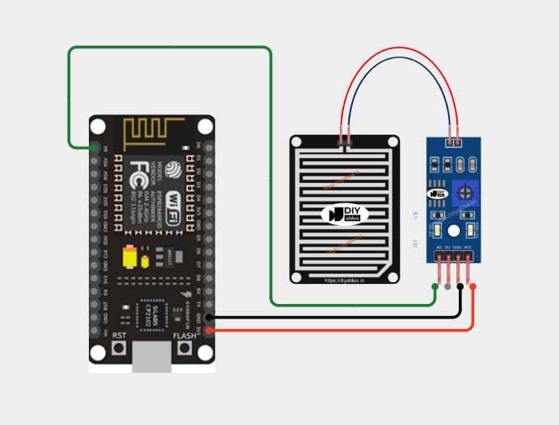
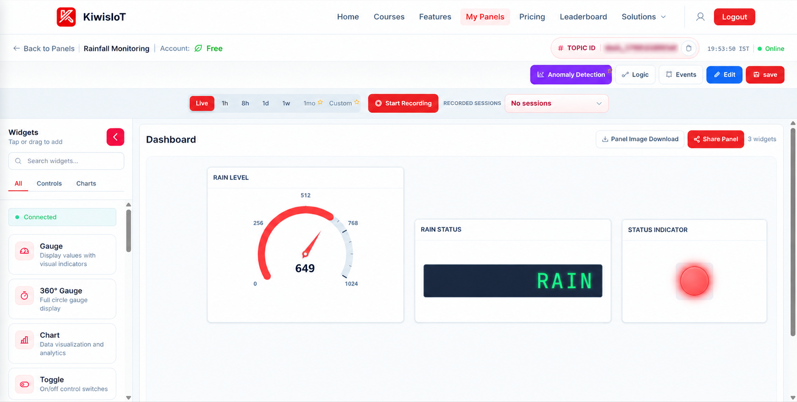
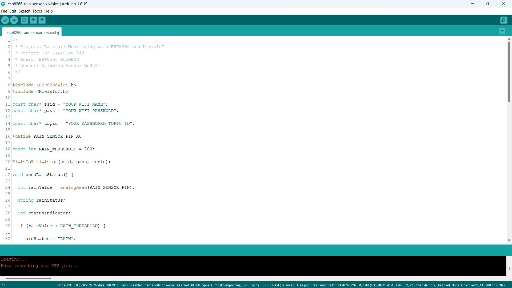
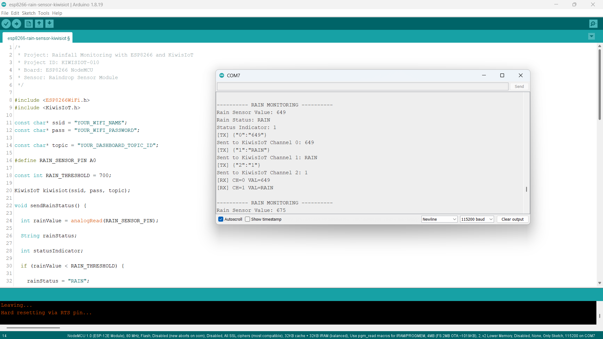

# ESP8266 Raindrop Sensor IoT Project: Monitor Rainfall with KiwisIoT Dashboard 🌧️

Monitor **rain conditions in real time** using a **raindrop sensor, ESP8266 NodeMCU, and KiwisIoT**.

In this project, the ESP8266 reads the analog value from the raindrop sensor module, determines whether **RAIN** is detected, and sends the rain sensor value, rain status, and status indicator to the **KiwisIoT IoT dashboard** over Wi-Fi.

The dashboard displays the rain sensor level, current rain status, and a visual status indicator, making it easy to monitor rain conditions remotely.

> **Note:** This project detects rain conditions using the analog output of a raindrop sensor. The sensor value is not a calibrated rainfall measurement in millimeters.

---

## 🚀 Project Highlights

* ESP8266-based rain monitoring
* Analog raindrop sensor measurement
* RAIN / NO RAIN detection
* Real-time rain-level visualization
* Status indicator for rain detection
* KiwisIoT dashboard integration
* Wi-Fi-based IoT monitoring
* Beginner-friendly Arduino IoT project
* Suitable for engineering and college IoT projects

---

## 📋 Project Overview

A **raindrop sensor module** can detect water droplets on its sensing plate and provide an analog output that changes according to the amount of water detected.

The ESP8266 reads this analog value through its **A0** pin and compares it with a predefined threshold.

In this project:

```text
Rain Sensor Value < 700 → RAIN
Rain Sensor Value ≥ 700 → NO RAIN
```

The ESP8266 sends the rain sensor value, rain status, and status indicator to different KiwisIoT channels.

The project flow is:

```text
Raindrop Sensor
        ↓
ESP8266 NodeMCU
        ↓
Analog Reading
        ↓
Rain Sensor Value
        ↓
RAIN / NO RAIN Classification
        ↓
Wi-Fi
        ↓
KiwisIoT
        ↓
IoT Dashboard
```

---

## 💡 Why This Project?

This project demonstrates how an ESP8266 can collect analog sensor data and convert it into meaningful rain detection information for IoT monitoring.

Instead of checking the sensor value only through the Serial Monitor, the ESP8266 sends the data to KiwisIoT, where the rain condition can be viewed on a dashboard.

The same concept can be used as a starting point for applications such as:

* Rain detection systems
* Weather monitoring concepts
* Smart agriculture
* Outdoor environmental monitoring
* Automatic rain alerts
* Smart irrigation concepts
* IoT-based weather projects
* Engineering and college IoT projects

---

## 🎓 What You'll Learn

By building this project, you will learn how to:

* Connect a raindrop sensor module to an ESP8266
* Read analog sensor values using `analogRead()`
* Set a threshold for rain detection
* Determine whether rain is detected
* Send numerical sensor data to KiwisIoT
* Send text status data to KiwisIoT
* Send a numerical status indicator to KiwisIoT
* Configure multiple KiwisIoT channels
* Display rain information on an IoT dashboard
* Monitor rain conditions remotely over Wi-Fi

---

## 🔧 Components Required

| Component              |    Quantity |
| ---------------------- | ----------: |
| ESP8266 NodeMCU        |           1 |
| Raindrop Sensor        |           1 |
| Raindrop Sensor Module |           1 |
| Jumper Wires           | As required |
| USB Cable              |           1 |
| Computer               |           1 |

---

## 💻 Software Requirements

* Arduino IDE
* ESP8266 board package
* KiwisIoT Arduino library
* KiwisIoT account
* Wi-Fi connection

### Common KiwisIoT Setup

Before starting this project, complete the common **KiwisIoT Arduino Setup Guide**.

The setup guide covers:

* Arduino IDE installation
* ESP8266 board installation
* ESP8266 board selection
* KiwisIoT Arduino library installation
* KiwisIoT account setup
* Panel creation
* Topic ID
* Dashboard widgets
* Widget configuration

The common setup guide is available in the parent `esp8266` directory:

[Open the KiwisIoT Arduino Setup Guide](../kiwisiot-arduino-setup/)

---

## 🛠️ Technologies Used

* ESP8266 NodeMCU
* Raindrop Sensor Module
* Arduino IDE
* KiwisIoT Arduino Library
* KiwisIoT IoT Dashboard
* Wi-Fi
* C++ / Arduino

---

## 🔌 Circuit Connection

The raindrop sensor module provides an analog output that is connected to the ESP8266 analog input.

For this project, the sensor module is connected as follows:

| Raindrop Sensor Module | ESP8266 NodeMCU |
| ---------------------- | --------------- |
| VCC                    | 3.3V            |
| GND                    | GND             |
| AO                     | A0              |

The raindrop sensing plate is connected to the sensor module.

The main signal connection is:

```text
AO → A0
```



> **Note:** The wiring shown reflects the hardware configuration used for this project.

---

## 🌧️ How the Raindrop Sensor Works

A **raindrop sensor** detects water droplets using a sensing plate with conductive traces.

When water droplets reach the sensing surface, the electrical characteristics of the sensing plate change. The sensor module converts this change into an analog output that can be read by the ESP8266.

The ESP8266 reads the analog value using:

```cpp
int rainValue = analogRead(RAIN_SENSOR_PIN);
```

The raindrop sensor is connected to:

```text
A0
```

The sensor value is then compared with the configured rain threshold:

```cpp
const int RAIN_THRESHOLD = 700;
```

The classification logic is:

```text
Rain Sensor Value < 700
          ↓
         RAIN
```

and:

```text
Rain Sensor Value ≥ 700
          ↓
       NO RAIN
```

The actual sensor readings can vary depending on the raindrop sensor module, amount of water on the sensing plate, sensor condition, power supply, and environment.

---

## ⚙️ Rain Detection Logic

The project uses a threshold-based method to determine the rain condition.

The code checks:

```cpp
if (rainValue < RAIN_THRESHOLD) {

  rainStatus = "RAIN";
  statusIndicator = 1;

}
else {

  rainStatus = "NO RAIN";
  statusIndicator = 0;
}
```

The threshold is:

```cpp
const int RAIN_THRESHOLD = 700;
```

Therefore:

| Rain Sensor Value | Rain Status | Status Indicator |
| ----------------- | ----------- | ---------------: |
| Less than 700     | RAIN        |                1 |
| 700 or above      | NO RAIN     |                0 |

The threshold can be adjusted according to the sensor readings and the conditions in which the project is being used.

---

## 📊 KiwisIoT Dashboard

This project sends three different values to KiwisIoT.

| Channel | Parameter         | Data Type | Example Value | Dashboard Widget |
| ------: | ----------------- | --------- | ------------: | ---------------- |
|     `0` | Rain Sensor Value | Integer   |         `649` | Gauge            |
|     `1` | Rain Status       | Text      |        `RAIN` | Label            |
|     `2` | Status Indicator  | Integer   |           `1` | LED              |

The data flow is:

```text
ESP8266
   │
   ├── Channel 0 → Rain Sensor Value
   │
   ├── Channel 1 → RAIN / NO RAIN
   │
   └── Channel 2 → Status Indicator
                         ↓
                    KiwisIoT
                         ↓
                    Dashboard
```



The dashboard provides:

```text
Rain Sensor Level → Numerical value
Rain Status       → RAIN / NO RAIN
Status Indicator  → 1 / 0
```

For example, during testing:

```text
Rain Sensor Value: 649
Rain Status: RAIN
Status Indicator: 1
```

---

## ⚙️ Dashboard Configuration

Configure the KiwisIoT dashboard with three widgets.

### 1. Rain Level

Use a **Gauge** widget to display the raindrop sensor value.

Suggested configuration:

```text
Name: Rain Level
Channel ID: 0
Minimum Value: 0
Maximum Value: 1024
```

The widget receives the value using:

```cpp
kiwisiot.send("0", rainData);
```

For example:

```text
Rain Sensor Value: 649
```

---

### 2. Rain Status

Use a **Label** widget.

Suggested configuration:

```text
Name: Rain Status
Channel ID: 1
```

The widget displays:

```text
RAIN
```

or:

```text
NO RAIN
```

The value is sent using:

```cpp
kiwisiot.send("1", rainStatus);
```

---

### 3. Status Indicator

Use the **LED** status indicator widget.

Suggested configuration:

```text
Name: Status Indicator
Channel ID: 2
```

The project sends:

```text
1 → RAIN
0 → NO RAIN
```

The value is sent using:

```cpp
kiwisiot.send("2", String(statusIndicator));
```

This provides a visual indication of the current rain condition.

> **Important:** The Channel IDs configured in the KiwisIoT dashboard must match the Channel IDs used in the ESP8266 code.

---

## 💻 Arduino Code

The complete Arduino code is available here:

[View the Arduino Code](code/esp8266-rain-sensor-kiwisiot.ino)

The program uses the ESP8266 Wi-Fi library and KiwisIoT Arduino library:

```cpp
#include <ESP8266WiFi.h>
#include <KiwisIoT.h>
```



---

## 🔐 Configure Wi-Fi and KiwisIoT

Before uploading the program, update these values:

```cpp
const char* ssid = "YOUR_WIFI_NAME";
const char* pass = "YOUR_WIFI_PASSWORD";

const char* topic = "YOUR_DASHBOARD_TOPIC_ID";
```

Replace:

```text
YOUR_WIFI_NAME
```

with your Wi-Fi network name.

Replace:

```text
YOUR_WIFI_PASSWORD
```

with your Wi-Fi password.

Replace:

```text
YOUR_DASHBOARD_TOPIC_ID
```

with the Topic ID of the KiwisIoT panel created for this project.

For example:

```cpp
const char* topic = "dash_xxxxxxxxxxxxx";
```

> **Security:** Never publish your actual Wi-Fi password or private credentials in a public GitHub repository.

---

## 🧾 Complete Arduino Code

```cpp
/*
 * Project: Rainfall Monitoring with ESP8266 and KiwisIoT
 * Project ID: KIWISIOT-010
 * Board: ESP8266 NodeMCU
 * Sensor: Raindrop Sensor Module
 */

#include <ESP8266WiFi.h>
#include <KiwisIoT.h>

const char* ssid = "YOUR_WIFI_NAME";
const char* pass = "YOUR_WIFI_PASSWORD";

const char* topic = "YOUR_DASHBOARD_TOPIC_ID";

#define RAIN_SENSOR_PIN A0

const int RAIN_THRESHOLD = 700;

KiwisIoT kiwisiot(ssid, pass, topic);

void sendRainStatus() {

  int rainValue = analogRead(RAIN_SENSOR_PIN);

  String rainStatus;

  int statusIndicator;

  if (rainValue < RAIN_THRESHOLD) {

    rainStatus = "RAIN";
    statusIndicator = 1;

  }
  else {

    rainStatus = "NO RAIN";
    statusIndicator = 0;
  }

  Serial.println();
  Serial.println("---------- RAIN MONITORING ----------");

  Serial.print("Rain Sensor Value: ");
  Serial.println(rainValue);

  Serial.print("Rain Status: ");
  Serial.println(rainStatus);

  Serial.print("Status Indicator: ");
  Serial.println(statusIndicator);

  String rainData = String(rainValue);

  kiwisiot.send("0", rainData);

  Serial.print("Sent to KiwisIoT Channel 0: ");
  Serial.println(rainData);

  kiwisiot.send("1", rainStatus);

  Serial.print("Sent to KiwisIoT Channel 1: ");
  Serial.println(rainStatus);

  kiwisiot.send("2", String(statusIndicator));

  Serial.print("Sent to KiwisIoT Channel 2: ");
  Serial.println(statusIndicator);
}

void setup() {

  Serial.begin(115200);

  Serial.println();
  Serial.println("     RAIN MONITORING     ");

  pinMode(RAIN_SENSOR_PIN, INPUT);

  Serial.println("Rain sensor initialized");

  Serial.println("Connecting to KiwisIoT...");

  kiwisiot.begin();

  Serial.println("KiwisIoT initialized");
  Serial.println("Starting rain monitoring...");
}

void loop() {

  kiwisiot.run();

  static unsigned long lastSend = 0;

  if (millis() - lastSend >= 2000) {

    lastSend = millis();

    sendRainStatus();
  }

  delay(100);
}
```

---

## ⬆️ Upload the Program

After configuring the code:

1. Connect the ESP8266 NodeMCU to your computer.
2. Open `esp8266-rain-sensor-kiwisiot.ino` in Arduino IDE.
3. Select the appropriate ESP8266 board.
4. Verify the program.
5. Upload the code to the ESP8266.
6. Open the Serial Monitor.
7. Set the baud rate to:

```text
115200
```

Once the ESP8266 connects to KiwisIoT, it will begin sending the rain sensor value and rain status to the configured dashboard.

---

## 🖥️ Serial Monitor Output

The ESP8266 prints the rain sensor value, rain status, status indicator, and KiwisIoT transmission information to the Serial Monitor.

A typical output during rain detection is:

```text
---------- RAIN MONITORING ----------

Rain Sensor Value: 649
Rain Status: RAIN
Status Indicator: 1

[TX] {"0":"649"}
Sent to KiwisIoT Channel 0: 649

[TX] {"1":"RAIN"}
Sent to KiwisIoT Channel 1: RAIN

[TX] {"2":"1"}
Sent to KiwisIoT Channel 2: 1
```

The project sends updated values approximately every two seconds.



---

## 🔄 Understanding the Data Flow

The project processes the raindrop sensor data in several stages.

### 1. Read the Rain Sensor Value

The ESP8266 reads the analog value from A0:

```cpp
int rainValue = analogRead(RAIN_SENSOR_PIN);
```

### 2. Compare with the Threshold

The value is compared with:

```cpp
const int RAIN_THRESHOLD = 700;
```

### 3. Determine the Rain Status

If the value is less than 700:

```text
RAIN
```

Otherwise:

```text
NO RAIN
```

### 4. Generate the Status Indicator

The project assigns:

```text
RAIN    → 1
NO RAIN → 0
```

### 5. Send the Data to KiwisIoT

Three channels are updated:

```cpp
kiwisiot.send("0", rainData);
kiwisiot.send("1", rainStatus);
kiwisiot.send("2", String(statusIndicator));
```

The complete flow is:

```text
Raindrop Sensor
        ↓
Analog Reading
        ↓
Rain Sensor Value
        ↓
Threshold Comparison
        ↓
RAIN / NO RAIN
        ↓
Status Indicator 1 / 0
        ↓
KiwisIoT
        ↓
Dashboard
```

---

## 🧪 Testing the Project

You can test the raindrop sensor by placing water droplets on the sensing plate.

### 🌧️ Rain Condition

Place water droplets on the raindrop sensor plate.

When the sensor value becomes less than the configured threshold:

```text
Rain Sensor Value < 700
```

the project reports:

```text
Rain Status: RAIN
Status Indicator: 1
```

The KiwisIoT dashboard should display:

```text
Rain Status → RAIN
Status Indicator → 1
```

For example:

```text
Rain Sensor Value: 649
Rain Status: RAIN
Status Indicator: 1
```

### ☀️ No Rain Condition

When the sensing plate is dry and the sensor value is 700 or above:

```text
Rain Sensor Value ≥ 700
```

the project reports:

```text
Rain Status: NO RAIN
Status Indicator: 0
```

The dashboard should display:

```text
Rain Status → NO RAIN
Status Indicator → 0
```

> **Note:** Actual sensor readings can vary depending on the raindrop sensor module, amount of water on the sensing plate, sensor condition, power supply, and surrounding environment.

---

## 🎯 Adjusting the Rain Threshold

The project currently uses:

```cpp
const int RAIN_THRESHOLD = 700;
```

This means:

```text
Value < 700 → RAIN
Value ≥ 700 → NO RAIN
```

If your sensor produces different readings under dry and wet conditions, the threshold can be adjusted.

For example:

```cpp
const int RAIN_THRESHOLD = 650;
```

or:

```cpp
const int RAIN_THRESHOLD = 750;
```

The appropriate threshold depends on the sensor and the conditions in which it is being used.

---

## 🌐 Why Use KiwisIoT for Rain Monitoring?

A raindrop sensor can provide a local analog reading, but connecting the ESP8266 to KiwisIoT makes the information available through an IoT dashboard.

With this project:

```text
Raindrop Sensor
        ↓
ESP8266
        ↓
Wi-Fi
        ↓
KiwisIoT
        ↓
Dashboard
        ↓
Rain Monitoring
```

The dashboard provides three different views of the sensor data:

```text
Rain Sensor Level → Numerical value
Rain Status       → RAIN / NO RAIN
Status Indicator  → 1 / 0
```

This makes the project a useful starting point for larger IoT-based weather, agriculture, and environmental monitoring applications.

---

## 🛠️ Troubleshooting

### Rain Sensor Value Does Not Change

Check:

* VCC connection
* GND connection
* AO connection to A0
* Raindrop sensing plate connection
* Sensor module wiring
* Sensor power supply
* Water droplets reaching the sensing plate

### Rain Status Is Always NO RAIN

Check:

* Sensor sensing plate
* Sensor wiring
* Analog output connection
* Current sensor reading
* `RAIN_THRESHOLD` value

The current threshold is:

```cpp
const int RAIN_THRESHOLD = 700;
```

If your sensor produces different readings, the threshold may need to be adjusted.

### Rain Status Is Always RAIN

Check:

* Whether the sensing plate is completely dry
* Analog sensor output
* Sensor module
* Current sensor reading
* `RAIN_THRESHOLD` value

### Dashboard Does Not Receive Data

Check:

* Wi-Fi name
* Wi-Fi password
* Internet connection
* KiwisIoT Topic ID
* Channel IDs
* Dashboard widget configuration
* KiwisIoT Arduino library
* ESP8266 connection

### Rain Level Widget Shows No Value

Make sure the Gauge widget uses:

```text
Channel ID: 0
```

The ESP8266 sends the rain sensor value using:

```cpp
kiwisiot.send("0", rainData);
```

### Rain Status Widget Shows No Value

Make sure the Label widget uses:

```text
Channel ID: 1
```

The ESP8266 sends the rain status using:

```cpp
kiwisiot.send("1", rainStatus);
```

### Status Indicator Does Not Update

Make sure the LED widget uses:

```text
Channel ID: 2
```

The ESP8266 sends:

```text
1 → RAIN
0 → NO RAIN
```

using:

```cpp
kiwisiot.send("2", String(statusIndicator));
```

---

## 🔒 Security

Never publish sensitive credentials in a public GitHub repository.

Do not commit:

* Wi-Fi passwords
* API keys
* Access tokens
* Account passwords
* Private credentials

Use placeholders such as:

```text
YOUR_WIFI_NAME
YOUR_WIFI_PASSWORD
YOUR_DASHBOARD_TOPIC_ID
```

Enter your actual credentials only in your local Arduino project.

---

## 💡 Possible Applications

An ESP8266 raindrop sensor monitoring system can be used as a starting point for:

* Rain detection systems
* Weather monitoring concepts
* Smart agriculture
* Smart gardening
* Outdoor environmental monitoring
* Rain alerts
* Smart irrigation concepts
* Agricultural monitoring
* IoT environmental monitoring
* Engineering and college IoT projects

The project can be extended by adding additional environmental sensors, alerts, actuators, automation logic, or other KiwisIoT dashboard features.

---

## 📁 Project Structure

```text
010-rain-sensor-kiwisiot/
│
├── README.md
│
├── code/
│   └── esp8266-rain-sensor-kiwisiot.ino
│
└── images/
    ├── circuit.png
    ├── code.png
    ├── serial-monitor.png
    └── dashboard-output.png
```

---

## 🔗 Related KiwisIoT ESP8266 Projects

This project is part of the **KiwisIoT ESP8266 IoT project collection**.

Explore related projects:

* [ESP8266 LDR Sensor IoT Project](../001-ldr-kiwisiot/)
* [ESP8266 IR Sensor IoT Project](../002-ir-kiwisiot/)
* [ESP8266 Ultrasonic Sensor IoT Project](../003-ultrasonic-kiwisiot/)
* [ESP8266 DHT11 Temperature & Humidity IoT Project](../004-dht11-kiwisiot/)
* [ESP8266 PIR Motion Sensor IoT Project](../005-pir-kiwisiot/)
* [ESP8266 Gas Sensor IoT Project](../006-gas-kiwisiot/)
* [ESP8266 Flame Sensor IoT Project](../007-flame-kiwisiot/)
* [ESP8266 Soil Moisture IoT Project](../008-soil-moisture-kiwisiot/)
* [ESP8266 Soil Moisture IoT Project](../009-water-level-kiwisiot/)

For the common Arduino and KiwisIoT setup, see the:

[**KiwisIoT Arduino Setup Guide**](../kiwisiot-arduino-setup/)

---

## ❓ Frequently Asked Questions

### What is a raindrop sensor?

A raindrop sensor is a sensor module that detects water droplets on its sensing surface and provides an electrical output that can be read by a microcontroller.

### Can I connect a raindrop sensor to an ESP8266?

Yes. In this project, the analog output of the raindrop sensor module is connected to the ESP8266 A0 pin.

### Which ESP8266 pin is used?

The project uses:

```text
AO → A0
```

for reading the analog rain sensor value.

### Which KiwisIoT channels are used?

This project uses three channels:

```text
Channel 0 → Rain Sensor Value
Channel 1 → Rain Status
Channel 2 → Status Indicator
```

### What does the rain status indicate?

The project uses a threshold to classify the sensor condition:

```text
Value < 700 → RAIN
Value ≥ 700 → NO RAIN
```

### What does the status indicator value mean?

The status indicator uses:

```text
1 → RAIN
0 → NO RAIN
```

It is displayed using the KiwisIoT LED status indicator widget.

### How often does the ESP8266 send the readings?

The project sends the rain sensor value and status information approximately every two seconds.

### Can I change the rain threshold?

Yes. Change:

```cpp
const int RAIN_THRESHOLD = 700;
```

according to the readings from your sensor and the conditions in which it is being used.

### Does this sensor measure rainfall in millimeters?

No. This project uses the analog output of a raindrop sensor to detect rain conditions. The sensor value is not a calibrated rainfall measurement in millimeters.

### Can this project be extended?

Yes. You can add temperature and humidity sensors, weather sensors, alerts, automation logic, charts, actuators, and other KiwisIoT dashboard features.

---

## 📝 Summary

This project demonstrates a simple **ESP8266 raindrop sensor IoT monitoring system** using KiwisIoT.

The ESP8266 reads the analog value from the raindrop sensor, determines whether the condition is **RAIN or NO RAIN**, and sends the rain sensor value, status, and status indicator to a KiwisIoT dashboard over Wi-Fi.

The final dashboard provides:

```text
Rain Sensor Level → Numerical value
Rain Status       → RAIN / NO RAIN
Status Indicator  → 1 / 0
```

It provides a practical example of how an ESP8266 can connect a raindrop sensor to an IoT platform for remote rain-condition monitoring.

---

## 📄 License

This project is licensed under the MIT License. See the `LICENSE` file for details.
