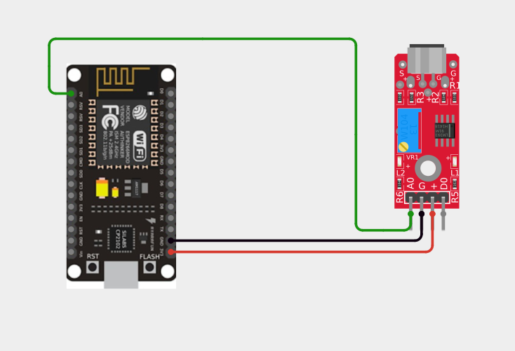
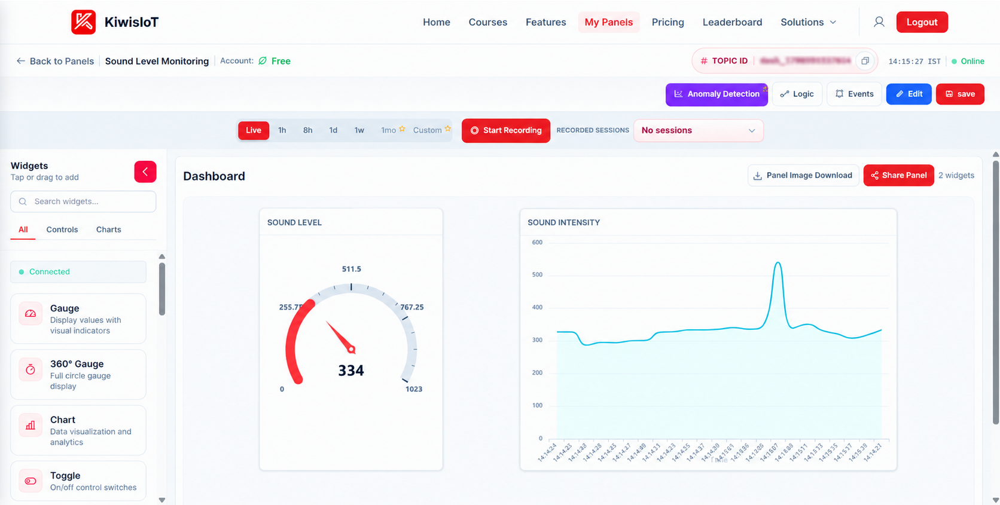
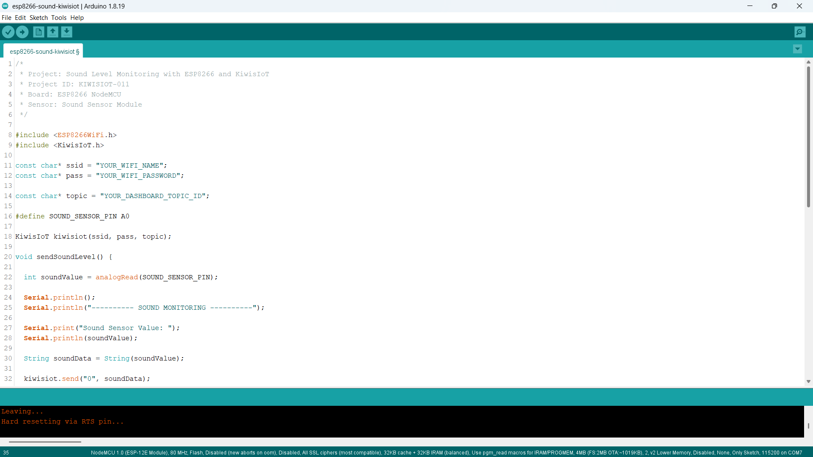
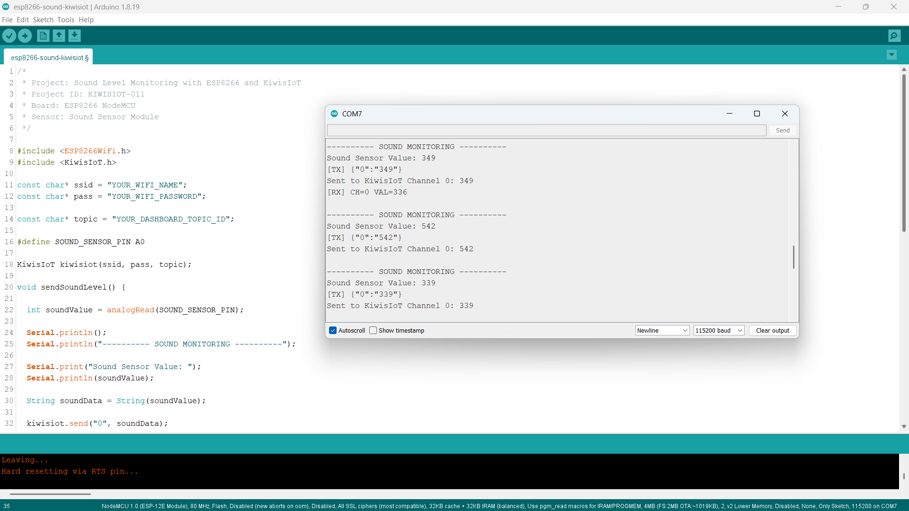

# ESP8266 Sound Sensor IoT Project: Monitor Sound Levels with KiwisIoT 🔊

Build an **ESP8266 sound sensor IoT project** to monitor changing sound levels in real time using a **sound sensor module, ESP8266 NodeMCU, and KiwisIoT**.

In this project, the ESP8266 reads the analog output from the sound sensor and sends the sensor value to a KiwisIoT IoT dashboard over Wi-Fi.

The dashboard uses a **Gauge** and **Chart** widget to visualize the changing sound sensor readings in real time.

---

## 🚀 Project Highlights

* ESP8266-based sound monitoring
* Analog sound sensor reading
* Real-time sound sensor value visualization
* KiwisIoT IoT dashboard integration
* Gauge-based live value display
* Chart-based sound level history
* Wi-Fi-based sensor monitoring
* Arduino IoT project for beginners
* Suitable for student and engineering IoT projects

---

## 🔎 Project Overview

A **sound sensor module** detects changes in sound intensity and produces an electrical signal that can be read by a microcontroller.

In this project, the analog output of the sound sensor is connected to the **A0 analog input** of the ESP8266 NodeMCU.

The ESP8266 reads the sensor value, sends it to KiwisIoT through Wi-Fi, and displays the changing readings on the IoT dashboard.

The project flow is:

```text
Sound Sensor
     ↓
ESP8266 NodeMCU
     ↓
Analog Reading
     ↓
Wi-Fi
     ↓
KiwisIoT
     ↓
IoT Dashboard
     ↓
Gauge + Chart
```

---

## 🔊 Why This Project?

This project demonstrates how an ESP8266 can collect changing sound sensor readings and send them to an IoT platform for remote visualization.

Instead of using only the Serial Monitor, the sensor readings can be monitored through a KiwisIoT dashboard.

The project provides a simple foundation for applications such as sound monitoring, noise observation, and environment monitoring.

The complete data path is:

```text
Sound Sensor
    ↓
ESP8266
    ↓
Analog Sensor Value
    ↓
Wi-Fi
    ↓
KiwisIoT
    ↓
Dashboard
    ↓
Real-Time Sound Monitoring
```

---

## 📚 What You'll Learn

By building this project, you will learn how to:

* Connect a sound sensor module to an ESP8266
* Read an analog sensor value using `analogRead()`
* Send sensor data from ESP8266 to KiwisIoT
* Use a KiwisIoT channel for sensor data
* Display sensor readings using a Gauge widget
* Visualize changing sensor values using a Chart widget
* Monitor sensor data remotely over Wi-Fi

---

## 🧰 Components Required

| Component           | Quantity    |
| ------------------- | ----------- |
| ESP8266 NodeMCU     | 1           |
| Sound Sensor Module | 1           |
| Jumper Wires        | As required |
| USB Cable           | 1           |
| Computer            | 1           |

---

## 💻 Software Requirements

* Arduino IDE
* ESP8266 board package
* KiwisIoT Arduino library
* KiwisIoT account
* Wi-Fi connection

### Common KiwisIoT Setup

Before starting this project, complete the common **KiwisIoT Arduino Setup Guide**.

The setup guide covers:

* Arduino IDE installation
* ESP8266 board installation
* ESP8266 board selection
* KiwisIoT Arduino library installation
* KiwisIoT account setup
* Panel creation
* Topic ID
* Dashboard widgets
* Widget configuration

The common setup guide is available in the parent `esp8266` directory:

[Open the KiwisIoT Arduino Setup Guide](../kiwisiot-arduino-setup/)

---

## 🛠️ Technologies Used

* ESP8266 NodeMCU
* Sound Sensor Module
* Arduino IDE
* KiwisIoT Arduino Library
* KiwisIoT IoT Dashboard
* Wi-Fi
* C++ / Arduino

---

## 🔌 Circuit Connection

The sound sensor module provides an analog output that is read by the ESP8266.

Connect the sensor as follows:

| Sound Sensor Module | ESP8266 NodeMCU |
| ------------------- | --------------- |
| VCC                 | 3.3V            |
| GND                 | GND             |
| AO                  | A0              |
| DO                  | Not used        |

This project uses the **AO (Analog Output)** pin because the objective is to monitor changing sound sensor readings.



---

## 🔬 How the Sound Sensor Works

A sound sensor module detects changes in sound using a microphone and electronic circuitry.

The module produces an electrical signal that changes according to the sound detected by the microphone.

In this project, the **analog output (AO)** is connected to the ESP8266 A0 pin.

The ESP8266 reads the analog signal using:

```cpp
int soundValue = analogRead(SOUND_SENSOR_PIN);
```

The ESP8266 analog input provides a value in the range:

```text
0 → 1023
```

The actual readings can vary depending on the sound sensor module, microphone sensitivity, surrounding noise, power supply, and environment.

---

## 📊 Sound Sensor Value

The project directly sends the analog reading from the sound sensor to KiwisIoT.

The code uses:

```cpp
int soundValue = analogRead(SOUND_SENSOR_PIN);
```

The reading is then converted to a string:

```cpp
String soundData = String(soundValue);
```

The value is sent to KiwisIoT using:

```cpp
kiwisiot.send("0", soundData);
```

For example, the Serial Monitor may show:

```text
Sound Sensor Value: 349
```

or:

```text
Sound Sensor Value: 542
```

These values represent the **analog output of the sound sensor module**.

> **Note:** The sensor value is not a calibrated sound pressure level in decibels (dB). It is the analog reading produced by the sensor module and can be used to observe relative changes in sound detected by the sensor.

---

## 📈 Understanding Sound Sensor Readings

The sound sensor value can change when the surrounding sound changes.

For example:

```text
Normal Environment
        ↓
Lower / Stable Sensor Values

Louder Sound
        ↓
Changing / Higher Sensor Values
```

During testing, sample readings may look like:

```text
349
542
339
```

The exact values are not fixed.

They depend on:

* Sound sensor module
* Microphone sensitivity
* Distance from the sound source
* Surrounding noise
* Sensor potentiometer
* Power supply
* Environment

Therefore, the sensor readings should be treated as **relative sound sensor values** rather than calibrated decibel measurements.

---

## ☁️ KiwisIoT Dashboard

This project uses **one KiwisIoT channel** for the sound sensor data.

| Channel | Data               | Example |
| ------- | ------------------ | ------- |
| `0`     | Sound Sensor Value | `349`   |

The same Channel 0 data is used by both dashboard widgets.

```text
ESP8266
     │
     │
     └── Channel 0 → Sound Sensor Value
                         │
                         ├── Gauge
                         │
                         └── Chart
```

The **Gauge** displays the current sensor reading, while the **Chart** shows how the sensor reading changes over time.



---

## ⚙️ Dashboard Configuration

Create a KiwisIoT panel for the project and add the required widgets.

### Sound Level Gauge

Use a **Gauge** widget to display the current sound sensor value.

Suggested configuration:

```text
Name: Sound Level
Channel ID: 0
Minimum Value: 0
Maximum Value: 1023
```

The Gauge receives the value sent using:

```cpp
kiwisiot.send("0", soundData);
```

For example:

```text
Sound Sensor Value: 334
```

The Gauge provides a quick view of the latest sensor reading.

### Sound Intensity Chart

Add a **Chart** widget to visualize the changing sound sensor values over time.

Suggested configuration:

```text
Name: Sound Intensity
Channel ID: 0
```

The Chart uses the same Channel 0 data as the Gauge.

```text
Channel 0
    ↓
Sound Sensor Value
    ↓
┌───────────────┐
│     Gauge     │
└───────────────┘

    +

┌───────────────┐
│     Chart     │
└───────────────┘
```

This allows the dashboard to show both the **current value** and the **historical variation** of the sensor reading.

> **Note:** Both widgets use Channel ID `0`. No additional channel is required for the Chart.

---

## 💻 Arduino Code

The complete Arduino code is available here:

[View the Arduino Code](code/esp8266-sound-kiwisiot.ino)

The program uses the ESP8266 Wi-Fi library and the KiwisIoT Arduino library:

```cpp
#include <ESP8266WiFi.h>
#include <KiwisIoT.h>
```



---

## 🔐 Configure Wi-Fi and KiwisIoT

Before uploading the program, update these values:

```cpp
const char* ssid = "YOUR_WIFI_NAME";
const char* pass = "YOUR_WIFI_PASSWORD";

const char* topic = "YOUR_DASHBOARD_TOPIC_ID";
```

Replace:

```text
YOUR_WIFI_NAME
```

with your Wi-Fi network name.

Replace:

```text
YOUR_WIFI_PASSWORD
```

with your Wi-Fi password.

Replace:

```text
YOUR_DASHBOARD_TOPIC_ID
```

with the Topic ID of the KiwisIoT panel created for this project.

For example:

```cpp
const char* topic = "dash_xxxxxxxxxxxxx";
```

> **Security:** Never publish your actual Wi-Fi password or private credentials in a public GitHub repository.

---

## 📝 Complete Arduino Code

```cpp
/*
 * Project: Sound Level Monitoring with ESP8266 and KiwisIoT
 * Project ID: KIWISIOT-011
 * Board: ESP8266 NodeMCU
 * Sensor: Sound Sensor Module
 */

#include <ESP8266WiFi.h>
#include <KiwisIoT.h>

const char* ssid = "YOUR_WIFI_NAME";
const char* pass = "YOUR_WIFI_PASSWORD";

const char* topic = "YOUR_DASHBOARD_TOPIC_ID";

#define SOUND_SENSOR_PIN A0

KiwisIoT kiwisiot(ssid, pass, topic);

void sendSoundLevel() {

  int soundValue = analogRead(SOUND_SENSOR_PIN);

  Serial.println();
  Serial.println("---------- SOUND MONITORING ----------");

  Serial.print("Sound Sensor Value: ");
  Serial.println(soundValue);

  String soundData = String(soundValue);

  kiwisiot.send("0", soundData);

  Serial.print("Sent to KiwisIoT Channel 0: ");
  Serial.println(soundData);
}

void setup() {

  Serial.begin(115200);

  Serial.println();
  Serial.println("     SOUND MONITORING     ");

  pinMode(SOUND_SENSOR_PIN, INPUT);

  Serial.println("Sound sensor initialized");

  Serial.println("Connecting to KiwisIoT...");

  kiwisiot.begin();

  Serial.println("KiwisIoT initialized");
  Serial.println("Starting sound monitoring...");
}

void loop() {

  kiwisiot.run();

  static unsigned long lastSend = 0;

  if (millis() - lastSend >= 2000) {

    lastSend = millis();

    sendSoundLevel();
  }

  delay(100);
}
```

---

## ⬆️ Upload the Program

After configuring the code:

1. Connect the ESP8266 NodeMCU to your computer.
2. Open `esp8266-sound-kiwisiot.ino` in Arduino IDE.
3. Select the appropriate ESP8266 board.
4. Verify the program.
5. Upload the code to the ESP8266.
6. Open the Serial Monitor.
7. Set the baud rate to:

```text
115200
```

Once the ESP8266 connects to KiwisIoT, it will begin sending sound sensor data to the configured dashboard.

---

## 🖥️ Serial Monitor Output

The ESP8266 prints the sound sensor readings and KiwisIoT transmission information to the Serial Monitor.

A typical output looks like:

```text
---------- SOUND MONITORING ----------
Sound Sensor Value: 349
[TX] {"0":"349"}
Sent to KiwisIoT Channel 0: 349

---------- SOUND MONITORING ----------
Sound Sensor Value: 542
[TX] {"0":"542"}
Sent to KiwisIoT Channel 0: 542

---------- SOUND MONITORING ----------
Sound Sensor Value: 339
[TX] {"0":"339"}
Sent to KiwisIoT Channel 0: 339
```

The project sends a new sound sensor reading approximately every two seconds.



---

## 🔄 Understanding the Data Flow

The project processes the sensor data in a simple sequence.

### 1. Read the Sound Sensor

```cpp
int soundValue = analogRead(SOUND_SENSOR_PIN);
```

### 2. Convert the Reading

```cpp
String soundData = String(soundValue);
```

### 3. Send the Reading to KiwisIoT

```cpp
kiwisiot.send("0", soundData);
```

### 4. Display the Data

The same Channel 0 data is displayed by:

```text
Channel 0
    ↓
┌──────────────┐
│     Gauge    │
└──────────────┘

    +

┌──────────────┐
│     Chart    │
└──────────────┘
```

The complete flow is:

```text
Sound Sensor
    ↓
Analog Reading
    ↓
ESP8266
    ↓
Channel 0
    ↓
KiwisIoT
    ↓
Gauge + Chart
```

---

## 🧪 Testing the Project

You can test the sound sensor by changing the sound around the microphone.

### 🔇 Quiet Environment

Place the sensor in a relatively quiet environment.

The sensor reading may remain relatively stable.

For example:

```text
Sound Sensor Value: 349
```

### 🗣️ Normal Sound

Speak or make normal sounds near the sensor.

The sensor reading may change depending on the distance and sound level.

### 🔊 Louder Sound

Make a louder sound near the microphone.

The sensor value may show a noticeable change.

For example:

```text
Sound Sensor Value: 542
```

The exact readings will vary depending on the sensor module and environment.

> **Note:** These readings are relative analog sensor values and should not be interpreted as calibrated dB measurements.

---

## ❓ Why Use One Channel for Both Widgets?

This project uses only **Channel 0** because both dashboard widgets display the same sensor data.

```text
Channel 0 → Sound Sensor Value
```

The Gauge uses Channel 0 to display the current reading:

```text
Channel 0 → Gauge
```

The Chart also uses Channel 0 to display changes over time:

```text
Channel 0 → Chart
```

This avoids sending the same sensor value through multiple channels.

---

## 🛠️ Troubleshooting

### Sound Sensor Value Does Not Change

Check:

* VCC connection
* GND connection
* AO connection to A0
* Sensor wiring
* Microphone position
* Surrounding sound
* Sensor module
* Sensor potentiometer, if applicable

### Sound Sensor Values Are Unstable

Some variation is normal because the sensor can detect surrounding environmental noise.

Check:

* Distance from sound sources
* Background noise
* Sensor power supply
* Microphone position
* Sensor module sensitivity

### Dashboard Does Not Receive Data

Check:

* Wi-Fi name
* Wi-Fi password
* Internet connection
* KiwisIoT Topic ID
* Channel ID
* Dashboard widget configuration
* KiwisIoT Arduino library
* ESP8266 connection

### Widget Shows No Data

Make sure both dashboard widgets are configured to use:

```text
Channel ID: 0
```

The data flow should be:

```text
ESP8266
    ↓
Channel 0
    ↓
KiwisIoT
    ↓
Sound Level Gauge
```

and:

```text
ESP8266
    ↓
Channel 0
    ↓
KiwisIoT
    ↓
Sound Intensity Chart
```

### Can the Sensor Value Be Used as dB?

The value in this project is the **analog output reading of the sound sensor module**.

It is not a calibrated decibel measurement.

For accurate sound pressure level measurement in dB, a calibrated microphone and appropriate measurement circuit or sensor would be required.

---

## 🔒 Security

Never publish sensitive credentials in a public GitHub repository.

Do not commit:

* Wi-Fi passwords
* API keys
* Access tokens
* Account passwords
* Private credentials

Use placeholders such as:

```text
YOUR_WIFI_NAME
YOUR_WIFI_PASSWORD
YOUR_DASHBOARD_TOPIC_ID
```

Enter your actual credentials only in your local Arduino project.

---

## 🌱 Possible Applications

An ESP8266 sound sensor monitoring system can be used as a starting point for:

* Sound activity monitoring
* Noise observation
* Room sound monitoring
* Environment monitoring
* IoT sensor monitoring
* Smart building projects
* Embedded systems projects
* Engineering and college IoT projects

The project can also be extended by adding additional sensors, automation logic, alerts, or other KiwisIoT dashboard widgets.

---

## 📁 Project Structure

```text
011-sound-kiwisiot/
│
├── README.md
├── LICENSE
├── .gitignore
│
├── code/
│   └── esp8266-sound-kiwisiot.ino
│
└── images/
    ├── circuit.png
    ├── code.png
    ├── serial-monitor.png
    └── dashboard-output.png
```

---

## 🔗 Related KiwisIoT ESP8266 Projects

This project is part of the **KiwisIoT ESP8266 IoT project collection**.

* [ESP8266 LDR Sensor IoT Project](../001-ldr-kiwisiot/)
* [ESP8266 IR Sensor IoT Project](../002-ir-kiwisiot/)
* [ESP8266 Ultrasonic Sensor IoT Project](../003-ultrasonic-kiwisiot/)
* [ESP8266 DHT11 Temperature & Humidity IoT Project](../004-dht11-kiwisiot/)
* [ESP8266 PIR Motion Sensor IoT Project](../005-pir-kiwisiot/)
* [ESP8266 Gas Sensor IoT Project](../006-gas-kiwisiot/)
* [ESP8266 Flame Sensor IoT Project](../007-flame-kiwisiot/)
* [ESP8266 Soil Moisture IoT Project](../008-soil-moisture-kiwisiot/)
* [ESP8266 Water Level Sensor IoT Project](../009-water-level-kiwisiot/)
* [ESP8266 Raindrop Sensor IoT Project](../010-rain-sensor-kiwisiot/)

For Arduino and KiwisIoT setup, see the:

[**KiwisIoT Arduino Setup Guide**](../kiwisiot-arduino-setup/)

---

## ❓ Frequently Asked Questions

### What is a sound sensor?

A sound sensor is an electronic module that detects sound using a microphone and produces an electrical signal that can be read by a microcontroller.

### Can I connect a sound sensor to an ESP8266?

Yes. A sound sensor module with an analog output can be connected to the ESP8266 analog input for monitoring changes in sound.

### Which ESP8266 board is used in this project?

This project uses an **ESP8266 NodeMCU** development board.

### Which pin is used for the sound sensor?

The analog output of the sound sensor module is connected to:

```text
A0
```

### Which KiwisIoT channel is used?

This project uses:

```text
Channel 0 → Sound Sensor Value
```

### Why are both the Gauge and Chart using Channel 0?

Both widgets display the same sound sensor data. The Gauge shows the current value, while the Chart shows how the value changes over time.

### Is the sensor value measured in decibels?

No. The project reads the analog output of the sound sensor module. The value is not a calibrated dB measurement.

### Why does the sound sensor value change?

The reading can change because of sound, background noise, microphone sensitivity, distance from the sound source, sensor configuration, and environmental conditions.

### Will the sound sensor always produce the same value?

No. Sensor readings can vary depending on the sound sensor module, surrounding noise, power supply, microphone sensitivity, and environment.

### Can this project be extended?

Yes. Additional sensors, automation logic, alerts, charts, and other KiwisIoT dashboard widgets can be added to build a larger IoT application.

---

## 📌 Summary

This project demonstrates a simple **ESP8266 sound sensor IoT monitoring system** using KiwisIoT.

The ESP8266 reads the analog output from the sound sensor and sends the sensor value to a KiwisIoT dashboard over Wi-Fi.

The dashboard uses the same **Channel 0** data for two widgets:

```text
Sound Sensor Value
        ↓
    Channel 0
       ↙  ↘
   Gauge   Chart
```

The Gauge displays the current sensor reading, while the Chart helps visualize changes in the sensor value over time.

This project provides a practical example of how an ESP8266 can collect analog sensor data and connect it to an IoT platform for real-time monitoring.

---

## 📄 License

This project is licensed under the MIT License. See the `LICENSE` file for details.
