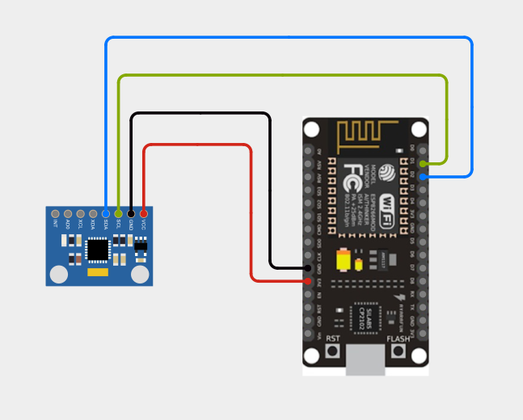
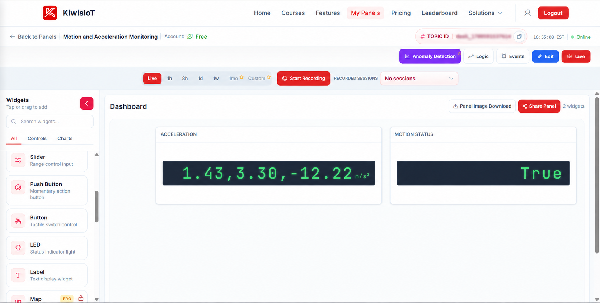
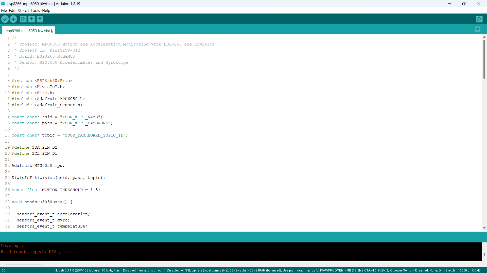
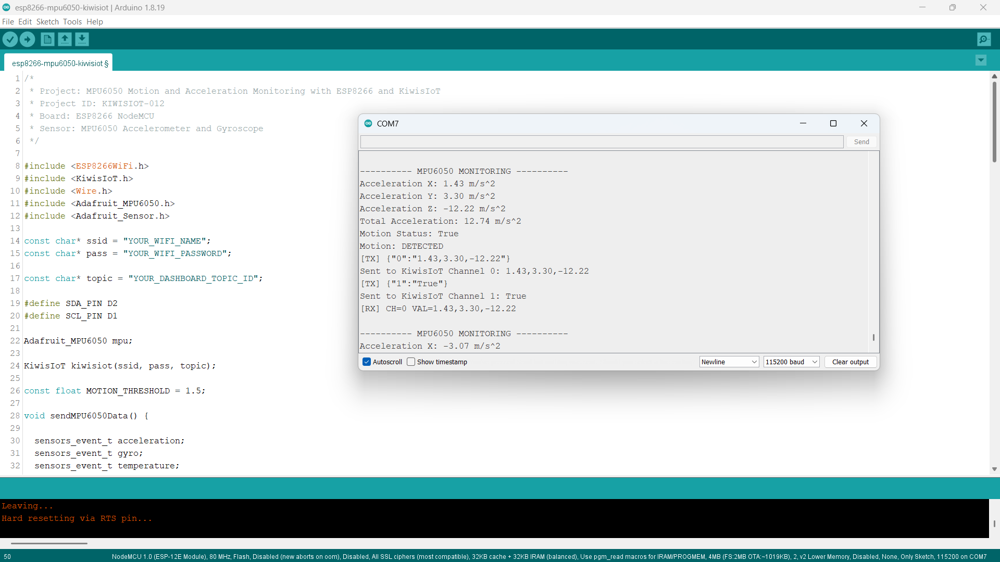

# ESP8266 MPU6050 IoT Project: Monitor Motion and Acceleration with KiwisIoT 📐

Build an **ESP8266 MPU6050 IoT project** to monitor acceleration and motion in real time using an **MPU6050 sensor, ESP8266 NodeMCU, Arduino, and KiwisIoT**.

In this project, the ESP8266 reads acceleration data from the MPU6050 sensor, calculates the total acceleration, detects motion based on a defined threshold, and sends the data to a KiwisIoT IoT dashboard over Wi-Fi.

The dashboard displays the **X, Y, and Z acceleration values** together with a **motion status**, providing a practical example of real-time motion and acceleration monitoring with ESP8266.

---

## 🚀 Project Highlights

* ESP8266-based motion monitoring
* MPU6050 accelerometer integration
* X, Y, and Z acceleration monitoring
* Total acceleration calculation
* Motion detection using a threshold
* Real-time KiwisIoT dashboard visualization
* Wi-Fi-based IoT monitoring
* Arduino IoT project for beginners
* Suitable for student and engineering IoT projects

---

## 🔎 Project Overview

The **MPU6050** is a motion-sensing module that provides accelerometer and gyroscope data.

In this project, the MPU6050 is connected to an ESP8266 NodeMCU using the I2C interface. The ESP8266 reads the acceleration values along the X, Y, and Z axes, calculates the total acceleration, and determines whether motion is detected.

The acceleration data and motion status are then sent to KiwisIoT.

The project flow is:

```text
MPU6050 Sensor
       ↓
ESP8266 NodeMCU
       ↓
X, Y, Z Acceleration
       ↓
Total Acceleration
       ↓
Motion Detection
       ↓
Wi-Fi
       ↓
KiwisIoT
       ↓
IoT Dashboard
```

---

## 📐 Why This Project?

This project demonstrates how a motion sensor can be connected to an ESP8266 and integrated with an IoT dashboard.

Instead of viewing acceleration values only through the Serial Monitor, the sensor data can be sent to KiwisIoT for remote visualization.

The project provides a simple foundation for applications such as:

* Motion monitoring
* Device movement detection
* Equipment monitoring
* IoT-based motion sensing
* Embedded systems projects
* Engineering and college IoT projects

---

## 📚 What You'll Learn

By building this project, you will learn how to:

* Connect an MPU6050 sensor to an ESP8266 using I2C
* Read acceleration data using the Adafruit MPU6050 library
* Monitor X, Y, and Z acceleration values
* Calculate total acceleration
* Detect motion using a threshold value
* Send sensor data from ESP8266 to KiwisIoT
* Use KiwisIoT channels for different types of data
* Display acceleration and motion status on an IoT dashboard
* Monitor motion remotely over Wi-Fi

---

## 🧰 Components Required

| Component       | Quantity    |
| --------------- | ----------- |
| ESP8266 NodeMCU | 1           |
| MPU6050 Module  | 1           |
| Jumper Wires    | As required |
| USB Cable       | 1           |
| Computer        | 1           |

---

## 💻 Software Requirements

* Arduino IDE
* ESP8266 board package
* KiwisIoT Arduino library
* Adafruit MPU6050 library
* Adafruit Unified Sensor library
* KiwisIoT account
* Wi-Fi connection

### Required Arduino Libraries

Install the following libraries through:

```text
Sketch → Include Library → Manage Libraries
```

Search for and install:

```text
Adafruit MPU6050
Adafruit Unified Sensor
```

The KiwisIoT Arduino library is required for communication between the ESP8266 and KiwisIoT.

### Common KiwisIoT Setup

Before starting this project, complete the common **KiwisIoT Arduino Setup Guide**.

The setup guide covers:

* Arduino IDE installation
* ESP8266 board installation
* ESP8266 board selection
* KiwisIoT Arduino library installation
* KiwisIoT account setup
* Panel creation
* Topic ID
* Dashboard widgets
* Widget configuration

The common setup guide is available in the parent `esp8266` directory:

[Open the KiwisIoT Arduino Setup Guide](../kiwisiot-arduino-setup/)

---

## 🛠️ Technologies Used

* ESP8266 NodeMCU
* MPU6050 Accelerometer and Gyroscope
* Arduino IDE
* KiwisIoT Arduino Library
* Adafruit MPU6050 Library
* Adafruit Unified Sensor Library
* KiwisIoT IoT Dashboard
* I2C
* Wi-Fi
* C++ / Arduino

---

## 🔌 Circuit Connection

The MPU6050 communicates with the ESP8266 using the **I2C interface**.

The project uses:

```text
SDA → D2
SCL → D1
```

Connect the MPU6050 to the ESP8266 NodeMCU as follows:

| MPU6050 | ESP8266 NodeMCU |
| ------- | --------------- |
| VCC     | 3.3V            |
| GND     | GND             |
| SDA     | D2              |
| SCL     | D1              |

The code defines the I2C pins as:

```cpp
#define SDA_PIN D2
#define SCL_PIN D1
```



---

## 📐 How the MPU6050 Works

The MPU6050 is a motion sensor that provides accelerometer and gyroscope measurements.

In this project, the accelerometer data is used to monitor movement along three axes:

```text
X Axis → Acceleration X
Y Axis → Acceleration Y
Z Axis → Acceleration Z
```

The ESP8266 reads the sensor using the Adafruit MPU6050 library:

```cpp
sensors_event_t acceleration;
sensors_event_t gyro;
sensors_event_t temperature;

mpu.getEvent(&acceleration, &gyro, &temperature);
```

The acceleration values are then stored as:

```cpp
float ax = acceleration.acceleration.x;
float ay = acceleration.acceleration.y;
float az = acceleration.acceleration.z;
```

The acceleration values are reported in:

```text
m/s²
```

---

## ⚙️ MPU6050 Configuration

The project configures the accelerometer and gyroscope ranges as follows:

```cpp
mpu.setAccelerometerRange(MPU6050_RANGE_8_G);

mpu.setGyroRange(MPU6050_RANGE_500_DEG);
```

This sets:

```text
Accelerometer Range → ±8 G
Gyroscope Range     → ±500 degrees/s
```

The project reads gyroscope and temperature data from the MPU6050 internally, but the KiwisIoT dashboard in this project is configured to display the acceleration data and motion status.

---

## 📊 Total Acceleration Calculation

The project calculates the magnitude of acceleration using the X, Y, and Z acceleration values.

The calculation is:

```cpp
float totalAcceleration =
  sqrt((ax * ax) + (ay * ay) + (az * az));
```

The calculation can be represented as:

```text
Total Acceleration
=
√(X² + Y² + Z²)
```

For example, if the sensor reports:

```text
Acceleration X: 1.43 m/s²
Acceleration Y: 3.30 m/s²
Acceleration Z: -12.22 m/s²
```

the project calculates the combined acceleration from all three axes.

The total acceleration is printed in the Serial Monitor.

---

## 🚨 Motion Detection

The project determines motion by comparing the calculated total acceleration with the approximate gravitational acceleration value.

The code uses:

```cpp
float accelerationChange =
  abs(totalAcceleration - 9.81);
```

A motion threshold is defined as:

```cpp
const float MOTION_THRESHOLD = 1.5;
```

The motion status is determined using:

```cpp
if (accelerationChange > MOTION_THRESHOLD) {
    motionStatus = "True";
}
else {
    motionStatus = "False";
}
```

This means:

```text
Acceleration Change > 1.5
        ↓
Motion = True
```

Otherwise:

```text
Acceleration Change ≤ 1.5
        ↓
Motion = False
```

The threshold is defined specifically for this project and can be adjusted according to the sensor behavior and application requirements.

---

## ☁️ KiwisIoT Dashboard

The ESP8266 sends two values to KiwisIoT.

| Channel | Data                 | Example            |
| ------- | -------------------- | ------------------ |
| `0`     | X, Y, Z Acceleration | `1.43,3.30,-12.22` |
| `1`     | Motion Status        | `True`             |

The data flow is:

```text
ESP8266
   │
   ├── Channel 0 → X,Y,Z Acceleration
   │                  ↓
   │              KiwisIoT
   │                  ↓
   │          Acceleration Widget
   │
   └── Channel 1 → Motion Status
                      ↓
                  KiwisIoT
                      ↓
                Motion Widget
```



---

## ⚙️ Dashboard Configuration

Create a KiwisIoT panel for the project and add the required widgets.

### Acceleration Widget

Use a suitable **Label** or text display widget to show the acceleration values.

Suggested configuration:

```text
Name: Acceleration
Channel ID: 0
Unit: m/s²
```

The widget receives a comma-separated acceleration value such as:

```text
1.43,3.30,-12.22
```

The data is sent using:

```cpp
kiwisiot.send("0", accelerationData);
```

---

### Motion Status Widget

Use a **Label** widget to display the motion status.

Suggested configuration:

```text
Name: Motion Status
Channel ID: 1
```

The widget receives:

```text
True
```

or:

```text
False
```

The status is sent using:

```cpp
kiwisiot.send("1", motionStatus);
```

> **Note:** The Channel ID configured in the dashboard must match the Channel ID used in the ESP8266 code.

---

## 💻 Arduino Code

The complete Arduino code is available here:

[View the Arduino Code](code/esp8266-mpu6050-kiwisiot.ino)

The program uses the ESP8266 Wi-Fi library, KiwisIoT library, Wire library, and Adafruit MPU6050 libraries:

```cpp
#include <ESP8266WiFi.h>
#include <KiwisIoT.h>
#include <Wire.h>
#include <Adafruit_MPU6050.h>
#include <Adafruit_Sensor.h>
```



---

## 🔐 Configure Wi-Fi and KiwisIoT

Before uploading the program, update these values:

```cpp
const char* ssid = "YOUR_WIFI_NAME";
const char* pass = "YOUR_WIFI_PASSWORD";

const char* topic = "YOUR_DASHBOARD_TOPIC_ID";
```

Replace:

```text
YOUR_WIFI_NAME
```

with your Wi-Fi network name.

Replace:

```text
YOUR_WIFI_PASSWORD
```

with your Wi-Fi password.

Replace:

```text
YOUR_DASHBOARD_TOPIC_ID
```

with the Topic ID of the KiwisIoT panel created for this project.

For example:

```cpp
const char* topic = "dash_xxxxxxxxxxxxx";
```

> **Security:** Never publish your actual Wi-Fi password or private credentials in a public GitHub repository.

---

## 📝 Complete Arduino Code

```cpp
/*
 * Project: MPU6050 Motion and Acceleration Monitoring with ESP8266 and KiwisIoT
 * Project ID: KIWISIOT-012
 * Board: ESP8266 NodeMCU
 * Sensor: MPU6050 Accelerometer and Gyroscope
 */

#include <ESP8266WiFi.h>
#include <KiwisIoT.h>
#include <Wire.h>
#include <Adafruit_MPU6050.h>
#include <Adafruit_Sensor.h>

const char* ssid = "YOUR_WIFI_NAME";
const char* pass = "YOUR_WIFI_PASSWORD";

const char* topic = "YOUR_DASHBOARD_TOPIC_ID";

#define SDA_PIN D2
#define SCL_PIN D1

Adafruit_MPU6050 mpu;

KiwisIoT kiwisiot(ssid, pass, topic);

const float MOTION_THRESHOLD = 1.5;

void sendMPU6050Data() {

  sensors_event_t acceleration;
  sensors_event_t gyro;
  sensors_event_t temperature;

  mpu.getEvent(&acceleration, &gyro, &temperature);

  float ax = acceleration.acceleration.x;
  float ay = acceleration.acceleration.y;
  float az = acceleration.acceleration.z;

  float totalAcceleration =
    sqrt((ax * ax) + (ay * ay) + (az * az));

  float accelerationChange =
    abs(totalAcceleration - 9.81);

  String motionStatus;

  if (accelerationChange > MOTION_THRESHOLD) {

    motionStatus = "True";

  }
  else {

    motionStatus = "False";
  }

  Serial.println();
  Serial.println("---------- MPU6050 MONITORING ----------");

  Serial.print("Acceleration X: ");
  Serial.print(ax, 2);
  Serial.println(" m/s^2");

  Serial.print("Acceleration Y: ");
  Serial.print(ay, 2);
  Serial.println(" m/s^2");

  Serial.print("Acceleration Z: ");
  Serial.print(az, 2);
  Serial.println(" m/s^2");

  Serial.print("Total Acceleration: ");
  Serial.print(totalAcceleration, 2);
  Serial.println(" m/s^2");

  Serial.print("Motion Status: ");
  Serial.println(motionStatus);

  if (motionStatus == "True") {

    Serial.println("Motion: DETECTED");

  }
  else {

    Serial.println("Motion: NOT DETECTED");
  }

  String accelerationData =
    String(ax, 2) + "," +
    String(ay, 2) + "," +
    String(az, 2);

  kiwisiot.send("0", accelerationData);

  Serial.print("Sent to KiwisIoT Channel 0: ");
  Serial.println(accelerationData);

  kiwisiot.send("1", motionStatus);

  Serial.print("Sent to KiwisIoT Channel 1: ");
  Serial.println(motionStatus);
}

void setup() {

  Serial.begin(115200);

  Serial.println();
  Serial.println("     MPU6050 MONITORING     ");

  Wire.begin(SDA_PIN, SCL_PIN);

  if (!mpu.begin()) {

    Serial.println("MPU6050 not found!");

    while (1) {
      delay(1000);
    }
  }

  Serial.println("MPU6050 initialized");

  mpu.setAccelerometerRange(MPU6050_RANGE_8_G);

  mpu.setGyroRange(MPU6050_RANGE_500_DEG);

  Serial.println("Connecting to KiwisIoT...");

  kiwisiot.begin();

  Serial.println("KiwisIoT initialized");
  Serial.println("Starting motion monitoring...");
}

void loop() {

  kiwisiot.run();

  static unsigned long lastSend = 0;

  if (millis() - lastSend >= 2000) {

    lastSend = millis();

    sendMPU6050Data();
  }

  delay(100);
}
```

---

## ⬆️ Upload the Program

After configuring the code:

1. Connect the ESP8266 NodeMCU to your computer.
2. Open `esp8266-mpu6050-kiwisiot.ino` in Arduino IDE.
3. Select the appropriate ESP8266 board.
4. Verify the program.
5. Upload the code to the ESP8266.
6. Open the Serial Monitor.
7. Set the baud rate to:

```text
115200
```

Once the ESP8266 connects to KiwisIoT and the MPU6050 is initialized, the project will begin monitoring acceleration and motion.

---

## 🖥️ Serial Monitor Output

The ESP8266 prints the MPU6050 acceleration values, total acceleration, motion status, and KiwisIoT transmission information to the Serial Monitor.

A typical output from the project looks like:

```text
---------- MPU6050 MONITORING ----------
Acceleration X: 1.43 m/s^2
Acceleration Y: 3.30 m/s^2
Acceleration Z: -12.22 m/s^2
Total Acceleration: 12.74 m/s^2
Motion Status: True
Motion: DETECTED
[TX] {"0":"1.43,3.30,-12.22"}
Sent to KiwisIoT Channel 0: 1.43,3.30,-12.22
[TX] {"1":"True"}
Sent to KiwisIoT Channel 1: True
[RX] CH=0 VAL=1.43,3.30,-12.22
```

The project sends updated acceleration and motion information approximately every two seconds.



---

## 🔄 Understanding the Data Flow

The project processes the MPU6050 data in several stages.

### 1. Read the MPU6050

```cpp
mpu.getEvent(&acceleration, &gyro, &temperature);
```

### 2. Read X, Y, and Z Acceleration

```cpp
float ax = acceleration.acceleration.x;
float ay = acceleration.acceleration.y;
float az = acceleration.acceleration.z;
```

### 3. Calculate Total Acceleration

```cpp
float totalAcceleration =
  sqrt((ax * ax) + (ay * ay) + (az * az));
```

### 4. Calculate Acceleration Change

```cpp
float accelerationChange =
  abs(totalAcceleration - 9.81);
```

### 5. Determine Motion Status

```text
Acceleration Change > 1.5
            ↓
        Motion = True
```

Otherwise:

```text
Acceleration Change ≤ 1.5
            ↓
        Motion = False
```

### 6. Send Acceleration Data

```cpp
kiwisiot.send("0", accelerationData);
```

### 7. Send Motion Status

```cpp
kiwisiot.send("1", motionStatus);
```

The complete flow is:

```text
MPU6050
   ↓
X, Y, Z Acceleration
   ↓
Total Acceleration
   ↓
Motion Detection
   ↓
Channel 0 + Channel 1
   ↓
KiwisIoT
   ↓
Dashboard
```

---

## 🧪 Testing the Project

You can test the project by changing the orientation or movement of the MPU6050 module.

### 📦 Sensor at Rest

Keep the MPU6050 relatively stable.

The acceleration values will mainly reflect the effect of gravity and the sensor orientation.

The motion status may be:

```text
Motion Status: False
```

### 🔄 Move the Sensor

Move, rotate, or shake the MPU6050 module.

The X, Y, and Z acceleration values will change.

If the calculated acceleration change exceeds the configured threshold, the project displays:

```text
Motion Status: True
Motion: DETECTED
```

### 📊 Dashboard Monitoring

The KiwisIoT dashboard updates the acceleration and motion status as new data is received.

For example:

```text
Acceleration:
1.43,3.30,-12.22

Motion Status:
True
```

> **Note:** Actual acceleration readings depend on sensor orientation, movement, mounting, vibration, and the surrounding environment.

---

## ❓ Why Use Two Channels?

This project sends two different types of information to KiwisIoT.

```text
Channel 0 → X,Y,Z Acceleration
Channel 1 → Motion Status
```

For example:

```text
Channel 0 → 1.43,3.30,-12.22
Channel 1 → True
```

The acceleration channel provides the numerical sensor information, while the motion channel provides a simple interpretation of whether motion has been detected.

This makes the dashboard easier to understand without requiring the user to continuously interpret the acceleration values.

---

## 🛠️ Troubleshooting

### MPU6050 Is Not Detected

Check:

* VCC connection
* GND connection
* SDA connection
* SCL connection
* I2C wiring
* MPU6050 module
* ESP8266 connections

The project uses:

```text
SDA → D2
SCL → D1
```

### Acceleration Values Are Unexpected

MPU6050 acceleration values depend on:

* Sensor orientation
* Gravity
* Movement
* Vibration
* Sensor mounting
* Environmental conditions

Try keeping the sensor stable and changing its orientation to observe how the X, Y, and Z values change.

### Motion Status Is Always True

The project uses:

```cpp
const float MOTION_THRESHOLD = 1.5;
```

If the sensor is experiencing vibration or movement, the calculated acceleration change may exceed this threshold.

You can adjust the threshold according to your application.

For example:

```cpp
const float MOTION_THRESHOLD = 2.0;
```

> Test the sensor readings before changing the threshold so that the value is appropriate for your setup.

### Motion Status Is Always False

If the threshold is too high for the movement being detected, motion may not be identified.

Check the acceleration values in the Serial Monitor and adjust:

```cpp
const float MOTION_THRESHOLD = 1.5;
```

according to your application.

### Dashboard Does Not Receive Data

Check:

* Wi-Fi name
* Wi-Fi password
* Internet connection
* KiwisIoT Topic ID
* Channel IDs
* KiwisIoT Arduino library
* ESP8266 connection
* Dashboard widget configuration

### Widget Shows No Data

Make sure the Channel ID in the widget matches the Channel ID used in the code.

For acceleration:

```text
ESP8266 Code
     ↓
Channel 0
     ↓
KiwisIoT
     ↓
Acceleration Widget
     ↓
Channel 0
```

For motion:

```text
ESP8266 Code
     ↓
Channel 1
     ↓
KiwisIoT
     ↓
Motion Status Widget
     ↓
Channel 1
```

---

## 🔒 Security

Never publish sensitive credentials in a public GitHub repository.

Do not commit:

* Wi-Fi passwords
* API keys
* Access tokens
* Account passwords
* Private credentials

Use placeholders such as:

```text
YOUR_WIFI_NAME
YOUR_WIFI_PASSWORD
YOUR_DASHBOARD_TOPIC_ID
```

Enter your actual credentials only in your local Arduino project.

---

## 🌱 Possible Applications

An ESP8266 and MPU6050 monitoring system can be used as a starting point for:

* Motion monitoring
* Device movement detection
* Equipment monitoring
* IoT motion sensing
* Vibration monitoring
* Orientation-based projects
* Embedded systems projects
* Engineering and college IoT projects
* Smart device monitoring

The project can also be extended by adding additional sensors, actuators, alerts, automation logic, or other KiwisIoT dashboard widgets.

---

## 📁 Project Structure

```text
012-mpu6050-kiwisiot/
│
├── README.md
│
├── code/
│   └── esp8266-mpu6050-kiwisiot.ino
│
└── images/
    ├── circuit.png
    ├── code.png
    ├── serial-monitor.png
    └── dashboard-output.png
```

---

## 🔗 Related KiwisIoT ESP8266 Projects

This project is part of the KiwisIoT ESP8266 IoT project collection.

* [ESP8266 LDR Sensor IoT Project](../001-ldr-kiwisiot/)
* [ESP8266 IR Sensor IoT Project](../002-ir-kiwisiot/)
* [ESP8266 Ultrasonic Sensor IoT Project](../003-ultrasonic-kiwisiot/)
* [ESP8266 DHT11 Temperature & Humidity IoT Project](../004-dht11-kiwisiot/)
* [ESP8266 PIR Motion Sensor IoT Project](../005-pir-kiwisiot/)
* [ESP8266 Gas Sensor IoT Project](../006-gas-kiwisiot/)
* [ESP8266 Flame Sensor IoT Project](../007-flame-kiwisiot/)
* [ESP8266 Soil Moisture IoT Project](../008-soil-moisture-kiwisiot/)
* [ESP8266 Sound Sensor IoT Project](../011-sound-kiwisiot/)
* [ESP8266 Water Level Sensor IoT Project](../009-water-level-kiwisiot/)
* [ESP8266 Raindrop Sensor IoT Project](../010-rain-sensor-kiwisiot/)

For Arduino and KiwisIoT setup, see the:

[KiwisIoT Arduino Setup Guide](../kiwisiot-arduino-setup/)

---

## ❓ Frequently Asked Questions

### What is the MPU6050?

The MPU6050 is a motion-sensing module that provides accelerometer and gyroscope measurements.

### Can I connect an MPU6050 to an ESP8266?

Yes. The MPU6050 can communicate with the ESP8266 through the I2C interface.

### Which ESP8266 board is used in this project?

This project uses an **ESP8266 NodeMCU** development board.

### Which pins are used for I2C?

The project uses:

```text
SDA → D2
SCL → D1
```

### Which KiwisIoT channels are used?

```text
Channel 0 → X, Y, Z Acceleration
Channel 1 → Motion Status
```

### What acceleration unit is used?

The acceleration values are reported in:

```text
m/s²
```

### How is total acceleration calculated?

The project calculates total acceleration using:

```text
√(X² + Y² + Z²)
```

### How is motion detected?

The project calculates the difference between total acceleration and approximately `9.81 m/s²`.

If the difference is greater than the configured threshold of `1.5`, the motion status becomes:

```text
True
```

Otherwise:

```text
False
```

### Can I change the motion threshold?

Yes. The threshold is defined in the Arduino code:

```cpp
const float MOTION_THRESHOLD = 1.5;
```

It can be adjusted according to the sensor behavior and application requirements.

### Does this project display gyroscope data on KiwisIoT?

No. The MPU6050 gyroscope data is read by the program, but the current KiwisIoT dashboard sends and displays only the acceleration data and motion status.

### Can this project be extended?

Yes. Additional sensor values, gyroscope data, alerts, automation logic, and other KiwisIoT dashboard widgets can be added to build a larger IoT application.

---

## 📌 Summary

This project demonstrates an **ESP8266 MPU6050 IoT monitoring system** using KiwisIoT.

The ESP8266 reads acceleration data from the MPU6050, calculates total acceleration, determines motion status using a defined threshold, and sends the results to a KiwisIoT dashboard over Wi-Fi.

The final dashboard provides:

```text
Acceleration → X, Y, Z acceleration values
Motion Status → True / False
```

It provides a practical example of how an ESP8266 can collect motion sensor data and connect it to an IoT platform for real-time monitoring.

---

## 📄 License

This project is licensed under the MIT License. See the `LICENSE` file for details.
