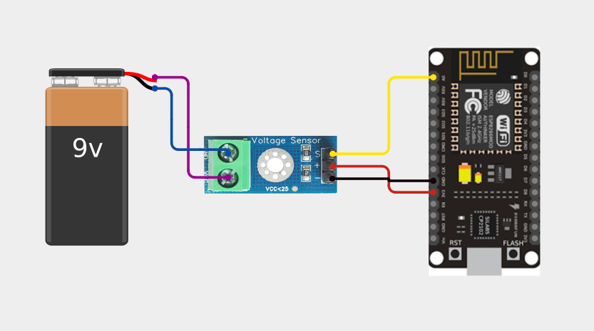
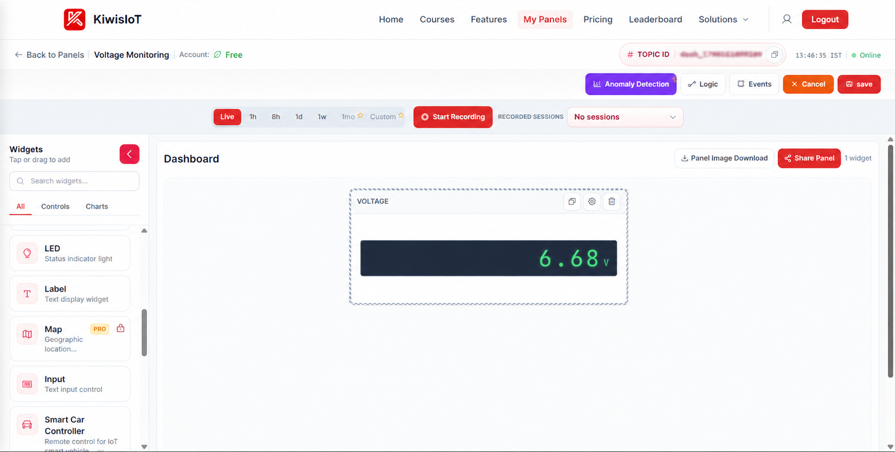
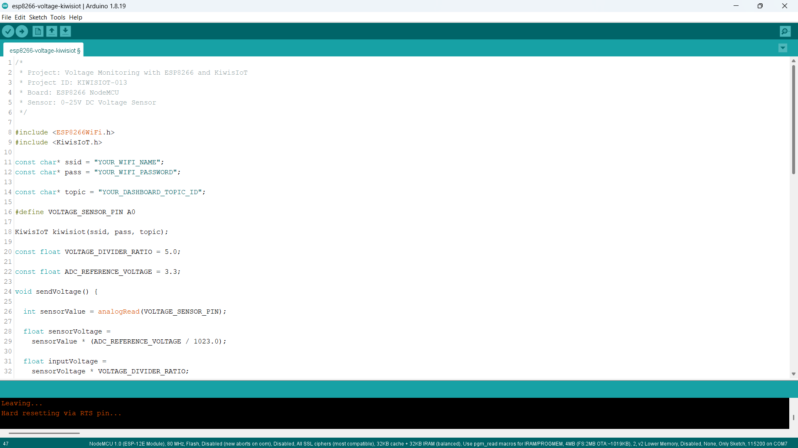
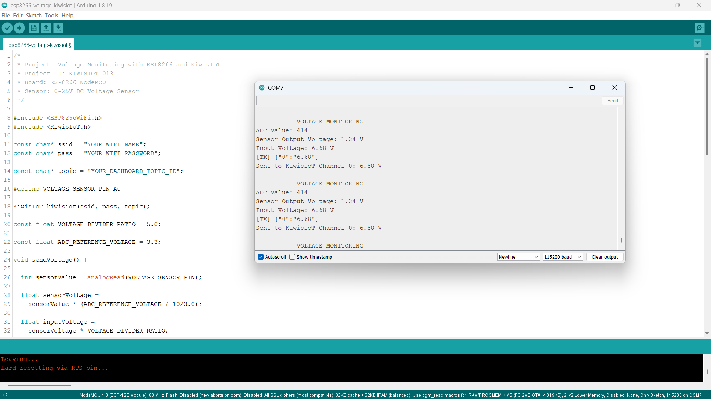

# ESP8266 Voltage Sensor IoT Project: Monitor Voltage in Real Time with KiwisIoT ⚡

Build an **ESP8266 voltage sensor IoT project** to monitor DC voltage in real time using a **0–25V DC voltage sensor, ESP8266 NodeMCU, Arduino, and KiwisIoT**.

In this project, the ESP8266 reads the analog output from the voltage sensor, converts the ADC reading into the sensor output voltage, calculates the input voltage using the voltage divider ratio, and sends the measured voltage to a KiwisIoT IoT dashboard over Wi-Fi.

The dashboard displays the measured voltage in real time, providing a simple example of voltage monitoring with an ESP8266 and an IoT platform.

---

## 🚀 Project Highlights

* ESP8266-based voltage monitoring
* 0–25V DC voltage sensor module
* Analog voltage measurement using A0
* ADC-based voltage calculation
* Voltage divider calculation
* Real-time voltage visualization
* KiwisIoT IoT dashboard integration
* Wi-Fi-based voltage monitoring
* Arduino IoT project for beginners
* Suitable for student and engineering IoT projects

---

## 🔎 Project Overview

A **voltage sensor module** allows a higher DC voltage to be measured by converting it into a lower voltage suitable for an analog input.

In this project, a **0–25V DC voltage sensor** is connected to the ESP8266 NodeMCU. The ESP8266 reads the sensor output through its analog input and calculates the corresponding input voltage.

The measured voltage is then sent to KiwisIoT through Channel 0 and displayed on the IoT dashboard.

The project flow is:

```text
DC Voltage Source
       ↓
0–25V Voltage Sensor
       ↓
ESP8266 NodeMCU
       ↓
Analog Reading
       ↓
Sensor Output Voltage
       ↓
Input Voltage Calculation
       ↓
Wi-Fi
       ↓
KiwisIoT
       ↓
IoT Dashboard
```

---

## ⚡ Why This Project?

This project demonstrates how an ESP8266 can be used to measure and remotely monitor DC voltage.

Instead of checking the voltage only locally, the measured value is sent over Wi-Fi to a KiwisIoT dashboard where it can be viewed in real time.

The project provides a simple foundation for applications such as:

* Battery voltage monitoring
* DC power monitoring
* Embedded systems projects
* IoT voltage monitoring
* Power supply monitoring

---

## 📚 What You'll Learn

By building this project, you will learn how to:

* Connect a 0–25V DC voltage sensor to an ESP8266
* Read an analog sensor value using `analogRead()`
* Convert an ADC reading into a sensor output voltage
* Calculate the input voltage using a voltage divider ratio
* Send voltage data from ESP8266 to KiwisIoT
* Use a KiwisIoT channel for voltage data
* Display voltage on an IoT dashboard
* Monitor voltage remotely over Wi-Fi

---

## 🧰 Components Required

| Component               |    Quantity |
| ----------------------- | ----------: |
| ESP8266 NodeMCU         |           1 |
| 0–25V DC Voltage Sensor |           1 |
| 9V Battery              |           1 |
| Jumper Wires            | As required |
| USB Cable               |           1 |
| Computer                |           1 |

---

## 💻 Software Requirements

* Arduino IDE
* ESP8266 board package
* KiwisIoT Arduino library
* KiwisIoT account
* Wi-Fi connection

### Common KiwisIoT Setup

Before starting this project, complete the common **KiwisIoT Arduino Setup Guide**.

The setup guide covers:

* Arduino IDE installation
* ESP8266 board installation
* ESP8266 board selection
* KiwisIoT Arduino library installation
* KiwisIoT account setup
* Panel creation
* Topic ID
* Dashboard widgets
* Widget configuration

The common setup guide is available in the parent `esp8266` directory:

[Open the KiwisIoT Arduino Setup Guide](../kiwisiot-arduino-setup/)

---

## 🛠️ Technologies Used

* ESP8266 NodeMCU
* 0–25V DC Voltage Sensor
* Arduino IDE
* KiwisIoT Arduino Library
* KiwisIoT IoT Dashboard
* Wi-Fi
* C++ / Arduino

---

## 🔌 Circuit Connection

The voltage sensor module is connected between the DC voltage source and the ESP8266 NodeMCU.

For this project, a **9V battery** is used as the input voltage source.

The voltage sensor connections are:

| Voltage Sensor | ESP8266 NodeMCU |
| -------------- | --------------- |
| VCC            | 3.3V            |
| GND            | GND             |
| S              | A0              |

The voltage source is connected to the input terminals of the voltage sensor module.

The sensor output is connected to the ESP8266 analog input:

```text
Voltage Sensor S
       ↓
ESP8266 A0
```



> **Important:** This project is intended for DC voltage measurement within the operating range of the voltage sensor module. Do not connect voltages higher than the sensor's specified input range.

---

## 🔬 How the Voltage Sensor Works

The voltage sensor module uses a voltage divider to reduce the input voltage to a lower voltage that can be read by the ESP8266 analog input.

The ESP8266 reads the reduced sensor voltage using:

```cpp
int sensorValue = analogRead(VOLTAGE_SENSOR_PIN);
```

The ESP8266 ADC reading is represented as a value between:

```text
0 → 1023
```

The project then converts this ADC value into the voltage present at the sensor output.

---

## 📊 Voltage Calculation

The project uses the following constants:

```cpp
const float VOLTAGE_DIVIDER_RATIO = 5.0;

const float ADC_REFERENCE_VOLTAGE = 3.3;
```

The ADC value is first converted into the sensor output voltage:

```cpp
float sensorVoltage =
  sensorValue * (ADC_REFERENCE_VOLTAGE / 1023.0);
```

The input voltage is then calculated using the voltage divider ratio:

```cpp
float inputVoltage =
  sensorVoltage * VOLTAGE_DIVIDER_RATIO;
```

The calculation flow is:

```text
ADC Value
    ↓
Sensor Output Voltage
    ↓
× Voltage Divider Ratio
    ↓
Input Voltage
```

For example, with the observed ADC value:

```text
ADC Value: 414
```

the project calculates:

```text
Sensor Output Voltage: 1.34 V
```

and then:

```text
Input Voltage: 6.68 V
```

The project therefore sends:

```text
6.68 V
```

to KiwisIoT.

---

## 🧮 Example Calculation

Using the values from the project:

```text
ADC Value = 414
ADC Reference Voltage = 3.3 V
Voltage Divider Ratio = 5.0
```

The sensor output voltage is calculated as:

```text
Sensor Output Voltage
= 414 × (3.3 / 1023)
≈ 1.34 V
```

The input voltage is then:

```text
Input Voltage
= 1.34 × 5
≈ 6.68 V
```

Therefore, the value displayed by the project is approximately:

```text
6.68 V
```

Actual measurements can vary depending on the voltage source, sensor module, ADC characteristics, wiring, and measurement conditions.

---

## ☁️ KiwisIoT Dashboard

The ESP8266 sends the calculated input voltage to **KiwisIoT Channel 0**.

| Channel | Data          | Example |
| ------- | ------------- | ------- |
| `0`     | Input Voltage | `6.68`  |

The data flow is:

```text
ESP8266
   ↓
Channel 0
   ↓
KiwisIoT
   ↓
Voltage Widget
   ↓
6.68 V
```

The KiwisIoT dashboard displays the measured voltage using a single voltage display widget.



---

## ⚙️ Dashboard Configuration

Create a KiwisIoT panel for the project and add a widget to display the voltage.

### Voltage Widget

Configure the widget to receive data from:

```text
Channel ID: 0
```

Suggested configuration:

```text
Name: Voltage
Channel ID: 0
Unit: V
```

The widget receives the voltage value sent by:

```cpp
kiwisiot.send("0", voltageData);
```

For example:

```text
Voltage: 6.68 V
```

> **Note:** The Channel ID configured in the dashboard must match the Channel ID used in the ESP8266 code.

---

## 💻 Arduino Code

The complete Arduino code is available in the project `code` directory.

The program uses the ESP8266 Wi-Fi library and the KiwisIoT Arduino library:

```cpp
#include <ESP8266WiFi.h>
#include <KiwisIoT.h>
```



---

## 🔐 Configure Wi-Fi and KiwisIoT

Before uploading the program, update these values:

```cpp
const char* ssid = "YOUR_WIFI_NAME";
const char* pass = "YOUR_WIFI_PASSWORD";

const char* topic = "YOUR_DASHBOARD_TOPIC_ID";
```

Replace:

```text
YOUR_WIFI_NAME
```

with your Wi-Fi network name.

Replace:

```text
YOUR_WIFI_PASSWORD
```

with your Wi-Fi password.

Replace:

```text
YOUR_DASHBOARD_TOPIC_ID
```

with the Topic ID of the KiwisIoT panel created for this project.

For example:

```cpp
const char* topic = "dash_xxxxxxxxxxxxx";
```

> **Security:** Never publish your actual Wi-Fi password or private credentials in a public GitHub repository.

---

## 📝 Complete Arduino Code

```cpp
/*
 * Project: Voltage Monitoring with ESP8266 and KiwisIoT
 * Project ID: KIWISIOT-013
 * Board: ESP8266 NodeMCU
 * Sensor: 0-25V DC Voltage Sensor
 */

#include <ESP8266WiFi.h>
#include <KiwisIoT.h>

const char* ssid = "YOUR_WIFI_NAME";
const char* pass = "YOUR_WIFI_PASSWORD";

const char* topic = "YOUR_DASHBOARD_TOPIC_ID";

#define VOLTAGE_SENSOR_PIN A0

KiwisIoT kiwisiot(ssid, pass, topic);

const float VOLTAGE_DIVIDER_RATIO = 5.0;

const float ADC_REFERENCE_VOLTAGE = 3.3;

void sendVoltage() {

  int sensorValue = analogRead(VOLTAGE_SENSOR_PIN);

  float sensorVoltage =
    sensorValue * (ADC_REFERENCE_VOLTAGE / 1023.0);

  float inputVoltage =
    sensorVoltage * VOLTAGE_DIVIDER_RATIO;

  Serial.println();
  Serial.println("---------- VOLTAGE MONITORING ----------");

  Serial.print("ADC Value: ");
  Serial.println(sensorValue);

  Serial.print("Sensor Output Voltage: ");
  Serial.print(sensorVoltage, 2);
  Serial.println(" V");

  Serial.print("Input Voltage: ");
  Serial.print(inputVoltage, 2);
  Serial.println(" V");

  String voltageData =
    String(inputVoltage, 2);

  kiwisiot.send("0", voltageData);

  Serial.print("Sent to KiwisIoT Channel 0: ");
  Serial.print(voltageData);
  Serial.println(" V");
}

void setup() {

  Serial.begin(115200);

  Serial.println();
  Serial.println("     VOLTAGE MONITORING     ");

  pinMode(VOLTAGE_SENSOR_PIN, INPUT);

  Serial.println("Voltage sensor initialized");

  Serial.println("Connecting to KiwisIoT...");

  kiwisiot.begin();

  Serial.println("KiwisIoT initialized");
  Serial.println("Starting voltage monitoring...");
}

void loop() {

  kiwisiot.run();

  static unsigned long lastSend = 0;

  if (millis() - lastSend >= 2000) {

    lastSend = millis();

    sendVoltage();
  }

  delay(100);
}
```

---

## ⬆️ Upload the Program

After configuring the code:

1. Connect the ESP8266 NodeMCU to your computer.
2. Open `esp8266-voltage-kiwisiot.ino` in Arduino IDE.
3. Select the appropriate ESP8266 board.
4. Verify the program.
5. Upload the code to the ESP8266.
6. Open the Serial Monitor.
7. Set the baud rate to:

```text
115200
```

Once the ESP8266 connects to KiwisIoT, it will begin sending voltage data to the configured dashboard.

---

## 🖥️ Serial Monitor Output

The ESP8266 prints the ADC reading, sensor output voltage, calculated input voltage, and KiwisIoT transmission information to the Serial Monitor.

A typical output from this project is:

```text
---------- VOLTAGE MONITORING ----------

ADC Value: 414
Sensor Output Voltage: 1.34 V
Input Voltage: 6.68 V

[TX] {"0":"6.68"}
Sent to KiwisIoT Channel 0: 6.68 V
```

The project sends an updated voltage value approximately every two seconds.



---

## 🔄 Understanding the Data Flow

The project processes the voltage measurement in several stages.

### 1. Read the Analog Sensor Value

```cpp
int sensorValue = analogRead(VOLTAGE_SENSOR_PIN);
```

The ESP8266 reads the voltage sensor through:

```text
A0
```

### 2. Calculate the Sensor Output Voltage

```cpp
float sensorVoltage =
  sensorValue * (ADC_REFERENCE_VOLTAGE / 1023.0);
```

### 3. Calculate the Input Voltage

```cpp
float inputVoltage =
  sensorVoltage * VOLTAGE_DIVIDER_RATIO;
```

### 4. Convert the Voltage to Data

```cpp
String voltageData =
  String(inputVoltage, 2);
```

### 5. Send the Voltage to KiwisIoT

```cpp
kiwisiot.send("0", voltageData);
```

The complete flow is:

```text
DC Voltage Source
       ↓
Voltage Sensor
       ↓
ESP8266 A0
       ↓
ADC Value
       ↓
Sensor Output Voltage
       ↓
Input Voltage
       ↓
KiwisIoT Channel 0
       ↓
Voltage Widget
       ↓
Dashboard
```

---

## 🧪 Testing the Project

You can test the project by connecting a suitable DC voltage source to the voltage sensor module.

In this project, a **9V battery** is used as the input source.

During testing, the Serial Monitor shows values such as:

```text
ADC Value: 414
Sensor Output Voltage: 1.34 V
Input Voltage: 6.68 V
```

The calculated input voltage is then sent to KiwisIoT:

```text
Channel 0 → 6.68 V
```

The same value is displayed on the KiwisIoT dashboard.

> **Note:** The measured value may differ from the nominal voltage of the source. Actual readings depend on the voltage source, sensor module, ADC characteristics, wiring, and measurement conditions.

---

## ❓ Why Use a Voltage Divider?

The voltage sensor module uses a voltage-divider arrangement to reduce the input voltage before it reaches the ESP8266 analog input.

The ESP8266 reads the reduced voltage:

```text
Input Voltage
     ↓
Voltage Divider
     ↓
Lower Sensor Voltage
     ↓
ESP8266 A0
```

The project then uses the configured divider ratio:

```cpp
const float VOLTAGE_DIVIDER_RATIO = 5.0;
```

to calculate the original input voltage.

---

## 🛠️ Troubleshooting

### Voltage Reading Is Incorrect

Check:

* Voltage sensor connections
* Input voltage source
* VCC connection
* GND connection
* Sensor output connection to A0
* Voltage divider ratio
* ADC reference voltage
* Wiring

The project uses:

```cpp
const float VOLTAGE_DIVIDER_RATIO = 5.0;
```

and:

```cpp
const float ADC_REFERENCE_VOLTAGE = 3.3;
```

If the characteristics of your sensor module or hardware configuration are different, the calculation may need to be adjusted.

### ADC Value Does Not Change

Check:

* Voltage sensor output connection
* A0 connection
* GND connection
* Input voltage source
* Sensor module wiring
* Power supply

### Dashboard Does Not Receive Data

Check:

* Wi-Fi name
* Wi-Fi password
* Internet connection
* KiwisIoT Topic ID
* Channel ID
* Dashboard widget configuration
* KiwisIoT Arduino library
* ESP8266 connection

### Widget Shows No Data

Make sure the widget uses:

```text
Channel ID: 0
```

The ESP8266 sends the voltage using:

```cpp
kiwisiot.send("0", voltageData);
```

The data flow should therefore be:

```text
ESP8266 Code
     ↓
Channel 0
     ↓
KiwisIoT
     ↓
Voltage Widget
     ↓
Channel 0
```

### Voltage Reading Is Different from the Expected Source Voltage

The displayed value can vary because of:

* Sensor module characteristics
* Voltage source
* ADC characteristics
* Voltage divider ratio
* Reference voltage
* Wiring
* Measurement conditions

Compare the calculated value with the actual source voltage and adjust the project calibration values if required.

---

## 🔒 Security

Never publish sensitive credentials in a public GitHub repository.

Do not commit:

* Wi-Fi passwords
* API keys
* Access tokens
* Account passwords
* Private credentials

Use placeholders such as:

```text
YOUR_WIFI_NAME
YOUR_WIFI_PASSWORD
YOUR_DASHBOARD_TOPIC_ID
```

Enter your actual credentials only in your local Arduino project.

---

## 🌱 Possible Applications

An ESP8266 voltage monitoring system can be used as a starting point for:

* Battery voltage monitoring
* DC power monitoring
* Power supply monitoring
* IoT voltage measurement
* Embedded systems projects
* Remote voltage monitoring
* Electronics projects
* Engineering and college IoT projects

The project can also be extended with additional sensors, alerts, data logging, charts, or automation logic.

---

## 📁 Project Structure

```text
013-voltage-kiwisiot/
│
├── README.md
├── LICENSE
├── .gitignore
│
├── code/
│   └── esp8266-voltage-kiwisiot.ino
│
└── images/
    ├── circuit.png
    ├── code.png
    ├── serial-monitor.png
    └── dashboard-output.png
```

---

## 🔗 Related KiwisIoT ESP8266 Projects

This project is part of the KiwisIoT ESP8266 IoT project collection.

* [ESP8266 LDR Sensor IoT Project](../001-ldr-kiwisiot/)
* [ESP8266 IR Sensor IoT Project](../002-ir-kiwisiot/)
* [ESP8266 Ultrasonic Sensor IoT Project](../003-ultrasonic-kiwisiot/)
* [ESP8266 DHT11 Temperature & Humidity IoT Project](../004-dht11-kiwisiot/)
* [ESP8266 PIR Motion Sensor IoT Project](../005-pir-kiwisiot/)
* [ESP8266 Gas Sensor IoT Project](../006-gas-kiwisiot/)
* [ESP8266 Flame Sensor IoT Project](../007-flame-kiwisiot/)
* [ESP8266 Soil Moisture IoT Project](../008-soil-moisture-kiwisiot/)
* ESP8266 Raindrop Sensor IoT Project
* ESP8266 Water Level Sensor IoT Project
* ESP8266 Sound Sensor IoT Project
* ESP8266 MPU6050 Motion & Acceleration IoT Project

For Arduino and KiwisIoT setup, see the [KiwisIoT Arduino Setup Guide](../kiwisiot-arduino-setup/).

---

## ❓ Frequently Asked Questions

### What is a voltage sensor module?

A voltage sensor module is used to measure a voltage by reducing the input voltage to a suitable level for an analog input.

### Can I connect a voltage sensor to an ESP8266?

Yes. A suitable voltage sensor module can be connected to the ESP8266 analog input for DC voltage monitoring.

### Which voltage sensor is used in this project?

This project uses a **0–25V DC Voltage Sensor**.

### Which ESP8266 board is used?

This project uses an **ESP8266 NodeMCU** development board.

### Which pin is used for the voltage sensor?

The sensor output is connected to:

```text
A0
```

### Which KiwisIoT channel is used?

The project uses:

```text
Channel 0 → Input Voltage
```

### What voltage divider ratio is used?

The project uses:

```cpp
const float VOLTAGE_DIVIDER_RATIO = 5.0;
```

### What ADC reference voltage is used?

The project uses:

```cpp
const float ADC_REFERENCE_VOLTAGE = 3.3;
```

### How often is the voltage sent to KiwisIoT?

The project sends the voltage approximately every:

```text
2 seconds
```

### Can I monitor battery voltage with this project?

Yes. The project can be used as a starting point for monitoring suitable DC battery voltages, provided the voltage remains within the supported range of the voltage sensor module.

### Can this project be extended?

Yes. Additional KiwisIoT widgets, sensors, charts, alerts, data logging, and automation logic can be added to build a larger IoT monitoring system.

---

## 📌 Summary

This project demonstrates a simple **ESP8266 voltage monitoring IoT system** using a **0–25V DC voltage sensor and KiwisIoT**.

The ESP8266 reads the analog output of the voltage sensor, converts the ADC reading into a sensor output voltage, calculates the input voltage using the configured divider ratio, and sends the result to a KiwisIoT dashboard over Wi-Fi.

The final dashboard provides:

```text
Input Voltage → Real-time voltage value
```

For example:

```text
6.68 V
```

This project provides a practical example of how an ESP8266 can collect voltage measurements and connect them to an IoT platform for remote monitoring.

---

## 📄 License

This project is licensed under the MIT License. See the `LICENSE` file for details.
