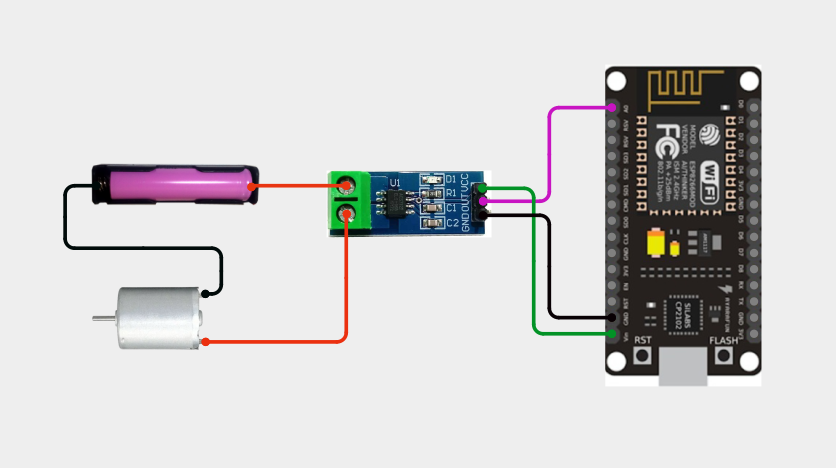
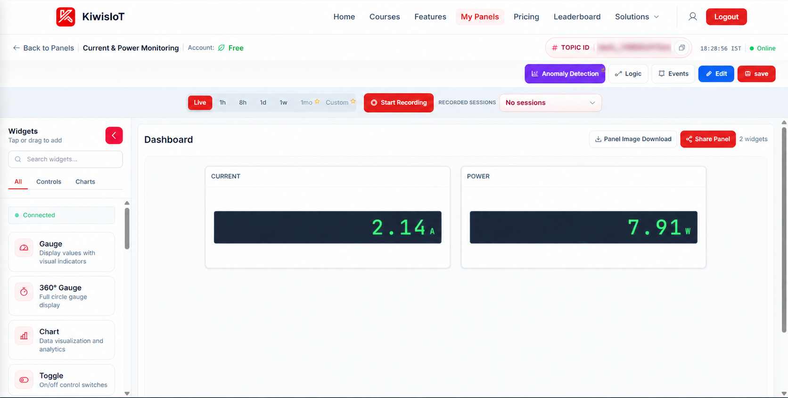
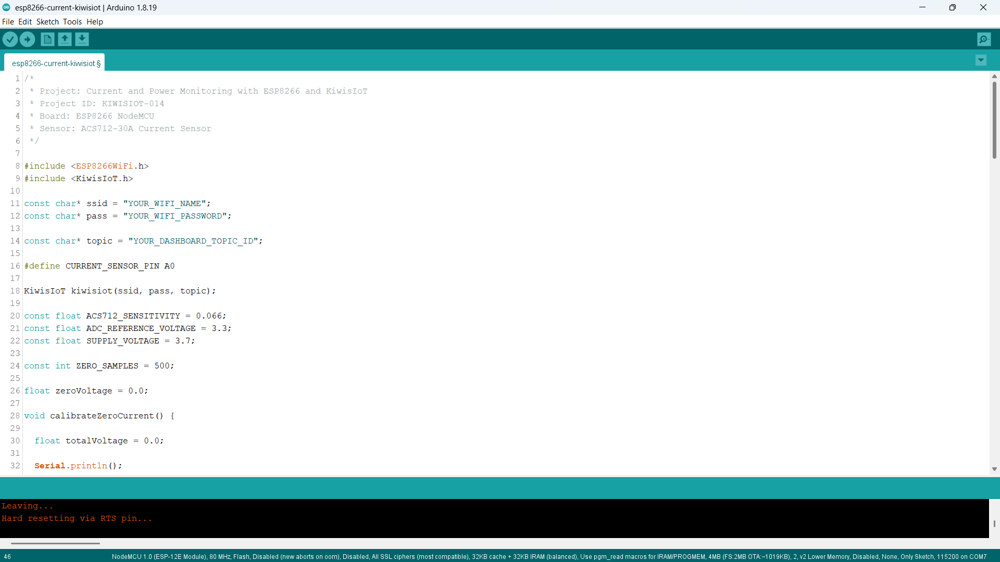
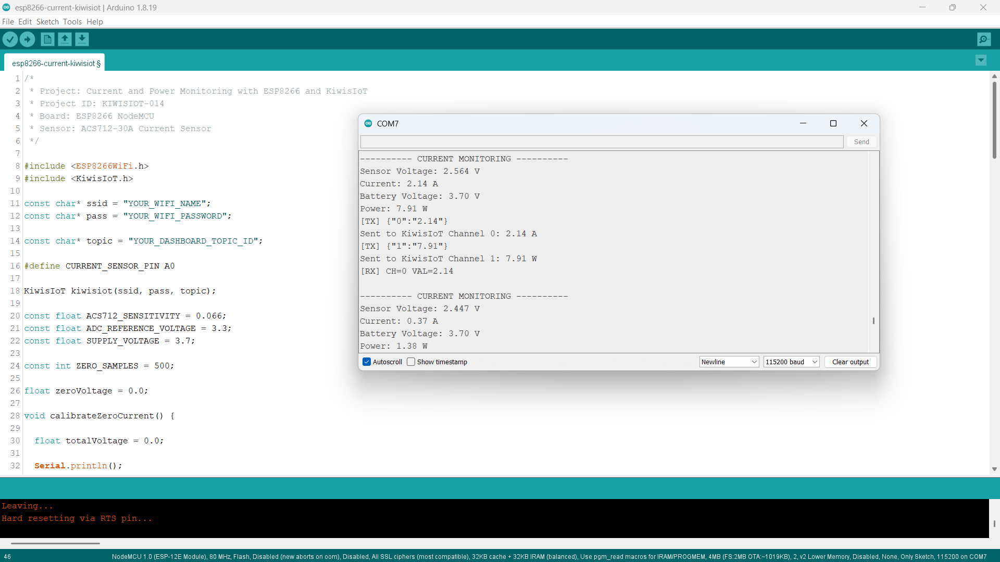

# ESP8266 Current Sensor IoT Project: Monitor Current and Power Usage with KiwisIoT ⚡

Build an **ESP8266 current sensor IoT project** to monitor current and power usage using an **ACS712-30A current sensor, ESP8266 NodeMCU, Arduino, and KiwisIoT**.

In this project, the ESP8266 reads the analog output from the ACS712 current sensor, calibrates the zero-current voltage, calculates the current flowing through the sensor, calculates power consumption using a fixed supply voltage, and sends the current and power values to a KiwisIoT IoT dashboard over Wi-Fi.

The dashboard displays both **current** and **power**, providing a simple example of real-time electrical monitoring with an ESP8266 and IoT platform.

---

## 🚀 Project Highlights

* ESP8266-based current monitoring
* ACS712-30A current sensor
* Zero-current calibration
* Current measurement in amperes
* Power calculation in watts
* Real-time current visualization
* Real-time power visualization
* KiwisIoT IoT dashboard integration
* Wi-Fi-based electrical monitoring
* Arduino IoT project for beginners
* Suitable for student and engineering IoT projects

---

## 🔎 Project Overview

The **ACS712 current sensor** provides an analog voltage that changes according to the current flowing through the sensor.

The ESP8266 reads this analog signal through its A0 input. During startup, the project measures the sensor output with no current flowing and uses the average value as the **zero-current voltage**.

The ESP8266 then calculates the current from the difference between the measured sensor voltage and the calibrated zero-current voltage.

The project also calculates power using the configured supply voltage and measured current.

The project flow is:

```text
ACS712-30A Current Sensor
          ↓
ESP8266 NodeMCU
          ↓
Analog Reading
          ↓
Sensor Voltage
          ↓
Zero-Current Calibration
          ↓
Current Calculation
          ↓
Power Calculation
          ↓
Wi-Fi
          ↓
KiwisIoT
          ↓
IoT Dashboard
```

---

## ⚡ Why This Project?

This project demonstrates how an ESP8266 can be used to collect electrical measurements and send them to an IoT dashboard.

The ESP8266 reads the analog signal from the ACS712 sensor, processes the reading locally, calculates current and power, and sends the results to KiwisIoT.

The project provides a simple foundation for applications such as:

```text
Current Monitoring
       ↓
Power Monitoring
       ↓
IoT Dashboard
       ↓
Remote Electrical Monitoring
```

---

## 📚 What You'll Learn

By building this project, you will learn how to:

* Connect an ACS712 current sensor to an ESP8266
* Read an analog sensor value using `analogRead()`
* Calibrate the ACS712 zero-current voltage
* Convert the sensor voltage into current
* Calculate power from voltage and current
* Send current data from ESP8266 to KiwisIoT
* Send power data from ESP8266 to KiwisIoT
* Use different KiwisIoT channels for different data
* Display electrical measurements on an IoT dashboard
* Monitor current and power remotely over Wi-Fi

---

## 🧰 Components Required

| Component                 | Quantity    |
| ------------------------- | ----------- |
| ESP8266 NodeMCU           | 1           |
| ACS712-30A Current Sensor | 1           |
| Jumper Wires              | As required |
| USB Cable                 | 1           |
| Computer                  | 1           |
| Power Source / Load       | As required |

---

## 💻 Software Requirements

* Arduino IDE
* ESP8266 board package
* KiwisIoT Arduino library
* KiwisIoT account
* Wi-Fi connection

### Common KiwisIoT Setup

Before starting this project, complete the common **KiwisIoT Arduino Setup Guide**.

The setup guide covers:

* Arduino IDE installation
* ESP8266 board installation
* ESP8266 board selection
* KiwisIoT Arduino library installation
* KiwisIoT account setup
* Panel creation
* Topic ID
* Dashboard widgets
* Widget configuration

The common setup guide is available in the parent `esp8266` directory:

[Open the KiwisIoT Arduino Setup Guide](../kiwisiot-arduino-setup/)

---

## 🛠️ Technologies Used

* ESP8266 NodeMCU
* ACS712-30A Current Sensor
* Arduino IDE
* KiwisIoT Arduino Library
* KiwisIoT IoT Dashboard
* Wi-Fi
* C++ / Arduino

---

## 🔌 Circuit Connection

The ACS712 current sensor provides an analog output that is connected to the ESP8266 analog input.

Connect the sensor module as follows:

| ACS712 Sensor | ESP8266 NodeMCU |
| ------------- | --------------- |
| VCC           | 3.3V            |
| GND           | GND             |
| OUT           | A0              |

The current-carrying conductor is passed through the ACS712 sensor terminals according to the sensor module's intended connection.

This project uses the **analog output** of the ACS712 because the objective is to measure the current flowing through the sensor.



> **Safety:** Current measurement involves electrical connections. Use an appropriate low-voltage setup for testing and follow the specifications and safety instructions for the ACS712 module and the circuit being measured.

---

## 🔬 How the ACS712 Current Sensor Works

The **ACS712** is a Hall-effect current sensor that provides an analog voltage corresponding to the current flowing through the sensor.

The ESP8266 reads the sensor output using:

```cpp
int sensorValue = analogRead(CURRENT_SENSOR_PIN);
```

The project converts the ADC reading into sensor voltage using:

```cpp
float sensorVoltage =
  sensorValue * (ADC_REFERENCE_VOLTAGE / 1023.0);
```

The ADC reference voltage used in this project is:

```cpp
const float ADC_REFERENCE_VOLTAGE = 3.3;
```

The ESP8266 analog reading is treated as a 10-bit value:

```text
0 → 1023
```

The actual readings can vary depending on the sensor module, power supply, wiring, load, and measurement conditions.

---

## 🎯 Zero-Current Calibration

The ACS712 output has a zero-current voltage that needs to be measured before calculating current.

When the ESP8266 starts, the project performs a zero-current calibration.

The code takes:

```cpp
const int ZERO_SAMPLES = 500;
```

samples while no current is flowing.

The sensor voltage is calculated for each sample and added to a total:

```cpp
totalVoltage += sensorVoltage;
```

The average voltage is then calculated:

```cpp
zeroVoltage = totalVoltage / ZERO_SAMPLES;
```

The calibration process is:

```text
No Current Flowing
       ↓
Read 500 Samples
       ↓
Calculate Sensor Voltage
       ↓
Calculate Average Voltage
       ↓
Zero-Current Voltage
```

During calibration, the Serial Monitor displays:

```text
Calibrating ACS712 zero current...
Make sure NO current is flowing.
```

After calibration:

```text
Zero Current Voltage: ...
Calibration complete
```

> **Important:** No current should be flowing through the sensor during the zero-current calibration.

---

## 📊 Current Calculation

After calibration, the ESP8266 reads the ACS712 sensor multiple times and calculates an average ADC value.

The project takes:

```cpp
for (int i = 0; i < 20; i++)
```

samples for each current measurement.

The average ADC value is calculated as:

```cpp
float averageADC =
  (float)totalADC / 20.0;
```

The average ADC value is converted into sensor voltage:

```cpp
float sensorVoltage =
  averageADC * (ADC_REFERENCE_VOLTAGE / 1023.0);
```

The current is then calculated using the calibrated zero-current voltage and ACS712 sensitivity:

```cpp
float current =
  (sensorVoltage - zeroVoltage) /
  ACS712_SENSITIVITY;
```

The sensitivity used in this project is:

```cpp
const float ACS712_SENSITIVITY = 0.066;
```

This value corresponds to the sensitivity configured for the ACS712 sensor used in the project.

Small current values are treated as zero using:

```cpp
if (abs(current) < 0.05) {
  current = 0.0;
}
```

This helps prevent very small readings from being displayed as measurable current.

---

## ⚡ Power Calculation

The project calculates power using the configured supply voltage and measured current.

The supply voltage is defined as:

```cpp
const float SUPPLY_VOLTAGE = 3.7;
```

Power is calculated using:

```cpp
float power =
  SUPPLY_VOLTAGE * abs(current);
```

The basic relationship used by the project is:

```text
Power = Voltage × Current
```

Therefore:

```text
P = V × I
```

For this project:

```text
Supply Voltage = 3.7 V
Current        = Measured Current
Power          = 3.7 × Current
```

The calculated power is sent to KiwisIoT in watts.

> **Note:** The power value represents the calculation performed by this project using the configured `SUPPLY_VOLTAGE`. It is not a direct AC power measurement.

---

## ☁️ KiwisIoT Dashboard

The ESP8266 sends two values to KiwisIoT.

| Channel | Data    | Unit | Example |
| ------- | ------- | ---- | ------- |
| `0`     | Current | A    | `0.12`  |
| `1`     | Power   | W    | `0.44`  |

The data flow is:

```text
ESP8266
   │
   ├── Channel 0 → Current
   │                  ↓
   │              KiwisIoT Widget
   │
   └── Channel 1 → Power
                      ↓
                  KiwisIoT Widget
```



---

## ⚙️ Dashboard Configuration

Create a KiwisIoT panel for the project and add the required widgets.

### Current Widget

Use a **Gauge** widget to display the measured current.

Suggested configuration:

```text
Name: Current
Channel ID: 0
Unit: A
```

The widget receives the current value sent by:

```cpp
kiwisiot.send("0", currentData);
```

For example:

```text
Current: 0.12 A
```

### Power Widget

Add another widget to display the calculated power.

Suggested configuration:

```text
Name: Power
Channel ID: 1
Unit: W
```

The widget receives the power value sent by:

```cpp
kiwisiot.send("1", powerData);
```

For example:

```text
Power: 0.44 W
```

> **Note:** The Channel ID configured in the dashboard must match the Channel ID used in the ESP8266 code.

---

## 💻 Arduino Code

The complete Arduino code is available here:

View the Arduino Code

The program uses the ESP8266 Wi-Fi library and the KiwisIoT Arduino library:

```cpp
#include <ESP8266WiFi.h>
#include <KiwisIoT.h>
```



---

## 🔐 Configure Wi-Fi and KiwisIoT

Before uploading the program, update these values:

```cpp
const char* ssid = "YOUR_WIFI_NAME";
const char* pass = "YOUR_WIFI_PASSWORD";

const char* topic = "YOUR_DASHBOARD_TOPIC_ID";
```

Replace:

```text
YOUR_WIFI_NAME
```

with your Wi-Fi network name.

Replace:

```text
YOUR_WIFI_PASSWORD
```

with your Wi-Fi password.

Replace:

```text
YOUR_DASHBOARD_TOPIC_ID
```

with the Topic ID of the KiwisIoT panel created for this project.

For example:

```cpp
const char* topic = "dash_xxxxxxxxxxxxx";
```

> **Security:** Never publish your actual Wi-Fi password or private credentials in a public GitHub repository.

---

## 📝 Complete Arduino Code

```cpp
/*
 * Project: Current and Power Monitoring with ESP8266 and KiwisIoT
 * Project ID: KIWISIOT-014
 * Board: ESP8266 NodeMCU
 * Sensor: ACS712-30A Current Sensor
 */

#include <ESP8266WiFi.h>
#include <KiwisIoT.h>

const char* ssid = "YOUR_WIFI_NAME";
const char* pass = "YOUR_WIFI_PASSWORD";

const char* topic = "YOUR_DASHBOARD_TOPIC_ID";

#define CURRENT_SENSOR_PIN A0

KiwisIoT kiwisiot(ssid, pass, topic);

const float ACS712_SENSITIVITY = 0.066;
const float ADC_REFERENCE_VOLTAGE = 3.3;
const float SUPPLY_VOLTAGE = 3.7;

const int ZERO_SAMPLES = 500;

float zeroVoltage = 0.0;

void calibrateZeroCurrent() {

  float totalVoltage = 0.0;

  Serial.println();
  Serial.println("Calibrating ACS712 zero current...");
  Serial.println("Make sure NO current is flowing.");

  for (int i = 0; i < ZERO_SAMPLES; i++) {

    int sensorValue = analogRead(CURRENT_SENSOR_PIN);

    float sensorVoltage =
      sensorValue * (ADC_REFERENCE_VOLTAGE / 1023.0);

    totalVoltage += sensorVoltage;

    delay(2);
  }

  zeroVoltage = totalVoltage / ZERO_SAMPLES;

  Serial.print("Zero Current Voltage: ");
  Serial.print(zeroVoltage, 3);
  Serial.println(" V");

  Serial.println("Calibration complete");
}

void sendCurrentData() {

  long totalADC = 0;

  for (int i = 0; i < 20; i++) {

    totalADC += analogRead(CURRENT_SENSOR_PIN);

    delay(2);
  }

  float averageADC =
    (float)totalADC / 20.0;

  float sensorVoltage =
    averageADC * (ADC_REFERENCE_VOLTAGE / 1023.0);

  float current =
    (sensorVoltage - zeroVoltage) /
    ACS712_SENSITIVITY;

  if (abs(current) < 0.05) {

    current = 0.0;
  }

  float power =
    SUPPLY_VOLTAGE * abs(current);

  Serial.println();
  Serial.println("---------- CURRENT MONITORING ----------");

  Serial.print("Sensor Voltage: ");
  Serial.print(sensorVoltage, 3);
  Serial.println(" V");

  Serial.print("Current: ");
  Serial.print(abs(current), 2);
  Serial.println(" A");

  Serial.print("Battery Voltage: ");
  Serial.print(SUPPLY_VOLTAGE, 2);
  Serial.println(" V");

  Serial.print("Power: ");
  Serial.print(power, 2);
  Serial.println(" W");

  String currentData =
    String(abs(current), 2);

  kiwisiot.send("0", currentData);

  Serial.print("Sent to KiwisIoT Channel 0: ");
  Serial.print(currentData);
  Serial.println(" A");

  String powerData =
    String(power, 2);

  kiwisiot.send("1", powerData);

  Serial.print("Sent to KiwisIoT Channel 1: ");
  Serial.print(powerData);
  Serial.println(" W");
}

void setup() {

  Serial.begin(115200);

  Serial.println();
  Serial.println("     CURRENT MONITORING     ");

  pinMode(CURRENT_SENSOR_PIN, INPUT);

  Serial.println("ACS712-30A initialized");

  Serial.println("Connecting to KiwisIoT...");

  kiwisiot.begin();

  Serial.println("KiwisIoT initialized");

  calibrateZeroCurrent();

  Serial.println("Starting current monitoring...");
}

void loop() {

  kiwisiot.run();

  static unsigned long lastSend = 0;

  if (millis() - lastSend >= 2000) {

    lastSend = millis();

    sendCurrentData();
  }

  delay(100);
}
```

---

## ⬆️ Upload the Program

After configuring the code:

1. Connect the ESP8266 NodeMCU to your computer.
2. Open `esp8266-current-kiwisiot.ino` in Arduino IDE.
3. Select the appropriate ESP8266 board.
4. Verify the program.
5. Upload the code to the ESP8266.
6. Open the Serial Monitor.
7. Set the baud rate to:

```text
115200
```

When the ESP8266 starts, the ACS712 zero-current calibration is performed first.

After calibration, the ESP8266 begins measuring current and sending the current and power values to KiwisIoT.

---

## 🖥️ Serial Monitor Output

The ESP8266 prints the calibration information, sensor voltage, current, battery voltage, power, and KiwisIoT transmission information to the Serial Monitor.

The calibration starts with:

```text
Calibrating ACS712 zero current...
Make sure NO current is flowing.
```

After calibration, the project displays the monitoring information:

```text
---------- CURRENT MONITORING ----------

Sensor Voltage: ...
Current: ... A
Battery Voltage: 3.70 V
Power: ... W

Sent to KiwisIoT Channel 0: ... A
Sent to KiwisIoT Channel 1: ... W
```

The project sends updated current and power information approximately every two seconds.



---

## 🔄 Understanding the Data Flow

The project processes the sensor data in several stages.

### 1. Read the ACS712 Sensor

```cpp
int sensorValue = analogRead(CURRENT_SENSOR_PIN);
```

### 2. Convert the ADC Reading to Voltage

```cpp
float sensorVoltage =
  averageADC * (ADC_REFERENCE_VOLTAGE / 1023.0);
```

### 3. Calibrate the Zero-Current Voltage

```cpp
zeroVoltage = totalVoltage / ZERO_SAMPLES;
```

### 4. Calculate Current

```cpp
float current =
  (sensorVoltage - zeroVoltage) /
  ACS712_SENSITIVITY;
```

### 5. Calculate Power

```cpp
float power =
  SUPPLY_VOLTAGE * abs(current);
```

### 6. Send Current to KiwisIoT

```cpp
kiwisiot.send("0", currentData);
```

### 7. Send Power to KiwisIoT

```cpp
kiwisiot.send("1", powerData);
```

The complete flow is:

```text
ACS712 Sensor
      ↓
Analog Reading
      ↓
Sensor Voltage
      ↓
Zero-Current Calibration
      ↓
Current Calculation
      ↓
Power Calculation
      ↓
KiwisIoT Channel 0 + Channel 1
      ↓
Dashboard
```

---

## 🧪 Testing the Project

Before testing the current measurement, allow the project to complete its zero-current calibration.

During startup:

```text
Make sure NO current is flowing.
```

After calibration, connect the intended test load and observe the current and power values.

### 🔋 Current Monitoring

The Serial Monitor displays:

```text
Current: ... A
```

The corresponding current value is also sent to:

```text
KiwisIoT Channel 0
```

### ⚡ Power Monitoring

The calculated power is displayed as:

```text
Power: ... W
```

The power value is sent to:

```text
KiwisIoT Channel 1
```

The exact readings depend on the sensor, load, supply voltage, wiring, and test conditions.

> **Note:** The power calculation in this project uses the fixed `SUPPLY_VOLTAGE` value defined in the code.

---

## ❓ Why Use Two Channels?

This project sends current and power as separate values.

For example:

```text
Channel 0 → Current
Channel 1 → Power
```

The current value shows how much current is being measured, while the power value represents the calculated power based on the configured supply voltage.

Using separate channels allows both measurements to be displayed independently on the KiwisIoT dashboard.

---

## 🛠️ Troubleshooting

### Current Reading Is Not Stable

Check:

* ACS712 sensor connections
* VCC connection
* GND connection
* OUT connection to A0
* Sensor wiring
* Load connections
* Power supply
* Zero-current calibration

### Current Shows a Value When No Current Is Flowing

Make sure the zero-current calibration is performed while no current is flowing.

The project averages 500 readings during startup:

```cpp
const int ZERO_SAMPLES = 500;
```

Small current values below the configured threshold are also set to zero:

```cpp
if (abs(current) < 0.05) {
  current = 0.0;
}
```

### Current Reading Appears Incorrect

Check the configured ACS712 sensitivity:

```cpp
const float ACS712_SENSITIVITY = 0.066;
```

Also check:

* Sensor model
* Sensor wiring
* ADC reference voltage
* Power supply
* Load
* Calibration process

### Dashboard Does Not Receive Data

Check:

* Wi-Fi name
* Wi-Fi password
* Internet connection
* KiwisIoT Topic ID
* Channel IDs
* Dashboard widget configuration
* KiwisIoT Arduino library
* ESP8266 connection

### Widget Shows No Data

Make sure the Channel ID in the widget matches the Channel ID used in the code.

For current:

```text
ESP8266 Code
     ↓
Channel 0
     ↓
KiwisIoT
     ↓
Current Widget
     ↓
Channel 0
```

For power:

```text
ESP8266 Code
     ↓
Channel 1
     ↓
KiwisIoT
     ↓
Power Widget
     ↓
Channel 1
```

### Power Reading Is Not Correct

The project calculates power using:

```cpp
float power =
  SUPPLY_VOLTAGE * abs(current);
```

The configured supply voltage is:

```cpp
const float SUPPLY_VOLTAGE = 3.7;
```

If your application uses a different voltage, the value in the code must correspond to the voltage used for the calculation.

---

## 🔒 Security

Never publish sensitive credentials in a public GitHub repository.

Do not commit:

* Wi-Fi passwords
* API keys
* Access tokens
* Account passwords
* Private credentials

Use placeholders such as:

```text
YOUR_WIFI_NAME
YOUR_WIFI_PASSWORD
YOUR_DASHBOARD_TOPIC_ID
```

Enter your actual credentials only in your local Arduino project.

---

## ⚠️ Safety

Current measurement can involve electrical hazards depending on the circuit being tested.

For learning and development, use a suitable **low-voltage setup** and follow the specifications of the ACS712 module and your power source.

Do not work on mains-voltage circuits unless you have the appropriate knowledge, equipment, and safety procedures.

---

## 🌱 Possible Applications

An ESP8266 and ACS712 current monitoring system can be used as a starting point for:

* Current monitoring
* Low-voltage power monitoring
* Battery-powered project monitoring
* Embedded systems projects
* IoT electrical monitoring
* Energy-related student projects
* Engineering IoT projects
* Remote current monitoring

The project can also be extended by adding additional sensors, alerts, automation logic, data logging, and other KiwisIoT dashboard widgets.

---

## 📁 Project Structure

```text
014-current-kiwisiot/
│
├── README.md
│
├── code/
│   └── esp8266-current-kiwisiot.ino
│
└── images/
    ├── circuit.png
    ├── code.png
    ├── serial-monitor.png
    └── dashboard-output.png
```

---

## 🔗 Related KiwisIoT ESP8266 Projects

This project is part of the KiwisIoT ESP8266 IoT project collection.

* [ESP8266 LDR Sensor IoT Project](../001-ldr-kiwisiot/)
* [ESP8266 IR Sensor IoT Project](../002-ir-kiwisiot/)
* [ESP8266 Ultrasonic Sensor IoT Project](../003-ultrasonic-kiwisiot/)
* [ESP8266 DHT11 Temperature & Humidity IoT Project](../004-dht11-kiwisiot/)
* [ESP8266 PIR Motion Sensor IoT Project](../005-pir-kiwisiot/)
* [ESP8266 Gas Sensor IoT Project](../006-gas-kiwisiot/)
* [ESP8266 Flame Sensor IoT Project](../007-flame-kiwisiot/)
* [ESP8266 Soil Moisture IoT Project](../008-soil-moisture-kiwisiot/)
* [ESP8266 Water Level Sensor IoT Project](../009-water-level-kiwisiot/)
* [ESP8266 Raindrop Sensor IoT Project](../010-soil-moisture-kiwisiot/)
* [ESP8266 Sound Sensor IoT Project](../011-rain-sensor-kiwisiot/)
* [ESP8266 MPU6050 IoT Project](../012-mpu6050-kiwisiot/)
* [ESP8266 Voltage Sensor IoT Project](../013-voltage-kiwisiot/)

For Arduino and KiwisIoT setup, see the [KiwisIoT Arduino Setup Guide](../kiwisiot-arduino-setup/).

---

## ❓ Frequently Asked Questions

### What is the ACS712 current sensor?

The ACS712 is a Hall-effect current sensor that provides an analog output related to the current flowing through the sensor.

### Which ACS712 sensor is used in this project?

This project uses an **ACS712-30A current sensor**.

### Which ESP8266 board is used?

This project uses an **ESP8266 NodeMCU** development board.

### Which pin is used for the ACS712 output?

The sensor output is connected to:

```text
A0
```

### Why is zero-current calibration required?

The project uses the sensor output voltage measured with no current flowing as the zero-current reference.

This reference is then used when calculating current.

### How many samples are used for zero-current calibration?

The project uses:

```cpp
const int ZERO_SAMPLES = 500;
```

samples.

### How many samples are used for each current measurement?

The project averages 20 ADC readings for each current measurement.

### Which KiwisIoT channels are used?

```text
Channel 0 → Current
Channel 1 → Power
```

### How is power calculated?

The project uses:

```text
Power = Supply Voltage × Current
```

with the configured supply voltage:

```text
3.7 V
```

### Can the supply voltage be changed?

Yes. The value is defined in the code:

```cpp
const float SUPPLY_VOLTAGE = 3.7;
```

It can be changed according to the voltage used for the project calculation.

### Can the current sensor sensitivity be changed?

Yes. The configured sensitivity is:

```cpp
const float ACS712_SENSITIVITY = 0.066;
```

This value should correspond to the ACS712 sensor variant being used.

### Can this project be extended?

Yes. Additional KiwisIoT widgets, sensors, alerts, data logging, and automation logic can be added to create a larger electrical monitoring system.

---

## 📌 Summary

This project demonstrates an **ESP8266 current and power monitoring IoT system** using an **ACS712-30A current sensor and KiwisIoT**.

The ESP8266 reads the ACS712 analog output, performs zero-current calibration, calculates the measured current, calculates power using the configured supply voltage, and sends the results to a KiwisIoT dashboard over Wi-Fi.

The final dashboard provides:

```text
Current → Measured current in amperes
Power   → Calculated power in watts
```

The project provides a practical example of connecting an electrical sensor to an ESP8266 and visualizing the resulting measurements through an IoT platform.

---

## 📄 License

This project is licensed under the MIT License. See the `LICENSE` file for details.
