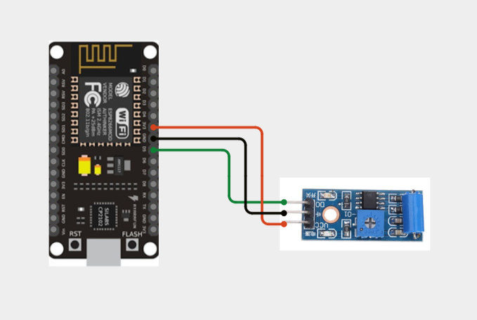
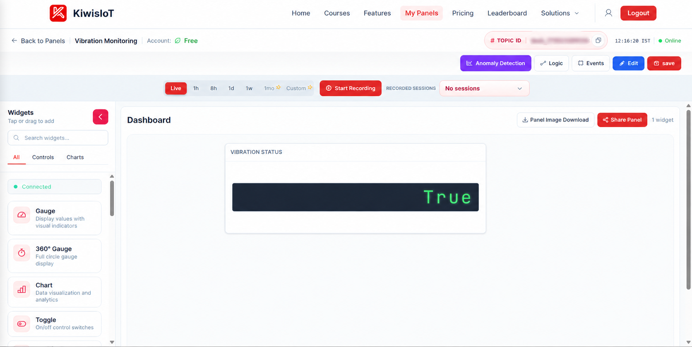
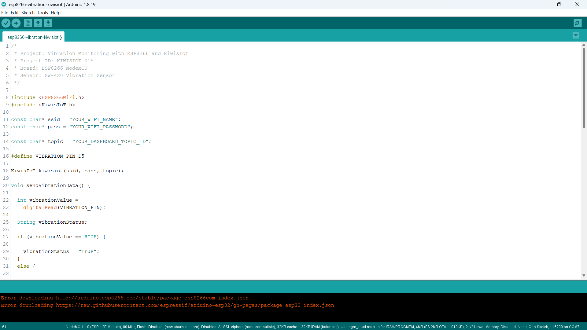
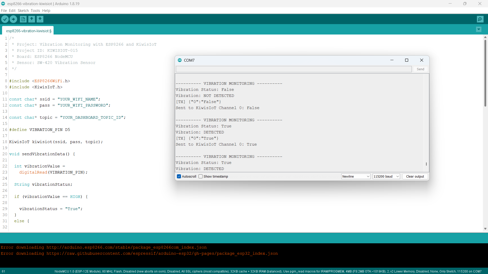

# ESP8266 Vibration Sensor IoT Project: Monitor Machine Vibration with KiwisIoT 📳

Build an **ESP8266 vibration sensor IoT project** to monitor vibration using an **SW-420 vibration sensor, ESP8266 NodeMCU, Arduino, and KiwisIoT**.

In this project, the ESP8266 reads the digital output from the SW-420 vibration sensor, detects whether vibration is present, and classifies the vibration status as **True** or **False**.

The detected vibration status is sent to a KiwisIoT IoT dashboard over Wi-Fi, allowing vibration activity to be monitored remotely.

---

## 🚀 Project Highlights

- ESP8266-based vibration monitoring
- SW-420 vibration sensor
- Digital vibration detection
- Vibration status as True or False
- KiwisIoT IoT dashboard integration
- Wi-Fi-based monitoring
- Serial Monitor status output
- Updates every 2 seconds
- Simple machine vibration monitoring example
- Suitable for student and engineering IoT projects

---

## 🔎 Project Overview

The **SW-420 vibration sensor** detects vibration and provides a digital output signal.

In this project, the sensor's digital output is connected to the **D5 pin** of the ESP8266 NodeMCU.

The ESP8266 reads the sensor using `digitalRead()` and determines whether vibration is detected.

The sensor status is converted into:

```text
True  → Vibration Detected
False → Vibration Not Detected
```

The status is then sent to **KiwisIoT Channel 0** and displayed on the IoT dashboard.

The project flow is:

```text
SW-420 Vibration Sensor
          ↓
ESP8266 NodeMCU
          ↓
Digital Reading
          ↓
Vibration Status
          ↓
Wi-Fi
          ↓
KiwisIoT
          ↓
IoT Dashboard
```

---

## 💡 Why This Project?

Vibration monitoring can be useful for detecting physical movement or vibration in machines, devices, and mechanical systems.

This project demonstrates how a simple digital vibration sensor can be connected to an ESP8266 and integrated with an IoT platform.

Instead of checking the sensor locally, the vibration status can be sent to a KiwisIoT dashboard for remote monitoring.

---

## 📚 What You'll Learn

By building this project, you will learn how to:

- Connect an SW-420 vibration sensor to an ESP8266
- Read a digital sensor using `digitalRead()`
- Detect vibration using a digital HIGH/LOW signal
- Convert the sensor reading into a True/False status
- Send sensor data to KiwisIoT
- Use a KiwisIoT dashboard to display sensor status
- Monitor vibration over Wi-Fi
- Test vibration detection using the Serial Monitor

---

## 🧰 Components Required

| Component | Quantity |
| --------- | -------- |
| ESP8266 NodeMCU | 1 |
| SW-420 Vibration Sensor Module | 1 |
| Jumper Wires | As required |
| USB Cable | 1 |
| Computer | 1 |

---

## 💻 Software Requirements

- Arduino IDE
- ESP8266 board package
- KiwisIoT Arduino library
- KiwisIoT account
- Wi-Fi connection

### Common KiwisIoT Setup

Before starting this project, complete the common **KiwisIoT Arduino Setup Guide**.

The setup guide covers:

- Arduino IDE installation
- ESP8266 board installation
- ESP8266 board selection
- KiwisIoT Arduino library installation
- KiwisIoT account setup
- Panel creation
- Topic ID
- Dashboard widgets
- Widget configuration

The common setup guide is available in the parent `esp8266` directory:

[Open the KiwisIoT Arduino Setup Guide](../kiwisiot-arduino-setup/)

---

## 🛠️ Technologies Used

- ESP8266 NodeMCU
- SW-420 Vibration Sensor
- Arduino IDE
- KiwisIoT Arduino Library
- KiwisIoT IoT Dashboard
- Wi-Fi
- C++ / Arduino

---

## 🔌 Circuit Connection

Connect the SW-420 vibration sensor module to the ESP8266 NodeMCU as follows:

| SW-420 Vibration Sensor | ESP8266 NodeMCU |
| ----------------------- | --------------- |
| VCC | 3.3V |
| GND | GND |
| DO | D5 |

The sensor's **digital output (DO)** is connected to the ESP8266 **D5** pin.



---

## 🔬 How the SW-420 Vibration Sensor Works

The **SW-420 vibration sensor module** detects vibration or physical movement and provides a digital output.

The sensor module includes an adjustable sensitivity control that can be used to change how easily vibration is detected.

The ESP8266 reads the digital output using:

```cpp
int vibrationValue =
  digitalRead(VIBRATION_PIN);
```

The vibration sensor is connected to:

```cpp
#define VIBRATION_PIN D5
```

The ESP8266 checks whether the digital input is `HIGH`:

```cpp
if (vibrationValue == HIGH) {

  vibrationStatus = "True";
}
else {

  vibrationStatus = "False";
}
```

The project interprets the result as:

| Sensor Reading | Status | Meaning |
| -------------- | ------ | ------- |
| `HIGH` | `True` | Vibration detected |
| `LOW` | `False` | Vibration not detected |

The sensor therefore provides a simple digital vibration status rather than a numerical vibration intensity measurement.

---

## 📳 Vibration Detection

The project converts the digital sensor reading into a text-based vibration status.

### Vibration Detected

When the sensor output is `HIGH`:

```text
Vibration Status: True
Vibration: DETECTED
```

The ESP8266 sends:

```text
True
```

to KiwisIoT Channel 0.

### Vibration Not Detected

When the sensor output is `LOW`:

```text
Vibration Status: False
Vibration: NOT DETECTED
```

The ESP8266 sends:

```text
False
```

to KiwisIoT Channel 0.

---

## ☁️ KiwisIoT Dashboard

This project uses **one KiwisIoT channel** to display the vibration status.

| Channel | Data | Value |
| ------- | ---- | ----- |
| `0` | Vibration Status | `True` / `False` |

The data flow is:

```text
SW-420 Sensor
      ↓
ESP8266 D5
      ↓
Vibration Status
      ↓
KiwisIoT Channel 0
      ↓
Vibration Status Widget
```



The dashboard displays the current vibration status. In the tested output, the dashboard shows:

```text
True
```

indicating that vibration was detected.

---

## ⚙️ Dashboard Configuration

Add a widget to your KiwisIoT panel to display the vibration status.

### Vibration Status Widget

Configure the widget to receive data from:

```text
Channel ID: 0
```

Suggested configuration:

```text
Name: Vibration Status
Channel ID: 0
```

The ESP8266 sends the status using:

```cpp
kiwisiot.send("0", vibrationStatus);
```

The dashboard can therefore display:

```text
True
```

when vibration is detected and:

```text
False
```

when vibration is not detected.

> **Note:** The Channel ID configured in the KiwisIoT widget must match the Channel ID used in the ESP8266 code.

---

## 💻 Arduino Code

The complete Arduino code is available here:

[View the Arduino Code](code/esp8266-vibration-kiwisiot.ino)

The project uses the ESP8266 Wi-Fi library and KiwisIoT Arduino library:

```cpp
#include <ESP8266WiFi.h>
#include <KiwisIoT.h>
```



---

## 🔐 Configure Wi-Fi and KiwisIoT

Before uploading the program, update these values:

```cpp
const char* ssid = "YOUR_WIFI_NAME";
const char* pass = "YOUR_WIFI_PASSWORD";

const char* topic = "YOUR_DASHBOARD_TOPIC_ID";
```

Replace:

```text
YOUR_WIFI_NAME
```

with your Wi-Fi network name.

Replace:

```text
YOUR_WIFI_PASSWORD
```

with your Wi-Fi password.

Replace:

```text
YOUR_DASHBOARD_TOPIC_ID
```

with the Topic ID of your KiwisIoT panel.

For example:

```cpp
const char* topic = "YOUR_DASHBOARD_TOPIC_ID";
```

> **Security:** Never publish your actual Wi-Fi password or private credentials in a public GitHub repository.

---

## 📝 Complete Arduino Code

```cpp
/* 
 * Project: Vibration Monitoring with ESP8266 and KiwisIoT 
 * Project ID: KIWISIOT-015 
 * Board: ESP8266 NodeMCU 
 * Sensor: SW-420 Vibration Sensor 
 */ 
 
#include <ESP8266WiFi.h> 
#include <KiwisIoT.h> 
 
const char* ssid = "YOUR_WIFI_NAME"; 
const char* pass = "YOUR_WIFI_PASSWORD"; 
 
const char* topic = "YOUR_DASHBOARD_TOPIC_ID"; 
 
#define VIBRATION_PIN D5 
 
KiwisIoT kiwisiot(ssid, pass, topic); 
 
void sendVibrationData() { 
 
  int vibrationValue = 
    digitalRead(VIBRATION_PIN); 
 
  String vibrationStatus; 
 
  if (vibrationValue == HIGH) { 
 
    vibrationStatus = "True"; 
  } 
  else { 
 
    vibrationStatus = "False"; 
  } 
 
  Serial.println(); 
  Serial.println("---------- VIBRATION MONITORING ----------"); 
 
  Serial.print("Vibration Status: "); 
  Serial.println(vibrationStatus); 
 
  if (vibrationStatus == "True") { 
 
    Serial.println("Vibration: DETECTED"); 
  } 
  else { 
 
    Serial.println("Vibration: NOT DETECTED"); 
  } 
 
  kiwisiot.send("0", vibrationStatus); 
 
  Serial.print("Sent to KiwisIoT Channel 0: "); 
  Serial.println(vibrationStatus); 
} 
 
void setup() { 
 
  Serial.begin(115200); 
 
  Serial.println(); 
  Serial.println("     VIBRATION MONITORING     "); 
 
  pinMode(VIBRATION_PIN, INPUT); 
 
  Serial.println("SW-420 vibration sensor initialized"); 
 
  Serial.println("Connecting to KiwisIoT..."); 
 
  kiwisiot.begin(); 
 
  Serial.println("KiwisIoT initialized"); 
  Serial.println("Starting vibration monitoring..."); 
} 
 
void loop() { 
 
  kiwisiot.run(); 
 
  static unsigned long lastSend = 0; 
 
  if (millis() - lastSend >= 2000) { 
 
    lastSend = millis(); 
 
    sendVibrationData(); 
  } 
 
  delay(100); 
}
```

---

## ⬆️ Upload the Program

After configuring the Wi-Fi and KiwisIoT details:

1. Connect the ESP8266 NodeMCU to your computer.
2. Open `esp8266-vibration-kiwisiot.ino` in Arduino IDE.
3. Select the appropriate ESP8266 NodeMCU board.
4. Verify the program.
5. Upload the program to the ESP8266.
6. Open the Serial Monitor.
7. Set the baud rate to:

```text
115200
```

After startup, the ESP8266 initializes the SW-420 vibration sensor and connects to KiwisIoT.

The ESP8266 then starts monitoring vibration.

---

## 🖥️ Serial Monitor Output

The project uses a baud rate of:

```text
115200
```

When no vibration is detected, the Serial Monitor displays:

```text
---------- VIBRATION MONITORING ----------
Vibration Status: False
Vibration: NOT DETECTED
[TX] {"0":"False"}
Sent to KiwisIoT Channel 0: False
```

When vibration is detected, the output changes to:

```text
---------- VIBRATION MONITORING ----------
Vibration Status: True
Vibration: DETECTED
[TX] {"0":"True"}
Sent to KiwisIoT Channel 0: True
```

The tested Serial Monitor output shows both:

```text
False → Vibration: NOT DETECTED
True  → Vibration: DETECTED
```



---

## 🔄 Understanding the Data Flow

The project processes the vibration signal through several stages.

### 1. Read the Sensor

The ESP8266 reads the digital output from D5:

```cpp
int vibrationValue =
  digitalRead(VIBRATION_PIN);
```

### 2. Determine the Vibration Status

The code checks whether the sensor output is `HIGH`:

```cpp
if (vibrationValue == HIGH) {

  vibrationStatus = "True";
}
else {

  vibrationStatus = "False";
}
```

### 3. Display the Status

The status is printed to the Serial Monitor:

```cpp
Serial.print("Vibration Status: ");
Serial.println(vibrationStatus);
```

### 4. Send the Status to KiwisIoT

The vibration status is sent to Channel 0:

```cpp
kiwisiot.send("0", vibrationStatus);
```

### 5. Display the Status on the Dashboard

KiwisIoT receives the value and displays it on the configured widget.

The complete flow is:

```text
SW-420 Vibration Sensor
          ↓
Digital Output
          ↓
ESP8266 D5
          ↓
True / False
          ↓
KiwisIoT Channel 0
          ↓
Dashboard
```

---

## 🧪 Testing the Project

To test the project:

1. Connect the SW-420 vibration sensor to the ESP8266.
2. Upload the program.
3. Open the Serial Monitor at `115200` baud.
4. Allow the ESP8266 to connect to KiwisIoT.
5. Observe the vibration status.
6. Gently create vibration near the sensor.
7. Check the Serial Monitor.
8. Check the KiwisIoT dashboard.

### Without Vibration

The expected status is:

```text
Vibration Status: False
Vibration: NOT DETECTED
```

### With Vibration

The expected status is:

```text
Vibration Status: True
Vibration: DETECTED
```

The dashboard should update the vibration status accordingly.

> **Note:** The SW-420 module's sensitivity can affect when vibration is detected. The adjustment potentiometer on the module can be used to change the sensor's sensitivity.

---

## ❓ Why Use a Digital Vibration Sensor?

The SW-420 module provides a simple digital output, making it easy to connect to an ESP8266.

Instead of calculating a numerical vibration level, this project focuses on determining whether vibration is detected.

The result is represented as:

```text
True  → Vibration detected
False → Vibration not detected
```

This makes the project useful for basic vibration detection and status monitoring applications.

---

## 🛠️ Troubleshooting

### Vibration Is Not Detected

Check:

- SW-420 sensor connections
- VCC connection
- GND connection
- DO connection
- D5 connection on the ESP8266
- Sensor sensitivity adjustment
- Sensor orientation and physical mounting

### Vibration Is Always Detected

If the sensor continuously reports:

```text
Vibration Status: True
```

check:

- Sensor sensitivity setting
- Loose wiring
- Physical movement of the sensor
- Unwanted vibrations
- Sensor mounting

Try adjusting the potentiometer on the SW-420 module.

### Dashboard Does Not Receive Data

Check:

- Wi-Fi name
- Wi-Fi password
- Internet connection
- KiwisIoT Topic ID
- KiwisIoT Arduino library
- Channel ID
- Dashboard widget configuration

### Dashboard Shows No Vibration Status

Make sure the dashboard widget is configured for:

```text
Channel ID: 0
```

The ESP8266 sends the vibration status using:

```cpp
kiwisiot.send("0", vibrationStatus);
```

Therefore, the widget must also use Channel 0.

### Serial Monitor Shows Incorrect Characters

Make sure the Serial Monitor baud rate is:

```text
115200
```

The code uses:

```cpp
Serial.begin(115200);
```

---

## 🔒 Security

Never publish sensitive credentials in a public GitHub repository.

Do not commit:

- Wi-Fi passwords
- API keys
- Access tokens
- Account passwords
- Private credentials

Use placeholders such as:

```text
YOUR_WIFI_NAME
YOUR_WIFI_PASSWORD
YOUR_DASHBOARD_TOPIC_ID
```

Enter your actual credentials only in your local Arduino project.

---

## 🌱 Possible Applications

An ESP8266 and SW-420 vibration sensor can be used as a starting point for:

- Machine vibration monitoring
- Equipment movement detection
- Motor vibration detection
- Mechanical system monitoring
- Device movement detection
- Basic industrial monitoring
- IoT vibration detection projects
- Student engineering projects
- ESP8266 automation projects

The project can also be extended by adding additional sensors, alerts, event handling, data logging, or other KiwisIoT dashboard features.

---

## 📁 Project Structure

```text
015-vibration-kiwisiot/
│
├── README.md
│
├── code/
│   └── esp8266-vibration-kiwisiot.ino
│
└── images/
    ├── circuit.png
    ├── code.png
    ├── serial-monitor.png
    └── dashboard-output.png
```

---

## 🔗 Related KiwisIoT ESP8266 Projects

This project is part of the KiwisIoT ESP8266 IoT project collection.

- [ESP8266 LDR Sensor IoT Project](../001-ldr-kiwisiot/)
- [ESP8266 IR Sensor IoT Project](../002-ir-kiwisiot/)
- [ESP8266 Ultrasonic Sensor IoT Project](../003-ultrasonic-kiwisiot/)
- [ESP8266 DHT11 Temperature & Humidity IoT Project](../004-dht11-kiwisiot/)
- [ESP8266 PIR Motion Sensor IoT Project](../005-pir-kiwisiot/)
- [ESP8266 Gas Sensor IoT Project](../006-gas-kiwisiot/)
- [ESP8266 Flame Sensor IoT Project](../007-flame-kiwisiot/)
- [ESP8266 Soil Moisture IoT Project](../008-soil-moisture-kiwisiot/)
- [ESP8266 Raindrop Sensor IoT Project](../010-raindrop-kiwisiot/)
- [ESP8266 Sound Sensor IoT Project](../011-sound-kiwisiot/)
- [ESP8266 MPU6050 IoT Project](../012-mpu6050-kiwisiot/)
- [ESP8266 Voltage Sensor IoT Project](../013-voltage-kiwisiot/)
- [ESP8266 Current Sensor IoT Project](../014-current-kiwisiot/)

For Arduino and KiwisIoT setup, see the
[KiwisIoT Arduino Setup Guide](../kiwisiot-arduino-setup/).

---

## ❓ Frequently Asked Questions

### What is the SW-420 vibration sensor?

The SW-420 is a vibration sensor module that provides a digital output when vibration or movement is detected.

### Which ESP8266 board is used?

This project uses an **ESP8266 NodeMCU** development board.

### Which sensor is used in this project?

The project uses an **SW-420 vibration sensor module**.

### Which ESP8266 pin is connected to the vibration sensor?

The sensor's digital output is connected to:

```text
D5
```

The code defines:

```cpp
#define VIBRATION_PIN D5
```

### Is this project measuring vibration intensity?

No. This project performs **digital vibration detection**.

It reports:

```text
True
```

or:

```text
False
```

It does not calculate a numerical vibration intensity or acceleration value.

### Which KiwisIoT channel is used?

The project uses:

```text
Channel 0 → Vibration Status
```

### What data is sent to KiwisIoT?

The ESP8266 sends:

```text
True
```

when vibration is detected and:

```text
False
```

when vibration is not detected.

### How often is the data sent?

The program checks and sends the vibration status approximately every **2 seconds**:

```cpp
if (millis() - lastSend >= 2000)
```

### Can the sensor sensitivity be adjusted?

Yes. The SW-420 module has a sensitivity adjustment potentiometer. It can be adjusted depending on how much vibration should trigger detection.

### Can this project be extended?

Yes. The project can be extended with additional sensors, alerts, event handling, data logging, or other KiwisIoT dashboard widgets.

---

## 📌 Summary

This project demonstrates an **ESP8266 vibration monitoring IoT system** using an **SW-420 vibration sensor and KiwisIoT**.

The ESP8266 reads the sensor's digital output through the D5 pin, determines whether vibration is detected, converts the result into a **True/False status**, and sends the status to KiwisIoT Channel 0 over Wi-Fi.

The final dashboard provides:

```text
True  → Vibration Detected
False → Vibration Not Detected
```

This project provides a simple and practical example of connecting a vibration sensor to an ESP8266 and monitoring its status through an IoT dashboard.

---

## 📄 License

This project is licensed under the MIT License. See the `LICENSE` file for details.
