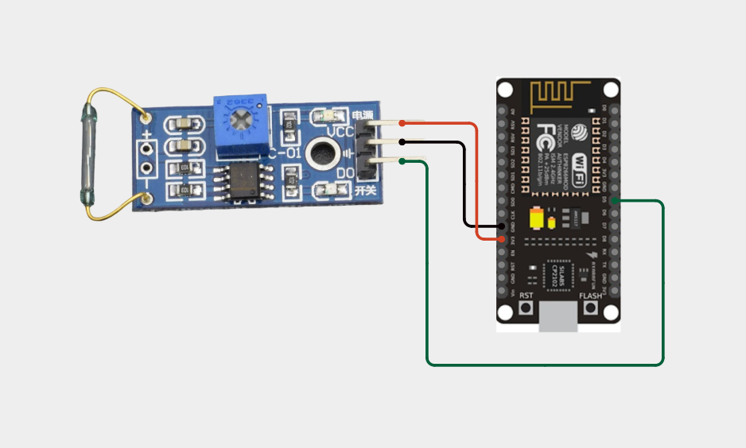
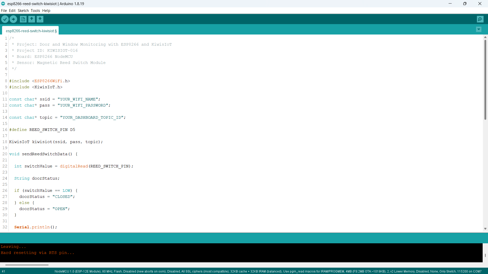
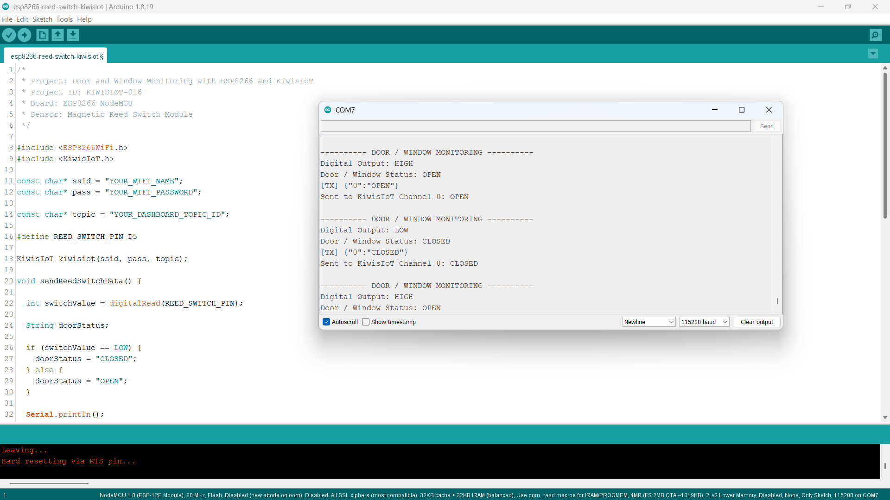

# ESP8266 Reed Switch IoT Project: Monitor Door and Window Status with KiwisIoT 🚪

Build an **ESP8266 reed switch IoT project** to monitor door and window status using a **magnetic reed switch module, ESP8266 NodeMCU, Arduino, and KiwisIoT**.

In this project, the ESP8266 reads the digital output from the magnetic reed switch module, determines whether a door or window is open or closed, and sends the status to a KiwisIoT IoT dashboard over Wi-Fi.

The dashboard displays the current **OPEN or CLOSED status**, providing a simple example of IoT-based door and window monitoring.

---

## 🚀 Project Highlights

* ESP8266-based door and window monitoring
* Magnetic reed switch sensor module
* Digital open/closed status detection
* Door status displayed as `OPEN` or `CLOSED`
* KiwisIoT dashboard integration
* Wi-Fi-based remote monitoring
* Serial Monitor status output
* Automatic status updates approximately every 2 seconds
* Suitable for home automation and student IoT projects

---

## 🔎 Project Overview

A **magnetic reed switch** detects the presence or absence of a magnetic field. It can be used to monitor whether a door or window is open or closed.

In this project, the reed switch module is connected to the **D5 pin** of the ESP8266 NodeMCU.

The ESP8266 reads the module's digital output using `digitalRead()` and converts the reading into a door or window status.

The code interprets the readings as follows:

* `LOW` → `CLOSED`
* `HIGH` → `OPEN`

The resulting status is sent to **KiwisIoT Channel 0** and displayed on the dashboard.

The project flow is:

```text
Magnetic Reed Switch Module
            ↓
      ESP8266 NodeMCU
            ↓
       Digital Reading
            ↓
     OPEN / CLOSED Status
            ↓
           Wi-Fi
            ↓
         KiwisIoT
            ↓
      IoT Dashboard
```

---

## 💡 Why This Project?

Monitoring doors and windows is a common requirement in home automation and security systems.

A reed switch provides a simple way to detect changes in the position of a door or window. By connecting the sensor to an ESP8266, the status can be transmitted to an IoT dashboard instead of being checked only at the sensor.

This project provides a foundation for building connected door monitoring systems and can be extended with notifications, alarms, and additional sensors.

---

## 📚 What You'll Learn

By building this project, you will learn how to:

* Connect a magnetic reed switch module to an ESP8266
* Read digital sensor signals using `digitalRead()`
* Interpret HIGH and LOW digital readings
* Determine door or window status
* Send text-based sensor data to KiwisIoT
* Configure a KiwisIoT dashboard widget
* Monitor sensor status over Wi-Fi
* Test door and window detection using the Serial Monitor

---

## 🧰 Components Required

| Component                   | Quantity    |
| --------------------------- | ----------- |
| ESP8266 NodeMCU             | 1           |
| Magnetic Reed Switch Module | 1           |
| Jumper Wires                | As required |
| USB Cable                   | 1           |
| Computer                    | 1           |

---

## 💻 Software Requirements

* Arduino IDE
* ESP8266 board package
* KiwisIoT Arduino library
* KiwisIoT account
* Wi-Fi connection

### Common KiwisIoT Setup

Before starting this project, complete the common **KiwisIoT Arduino Setup Guide**.

The setup guide covers:

* Arduino IDE installation
* ESP8266 board installation and selection
* KiwisIoT Arduino library installation
* KiwisIoT panel setup
* Topic ID configuration
* Dashboard widget setup and configuration

The common setup guide is available in the parent `esp8266` directory:

[Open the KiwisIoT Arduino Setup Guide](../kiwisiot-arduino-setup/)

---

## 🛠️ Technologies Used

* ESP8266 NodeMCU
* Magnetic Reed Switch Module
* Arduino IDE
* KiwisIoT Arduino Library
* KiwisIoT IoT Dashboard
* Wi-Fi
* C++ / Arduino

---

## 🔌 Circuit Connection

Connect the magnetic reed switch module to the ESP8266 NodeMCU as shown in the circuit diagram.

| Reed Switch Module | ESP8266 NodeMCU |
| ------------------ | --------------- |
| VCC                | 3.3V            |
| GND                | GND             |
| DO                 | D5              |

The module's **digital output (DO)** is connected to the ESP8266 D5 pin.

The magnetic reed switch and its magnet should be positioned so that their relative movement corresponds to the door or window opening and closing.



> **Note:** The table follows the circuit shown for this project. Check your specific module's operating-voltage requirements before powering it from the ESP8266.

---

## 🔬 How the Magnetic Reed Switch Works

A magnetic reed switch contains electrical contacts that change state in response to a magnetic field. In a door or window sensor, a magnet is positioned near the reed switch when the door or window is closed.

When the magnet moves away, the switch changes state. The reed switch module processes this change and provides a digital output.

The ESP8266 reads that output using:

```cpp
int switchValue = digitalRead(REED_SWITCH_PIN);
```

The input pin is defined as:

```cpp
#define REED_SWITCH_PIN D5
```

The code converts the reading into a status:

```cpp
if (switchValue == LOW) {
  doorStatus = "CLOSED";
} else {
  doorStatus = "OPEN";
}
```

According to this project's tested configuration:

| Digital Output | Door / Window Status |
| -------------- | -------------------- |
| `LOW`          | `CLOSED`             |
| `HIGH`         | `OPEN`               |

The exact electrical behavior depends on the module's circuitry and wiring. The table above describes the interpretation used by this project's code.

---

## 🚪 Door and Window Status Detection

The ESP8266 converts the digital reading into a text status that can be displayed on the Serial Monitor and KiwisIoT dashboard.

### Door or Window Closed

When the digital output is `LOW`, the code assigns:

```cpp
doorStatus = "CLOSED";
```

The Serial Monitor displays:

```text
Digital Output: LOW
Door / Window Status: CLOSED
```

The ESP8266 sends `CLOSED` to KiwisIoT Channel 0.

### Door or Window Open

When the digital output is `HIGH`, the code assigns:

```cpp
doorStatus = "OPEN";
```

The Serial Monitor displays:

```text
Digital Output: HIGH
Door / Window Status: OPEN
```

The ESP8266 sends `OPEN` to KiwisIoT Channel 0.

This approach provides a simple digital status rather than measuring the physical distance between the door and its frame.

---

## ☁️ KiwisIoT Dashboard

This project uses **one KiwisIoT channel** to display the door or window status.

| Channel | Data                 | Possible Values  |
| ------- | -------------------- | ---------------- |
| `0`     | Door / Window Status | `OPEN`, `CLOSED` |

The data flow is:

```text
Reed Switch Module
        ↓
    ESP8266 D5
        ↓
  OPEN / CLOSED
        ↓
 KiwisIoT Channel 0
        ↓
 Door Status Widget
```


The dashboard displays the current status received from the ESP8266. In the supplied dashboard screenshot, the widget displays `CLOSED`.

---

## ⚙️ Dashboard Configuration

Create a KiwisIoT panel and add a widget to display the door or window status.

### Door Status Widget

Configure the widget to receive data from Channel 0.

Suggested configuration:

```text
Name: Door Status
Channel ID: 0
```

The ESP8266 sends the status using:

```cpp
kiwisiot.send("0", doorStatus);
```

The widget can display:

```text
OPEN
```

or:

```text
CLOSED
```

For a window monitoring application, the widget name can be changed to `Window Status`.

> **Note:** The channel configured in the dashboard must match the channel used in the Arduino code.

---

## 💻 Arduino Code

The complete Arduino program is available here:

[View the Arduino Code](code/esp8266-reed-switch-kiwisiot.ino)

The project uses the ESP8266 Wi-Fi library and KiwisIoT Arduino library:

```cpp
#include <ESP8266WiFi.h>
#include <KiwisIoT.h>
```



---

## 🔐 Configure Wi-Fi and KiwisIoT

Before uploading the program, update these values in the Arduino code:

```cpp
const char* ssid = "YOUR_WIFI_NAME";
const char* pass = "YOUR_WIFI_PASSWORD";

const char* topic = "YOUR_DASHBOARD_TOPIC_ID";
```

Replace `YOUR_WIFI_NAME` with your Wi-Fi network name.

Replace `YOUR_WIFI_PASSWORD` with your Wi-Fi password.

Replace `YOUR_DASHBOARD_TOPIC_ID` with the Topic ID of your KiwisIoT panel.

Make sure the Topic ID corresponds to the panel where you configured the door status widget.

> **Security:** Never publish your actual Wi-Fi password or private credentials in a public GitHub repository.

---

## 📝 Complete Arduino Code

```cpp
/*
 * Project: Door and Window Monitoring with ESP8266 and KiwisIoT
 * Project ID: KIWISIOT-016
 * Board: ESP8266 NodeMCU
 * Sensor: Magnetic Reed Switch Module
 */

#include <ESP8266WiFi.h>
#include <KiwisIoT.h>

const char* ssid = "YOUR_WIFI_NAME";
const char* pass = "YOUR_WIFI_PASSWORD";

const char* topic = "YOUR_DASHBOARD_TOPIC_ID";

#define REED_SWITCH_PIN D5

KiwisIoT kiwisiot(ssid, pass, topic);

void sendReedSwitchData() {

  int switchValue = digitalRead(REED_SWITCH_PIN);

  String doorStatus;

  if (switchValue == LOW) {
    doorStatus = "CLOSED";
  } else {
    doorStatus = "OPEN";
  }

  Serial.println();
  Serial.println("---------- DOOR / WINDOW MONITORING ----------");

  Serial.print("Digital Output: ");
  Serial.println(switchValue == HIGH ? "HIGH" : "LOW");

  Serial.print("Door / Window Status: ");
  Serial.println(doorStatus);

  kiwisiot.send("0", doorStatus);

  Serial.print("Sent to KiwisIoT Channel 0: ");
  Serial.println(doorStatus);
}

void setup() {
  Serial.begin(115200);

  Serial.println();
  Serial.println("===== REED SWITCH MONITORING =====");

  pinMode(REED_SWITCH_PIN, INPUT);

  Serial.println("Reed switch module initialized");
  Serial.println("Connecting to KiwisIoT...");

  kiwisiot.begin();

  Serial.println("KiwisIoT initialized");
  Serial.println("Starting door / window monitoring...");
}

void loop() {
  kiwisiot.run();

  static unsigned long lastSend = 0;

  if (millis() - lastSend >= 2000) {
    lastSend = millis();
    sendReedSwitchData();
  }

  delay(100);
}
```

---

## ⬆️ Upload the Program

Follow these steps to upload the program:

1. Connect the ESP8266 NodeMCU to your computer using a USB cable.
2. Open `esp8266-reed-switch-kiwisiot.ino` in Arduino IDE.
3. Select the appropriate ESP8266 NodeMCU board.
4. Verify the code.
5. Upload the program.
6. Open the Serial Monitor.
7. Set the baud rate to `115200`.

After startup, the ESP8266 initializes the reed switch input and calls `kiwisiot.begin()`.

The program then reads the sensor status and sends updates to KiwisIoT approximately every two seconds.

---

## 🖥️ Serial Monitor Output

The Serial Monitor displays the digital output, interpreted door or window status, and the value sent to KiwisIoT.

### When the Door or Window Is Open

```text
---------- DOOR / WINDOW MONITORING ----------
Digital Output: HIGH
Door / Window Status: OPEN
[TX] {"0":"OPEN"}
Sent to KiwisIoT Channel 0: OPEN
```

### When the Door or Window Is Closed

```text
---------- DOOR / WINDOW MONITORING ----------
Digital Output: LOW
Door / Window Status: CLOSED
[TX] {"0":"CLOSED"}
Sent to KiwisIoT Channel 0: CLOSED
```

These examples follow the output shown in the supplied Serial Monitor screenshot.



---

## 🔄 Understanding the Data Flow

The project processes the reed switch signal in several stages.

### 1. Read the Digital Input

The ESP8266 reads the digital output from D5:

```cpp
int switchValue = digitalRead(REED_SWITCH_PIN);
```

### 2. Determine the Door Status

The program interprets `LOW` as closed and `HIGH` as open:

```cpp
if (switchValue == LOW) {
  doorStatus = "CLOSED";
} else {
  doorStatus = "OPEN";
}
```

### 3. Print the Status

The interpreted status is displayed in the Serial Monitor:

```cpp
Serial.print("Door / Window Status: ");
Serial.println(doorStatus);
```

### 4. Send the Status to KiwisIoT

The status is sent through Channel 0:

```cpp
kiwisiot.send("0", doorStatus);
```

### 5. Display the Result

KiwisIoT receives the status and displays it on the configured dashboard widget.

The complete data flow is:

```text
Magnetic Reed Switch
          ↓
     Digital Output
          ↓
      ESP8266 D5
          ↓
    OPEN / CLOSED
          ↓
   KiwisIoT Channel 0
          ↓
      Dashboard
```

---

## 🧪 Testing the Project

To test the project:

1. Connect the reed switch module to the ESP8266.
2. Upload the Arduino program.
3. Open the Serial Monitor at `115200` baud.
4. Confirm that the ESP8266 initializes and connects to KiwisIoT.
5. Position the magnet near the reed switch to represent the closed position.
6. Move the magnet away to represent the open position.
7. Observe the Serial Monitor.
8. Verify that the KiwisIoT dashboard displays the updated status.

### Test 1: Door or Window Closed

Expected output:

```text
Digital Output: LOW
Door / Window Status: CLOSED
```

### Test 2: Door or Window Open

Expected output:

```text
Digital Output: HIGH
Door / Window Status: OPEN
```

The dashboard should reflect the status sent by the ESP8266.

> **Note:** Position the magnet according to your particular reed switch module. The sensor's mounting position and module circuitry determine how the digital output changes.

---

## ❓ Why Use a Reed Switch for Door Monitoring?

A reed switch is a simple way to detect whether a magnetic contact is near or away from the switch.

When used with a door or window, the switch and magnet can be mounted on opposite parts of the frame and moving section.

Combined with an ESP8266 and KiwisIoT, this provides a basic way to monitor the contact status remotely.

The project uses a single digital channel because the output represents one status:

```text
Channel 0 → OPEN / CLOSED
```

---

## 🛠️ Troubleshooting

### Door Status Does Not Change

Check:

* VCC, GND, and DO connections
* The connection between DO and D5
* The position of the magnet
* The reed switch module's sensitivity or adjustment, if applicable
* The module's digital output
* Loose jumper wires

### Status Is Reversed

If the Serial Monitor shows `OPEN` when the door is closed, or `CLOSED` when the door is open, check the module's output behavior and wiring.

The current code uses:

```cpp
if (switchValue == LOW) {
  doorStatus = "CLOSED";
} else {
  doorStatus = "OPEN";
}
```

If your module produces the opposite signal, adjust the interpretation to match the actual sensor readings.

### Dashboard Does Not Receive Data

Check:

* Wi-Fi name and password
* Internet connection
* KiwisIoT Topic ID
* KiwisIoT Arduino library
* Dashboard widget configuration
* Channel ID

### Dashboard Shows No Door Status

Confirm that the widget is configured for Channel 0.

The code sends the status using:

```cpp
kiwisiot.send("0", doorStatus);
```

### Serial Monitor Shows Incorrect Characters

Make sure the Serial Monitor baud rate is `115200`, matching:

```cpp
Serial.begin(115200);
```

---

## 🔒 Security

Never publish sensitive credentials in a public GitHub repository.

Do not commit:

* Wi-Fi passwords
* API keys
* Access tokens
* Account passwords
* Private credentials

Use placeholders in the public example:

```text
YOUR_WIFI_NAME
YOUR_WIFI_PASSWORD
YOUR_DASHBOARD_TOPIC_ID
```

Enter your actual credentials only in your local Arduino project.

---

## 🌱 Possible Applications

An ESP8266 reed switch monitoring system can be used as a starting point for:

* Door status monitoring
* Window status monitoring
* Home automation projects
* Cabinet and storage door monitoring
* Equipment enclosure monitoring
* Entry-point status monitoring
* Basic IoT security projects
* Student and engineering IoT projects

The project can be extended with additional sensors, notification logic, alarms, event recording, or other KiwisIoT dashboard features.

> **Note:** This project reports the contact status. It does not independently verify unauthorized entry or provide a complete security system.

---

## 📁 Project Structure

```text
016-reed-switch-kiwisiot/
│
├── README.md
│
├── code/
│   └── esp8266-reed-switch-kiwisiot.ino
│
└── images/
    ├── circuit.png
    ├── code.png
    ├── serial-monitor.png
    └── dashboard-output.png
```

---

## 🔗 Related KiwisIoT ESP8266 Projects

This project is part of the KiwisIoT ESP8266 IoT project collection.

* [ESP8266 LDR Sensor IoT Project](../001-ldr-kiwisiot/)
* [ESP8266 IR Sensor IoT Project](../002-ir-kiwisiot/)
* [ESP8266 Ultrasonic Sensor IoT Project](../003-ultrasonic-kiwisiot/)
* [ESP8266 DHT11 Temperature and Humidity IoT Project](../004-dht11-kiwisiot/)
* [ESP8266 PIR Motion Sensor IoT Project](../005-pir-kiwisiot/)
* [ESP8266 Gas Sensor IoT Project](../006-gas-kiwisiot/)
* [ESP8266 Flame Sensor IoT Project](../007-flame-kiwisiot/)
* [ESP8266 Soil Moisture IoT Project](../008-soil-moisture-kiwisiot/)
* [ESP8266 Raindrop Sensor IoT Project](../010-raindrop-kiwisiot/)
* [ESP8266 Sound Sensor IoT Project](../011-sound-kiwisiot/)
* [ESP8266 MPU6050 IoT Project](../012-mpu6050-kiwisiot/)
* [ESP8266 Voltage Sensor IoT Project](../013-voltage-kiwisiot/)
* [ESP8266 Current Sensor IoT Project](../014-current-kiwisiot/)
* [ESP8266 Vibration Sensor IoT Project](../015-vibration-kiwisiot/)

For Arduino and KiwisIoT setup, see the [KiwisIoT Arduino Setup Guide](../kiwisiot-arduino-setup/).

---

## ❓ Frequently Asked Questions

### What is a magnetic reed switch?

A magnetic reed switch is a switch that changes its electrical contact state in response to a magnetic field. It is commonly used for contact detection.

### Which ESP8266 board is used?

This project uses the ESP8266 NodeMCU development board.

### Which sensor is used?

The project uses a magnetic reed switch module with a digital output.

### Which ESP8266 pin is connected to the sensor?

The module's digital output is connected to D5:

```cpp
#define REED_SWITCH_PIN D5
```

### How does the project determine whether the door is open or closed?

The code interprets the digital readings as follows:

```text
LOW  → CLOSED
HIGH → OPEN
```

### Which KiwisIoT channel is used?

The project uses Channel 0 to send the door or window status.

### How often is the status sent?

The program sends the status approximately every two seconds.

### Can this project monitor windows as well as doors?

Yes. The same contact-monitoring approach can be used for doors, windows, cabinets, and other suitable moving panels.

### Can the project be extended?

Yes. You can add alerts, additional contact sensors, event logging, or other KiwisIoT dashboard features.

---

## 📌 Summary

This project demonstrates an **ESP8266 door and window monitoring IoT system** using a magnetic reed switch module and KiwisIoT.

The ESP8266 reads the digital signal through D5, interprets the input as `OPEN` or `CLOSED`, and sends the status to KiwisIoT Channel 0 over Wi-Fi.

The final dashboard displays:

```text
OPEN   → Door / Window Open
CLOSED → Door / Window Closed
```

This project provides a practical introduction to contact sensing, digital inputs, and IoT-based status monitoring.

---

## 📄 License

This project is licensed under the MIT License. See the `LICENSE` file for details.
