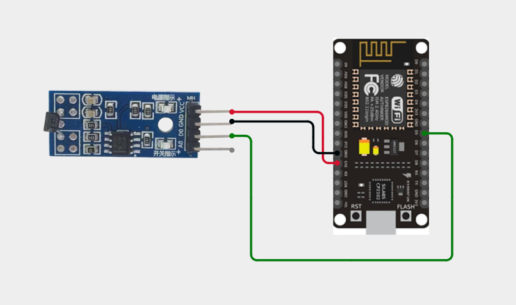
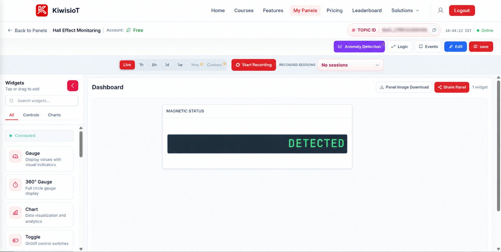
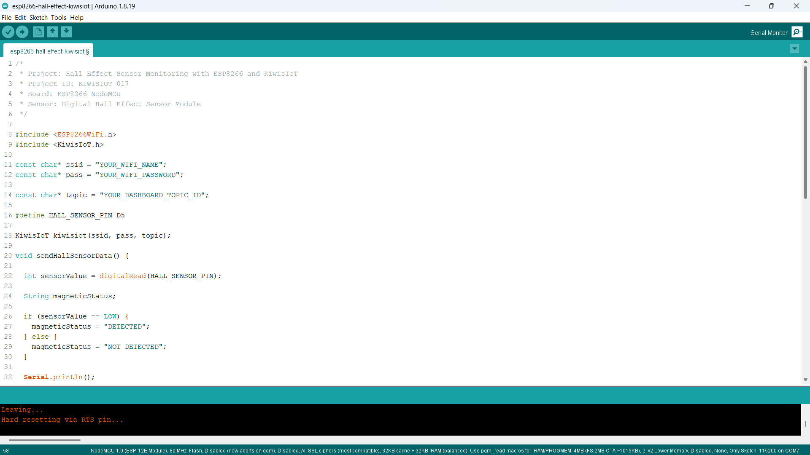
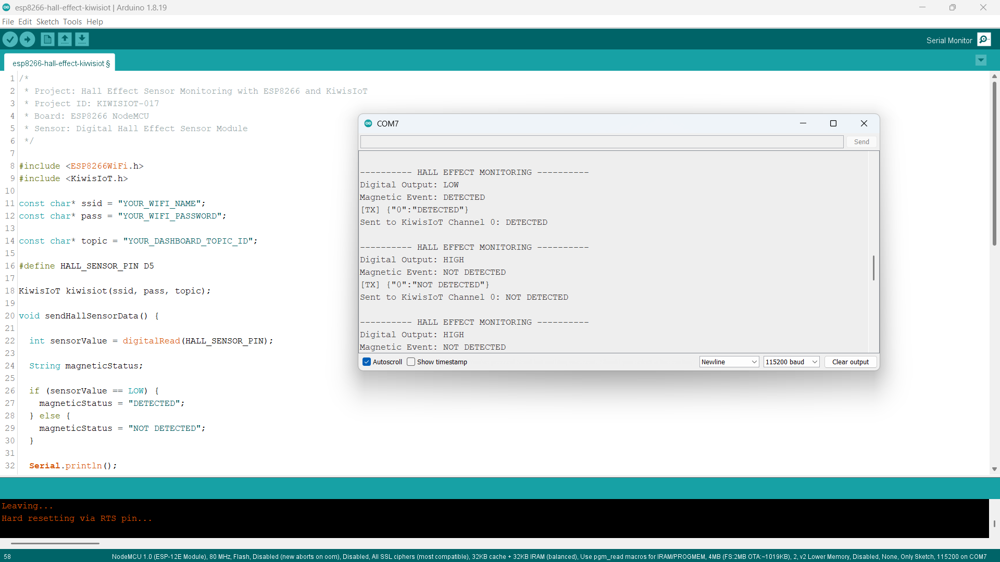

# ESP8266 Hall Effect Sensor IoT Project: Monitor Magnetic Events with KiwisIoT 🧲

Build an **ESP8266 Hall Effect sensor IoT project** to detect magnetic events using a **digital Hall Effect sensor module, ESP8266 NodeMCU, Arduino, and KiwisIoT**.

In this project, the ESP8266 reads the digital output from the Hall Effect sensor module, determines whether a magnetic event is detected, and sends the status to a KiwisIoT IoT dashboard over Wi-Fi.

The dashboard displays the magnetic status as **DETECTED or NOT DETECTED**, providing a simple example of digital magnetic sensing and IoT-based event monitoring.

---

## 🚀 Project Highlights

* ESP8266-based magnetic event monitoring
* Digital Hall Effect sensor module
* Digital signal reading using `digitalRead()`
* Magnetic status detection using HIGH and LOW signals
* `DETECTED` and `NOT DETECTED` status messages
* KiwisIoT IoT dashboard integration
* Wi-Fi-based remote monitoring
* Serial Monitor output for sensor testing
* Automatic status updates approximately every 2 seconds
* Suitable for electronics, embedded systems, and student IoT projects

---

## 🔎 Project Overview

A **Hall Effect sensor** detects a magnetic field and converts it into an electrical signal. Digital Hall Effect sensor modules provide a HIGH or LOW output depending on the detected magnetic field and the module's configuration.

In this project, a digital Hall Effect sensor module is connected to the **D5 pin** of the ESP8266 NodeMCU.

The ESP8266 reads the digital output using `digitalRead()` and interprets the result as a magnetic event status.

The code uses the following logic:

* `LOW` → `DETECTED`
* `HIGH` → `NOT DETECTED`

The resulting status is sent to **KiwisIoT Channel 0** and displayed on the dashboard.

The project flow is:

```text
Digital Hall Effect Sensor
            ↓
      ESP8266 NodeMCU
            ↓
       Digital Reading
            ↓
    Magnetic Event Status
            ↓
           Wi-Fi
            ↓
         KiwisIoT
            ↓
      IoT Dashboard
```

---

## 💡 Why This Project?

Magnetic sensing is useful in applications where a system needs to detect the presence or movement of a magnet.

By connecting a digital Hall Effect sensor to an ESP8266, the detected status can be transmitted to an IoT dashboard instead of being monitored only locally.

This project demonstrates how a digital sensor can be integrated with an IoT platform for remote status monitoring.

It provides a foundation for applications such as:

* Magnetic field presence detection
* Magnet position detection
* Contactless event monitoring
* Rotational or movement detection with suitable sensor arrangements
* Embedded systems projects
* IoT-based magnetic monitoring

---

## 📚 What You'll Learn

By building this project, you will learn how to:

* Connect a digital Hall Effect sensor module to an ESP8266
* Read digital sensor output using `digitalRead()`
* Interpret HIGH and LOW digital signals
* Convert a sensor reading into a magnetic event status
* Send text-based sensor data to KiwisIoT
* Configure a KiwisIoT dashboard widget
* Monitor magnetic events over Wi-Fi
* Test the sensor using the Arduino Serial Monitor

---

## 🧰 Components Required

| Component                         |    Quantity |
| --------------------------------- | ----------: |
| ESP8266 NodeMCU                   |           1 |
| Digital Hall Effect Sensor Module |           1 |
| Jumper Wires                      | As required |
| USB Cable                         |           1 |
| Computer                          |           1 |
| Magnet                            |           1 |

---

## 💻 Software Requirements

* Arduino IDE
* ESP8266 board package
* KiwisIoT Arduino library
* KiwisIoT account
* Wi-Fi connection

### Common KiwisIoT Setup

Before starting this project, complete the common **KiwisIoT Arduino Setup Guide**.

The setup guide covers:

* Arduino IDE installation
* ESP8266 board installation and selection
* KiwisIoT Arduino library installation
* KiwisIoT panel setup
* Topic ID configuration
* Dashboard widget setup and configuration

The common setup guide is available in the parent `esp8266` directory:

[Open the KiwisIoT Arduino Setup Guide](../kiwisiot-arduino-setup/)

---

## 🛠️ Technologies Used

* ESP8266 NodeMCU
* Digital Hall Effect Sensor Module
* Arduino IDE
* KiwisIoT Arduino Library
* KiwisIoT IoT Dashboard
* Wi-Fi
* C++ / Arduino

---

## 🔌 Circuit Connection

Connect the digital Hall Effect sensor module to the ESP8266 NodeMCU as shown in the circuit diagram.

| Hall Effect Sensor Module | ESP8266 NodeMCU |
| ------------------------- | --------------- |
| VCC                       | 3.3V            |
| GND                       | GND             |
| DO / Digital Output       | D5              |

The sensor module's digital output is connected to the ESP8266 D5 pin.

The ESP8266 reads the signal from this pin to determine whether the sensor reports a magnetic event.



> **Note:** Follow the pin labels on your particular Hall Effect sensor module. The connections above match the supplied circuit. Confirm your module's operating-voltage requirements before powering it.

---

## 🔬 How the Hall Effect Sensor Works

The Hall Effect is a physical effect in which a magnetic field influences the electrical behavior of a conducting or semiconductor material.

A Hall Effect sensor uses this principle to detect magnetic fields. A digital Hall Effect sensor module converts the sensor response into a digital output.

In this project, the ESP8266 reads the digital output using:

```cpp
int sensorValue = digitalRead(HALL_SENSOR_PIN);
```

The sensor pin is defined as:

```cpp
#define HALL_SENSOR_PIN D5
```

The program interprets the reading as follows:

```cpp
if (sensorValue == LOW) {
  magneticStatus = "DETECTED";
} else {
  magneticStatus = "NOT DETECTED";
}
```

According to the logic used by this project:

| Digital Output | Magnetic Status |
| -------------- | --------------- |
| `LOW`          | `DETECTED`      |
| `HIGH`         | `NOT DETECTED`  |

The exact response depends on the Hall Effect sensor module and its output circuitry. The table above describes the interpretation used by this project's code and observed output.

---

## 🧲 Magnetic Event Detection

The ESP8266 converts the sensor's digital output into a readable magnetic status.

### Magnetic Event Detected

When the sensor output is `LOW`, the program assigns:

```cpp
magneticStatus = "DETECTED";
```

The Serial Monitor displays:

```text
Digital Output: LOW
Magnetic Event: DETECTED
```

The ESP8266 sends `DETECTED` to KiwisIoT Channel 0.

### Magnetic Event Not Detected

When the sensor output is `HIGH`, the program assigns:

```cpp
magneticStatus = "NOT DETECTED";
```

The Serial Monitor displays:

```text
Digital Output: HIGH
Magnetic Event: NOT DETECTED
```

The ESP8266 sends `NOT DETECTED` to KiwisIoT Channel 0.

This approach reports the sensor's digital status. It does not measure magnetic field strength or the distance between the magnet and sensor.

---

## ☁️ KiwisIoT Dashboard

This project uses **one KiwisIoT channel** to display the magnetic event status.

| Channel | Data            | Possible Values            |
| ------- | --------------- | -------------------------- |
| `0`     | Magnetic Status | `DETECTED`, `NOT DETECTED` |

The data flow is:

```text
Hall Effect Sensor
        ↓
    ESP8266 D5
        ↓
 Magnetic Event Status
        ↓
 KiwisIoT Channel 0
        ↓
 Magnetic Status Widget
```



The dashboard widget displays the magnetic status received from the ESP8266. In the supplied screenshot, the widget displays `DETECTED`.

---

## ⚙️ Dashboard Configuration

Create a KiwisIoT panel and add a widget to display the magnetic status.

### Magnetic Status Widget

Configure the widget to receive data from Channel 0.

Suggested configuration:

```text
Name: Magnetic Status
Channel ID: 0
```

The ESP8266 sends the status using:

```cpp
kiwisiot.send("0", magneticStatus);
```

The widget can display:

```text
DETECTED
```

or:

```text
NOT DETECTED
```

> **Note:** The channel configured in the dashboard must match the channel used in the Arduino code.

---

## 💻 Arduino Code

The complete Arduino program is available in the project `code` directory.

The program uses the ESP8266 Wi-Fi library and KiwisIoT Arduino library:

```cpp
#include <ESP8266WiFi.h>
#include <KiwisIoT.h>
```



---

## 🔐 Configure Wi-Fi and KiwisIoT

Before uploading the program, update these values in the Arduino code:

```cpp
const char* ssid = "YOUR_WIFI_NAME";
const char* pass = "YOUR_WIFI_PASSWORD";

const char* topic = "YOUR_DASHBOARD_TOPIC_ID";
```

Replace `YOUR_WIFI_NAME` with your Wi-Fi network name.

Replace `YOUR_WIFI_PASSWORD` with your Wi-Fi password.

Replace `YOUR_DASHBOARD_TOPIC_ID` with the Topic ID of your KiwisIoT panel.

Make sure the Topic ID corresponds to the panel where you configured the magnetic status widget.

> **Security:** Never publish your actual Wi-Fi password or private credentials in a public GitHub repository.

---

## 📝 Complete Arduino Code

```cpp
/*
 * Project: Hall Effect Sensor Monitoring with ESP8266 and KiwisIoT
 * Project ID: KIWISIOT-017
 * Board: ESP8266 NodeMCU
 * Sensor: Digital Hall Effect Sensor Module
 */

#include <ESP8266WiFi.h>
#include <KiwisIoT.h>

const char* ssid = "YOUR_WIFI_NAME";
const char* pass = "YOUR_WIFI_PASSWORD";

const char* topic = "YOUR_DASHBOARD_TOPIC_ID";

#define HALL_SENSOR_PIN D5

KiwisIoT kiwisiot(ssid, pass, topic);

void sendHallSensorData() {

  int sensorValue = digitalRead(HALL_SENSOR_PIN);

  String magneticStatus;

  if (sensorValue == LOW) {
    magneticStatus = "DETECTED";
  } else {
    magneticStatus = "NOT DETECTED";
  }

  Serial.println();
  Serial.println("---------- HALL EFFECT MONITORING ----------");

  Serial.print("Digital Output: ");
  Serial.println(sensorValue == HIGH ? "HIGH" : "LOW");

  Serial.print("Magnetic Event: ");
  Serial.println(magneticStatus);

  kiwisiot.send("0", magneticStatus);

  Serial.print("Sent to KiwisIoT Channel 0: ");
  Serial.println(magneticStatus);
}

void setup() {
  Serial.begin(115200);

  Serial.println();
  Serial.println("===== HALL EFFECT SENSOR =====");

  pinMode(HALL_SENSOR_PIN, INPUT);

  Serial.println("Hall sensor initialized");
  Serial.println("Connecting to KiwisIoT...");

  kiwisiot.begin();

  Serial.println("KiwisIoT initialized");
  Serial.println("Starting magnetic event monitoring...");
}

void loop() {
  kiwisiot.run();

  static unsigned long lastSend = 0;

  if (millis() - lastSend >= 2000) {
    lastSend = millis();
    sendHallSensorData();
  }

  delay(100);
}
```

---

## ⬆️ Upload the Program

Follow these steps to upload the program:

1. Connect the ESP8266 NodeMCU to your computer using a USB cable.
2. Open `esp8266-hall-effect-kiwisiot.ino` in Arduino IDE.
3. Select the appropriate ESP8266 NodeMCU board.
4. Verify the code.
5. Upload the program.
6. Open the Serial Monitor.
7. Set the baud rate to `115200`.

After startup, the ESP8266 initializes the sensor input and calls `kiwisiot.begin()`.

The program then reads the sensor status and sends updates to KiwisIoT approximately every two seconds.

---

## 🖥️ Serial Monitor Output

The Serial Monitor displays the digital output, interpreted magnetic status, and the value sent to KiwisIoT.

### When a Magnetic Event Is Detected

The supplied Serial Monitor screenshot shows output in this format:

```text
---------- HALL EFFECT MONITORING ----------
Digital Output: LOW
Magnetic Event: DETECTED
[TX] {"0":"DETECTED"}
Sent to KiwisIoT Channel 0: DETECTED
```

### When a Magnetic Event Is Not Detected

The supplied Serial Monitor screenshot also shows:

```text
---------- HALL EFFECT MONITORING ----------
Digital Output: HIGH
Magnetic Event: NOT DETECTED
[TX] {"0":"NOT DETECTED"}
Sent to KiwisIoT Channel 0: NOT DETECTED
```

These examples follow the observed output in your supplied screenshot.



---

## 🔄 Understanding the Data Flow

The project processes the Hall Effect sensor signal in several stages.

### 1. Read the Digital Input

The ESP8266 reads the sensor output from D5:

```cpp
int sensorValue = digitalRead(HALL_SENSOR_PIN);
```

### 2. Determine the Magnetic Status

The program interprets `LOW` as detected and `HIGH` as not detected:

```cpp
if (sensorValue == LOW) {
  magneticStatus = "DETECTED";
} else {
  magneticStatus = "NOT DETECTED";
}
```

### 3. Print the Status

The magnetic status is displayed in the Serial Monitor:

```cpp
Serial.print("Magnetic Event: ");
Serial.println(magneticStatus);
```

### 4. Send the Status to KiwisIoT

The status is sent through Channel 0:

```cpp
kiwisiot.send("0", magneticStatus);
```

### 5. Display the Result

KiwisIoT receives the status and displays it on the configured dashboard widget.

The complete data flow is:

```text
Digital Hall Effect Sensor
            ↓
       Digital Output
            ↓
         ESP8266 D5
            ↓
   DETECTED / NOT DETECTED
            ↓
      KiwisIoT Channel 0
            ↓
         Dashboard
```

---

## 🧪 Testing the Project

To test the project:

1. Connect the Hall Effect sensor module to the ESP8266.
2. Upload the Arduino program.
3. Open the Serial Monitor at `115200` baud.
4. Confirm that the sensor initializes and KiwisIoT starts.
5. Bring a suitable magnet near the sensor.
6. Move the magnet away from the sensor.
7. Observe the digital output and magnetic status in the Serial Monitor.
8. Verify that the KiwisIoT dashboard displays the status sent by the ESP8266.

### Test 1: Magnetic Event Detected

Expected output according to the project's code:

```text
Digital Output: LOW
Magnetic Event: DETECTED
```

### Test 2: Magnetic Event Not Detected

Expected output according to the project's code:

```text
Digital Output: HIGH
Magnetic Event: NOT DETECTED
```

The dashboard should reflect the status sent by the ESP8266.

> **Note:** The response depends on the type and orientation of the magnet, the sensor's sensitivity, and the particular module. Test your module to confirm the detection behavior.

---

## ❓ Why Use a Digital Hall Effect Sensor?

A digital Hall Effect sensor provides a simple HIGH or LOW signal based on its magnetic detection behavior.

Unlike an analog magnetic sensor, this project does not calculate a magnetic field strength value. It converts the digital signal into a readable status and sends that status to KiwisIoT.

The project uses one channel because it sends one magnetic status:

```text
Channel 0 → DETECTED / NOT DETECTED
```

This keeps the dashboard configuration simple and makes the project suitable for learning digital inputs and IoT data transmission.

---

## 🛠️ Troubleshooting

### Magnetic Status Does Not Change

Check:

* VCC, GND, and digital output connections
* The connection between the sensor output and D5
* The position and orientation of the magnet
* The sensor module's sensitivity or adjustment, if available
* The sensor's digital output
* Loose jumper wires

### Magnetic Status Is Reversed

If the Serial Monitor displays `DETECTED` when you expect `NOT DETECTED`, check the actual output of your sensor module.

The current code uses:

```cpp
if (sensorValue == LOW) {
  magneticStatus = "DETECTED";
} else {
  magneticStatus = "NOT DETECTED";
}
```

If your module has opposite output behavior, adjust the interpretation to match your module's readings.

### Dashboard Does Not Receive Data

Check:

* Wi-Fi name and password
* Internet connection
* KiwisIoT Topic ID
* KiwisIoT Arduino library
* Dashboard widget configuration
* Channel ID

### Dashboard Shows No Magnetic Status

Confirm that the widget is configured for Channel 0.

The code sends the status using:

```cpp
kiwisiot.send("0", magneticStatus);
```

### Serial Monitor Shows Incorrect Characters

Make sure the Serial Monitor baud rate is `115200`, matching:

```cpp
Serial.begin(115200);
```

---

## 🔒 Security

Never publish sensitive credentials in a public GitHub repository.

Do not commit:

* Wi-Fi passwords
* API keys
* Access tokens
* Account passwords
* Private credentials

Use placeholders in the public example:

```text
YOUR_WIFI_NAME
YOUR_WIFI_PASSWORD
YOUR_DASHBOARD_TOPIC_ID
```

Enter your actual credentials only in your local Arduino project.

---

## 🌱 Possible Applications

An ESP8266 Hall Effect sensor monitoring system can be used as a starting point for:

* Magnetic event detection
* Magnet position sensing
* Contactless detection systems
* Rotational event detection with a suitable magnet arrangement
* Equipment position monitoring
* Embedded systems experiments
* Home automation prototypes
* Student and engineering IoT projects

The project can be extended with additional sensors, event logging, notifications, or other KiwisIoT dashboard features.

> **Note:** This project reports the digital status produced by the sensor module. It does not measure magnetic field strength, and it is not by itself a complete security or industrial monitoring system.

---

## 📁 Project Structure

```text
017-hall-effect-kiwisiot/
│
├── README.md
│
├── code/
│   └── esp8266-hall-effect-kiwisiot.ino
│
└── images/
    ├── circuit.png
    ├── code.png
    ├── serial-monitor.png
    └── dashboard-output.png
```

---

## 🔗 Related KiwisIoT ESP8266 Projects

This project is part of the KiwisIoT ESP8266 IoT project collection.

* [ESP8266 LDR Sensor IoT Project](../001-ldr-kiwisiot/)
* [ESP8266 IR Sensor IoT Project](../002-ir-kiwisiot/)
* [ESP8266 Ultrasonic Sensor IoT Project](../003-ultrasonic-kiwisiot/)
* [ESP8266 DHT11 Temperature and Humidity IoT Project](../004-dht11-kiwisiot/)
* [ESP8266 PIR Motion Sensor IoT Project](../005-pir-kiwisiot/)
* [ESP8266 Gas Sensor IoT Project](../006-gas-kiwisiot/)
* [ESP8266 Flame Sensor IoT Project](../007-flame-kiwisiot/)
* [ESP8266 Soil Moisture IoT Project](../008-soil-moisture-kiwisiot/)
* [ESP8266 Water Level Sensor IoT Project](../009-water-level-kiwisiot/)
* [ESP8266 Raindrop Sensor IoT Project](../010-raindrop-kiwisiot/)
* [ESP8266 Sound Sensor IoT Project](../011-sound-kiwisiot/)
* [ESP8266 MPU6050 Motion and Acceleration IoT Project](../012-mpu6050-kiwisiot/)
* [ESP8266 Voltage Sensor IoT Project](../013-voltage-kiwisiot/)
* [ESP8266 Current Sensor IoT Project](../014-current-kiwisiot/)
* [ESP8266 Vibration Sensor IoT Project](../015-vibration-kiwisiot/)
* [ESP8266 Reed Switch IoT Project](../016-reed-switch-kiwisiot/)

For Arduino and KiwisIoT setup, see the [KiwisIoT Arduino Setup Guide](../kiwisiot-arduino-setup/).

---

## ❓ Frequently Asked Questions

### What is a Hall Effect sensor?

A Hall Effect sensor detects a magnetic field and converts the response into an electrical signal. A digital module provides a HIGH or LOW output based on its detection behavior.

### Which ESP8266 board is used?

This project uses the ESP8266 NodeMCU development board.

### Which sensor is used?

The project uses a digital Hall Effect sensor module.

### Which ESP8266 pin is connected to the sensor?

The digital output is connected to D5:

```cpp
#define HALL_SENSOR_PIN D5
```

### How does the project determine whether a magnetic event is detected?

The code interprets the digital readings as follows:

```text
LOW  → DETECTED
HIGH → NOT DETECTED
```

### Which KiwisIoT channel is used?

The project uses Channel 0 to send the magnetic status.

### How often is the status sent?

The program sends the status approximately every two seconds.

### Does this project measure magnetic field strength?

No. The project uses a digital sensor output to report `DETECTED` or `NOT DETECTED`. It does not measure magnetic field strength.

### Can this project detect a rotating magnet?

It can be adapted for rotational event detection when a suitable sensor and magnet arrangement are used. The current program reports the sensor's status at regular intervals; it does not count rotations.

### Can the project be extended?

Yes. Additional sensors, alerts, event logging, or other KiwisIoT dashboard features can be added.

---

## 📌 Summary

This project demonstrates an **ESP8266 Hall Effect sensor IoT system** using a digital Hall Effect sensor module and KiwisIoT.

The ESP8266 reads the sensor's digital output through D5, interprets the input as `DETECTED` or `NOT DETECTED`, and sends the status to KiwisIoT Channel 0 over Wi-Fi.

The final dashboard displays:

```text
DETECTED     → Magnetic event detected
NOT DETECTED → Magnetic event not detected
```

This project provides a practical introduction to digital magnetic sensing, ESP8266 programming, and IoT-based status monitoring.

---

## 📄 License

This project is licensed under the MIT License. See the `LICENSE` file for details.
