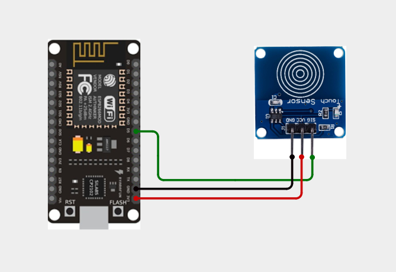
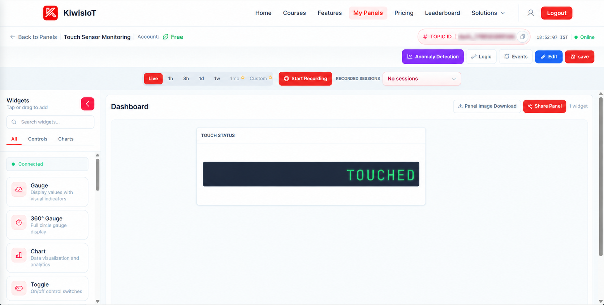
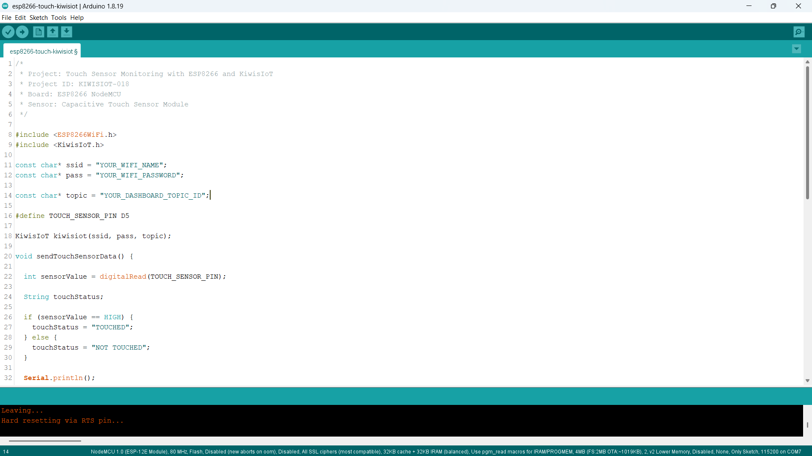
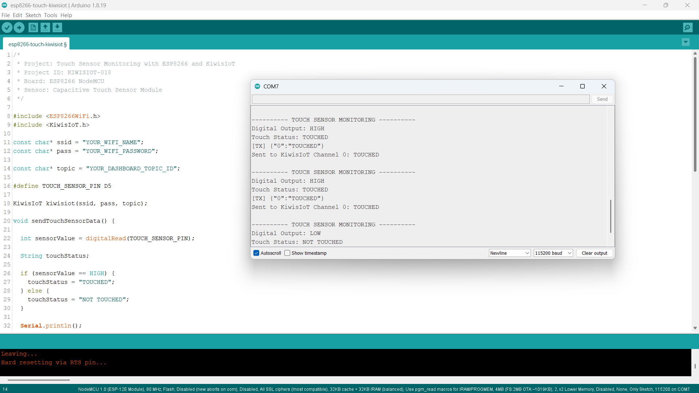

# ESP8266 Touch Sensor IoT Project: Create a Touch-Based IoT System with KiwisIoT 👆

Build an **ESP8266 touch sensor IoT project** to detect touch events using a **capacitive touch sensor module, ESP8266 NodeMCU, Arduino, and KiwisIoT**.

In this project, the ESP8266 reads the digital output from the capacitive touch sensor module, determines whether the sensor reports a touch event, and sends the status to a KiwisIoT IoT dashboard over Wi-Fi.

The dashboard displays the touch status as **TOUCHED or NOT TOUCHED**, providing a simple example of digital touch detection and IoT-based status monitoring.

---

## 🚀 Project Highlights

- ESP8266-based touch status monitoring
- Capacitive touch sensor module
- Digital signal reading using `digitalRead()`
- Touch detection using HIGH and LOW signals
- `TOUCHED` and `NOT TOUCHED` status messages
- KiwisIoT IoT dashboard integration
- Wi-Fi-based remote monitoring
- Serial Monitor output for sensor testing
- Automatic status updates approximately every 2 seconds
- Suitable for electronics, embedded systems, and student IoT projects

---

## 🔎 Project Overview

A **capacitive touch sensor** detects changes in capacitance when a finger or another suitable object touches or approaches its sensing surface. A digital touch sensor module processes this change and provides a digital output.

In this project, the touch sensor module is connected to the **D5 pin** of the ESP8266 NodeMCU.

The ESP8266 reads the digital output using `digitalRead()` and interprets the result as a touch status.

The code uses the following logic:

- `HIGH` → `TOUCHED`
- `LOW` → `NOT TOUCHED`

The resulting status is sent to **KiwisIoT Channel 0** and displayed on the dashboard.

The project flow is:

```text
Capacitive Touch Sensor
          ↓
     ESP8266 NodeMCU
          ↓
      Digital Reading
          ↓
       Touch Status
          ↓
          Wi-Fi
          ↓
        KiwisIoT
          ↓
      IoT Dashboard
```

---

## 💡 Why This Project?

Touch sensing is useful in applications where a system needs to respond to a touch input without relying on a conventional mechanical push button.

By connecting a capacitive touch sensor to an ESP8266, the sensor's digital status can be transmitted to an IoT dashboard instead of being monitored only locally.

This project demonstrates how a digital input can be integrated with an IoT platform for remote status monitoring.

It provides a foundation for applications such as:

- Touch-based input systems
- Touch-controlled electronics prototypes
- Contactless-style user interfaces
- Interactive embedded systems
- Smart home control prototypes
- IoT-based touch status monitoring

---

## 📚 What You'll Learn

By building this project, you will learn how to:

- Connect a capacitive touch sensor module to an ESP8266
- Read digital sensor output using `digitalRead()`
- Interpret HIGH and LOW digital signals
- Convert a sensor reading into a touch status
- Send text-based sensor data to KiwisIoT
- Configure a KiwisIoT dashboard widget
- Monitor touch events over Wi-Fi
- Test the sensor using the Arduino Serial Monitor

---

## 🧰 Components Required

| Component | Quantity |
|---|---:|
| ESP8266 NodeMCU | 1 |
| Capacitive Touch Sensor Module | 1 |
| Jumper Wires | As required |
| USB Cable | 1 |
| Computer | 1 |

---

## 💻 Software Requirements

- Arduino IDE
- ESP8266 board package
- KiwisIoT Arduino library
- KiwisIoT account
- Wi-Fi connection

### Common KiwisIoT Setup

Before starting this project, complete the common **KiwisIoT Arduino Setup Guide**.

The setup guide covers:

- Arduino IDE installation
- ESP8266 board installation and selection
- KiwisIoT Arduino library installation
- KiwisIoT panel setup
- Topic ID configuration
- Dashboard widget setup and configuration

The common setup guide is available in the parent `esp8266` directory:

[Open the KiwisIoT Arduino Setup Guide](../kiwisiot-arduino-setup/)

---

## 🛠️ Technologies Used

- ESP8266 NodeMCU
- Capacitive Touch Sensor Module
- Arduino IDE
- KiwisIoT Arduino Library
- KiwisIoT IoT Dashboard
- Wi-Fi
- C++ / Arduino

---

## 🔌 Circuit Connection

Connect the capacitive touch sensor module to the ESP8266 NodeMCU as shown in the circuit diagram.

| Touch Sensor Module | ESP8266 NodeMCU |
|---|---|
| GND | GND |
| VCC | 3.3V |
| SIG / Digital Output | D5 |

The sensor module's digital output is connected to the ESP8266 D5 pin. The ESP8266 reads this signal to determine whether the module reports a touch event.



> **Note:** Follow the pin labels on your particular touch sensor module. The connections above match the supplied circuit. Confirm your module's operating-voltage requirements before powering it.

---

## 🔬 How the Touch Sensor Works

A capacitive touch sensor detects changes in capacitance around its sensing surface. When a finger touches or approaches the sensing area, the module detects the change and updates its digital output.

In this project, the ESP8266 reads the digital output using:

```cpp
int sensorValue = digitalRead(TOUCH_SENSOR_PIN);
```

The sensor pin is defined as:

```cpp
#define TOUCH_SENSOR_PIN D5
```

The program interprets the reading as follows:

```cpp
if (sensorValue == HIGH) {
  touchStatus = "TOUCHED";
} else {
  touchStatus = "NOT TOUCHED";
}
```

According to the logic used by this project:

| Digital Output | Touch Status |
|---|---|
| `HIGH` | `TOUCHED` |
| `LOW` | `NOT TOUCHED` |

The table describes the interpretation used by this project's code. The actual output behavior depends on the particular sensor module and its configuration.

---

## 👆 Touch Status Detection

The ESP8266 converts the sensor's digital output into a readable touch status.

### Touch Detected

When the sensor output is `HIGH`, the program assigns:

```cpp
touchStatus = "TOUCHED";
```

The Serial Monitor displays:

```text
---------- TOUCH SENSOR MONITORING ----------
Digital Output: HIGH
Touch Status: TOUCHED
[TX] {"0":"TOUCHED"}
Sent to KiwisIoT Channel 0: TOUCHED
```

The ESP8266 sends `TOUCHED` to KiwisIoT Channel 0.

### Touch Not Detected

When the sensor output is `LOW`, the program assigns:

```cpp
touchStatus = "NOT TOUCHED";
```

The Serial Monitor displays:

```text
---------- TOUCH SENSOR MONITORING ----------
Digital Output: LOW
Touch Status: NOT TOUCHED
[TX] {"0":"NOT TOUCHED"}
Sent to KiwisIoT Channel 0: NOT TOUCHED
```

The ESP8266 sends `NOT TOUCHED` to KiwisIoT Channel 0.

This approach reports the sensor module's digital status. It does not measure touch pressure, contact area, or the distance to a finger.

---

## ☁️ KiwisIoT Dashboard

This project uses **one KiwisIoT channel** to display the touch status.

| Channel | Data | Possible Values |
|---|---|---|
| `0` | Touch Status | `TOUCHED`, `NOT TOUCHED` |

The data flow is:

```text
Capacitive Touch Sensor
          ↓
       ESP8266 D5
          ↓
       Touch Status
          ↓
     KiwisIoT Channel 0
          ↓
      Touch Status Widget
```



The dashboard widget displays the touch status received from the ESP8266. In the supplied screenshot, the widget displays `TOUCHED`.

---

## ⚙️ Dashboard Configuration

Create a KiwisIoT panel and add a widget to display the touch status.

### Touch Status Widget

Configure the widget to receive data from Channel 0.

Suggested configuration:

```text
Name: Touch Status
Channel ID: 0
```

The ESP8266 sends the status using:

```cpp
kiwisiot.send("0", touchStatus);
```

The widget can display:

```text
TOUCHED
```

or:

```text
NOT TOUCHED
```

> **Note:** The channel configured in the dashboard must match the channel used in the Arduino code.

---

## 💻 Arduino Code

The complete Arduino program is available in the project `code` directory.

The program uses the ESP8266 Wi-Fi library and KiwisIoT Arduino library:

```cpp
#include <ESP8266WiFi.h>
#include <KiwisIoT.h>
```



---

## 🔐 Configure Wi-Fi and KiwisIoT

Before uploading the program, update these values in the Arduino code:

```cpp
const char* ssid = "YOUR_WIFI_NAME";
const char* pass = "YOUR_WIFI_PASSWORD";

const char* topic = "YOUR_DASHBOARD_TOPIC_ID";
```

Replace `YOUR_WIFI_NAME` with your Wi-Fi network name.

Replace `YOUR_WIFI_PASSWORD` with your Wi-Fi password.

Replace `YOUR_DASHBOARD_TOPIC_ID` with the Topic ID of your KiwisIoT panel.

Make sure the Topic ID corresponds to the panel where you configured the touch status widget.

> **Security:** Never publish your actual Wi-Fi password or private credentials in a public GitHub repository.

---

## 📝 Complete Arduino Code

```cpp
/*
 * Project: Touch Sensor Monitoring with ESP8266 and KiwisIoT
 * Project ID: KIWISIOT-018
 * Board: ESP8266 NodeMCU
 * Sensor: Capacitive Touch Sensor Module
 */

#include <ESP8266WiFi.h>
#include <KiwisIoT.h>

const char* ssid = "YOUR_WIFI_NAME";
const char* pass = "YOUR_WIFI_PASSWORD";

const char* topic = "YOUR_DASHBOARD_TOPIC_ID";

#define TOUCH_SENSOR_PIN D5

KiwisIoT kiwisiot(ssid, pass, topic);

void sendTouchSensorData() {

  int sensorValue = digitalRead(TOUCH_SENSOR_PIN);

  String touchStatus;

  if (sensorValue == HIGH) {
    touchStatus = "TOUCHED";
  } else {
    touchStatus = "NOT TOUCHED";
  }

  Serial.println();
  Serial.println("---------- TOUCH SENSOR MONITORING ----------");

  Serial.print("Digital Output: ");
  Serial.println(sensorValue == HIGH ? "HIGH" : "LOW");

  Serial.print("Touch Status: ");
  Serial.println(touchStatus);

  kiwisiot.send("0", touchStatus);

  Serial.print("Sent to KiwisIoT Channel 0: ");
  Serial.println(touchStatus);
}

void setup() {
  Serial.begin(115200);

  Serial.println();
  Serial.println("===== TOUCH SENSOR MONITORING =====");

  pinMode(TOUCH_SENSOR_PIN, INPUT);

  Serial.println("Touch sensor initialized");
  Serial.println("Connecting to KiwisIoT...");

  kiwisiot.begin();

  Serial.println("KiwisIoT initialized");
  Serial.println("Starting touch detection...");
}

void loop() {
  kiwisiot.run();

  static unsigned long lastSend = 0;

  if (millis() - lastSend >= 2000) {
    lastSend = millis();
    sendTouchSensorData();
  }

  delay(100);
}
```

---

## ⬆️ Upload the Program

Follow these steps to upload the program:

1. Connect the ESP8266 NodeMCU to your computer using a USB cable.
2. Open `esp8266-touch-kiwisiot.ino` in Arduino IDE.
3. Select the appropriate ESP8266 NodeMCU board.
4. Enter your Wi-Fi credentials and KiwisIoT Topic ID.
5. Verify the code.
6. Upload the program.
7. Open the Serial Monitor.
8. Set the baud rate to `115200`.

After startup, the ESP8266 initializes the sensor input and calls `kiwisiot.begin()`.

The program then reads the sensor status and sends updates to KiwisIoT approximately every two seconds.

---

## 🖥️ Serial Monitor Output

The Serial Monitor displays the digital output, interpreted touch status, and the value sent to KiwisIoT.

### When Touch Is Detected

The supplied Serial Monitor screenshot shows output in this format:

```text
---------- TOUCH SENSOR MONITORING ----------
Digital Output: HIGH
Touch Status: TOUCHED
[TX] {"0":"TOUCHED"}
Sent to KiwisIoT Channel 0: TOUCHED
```

### When Touch Is Not Detected

When the sensor output is LOW, the code reports:

```text
---------- TOUCH SENSOR MONITORING ----------
Digital Output: LOW
Touch Status: NOT TOUCHED
[TX] {"0":"NOT TOUCHED"}
Sent to KiwisIoT Channel 0: NOT TOUCHED
```

The second example follows the program's logic; the displayed status depends on the actual sensor reading.



---

## 🔄 Understanding the Data Flow

The project processes the touch sensor signal in several stages.

### 1. Read the Digital Input

The ESP8266 reads the sensor output from D5:

```cpp
int sensorValue = digitalRead(TOUCH_SENSOR_PIN);
```

### 2. Determine the Touch Status

The program interprets `HIGH` as touched and `LOW` as not touched:

```cpp
if (sensorValue == HIGH) {
  touchStatus = "TOUCHED";
} else {
  touchStatus = "NOT TOUCHED";
}
```

### 3. Print the Status

The touch status is displayed in the Serial Monitor:

```cpp
Serial.print("Touch Status: ");
Serial.println(touchStatus);
```

### 4. Send the Status to KiwisIoT

The status is sent through Channel 0:

```cpp
kiwisiot.send("0", touchStatus);
```

### 5. Display the Result

KiwisIoT receives the status and displays it on the configured dashboard widget.

The complete data flow is:

```text
Capacitive Touch Sensor
          ↓
      Digital Output
          ↓
        ESP8266 D5
          ↓
   TOUCHED / NOT TOUCHED
          ↓
     KiwisIoT Channel 0
          ↓
        Dashboard
```

---

## 🧪 Testing the Project

To test the project:

1. Connect the touch sensor module to the ESP8266.
2. Upload the Arduino program.
3. Open the Serial Monitor at `115200` baud.
4. Confirm that the sensor initializes and KiwisIoT starts.
5. Touch the sensor's sensing surface.
6. Remove your finger from the sensing surface.
7. Observe the digital output and touch status in the Serial Monitor.
8. Verify that the KiwisIoT dashboard displays the status sent by the ESP8266.

### Test 1: Touch Detected

Expected output according to the project's code:

```text
Digital Output: HIGH
Touch Status: TOUCHED
```

### Test 2: Touch Not Detected

Expected output according to the project's code:

```text
Digital Output: LOW
Touch Status: NOT TOUCHED
```

The dashboard should reflect the status sent by the ESP8266.

> **Note:** The response depends on the sensor module, its sensitivity, and its output configuration. Test your particular module to confirm the detection behavior.

---

## ❓ Why Use a Capacitive Touch Sensor?

A capacitive touch sensor provides a digital signal when it detects a touch-related change at its sensing surface.

Unlike a mechanical push button, a capacitive touch sensor can detect touch without requiring a conventional moving switch mechanism.

This project does not measure the strength or duration of a touch. It converts the sensor's digital output into a readable status and sends that status to KiwisIoT.

The project uses one channel because it sends one touch status:

```text
Channel 0 → TOUCHED / NOT TOUCHED
```

This keeps the dashboard configuration simple and makes the project suitable for learning digital inputs and IoT data transmission.

---

## 🛠️ Troubleshooting

### Touch Status Does Not Change

Check:

- VCC and GND connections
- The connection between the sensor's digital output and D5
- Whether the sensing surface is being touched correctly
- The sensor module's sensitivity or adjustment, if available
- The sensor's digital output
- Loose jumper wires
- Whether the module is receiving its required operating voltage

### Touch Status Is Reversed

If the Serial Monitor displays `TOUCHED` when you expect `NOT TOUCHED`, check the actual output of your sensor module.

The current code uses:

```cpp
if (sensorValue == HIGH) {
  touchStatus = "TOUCHED";
} else {
  touchStatus = "NOT TOUCHED";
}
```

If your module has opposite output behavior, adjust the interpretation to match your module's readings.

### Dashboard Does Not Receive Data

Check:

- Wi-Fi name and password
- Internet connection
- KiwisIoT Topic ID
- KiwisIoT Arduino library
- Dashboard widget configuration
- Channel ID

### Dashboard Shows No Touch Status

Confirm that the widget is configured for Channel 0.

The code sends the status using:

```cpp
kiwisiot.send("0", touchStatus);
```

### Serial Monitor Shows Incorrect Characters

Make sure the Serial Monitor baud rate is `115200`, matching:

```cpp
Serial.begin(115200);
```

---

## 🔒 Security

Never publish sensitive credentials in a public GitHub repository.

Do not commit:

- Wi-Fi passwords
- API keys
- Access tokens
- Account passwords
- Private credentials

Use placeholders in the public example:

```text
YOUR_WIFI_NAME
YOUR_WIFI_PASSWORD
YOUR_DASHBOARD_TOPIC_ID
```

Enter your actual credentials only in your local Arduino project.

---

## 🌱 Possible Applications

An ESP8266 touch sensor monitoring system can be used as a starting point for:

- Touch-based input systems
- Touch-controlled device prototypes
- Interactive electronics projects
- Smart home interface prototypes
- Touch-triggered IoT experiments
- Embedded systems demonstrations
- Student and engineering IoT projects

The project can be extended with additional sensors, event logging, notifications, or other KiwisIoT dashboard features.

> **Note:** This project reports the digital status produced by the sensor module. It does not measure touch pressure or serve as a complete access-control or security system.

---

## 📁 Project Structure

```text
018-touch-sensor-kiwisiot/
│
├── README.md
│
├── code/
│   └── esp8266-touch-kiwisiot.ino
│
└── images/
    ├── circuit.png
    ├── code.png
    ├── serial-monitor.png
    └── dashboard-output.png
```

---

## 🔗 Related KiwisIoT ESP8266 Projects

This project is part of the KiwisIoT ESP8266 IoT project collection.

- [ESP8266 LDR Sensor IoT Project](../001-ldr-kiwisiot/)
- [ESP8266 IR Sensor IoT Project](../002-ir-kiwisiot/)
- [ESP8266 Ultrasonic Sensor IoT Project](../003-ultrasonic-kiwisiot/)
- [ESP8266 DHT11 Temperature and Humidity IoT Project](../004-dht11-kiwisiot/)
- [ESP8266 PIR Motion Sensor IoT Project](../005-pir-kiwisiot/)
- [ESP8266 Gas Sensor IoT Project](../006-gas-kiwisiot/)
- [ESP8266 Flame Sensor IoT Project](../007-flame-kiwisiot/)
- [ESP8266 Soil Moisture IoT Project](../008-soil-moisture-kiwisiot/)
- [ESP8266 Water Level Sensor IoT Project](../009-water-level-kiwisiot/)
- [ESP8266 Raindrop Sensor IoT Project](../010-raindrop-kiwisiot/)
- [ESP8266 Sound Sensor IoT Project](../011-sound-kiwisiot/)
- [ESP8266 MPU6050 Motion and Acceleration IoT Project](../012-mpu6050-kiwisiot/)
- [ESP8266 Voltage Sensor IoT Project](../013-voltage-kiwisiot/)
- [ESP8266 Current Sensor IoT Project](../014-current-kiwisiot/)
- [ESP8266 Vibration Sensor IoT Project](../015-vibration-kiwisiot/)
- [ESP8266 Reed Switch IoT Project](../016-reed-switch-kiwisiot/)
- [ESP8266 Hall Effect Sensor IoT Project](../017-hall-effect-kiwisiot/)

For Arduino and KiwisIoT setup, see the [KiwisIoT Arduino Setup Guide](../kiwisiot-arduino-setup/).

---

## ❓ Frequently Asked Questions

### What is a capacitive touch sensor?

A capacitive touch sensor detects changes in capacitance at its sensing surface and converts the response into an electrical signal. A digital module provides a HIGH or LOW output based on its detection behavior.

### Which ESP8266 board is used?

This project uses the ESP8266 NodeMCU development board.

### Which sensor is used?

The project uses a capacitive touch sensor module.

### Which ESP8266 pin is connected to the sensor?

The sensor's digital output is connected to D5:

```cpp
#define TOUCH_SENSOR_PIN D5
```

### How does the project determine whether touch is detected?

The code interprets the digital readings as follows:

```text
HIGH → TOUCHED
LOW  → NOT TOUCHED
```

### Which KiwisIoT channel is used?

The project uses Channel 0 to send the touch status.

### How often is the status sent?

The program sends the status approximately every two seconds.

### Does this project measure touch pressure?

No. The project uses a digital sensor output to report `TOUCHED` or `NOT TOUCHED`. It does not measure pressure or touch intensity.

### Can this project control another device?

The current program only reports the touch status to KiwisIoT. It can be extended to control a suitable output device, but that functionality is not included in the current code.

### Can the project be extended?

Yes. Additional sensors, alerts, event logging, or other KiwisIoT dashboard features can be added.

---

## 📌 Summary

This project demonstrates an **ESP8266 capacitive touch sensor IoT system** using a touch sensor module and KiwisIoT.

The ESP8266 reads the sensor's digital output through D5, interprets the input as `TOUCHED` or `NOT TOUCHED`, and sends the status to KiwisIoT Channel 0 over Wi-Fi.

The final dashboard displays:

```text
TOUCHED     → Touch detected
NOT TOUCHED → Touch not detected
```

This project provides a practical introduction to capacitive touch sensing, ESP8266 programming, and IoT-based status monitoring.

---

## 📄 License

This project is licensed under the MIT License. See the `LICENSE` file for details.
