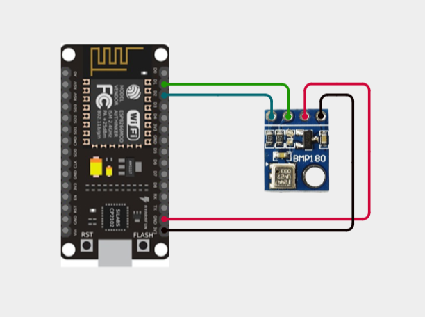
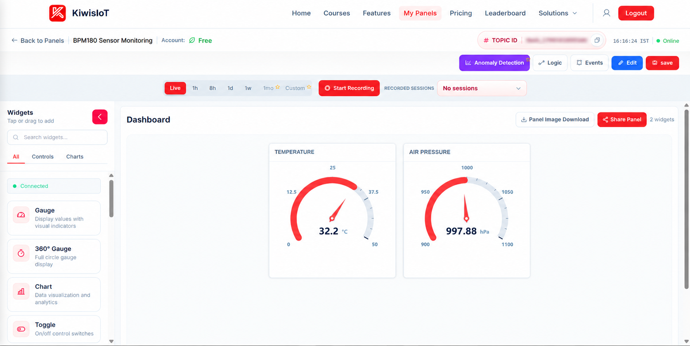
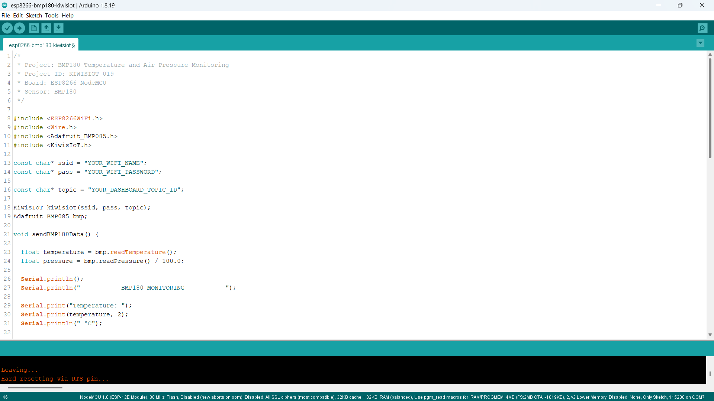
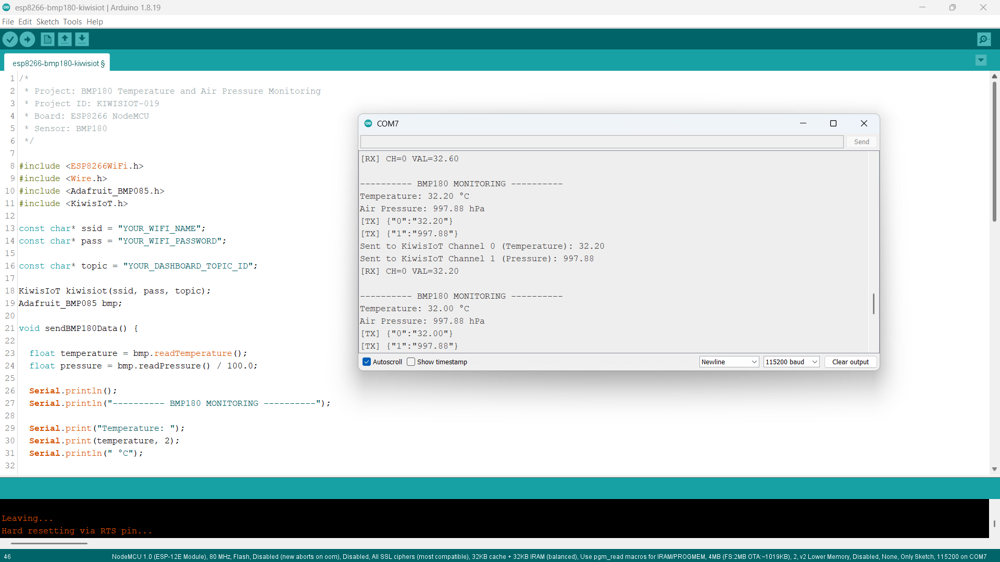

# ESP8266 BMP180 IoT Project: Monitor Temperature and Air Pressure with KiwisIoT 🌡️

Build an **ESP8266 BMP180 IoT project** to monitor temperature and atmospheric pressure using a **BMP180 barometric pressure sensor, ESP8266 NodeMCU, Arduino, and KiwisIoT**.

In this project, the BMP180 sensor measures the surrounding temperature and air pressure. The ESP8266 reads these measurements through the I²C communication interface and sends the data to a KiwisIoT IoT dashboard over Wi-Fi.

The dashboard displays temperature in **degrees Celsius (°C)** and air pressure in **hectopascals (hPa)** using separate gauge widgets. This project demonstrates how environmental sensor data can be collected, transmitted, and monitored remotely using an IoT platform.

---

## 🚀 Project Highlights

- ESP8266-based temperature and air pressure monitoring
- BMP180 barometric pressure sensor
- I²C communication using SDA and SCL
- Temperature measurement in °C
- Atmospheric pressure measurement in hPa
- Separate KiwisIoT channels for temperature and pressure
- Real-time dashboard visualization using gauge widgets
- Wi-Fi-based remote monitoring
- Serial Monitor output for sensor testing
- Automatic sensor data updates approximately every 2 seconds
- Suitable for electronics, embedded systems, environmental monitoring, and student IoT projects

---

## 🔎 Project Overview

The **BMP180** is a digital barometric pressure sensor that measures atmospheric pressure and temperature. It communicates with a microcontroller through the I²C interface.

In this project, the BMP180 sensor is connected to the **ESP8266 NodeMCU** using the D2 and D1 pins for I²C communication.

The ESP8266 reads the sensor measurements using the Adafruit BMP085 library, which also supports the BMP180 sensor.

The program performs the following operations:

- Reads temperature from the BMP180 sensor.
- Reads atmospheric pressure in pascals and converts it to hectopascals.
- Displays both measurements in the Serial Monitor.
- Sends temperature to KiwisIoT Channel 0.
- Sends air pressure to KiwisIoT Channel 1.
- Updates the dashboard approximately every two seconds.

The project flow is:

```text
        BMP180 Sensor
               ↓
     Temperature and Pressure
               ↓
       I²C Communication
               ↓
       ESP8266 NodeMCU
               ↓
      Process Sensor Data
               ↓
             Wi-Fi
               ↓
           KiwisIoT
               ↓
      IoT Dashboard Gauges
       ↙              ↘
 Temperature       Air Pressure
```

---

## 💡 Why This Project?

Temperature and atmospheric pressure are useful environmental measurements in weather monitoring, indoor environmental observation, and electronics projects.

A sensor connected to a microcontroller can collect these measurements locally. By connecting the ESP8266 to an IoT platform, the data can also be displayed on a dashboard for convenient monitoring.

This project demonstrates how to combine a barometric pressure sensor, an ESP8266, I²C communication, and cloud-connected visualization in one practical system.

It provides a foundation for applications such as:

- Environmental data monitoring
- Basic weather observation
- Indoor temperature monitoring
- Atmospheric pressure tracking
- IoT-based sensor dashboards
- Embedded systems experiments

---

## 📚 What You'll Learn

By building this project, you will learn how to:

- Connect a BMP180 sensor to an ESP8266 NodeMCU.
- Understand SDA and SCL connections for I²C communication.
- Install and use the Adafruit BMP085 library.
- Read temperature and pressure measurements.
- Convert pressure from pascals to hectopascals.
- Format sensor readings to two decimal places.
- Send multiple sensor values to separate KiwisIoT channels.
- Configure gauge widgets for temperature and pressure.
- Monitor environmental measurements over Wi-Fi.
- Troubleshoot common sensor and dashboard connection issues.

---

## 🧰 Components Required

| Component | Quantity |
|---|---:|
| ESP8266 NodeMCU | 1 |
| BMP180 Barometric Pressure Sensor Module | 1 |
| Jumper Wires | As required |
| USB Cable | 1 |
| Computer | 1 |

---

## 💻 Software Requirements

- Arduino IDE
- ESP8266 board package
- KiwisIoT Arduino library
- Adafruit BMP085 library
- Wire library for I²C communication
- KiwisIoT account
- Wi-Fi connection

### Common KiwisIoT Setup

Before starting this project, complete the common **KiwisIoT Arduino Setup Guide**.

The setup guide covers:

- Arduino IDE installation
- ESP8266 board installation and selection
- KiwisIoT Arduino library installation
- KiwisIoT panel setup
- Topic ID configuration
- Dashboard widget setup and configuration

The common setup guide is available in the parent `esp8266` directory:

[Open the KiwisIoT Arduino Setup Guide](../kiwisiot-arduino-setup/)

### BMP180 Library Setup

Install the **Adafruit BMP085 Library** using the Arduino IDE Library Manager.

1. Open Arduino IDE.
2. Navigate to **Sketch → Include Library → Manage Libraries**.
3. Search for `Adafruit BMP085`.
4. Install the library.
5. Confirm that the library is available before compiling the project.

The `Wire.h` library is used for I²C communication and is included with the supported Arduino platform.

---

## 🛠️ Technologies Used

- ESP8266 NodeMCU
- BMP180 Barometric Pressure Sensor
- Arduino IDE
- Adafruit BMP085 Library
- Wire Library
- KiwisIoT Arduino Library
- KiwisIoT IoT Dashboard
- I²C Communication
- Wi-Fi
- C++ / Arduino

---

## 🔌 Circuit Connection

Connect the BMP180 sensor module to the ESP8266 NodeMCU as shown in the circuit diagram.

| BMP180 Sensor Module | ESP8266 NodeMCU |
|---|---|
| VCC | 3.3V |
| GND | GND |
| SDA | D2 |
| SCL | D1 |

The SDA pin carries I²C data, while the SCL pin provides the I²C clock signal.

The Arduino program configures these pins using:

```cpp
Wire.begin(D2, D1);
```

For the ESP8266 Arduino core, this specifies D2 as SDA and D1 as SCL.



> **Note:** The table describes the connections used by this project. Check the labels on your particular BMP180 module before connecting it. Use a compatible supply voltage and avoid applying 5V to ESP8266 GPIO pins.

---

## 🔬 How the BMP180 Sensor Works

The BMP180 is a digital sensor designed to measure atmospheric pressure and temperature.

It communicates with the ESP8266 through the I²C interface, allowing the microcontroller to request measurements from the sensor.

In this project, the Adafruit BMP085 library provides the functions required to read the BMP180 measurements.

### 1. Temperature Measurement

The program reads the temperature using:

```cpp
float temperature = bmp.readTemperature();
```

The returned temperature is expressed in degrees Celsius.

The program displays the result with two decimal places:

```cpp
Serial.print("Temperature: ");
Serial.print(temperature, 2);
Serial.println(" °C");
```

For example, the Serial Monitor may display:

```text
Temperature: 32.20 °C
```

### 2. Air Pressure Measurement

The program reads the pressure using:

```cpp
float pressure = bmp.readPressure() / 100.0;
```

The `readPressure()` function returns pressure in pascals (Pa). Dividing the result by 100 converts the value to hectopascals (hPa).

The conversion is:

```text
1 hPa = 100 Pa

Pressure (hPa) = Pressure (Pa) / 100
```

For example, a pressure measurement of 99788 Pa becomes approximately 997.88 hPa.

The Serial Monitor displays the result as:

```text
Air Pressure: 997.88 hPa
```

The readings depend on the sensor's environment and operating conditions.

---

## 🌡️ Temperature Monitoring

The ESP8266 reads the temperature from the BMP180 sensor and sends it to KiwisIoT Channel 0.

### Temperature Data Processing

The temperature reading is obtained using:

```cpp
float temperature = bmp.readTemperature();
```

The value is converted into a string with two decimal places before transmission:

```cpp
String temperatureData = String(temperature, 2);
```

The program sends the value to Channel 0:

```cpp
kiwisiot.send("0", temperatureData);
```

### Example Temperature Reading

The supplied Serial Monitor screenshot shows:

```text
Temperature: 32.20 °C
Sent to KiwisIoT Channel 0 (Temperature): 32.20
```

The dashboard's temperature gauge displays the received value in °C.

This project measures the temperature reported by the sensor. It does not calculate a temperature forecast.

---

## 🌬️ Air Pressure Monitoring

The BMP180 also measures atmospheric pressure, allowing the ESP8266 to send pressure readings to KiwisIoT.

### Pressure Data Processing

The pressure measurement is converted from pascals to hectopascals:

```cpp
float pressure = bmp.readPressure() / 100.0;
```

The program formats the value to two decimal places:

```cpp
String pressureData = String(pressure, 2);
```

The formatted value is sent to Channel 1:

```cpp
kiwisiot.send("1", pressureData);
```

### Example Pressure Reading

The supplied Serial Monitor screenshot shows:

```text
Air Pressure: 997.88 hPa
Sent to KiwisIoT Channel 1 (Pressure): 997.88
```

The dashboard's air pressure gauge displays the received value in hPa.

> **Note:** Atmospheric pressure changes with weather and altitude. The pressure reported by this project is the sensor measurement; it is not automatically corrected to sea-level pressure.

---

## ☁️ KiwisIoT Dashboard

This project uses **two KiwisIoT channels** to display the BMP180 sensor measurements.

| Channel | Data | Unit |
|---|---|---|
| `0` | Temperature | °C |
| `1` | Air Pressure | hPa |

The temperature and pressure measurements are sent separately so each dashboard widget can display the appropriate value and unit.

The data flow is:

```text
         BMP180 Sensor
                ↓
       ESP8266 NodeMCU
                ↓
       Read Sensor Values
                ↓
       ┌────────┴────────┐
       ↓                 ↓
 Temperature         Air Pressure
       ↓                 ↓
 Channel 0           Channel 1
       ↓                 ↓
 Temperature         Pressure
    Gauge              Gauge
```



The supplied dashboard screenshot shows two gauge widgets:

- **TEMPERATURE:** 32.2 °C
- **AIR PRESSURE:** 997.88 hPa

These values are examples from the supplied screenshot, not fixed values. Actual readings can change according to the environment.

---

## ⚙️ Dashboard Configuration

Create a KiwisIoT panel and add two gauge widgets to display the BMP180 measurements.

### 1. Temperature Gauge

Configure the first gauge to receive temperature data from Channel 0.

Suggested configuration based on the supplied dashboard:

```text
Widget Name: TEMPERATURE
Channel ID: 0
Unit: °C
Minimum Value: 0
Maximum Value: 50
```

The temperature gauge range shown in the screenshot is 0–50 °C.

### 2. Air Pressure Gauge

Configure the second gauge to receive pressure data from Channel 1.

Suggested configuration based on the supplied dashboard:

```text
Widget Name: AIR PRESSURE
Channel ID: 1
Unit: hPa
Minimum Value: 900
Maximum Value: 1100
```

The air pressure gauge range shown in the screenshot is 900–1100 hPa.

These ranges are the settings represented in the supplied dashboard image. You can adjust the ranges to suit your intended monitoring environment.

### Channel Mapping in Arduino

The program sends temperature using:

```cpp
kiwisiot.send("0", temperatureData);
```

It sends pressure using:

```cpp
kiwisiot.send("1", pressureData);
```

> **Important:** The channel IDs configured in the dashboard must match the channel IDs used in the Arduino code. The dashboard should use a temperature gauge for Channel 0 and an air pressure gauge for Channel 1.

---

## 💻 Arduino Code

The complete Arduino program is available in the project `code` directory.

The program uses four headers:

```cpp
#include <ESP8266WiFi.h>
#include <Wire.h>
#include <Adafruit_BMP085.h>
#include <KiwisIoT.h>
```

Their purposes are:

- `ESP8266WiFi.h` — provides ESP8266 Wi-Fi functionality.
- `Wire.h` — provides I²C communication.
- `Adafruit_BMP085.h` — provides BMP180 sensor access through the Adafruit library.
- `KiwisIoT.h` — enables communication with the KiwisIoT platform.

The sensor object is created using:

```cpp
Adafruit_BMP085 bmp;
```

The ESP8266 initializes the sensor, reads its measurements, and sends the values to the dashboard.



---

## 🔐 Configure Wi-Fi and KiwisIoT

Before uploading the program, update these values in the Arduino code:

```cpp
const char* ssid = "YOUR_WIFI_NAME";
const char* pass = "YOUR_WIFI_PASSWORD";

const char* topic = "YOUR_DASHBOARD_TOPIC_ID";
```

Replace `YOUR_WIFI_NAME` with your Wi-Fi network name.

Replace `YOUR_WIFI_PASSWORD` with your Wi-Fi password.

Replace `YOUR_DASHBOARD_TOPIC_ID` with the Topic ID of your KiwisIoT panel.

Make sure the Topic ID corresponds to the panel where you configured both gauge widgets.

> **Security:** Never publish your actual Wi-Fi password or private credentials in a public GitHub repository. Keep placeholders in the public example and configure your credentials locally.

---

## 📝 Complete Arduino Code

```cpp
/*
 * Project: BMP180 Temperature and Air Pressure Monitoring
 * Project ID: KIWISIOT-019
 * Board: ESP8266 NodeMCU
 * Sensor: BMP180
 */

#include <ESP8266WiFi.h>
#include <Wire.h>
#include <Adafruit_BMP085.h>
#include <KiwisIoT.h>

const char* ssid = "YOUR_WIFI_NAME";
const char* pass = "YOUR_WIFI_PASSWORD";

const char* topic = "YOUR_DASHBOARD_TOPIC_ID";

KiwisIoT kiwisiot(ssid, pass, topic);
Adafruit_BMP085 bmp;

void sendBMP180Data() {

  float temperature = bmp.readTemperature();
  float pressure = bmp.readPressure() / 100.0;

  Serial.println();
  Serial.println("---------- BMP180 MONITORING ----------");

  Serial.print("Temperature: ");
  Serial.print(temperature, 2);
  Serial.println(" °C");

  Serial.print("Air Pressure: ");
  Serial.print(pressure, 2);
  Serial.println(" hPa");

  String temperatureData = String(temperature, 2);
  String pressureData = String(pressure, 2);

  kiwisiot.send("0", temperatureData);
  kiwisiot.send("1", pressureData);

  Serial.print("Sent to KiwisIoT Channel 0 (Temperature): ");
  Serial.println(temperatureData);

  Serial.print("Sent to KiwisIoT Channel 1 (Pressure): ");
  Serial.println(pressureData);
}

void setup() {
  Serial.begin(115200);

  Serial.println();
  Serial.println("===== BMP180 SENSOR MONITORING =====");

  Wire.begin(D2, D1);

  if (!bmp.begin()) {
    Serial.println("ERROR: BMP180 sensor not detected!");
    Serial.println("Check VCC, GND, SDA and SCL connections.");

    while (true) {
      delay(1000);
    }
  }

  Serial.println("BMP180 initialized successfully.");
  Serial.println("Connecting to KiwisIoT...");

  kiwisiot.begin();

  Serial.println("KiwisIoT initialized.");
  Serial.println("Starting temperature and pressure monitoring...");
}

void loop() {
  kiwisiot.run();

  static unsigned long lastSend = 0;

  if (millis() - lastSend >= 2000) {
    lastSend = millis();
    sendBMP180Data();
  }

  delay(100);
}
```

---

## ⬆️ Upload the Program

Follow these steps to upload the program:

1. Connect the ESP8266 NodeMCU to your computer using a USB cable.
2. Open `esp8266-bmp180-kiwisiot.ino` in Arduino IDE.
3. Install the ESP8266 board package if it is not already installed.
4. Install the Adafruit BMP085 library and the KiwisIoT Arduino library.
5. Select the appropriate ESP8266 NodeMCU board.
6. Update the Wi-Fi credentials and KiwisIoT Topic ID.
7. Verify the code.
8. Upload the program.
9. Open the Serial Monitor.
10. Set the baud rate to `115200`.

After startup, the ESP8266 initializes I²C communication and checks whether the BMP180 sensor is detected.

If initialization succeeds, the program initializes KiwisIoT and starts monitoring temperature and pressure.

The program sends sensor data approximately every two seconds.

**Important:** If the BMP180 sensor is not detected, the program prints an error and remains in the initialization loop until the board is reset. Check the sensor connections before restarting.

---

## 🖥️ Serial Monitor Output

The Serial Monitor displays the measured temperature, air pressure, and the values sent to KiwisIoT.

Set the baud rate to `115200` to match the program:

```cpp
Serial.begin(115200);
```

### Example Output

The supplied Serial Monitor screenshot shows output in this format:

```text
---------- BMP180 MONITORING ----------
Temperature: 32.20 °C
Air Pressure: 997.88 hPa
[TX] {"0":"32.20"}
[TX] {"1":"997.88"}
Sent to KiwisIoT Channel 0 (Temperature): 32.20
Sent to KiwisIoT Channel 1 (Pressure): 997.88
```

The screenshot also shows subsequent measurements, including a temperature reading of `32.00 °C` while the displayed pressure remains `997.88 hPa`.

The exact measurements may vary during testing. The `[TX]` lines shown above are consistent with the supplied screenshot; they are generated by the KiwisIoT communication library rather than explicit `Serial.println()` calls in the project code.



---

## 🔄 Understanding the Data Flow

The project processes the BMP180 measurements in several stages.

### 1. Initialize I²C Communication

The ESP8266 configures the I²C pins:

```cpp
Wire.begin(D2, D1);
```

This uses D2 as SDA and D1 as SCL.

### 2. Initialize the BMP180 Sensor

The program checks whether the sensor can be initialized:

```cpp
if (!bmp.begin()) {
  Serial.println("ERROR: BMP180 sensor not detected!");
  Serial.println("Check VCC, GND, SDA and SCL connections.");

  while (true) {
    delay(1000);
  }
}
```

If the sensor is not detected, the program prints an error message and stops normal monitoring.

### 3. Read Temperature

The temperature is read in degrees Celsius:

```cpp
float temperature = bmp.readTemperature();
```

The value is formatted to two decimal places for transmission.

### 4. Read and Convert Air Pressure

The pressure is read and converted from pascals to hectopascals:

```cpp
float pressure = bmp.readPressure() / 100.0;
```

### 5. Send the Measurements to KiwisIoT

The temperature and pressure are sent through separate channels:

```cpp
kiwisiot.send("0", temperatureData);
kiwisiot.send("1", pressureData);
```

### 6. Display the Results

KiwisIoT receives the two measurements and displays them on the configured gauge widgets.

The complete data flow is:

```text
        BMP180 Sensor
               ↓
       I²C Data Transfer
               ↓
       ESP8266 NodeMCU
               ↓
       ┌───────┴────────┐
       ↓                ↓
 Temperature         Pressure
       ↓                ↓
   Format Data      Convert to hPa
       ↓                ↓
   Channel 0          Channel 1
       ↓                ↓
 Temperature         Air Pressure
    Gauge               Gauge
```

---

## 🧪 Testing the Project

To test the project:

1. Connect the BMP180 sensor to the ESP8266 according to the circuit diagram.
2. Check the VCC, GND, SDA, and SCL connections.
3. Upload the Arduino program.
4. Open the Serial Monitor at `115200` baud.
5. Confirm that the BMP180 initializes successfully.
6. Check that temperature and air pressure measurements appear.
7. Open the KiwisIoT dashboard.
8. Confirm that the temperature gauge receives Channel 0 data.
9. Confirm that the air pressure gauge receives Channel 1 data.
10. Observe the readings over several update cycles.

### Test 1: Temperature Monitoring

Expected output format:

```text
Temperature: 32.20 °C
Sent to KiwisIoT Channel 0 (Temperature): 32.20
```

The numerical value is an example from the supplied screenshot. Your actual reading may differ.

### Test 2: Air Pressure Monitoring

Expected output format:

```text
Air Pressure: 997.88 hPa
Sent to KiwisIoT Channel 1 (Pressure): 997.88
```

The numerical value is an example from the supplied screenshot. Your actual reading may differ.

### Test 3: Dashboard Monitoring

Verify that:

- The temperature gauge displays data from Channel 0.
- The air pressure gauge displays data from Channel 1.
- The units are configured as °C and hPa, respectively.
- The displayed values correspond to the measurements in the Serial Monitor.

The dashboard should update as the ESP8266 sends new measurements.

> **Note:** The BMP180 measures temperature and pressure at the sensor. Its readings may differ from other devices because of sensor placement, local conditions, calibration, and measurement accuracy.

---

## ❓ Why Use the BMP180 Sensor?

The BMP180 combines temperature and barometric pressure measurement in a compact digital sensor.

Its I²C interface allows it to communicate with an ESP8266 using only two signal lines, SDA and SCL, in addition to power and ground.

This project sends two different measurements to KiwisIoT:

```text
Channel 0 → Temperature (°C)
Channel 1 → Air Pressure (hPa)
```

Using separate channels makes it possible to display the measurements independently with appropriate units and gauge ranges.

The project is useful for learning sensor communication, unit conversion, multiple-channel data transmission, and IoT dashboard configuration.

---

## 🛠️ Troubleshooting

### BMP180 Sensor Is Not Detected

If the Serial Monitor displays:

```text
ERROR: BMP180 sensor not detected!
Check VCC, GND, SDA and SCL connections.
```

Check:

- VCC and GND connections.
- SDA connection to D2.
- SCL connection to D1.
- Jumper wires and breadboard connections.
- Whether the sensor module is compatible with the BMP180 library.
- Whether the correct library is installed.

The program does not continue to normal monitoring when sensor initialization fails.

### Temperature or Pressure Values Are Missing

Check:

- Whether `bmp.begin()` succeeds.
- Whether the I²C connections are correct.
- Whether the correct sensor library is installed.
- Whether the sensor is powered correctly.
- Whether the program compiles and uploads successfully.

### Dashboard Does Not Receive Data

Check:

- Wi-Fi name and password.
- Internet connection.
- KiwisIoT Topic ID.
- KiwisIoT Arduino library installation.
- Whether `kiwisiot.begin()` is called.
- Whether the dashboard belongs to the configured Topic ID.

### Temperature Gauge Shows No Value

Confirm that the temperature gauge is configured for Channel 0.

The code sends temperature using:

```cpp
kiwisiot.send("0", temperatureData);
```

### Air Pressure Gauge Shows No Value

Confirm that the air pressure gauge is configured for Channel 1.

The code sends pressure using:

```cpp
kiwisiot.send("1", pressureData);
```

### Gauge Values Appear Incorrect

Check the widget units and configured ranges.

Recommended settings based on the supplied dashboard are:

```text
Temperature: 0–50 °C
Air Pressure: 900–1100 hPa
```

These ranges affect visualization; they do not change the sensor's measurements.

Also verify that pressure is converted from pascals to hectopascals by dividing by 100.

### Serial Monitor Shows Incorrect Characters

Make sure the baud rate is set to `115200`, matching:

```cpp
Serial.begin(115200);
```

---

## 🔒 Security

Never publish sensitive credentials in a public GitHub repository.

Do not commit:

- Wi-Fi passwords
- API keys
- Access tokens
- Account passwords
- Private credentials
- Private dashboard access information

Use placeholders in the public example:

```text
YOUR_WIFI_NAME
YOUR_WIFI_PASSWORD
YOUR_DASHBOARD_TOPIC_ID
```

Enter your actual credentials only in your local Arduino project.

If you share screenshots publicly, blur your private KiwisIoT Topic ID where appropriate.

---

## 🌱 Possible Applications

An ESP8266 BMP180 monitoring system can be used as a starting point for:

- Environmental monitoring
- Basic weather observation
- Indoor temperature monitoring
- Atmospheric pressure monitoring
- IoT-based environmental dashboards
- Student electronics experiments
- Embedded systems learning
- Remote sensor data visualization

The project can be extended with additional sensors, data logging, alerts, charts, or other KiwisIoT dashboard features.

For example, combining a BMP180 with a humidity sensor could provide additional environmental measurements on the same dashboard.

> **Note:** This project provides sensor-based temperature and pressure monitoring. It does not independently generate weather forecasts or guarantee professional meteorological accuracy.

---

## 📁 Project Structure

```text
019-bmp180-kiwisiot/
│
├── README.md
│
├── code/
│   └── esp8266-bmp180-kiwisiot.ino
│
└── images/
    ├── circuit.png
    ├── code.png
    ├── serial-monitor.png
    └── dashboard-output.png
```

Keep the Arduino source code and screenshots in the specified folders so the relative image paths in the README work correctly.

---

## 🔗 Related KiwisIoT ESP8266 Projects

This project is part of the KiwisIoT ESP8266 IoT project collection.

- [ESP8266 LDR Sensor IoT Project](../001-ldr-kiwisiot/)
- [ESP8266 IR Sensor IoT Project](../002-ir-kiwisiot/)
- [ESP8266 Ultrasonic Sensor IoT Project](../003-ultrasonic-kiwisiot/)
- [ESP8266 DHT11 Temperature and Humidity IoT Project](../004-dht11-kiwisiot/)
- [ESP8266 PIR Motion Sensor IoT Project](../005-pir-kiwisiot/)
- [ESP8266 Gas Sensor IoT Project](../006-gas-kiwisiot/)
- [ESP8266 Flame Sensor IoT Project](../007-flame-kiwisiot/)
- [ESP8266 Soil Moisture IoT Project](../008-soil-moisture-kiwisiot/)
- [ESP8266 Water Level Sensor IoT Project](../009-water-level-kiwisiot/)
- [ESP8266 Raindrop Sensor IoT Project](../010-raindrop-kiwisiot/)
- [ESP8266 Sound Sensor IoT Project](../011-sound-kiwisiot/)
- [ESP8266 MPU6050 Motion and Acceleration IoT Project](../012-mpu6050-kiwisiot/)
- [ESP8266 Voltage Sensor IoT Project](../013-voltage-kiwisiot/)
- [ESP8266 Current Sensor IoT Project](../014-current-kiwisiot/)
- [ESP8266 Vibration Sensor IoT Project](../015-vibration-kiwisiot/)
- [ESP8266 Reed Switch IoT Project](../016-reed-switch-kiwisiot/)
- [ESP8266 Hall Effect Sensor IoT Project](../017-hall-effect-kiwisiot/)
- [ESP8266 Touch Sensor IoT Project](../018-touch-sensor-kiwisiot/)

For Arduino and KiwisIoT setup, see the [KiwisIoT Arduino Setup Guide](../kiwisiot-arduino-setup/).

---

## ❓ Frequently Asked Questions

### What is the BMP180 sensor?

The BMP180 is a digital barometric pressure sensor that measures atmospheric pressure and temperature.

### Which ESP8266 board is used?

This project uses the ESP8266 NodeMCU development board.

### Which sensor library is used?

The project uses the Adafruit BMP085 library, which supports the BMP180 sensor.

### Which pins connect the BMP180 to the ESP8266?

The project uses D2 for SDA and D1 for SCL.

```cpp
Wire.begin(D2, D1);
```

### What does the project measure?

It measures temperature in degrees Celsius and atmospheric pressure in hectopascals.

### Why is the pressure divided by 100?

The sensor library returns pressure in pascals. Dividing by 100 converts the measurement to hectopascals.

### Which KiwisIoT channels are used?

The project uses two channels:

```text
Channel 0 → Temperature
Channel 1 → Air Pressure
```

### Which dashboard widgets are used?

Two gauge widgets are used: one for temperature and one for air pressure.

### How often is the data sent?

The program sends sensor measurements approximately every two seconds.

### Does the project predict the weather?

No. It measures temperature and atmospheric pressure. Weather forecasting would require additional data and processing.

### Why does the program stop when the sensor is not detected?

The code uses an initialization check. If `bmp.begin()` fails, it prints an error and enters an infinite loop, preventing normal monitoring until the board is reset.

### Can the project be extended?

Yes. You can add humidity sensing, data logging, charts, alerts, or additional environmental sensors to expand the monitoring system.

---

## 📌 Summary

This project demonstrates an **ESP8266 BMP180 IoT monitoring system** using a BMP180 barometric pressure sensor and KiwisIoT.

The ESP8266 communicates with the sensor through I²C, reads temperature and atmospheric pressure, converts the pressure measurement into hectopascals, and sends the values to separate KiwisIoT channels over Wi-Fi.

The final dashboard displays:

```text
Channel 0 → Temperature (°C)
Channel 1 → Air Pressure (hPa)
```

With two gauge widgets, the project provides a practical introduction to environmental sensing, I²C communication, sensor data conversion, and IoT-based remote monitoring.

---

## 📄 License

This project is licensed under the MIT License. See the `LICENSE` file for details.
