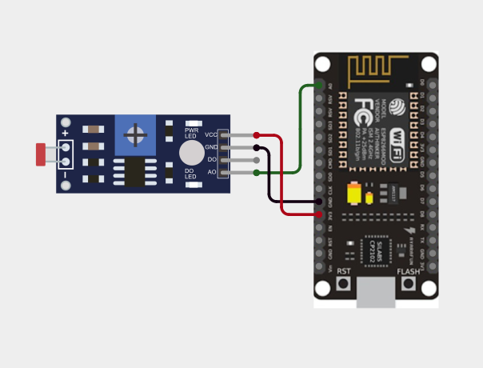
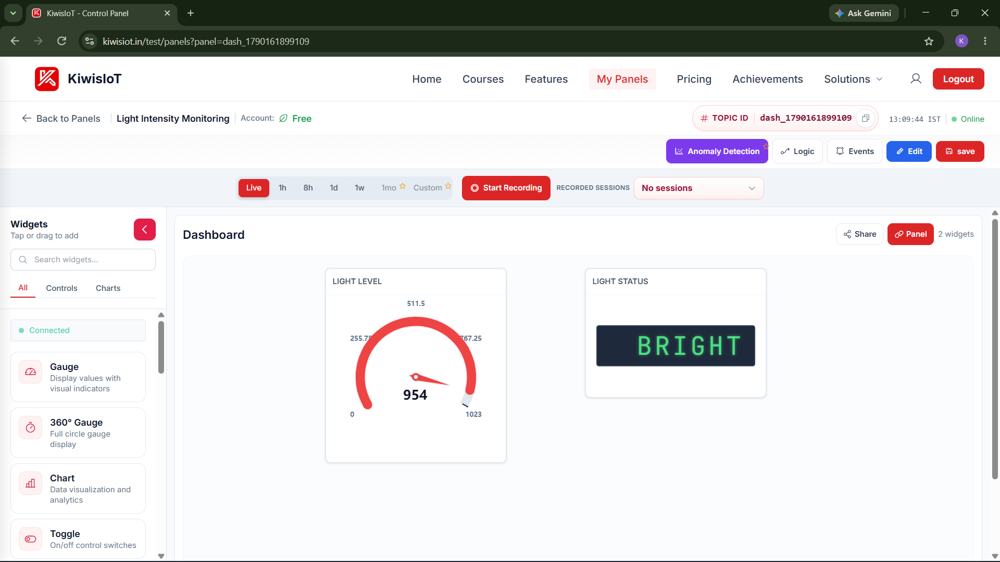
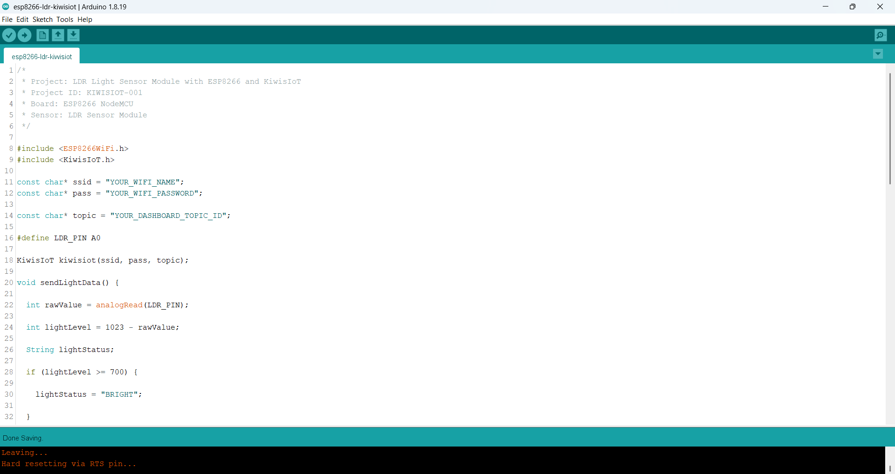
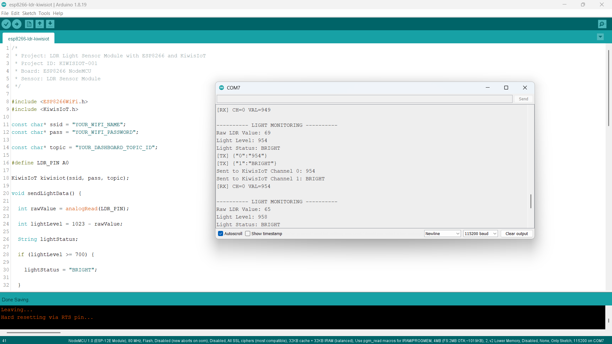

# ESP8266 LDR Sensor IoT Project with KiwisIoT

Monitor **light intensity in real time** using an **LDR sensor, ESP8266 NodeMCU, and KiwisIoT**.

In this project, the ESP8266 reads the analog output from an LDR sensor module, processes the reading into a light-level value, classifies the lighting condition as **BRIGHT, MEDIUM, or DARK**, and sends the data to a KiwisIoT dashboard over Wi-Fi.

The dashboard displays both the numerical **light level** and the current **light status**.

---

## Project Overview

An **LDR (Light Dependent Resistor)** changes its electrical resistance according to the amount of light falling on it.

The LDR sensor module is connected to the analog input of the ESP8266 NodeMCU. The ESP8266 reads the sensor value, calculates a project-specific light level, determines the light condition, and sends the results to KiwisIoT.

The project flow is:

```text
LDR Sensor
     ↓
ESP8266 NodeMCU
     ↓
Analog Reading
     ↓
Light Level Calculation
     ↓
BRIGHT / MEDIUM / DARK
     ↓
Wi-Fi
     ↓
KiwisIoT
     ↓
Dashboard
```

---

## What You'll Learn

By building this project, you will learn how to:

* Connect an LDR sensor module to an ESP8266
* Read an analog sensor value using `analogRead()`
* Process an LDR reading into a light-level value
* Classify light conditions using threshold values
* Send sensor data from ESP8266 to KiwisIoT
* Use KiwisIoT channels for different types of data
* Display sensor readings on an IoT dashboard
* Monitor light conditions remotely over Wi-Fi

---

## Components Required

| Component         |    Quantity |
| ----------------- | ----------: |
| ESP8266 NodeMCU   |           1 |
| LDR Sensor Module |           1 |
| Jumper Wires      | As required |
| USB Cable         |           1 |
| Computer          |           1 |

---

## Software Requirements

* Arduino IDE
* ESP8266 board package
* KiwisIoT Arduino library
* KiwisIoT account
* Wi-Fi connection

### Common KiwisIoT Setup

Before starting this project, complete the common **KiwisIoT Arduino Setup Guide**.

The setup guide covers:

* Arduino IDE installation
* ESP8266 board installation
* ESP8266 board selection
* KiwisIoT Arduino library installation
* KiwisIoT account setup
* Panel creation
* Topic ID
* Dashboard widgets
* Widget configuration

The common setup guide is available in the parent `esp8266` directory:

```text
../kiwisiot-arduino-setup/
```

---

## Circuit Connection

The LDR sensor module provides an analog output that is read by the ESP8266.

Connect the sensor as follows:

| LDR Sensor Module | ESP8266 NodeMCU |
| ----------------- | --------------- |
| VCC               | 3.3V            |
| GND               | GND             |
| AO                | A0              |
| DO                | Not used        |

This project uses the **AO (Analog Output)** pin because the objective is to measure changing light levels.



---

## How the LDR Sensor Works

An LDR, or **Light Dependent Resistor**, changes its resistance according to the amount of light reaching its surface.

The LDR sensor module converts this change into an analog signal that can be read by the ESP8266.

The project reads the analog signal using:

```cpp
int rawValue = analogRead(LDR_PIN);
```

The ESP8266 analog reading used by this project ranges from:

```text
0 → 1023
```

The actual reading can vary depending on the LDR module, lighting conditions, power supply, and environment.

---

## Light Level Calculation

The raw LDR value is processed to create a project-specific **light level**.

The code uses:

```cpp
int lightLevel = 1023 - rawValue;
```

This calculation reverses the raw reading so that a higher calculated light level represents a brighter condition in this project.

The relationship is:

```text
More Light
    ↓
Lower Raw LDR Value
    ↓
Higher Calculated Light Level
```

For example, during testing:

```text
Raw LDR Value: 69
Light Level:   954
Light Status:  BRIGHT
```

The `rawValue` and `lightLevel` are therefore two different values.

* **Raw LDR Value** → direct analog reading
* **Light Level** → processed value used by the project

---

## Light Status Classification

The project converts the calculated light level into three simple lighting conditions.

|  Light Level | Status |
| -----------: | ------ |
| `700 – 1023` | BRIGHT |
|  `300 – 699` | MEDIUM |
|    `0 – 299` | DARK   |

The classification is implemented using:

```cpp
if (lightLevel >= 700) {
    lightStatus = "BRIGHT";
}
else if (lightLevel >= 300) {
    lightStatus = "MEDIUM";
}
else {
    lightStatus = "DARK";
}
```

These threshold values are defined for this project and can be adjusted according to the sensor and application requirements.

---

## KiwisIoT Dashboard

The ESP8266 sends two values to KiwisIoT.

| Channel | Data         | Example  |
| ------- | ------------ | -------- |
| `0`     | Light Level  | `954`    |
| `1`     | Light Status | `BRIGHT` |

The data flow is:

```text
ESP8266
   │
   ├── Channel 0 → Light Level
   │                  ↓
   │              KiwisIoT Gauge
   │
   └── Channel 1 → Light Status
                      ↓
                  KiwisIoT Widget
```

This allows the dashboard to show both the numerical sensor value and an easy-to-understand status.



---

## Dashboard Configuration

Create a KiwisIoT panel for the project and add the required widgets.

### Light Level Widget

Use a **Gauge** widget to display the calculated light level.

Suggested configuration:

```text
Name: Light Level
Channel ID: 0
Minimum Value: 0
Maximum Value: 1023
Unit: ADC
```

The Gauge should receive the value sent by:

```cpp
kiwisiot.send("0", String(lightLevel));
```

For example:

```text
Light Level: 954
```

---

### Light Status Widget

Add a widget to display the lighting condition.

Suggested configuration:

```text
Name: Light Status
Channel ID: 1
```

The widget receives values such as:

```text
BRIGHT
MEDIUM
DARK
```

The status is sent using:

```cpp
kiwisiot.send("1", lightStatus);
```

> The Channel ID configured in the dashboard must match the Channel ID used in the ESP8266 code.

---

## Arduino Code

The project code is located at:

```text
code/esp8266-ldr-kiwisiot.ino
```

The program uses the ESP8266 Wi-Fi library and the KiwisIoT Arduino library:

```cpp
#include <ESP8266WiFi.h>
#include <KiwisIoT.h>
```



---

## Configure Wi-Fi and KiwisIoT

Before uploading the program, update these values:

```cpp
const char* ssid = "YOUR_WIFI_NAME";
const char* pass = "YOUR_WIFI_PASSWORD";

const char* topic = "YOUR_DASHBOARD_TOPIC_ID";
```

Replace:

```text
YOUR_WIFI_NAME
```

with your Wi-Fi network name.

Replace:

```text
YOUR_WIFI_PASSWORD
```

with your Wi-Fi password.

Replace:

```text
YOUR_DASHBOARD_TOPIC_ID
```

with the Topic ID of the KiwisIoT panel created for this project.

For example:

```cpp
const char* topic = "dash_xxxxxxxxxxxxx";
```

> Never publish your actual Wi-Fi password or private credentials in a public GitHub repository.

---

## Complete Arduino Code

```cpp
/*
 * Project: LDR Light Sensor Module with ESP8266 and KiwisIoT
 * Project ID: KIWISIOT-001
 * Board: ESP8266 NodeMCU
 * Sensor: LDR Sensor Module
 */

#include <ESP8266WiFi.h>
#include <KiwisIoT.h>

const char* ssid = "YOUR_WIFI_NAME";
const char* pass = "YOUR_WIFI_PASSWORD";

const char* topic = "YOUR_DASHBOARD_TOPIC_ID";

#define LDR_PIN A0

KiwisIoT kiwisiot(ssid, pass, topic);

void sendLightData() {

  int rawValue = analogRead(LDR_PIN);

  int lightLevel = 1023 - rawValue;

  String lightStatus;

  if (lightLevel >= 700) {
    lightStatus = "BRIGHT";
  }
  else if (lightLevel >= 300) {
    lightStatus = "MEDIUM";
  }
  else {
    lightStatus = "DARK";
  }

  Serial.println();
  Serial.println("---------- LIGHT MONITORING ----------");

  Serial.print("Raw LDR Value: ");
  Serial.println(rawValue);

  Serial.print("Light Level: ");
  Serial.println(lightLevel);

  Serial.print("Light Status: ");
  Serial.println(lightStatus);

  kiwisiot.send("0", String(lightLevel));

  kiwisiot.send("1", lightStatus);

  Serial.print("Sent to KiwisIoT Channel 0: ");
  Serial.println(lightLevel);

  Serial.print("Sent to KiwisIoT Channel 1: ");
  Serial.println(lightStatus);
}

void setup() {

  Serial.begin(115200);

  Serial.println();
  Serial.println("    LDR LIGHT MONITORING    ");

  pinMode(LDR_PIN, INPUT);

  Serial.println("LDR initialized");

  Serial.println("Connecting to KiwisIoT...");

  kiwisiot.begin();

  Serial.println("KiwisIoT initialized");
  Serial.println("Starting light monitoring...");
}

void loop() {

  kiwisiot.run();

  static unsigned long lastSend = 0;

  if (millis() - lastSend >= 2000) {

    lastSend = millis();

    sendLightData();
  }

  delay(100);
}
```

---

## Upload the Program

After configuring the code:

1. Connect the ESP8266 NodeMCU to your computer.
2. Open `esp8266-ldr-kiwisiot.ino` in Arduino IDE.
3. Select the appropriate ESP8266 board.
4. Verify the program.
5. Upload the code to the ESP8266.
6. Open the Serial Monitor.
7. Set the baud rate to:

```text
115200
```

Once the ESP8266 connects to KiwisIoT, it will begin sending light data to the configured dashboard.

---

## Serial Monitor Output

The ESP8266 prints the LDR readings and KiwisIoT transmission information to the Serial Monitor.

A typical output looks like:

```text
---------- LIGHT MONITORING ----------

Raw LDR Value: 69
Light Level: 954
Light Status: BRIGHT

Sent to KiwisIoT Channel 0: 954
Sent to KiwisIoT Channel 1: BRIGHT
```

The project sends updated light information approximately every two seconds.



---

## Understanding the Data Flow

The project processes the sensor data in several stages.

### 1. Read the LDR

```cpp
int rawValue = analogRead(LDR_PIN);
```

### 2. Calculate the light level

```cpp
int lightLevel = 1023 - rawValue;
```

### 3. Determine the light status

```text
700 and above → BRIGHT
300 to 699    → MEDIUM
Below 300     → DARK
```

### 4. Send the light level

```cpp
kiwisiot.send("0", String(lightLevel));
```

### 5. Send the light status

```cpp
kiwisiot.send("1", lightStatus);
```

The complete flow is:

```text
LDR Sensor
    ↓
Raw LDR Value
    ↓
Light Level
    ↓
Light Status
    ↓
KiwisIoT Channel 0 + Channel 1
    ↓
Dashboard
```

---

## Testing the Project

You can test the LDR by changing the amount of light reaching the sensor.

### Bright Light

Place a flashlight or torch near the LDR.

The calculated light level should increase and the project may display:

```text
Light Status: BRIGHT
```

For example:

```text
Raw LDR Value: 69
Light Level: 954
Light Status: BRIGHT
```

### Normal Room Lighting

Place the sensor under normal room lighting.

The light level depends on the surrounding environment and may result in:

```text
BRIGHT
```

or:

```text
MEDIUM
```

### Low Light

Cover the LDR or move it into a darker environment.

The calculated light level should decrease and may produce:

```text
Light Status: DARK
```

> Actual readings vary depending on the LDR module, lighting conditions, circuit, power supply, and environment.

---

## Why Use Two Channels?

This project sends both a numerical value and a status value.

For example:

```text
Channel 0 → 954
Channel 1 → BRIGHT
```

The numerical value provides the measured light level, while the status provides a simple interpretation.

This makes the dashboard easier to understand without requiring the user to interpret the sensor value manually.

---

## Troubleshooting

### LDR Value Does Not Change

Check:

* VCC connection
* GND connection
* AO connection to A0
* Sensor wiring
* Lighting conditions
* LDR sensor module
* Sensor module potentiometer, if applicable

### Light Level Appears Inverted

This project uses:

```cpp
int lightLevel = 1023 - rawValue;
```

This is intentional so that the calculated light level increases as the raw LDR reading decreases.

If your sensor behaves differently, first check the raw LDR readings and then adjust the calculation if necessary.

### Dashboard Does Not Receive Data

Check:

* Wi-Fi name
* Wi-Fi password
* Internet connection
* KiwisIoT Topic ID
* Channel IDs
* Dashboard widget configuration
* KiwisIoT Arduino library
* ESP8266 connection

### Widget Shows No Data

Make sure the Channel ID in the widget matches the Channel ID used in the code.

For example:

```text
ESP8266 Code
     ↓
Channel 0
     ↓
KiwisIoT
     ↓
Light Level Widget
     ↓
Channel 0
```

For the status:

```text
ESP8266 Code
     ↓
Channel 1
     ↓
KiwisIoT
     ↓
Light Status Widget
     ↓
Channel 1
```

### Light Status Does Not Match the Environment

The project uses:

```text
700 and above → BRIGHT
300 to 699    → MEDIUM
Below 300     → DARK
```

These are project-defined thresholds.

You can adjust the values according to the readings obtained from your LDR sensor and the environment where the project is used.

---

## Security

Never publish sensitive credentials in a public GitHub repository.

Do not commit:

* Wi-Fi passwords
* API keys
* Access tokens
* Account passwords
* Private credentials

Use placeholders such as:

```text
YOUR_WIFI_NAME
YOUR_WIFI_PASSWORD
YOUR_DASHBOARD_TOPIC_ID
```

Enter your actual credentials only in your local Arduino project.

---

## Possible Applications

An ESP8266 LDR monitoring system can be used as a starting point for:

* Light intensity monitoring
* Smart lighting systems
* Room brightness monitoring
* Automatic lighting projects
* IoT sensor monitoring
* Environmental monitoring
* Embedded systems projects
* Student IoT projects

The project can also be extended by adding actuators or automation rules based on the measured light level.

---

## Project Structure

```text
001-ldr-kiwisiot/
│
├── README.md
├── LICENSE
├── .gitignore
│
├── code/
│   └── esp8266-ldr-kiwisiot.ino
│
└── images/
    ├── circuit.png
    ├── code.png
    ├── serial-monitor.png
    └── dashboard-output.png
```

---

## Related KiwisIoT Projects

This project is part of the **KiwisIoT ESP8266 project collection**.

The common setup guide is available here:

```text
../kiwisiot-arduino-setup/
```

Other ESP8266 projects can be found in the parent directory.

---

## Frequently Asked Questions

### What is an LDR sensor?

An LDR, or Light Dependent Resistor, is a light-sensitive component whose resistance changes according to the amount of light reaching it.

### Can I connect an LDR sensor to an ESP8266?

Yes. An LDR sensor module with an analog output can be connected to the ESP8266 analog input for light-level monitoring.

### Which ESP8266 board is used in this project?

This project uses an **ESP8266 NodeMCU** development board.

### Which pin is used for the LDR?

The analog output of the LDR module is connected to:

```text
A0
```

### Which KiwisIoT channels are used?

```text
Channel 0 → Light Level
Channel 1 → Light Status
```

### Why does the project use `1023 - rawValue`?

The calculation reverses the raw analog reading so that the project's calculated light level increases when the measured raw value decreases.

### Does the LDR always produce the same reading?

No. LDR readings can vary depending on the sensor module, lighting conditions, circuit, power supply, and surrounding environment.

### Can I change the BRIGHT, MEDIUM, and DARK thresholds?

Yes. The thresholds are defined in the Arduino code and can be changed according to your application.

### Can this project be extended?

Yes. Additional sensors, actuators, automation logic, alerts, charts, and other KiwisIoT dashboard widgets can be added to build a larger IoT application.

---

## Summary

This project demonstrates a simple **ESP8266 LDR IoT monitoring system** using KiwisIoT.

The ESP8266 reads the LDR sensor, processes the analog reading into a light level, classifies the lighting condition, and sends the results to a KiwisIoT dashboard over Wi-Fi.

The final dashboard provides:

```text
Light Level  → Numerical value
Light Status → BRIGHT / MEDIUM / DARK
```

It provides a practical example of how an ESP8266 can collect sensor data and connect it to an IoT platform for remote monitoring.

---

## License

This project is licensed under the MIT License. See the `LICENSE` file for details.
