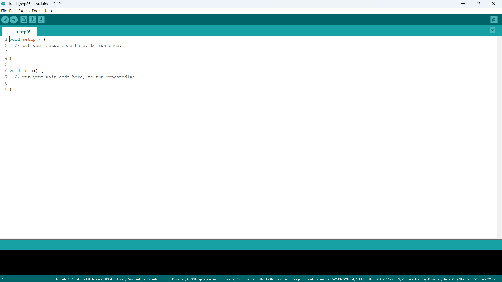
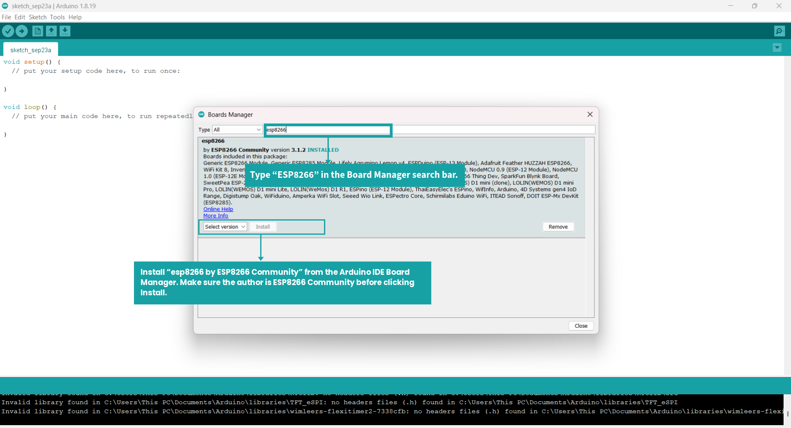
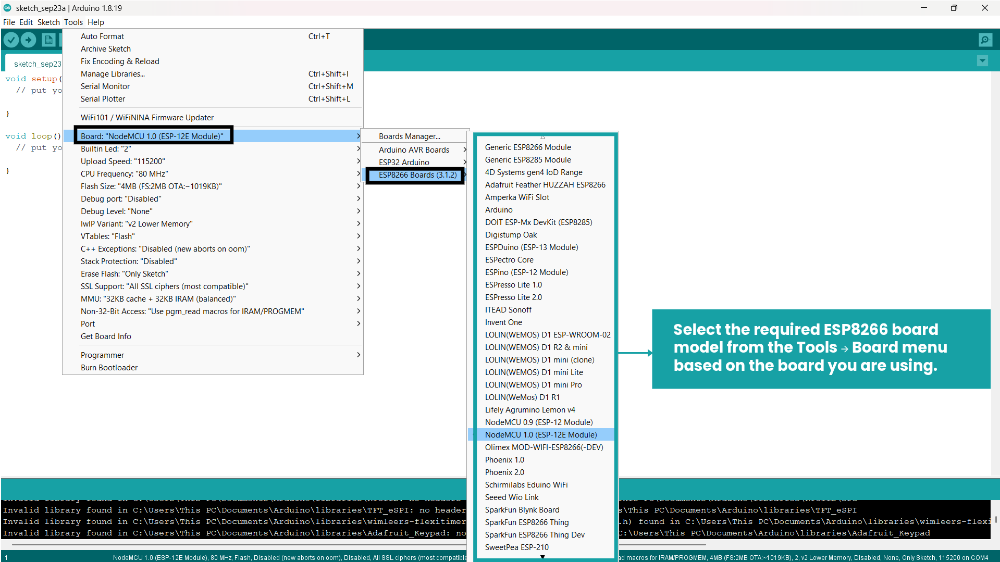
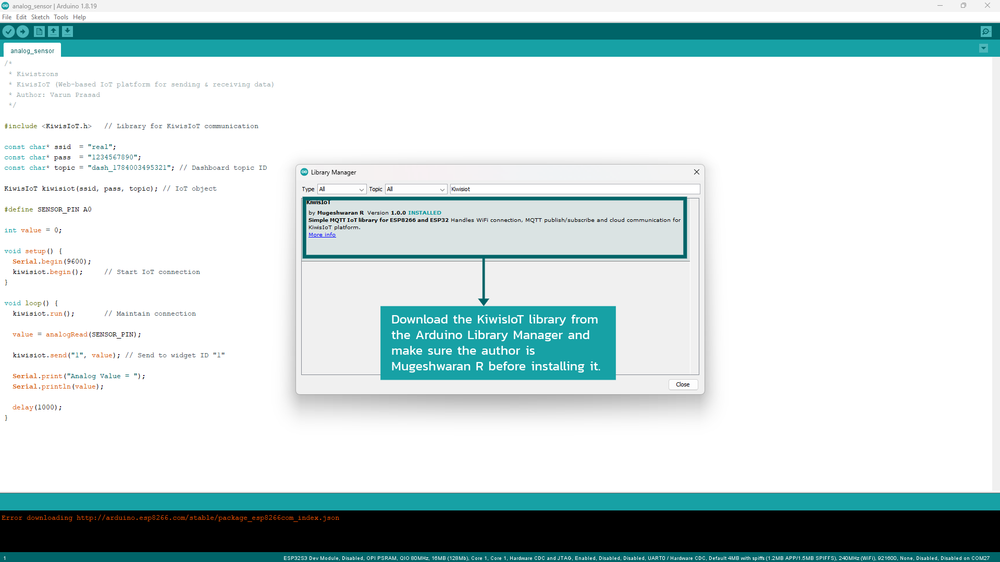
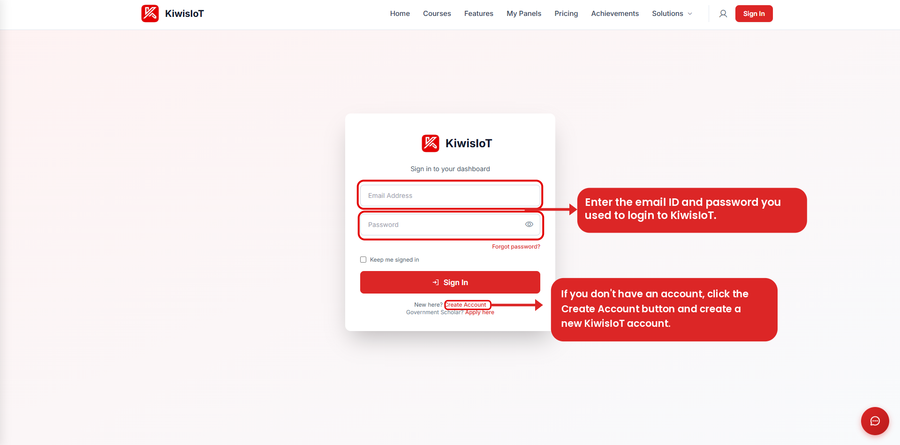
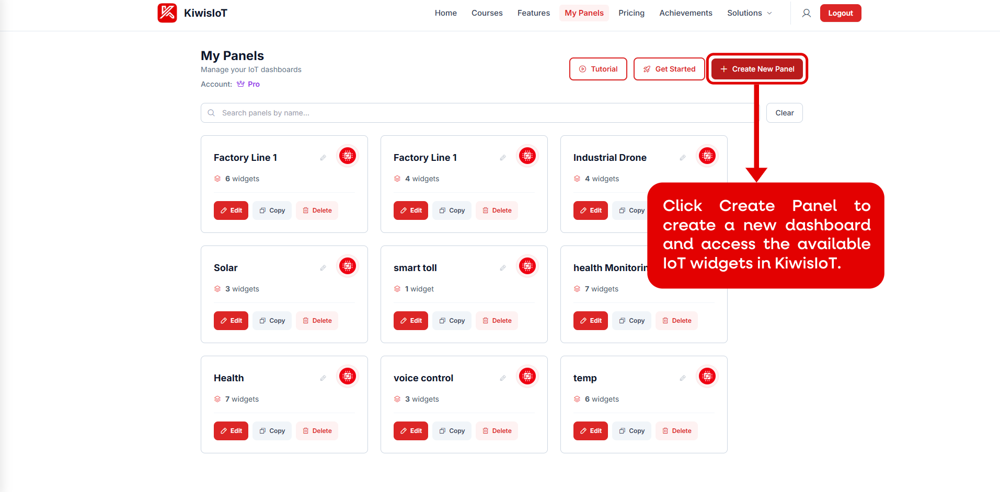
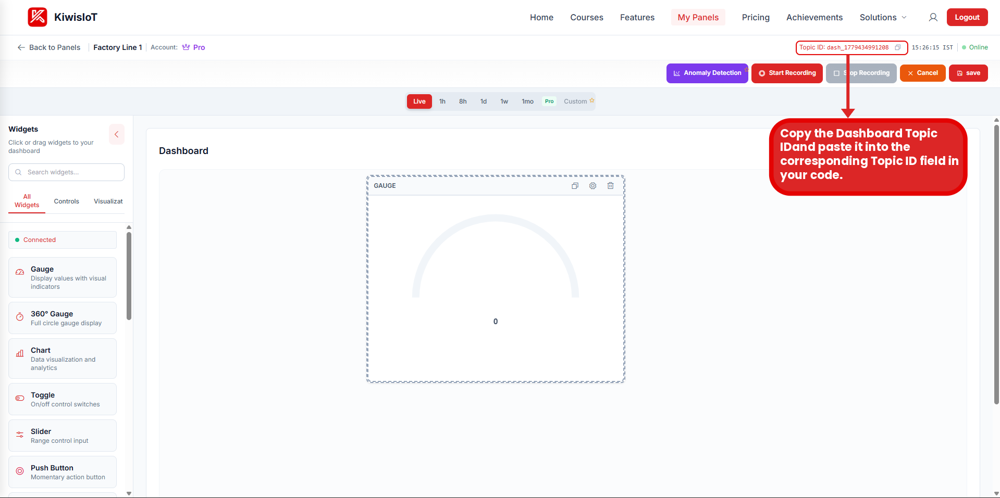
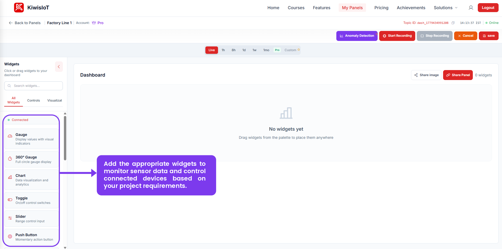
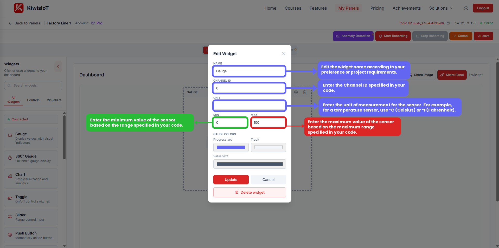
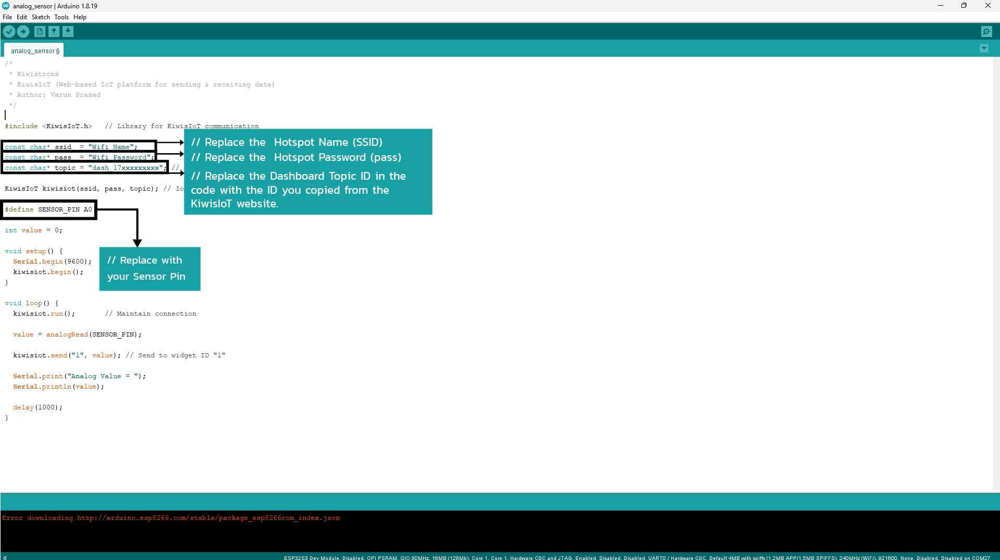

# KiwisIoT Arduino Setup Guide

A beginner-friendly guide for setting up **Arduino IDE, ESP8266, the KiwisIoT Arduino library, and the KiwisIoT dashboard** for IoT projects.

This repository provides the common setup steps required before starting a KiwisIoT-based Arduino or ESP8266 project.

---

## Setup Flow

The complete setup follows this flow:

```text
Arduino IDE
     ↓
ESP8266 Board Package
     ↓
ESP8266 Board Selection
     ↓
KiwisIoT Arduino Library
     ↓
KiwisIoT Account
     ↓
Create Panel
     ↓
Get Topic ID
     ↓
Add Widget
     ↓
Configure Widget
     ↓
Configure ESP8266 Code
     ↓
Start Your IoT Project
```

---

# 1. Install Arduino IDE

Arduino IDE is used to write, compile, and upload programs to ESP8266 and other Arduino-compatible boards.

Download and install Arduino IDE from the official Arduino website:

https://www.arduino.cc/en/software

Open Arduino IDE after installation.



---

# 2. Install the ESP8266 Board Package

Arduino IDE needs the ESP8266 board package before ESP8266 boards can be selected and programmed.

## Open Preferences

In Arduino IDE, go to:

```text
File → Preferences
```

Find:

```text
Additional Boards Manager URLs
```

Add the following ESP8266 board package URL:

```text
https://arduino.esp8266.com/stable/package_esp8266com_index.json
```

Click **OK**.

---

# 3. Install ESP8266 Boards

Open:

```text
Tools → Board → Boards Manager
```

Search for:

```text
ESP8266
```

Find the ESP8266 platform and click **Install**.

Wait until the installation is completed.



After installation, ESP8266 boards will be available in the Arduino IDE board menu.

---

# 4. Select the ESP8266 Board

Open:

```text
Tools → Board
```

Find the ESP8266 section.

For a common NodeMCU ESP8266 development board, select:

```text
NodeMCU 1.0 (ESP-12E Module)
```

Select the board that matches the ESP8266 hardware used in your project.



> The available board names may vary depending on the ESP8266 board package version and the hardware being used.

---

# 5. Install the KiwisIoT Arduino Library

The **KiwisIoT Arduino library** is used by Arduino-based projects to communicate with the KiwisIoT platform.

KiwisIoT projects can include the library using:

```cpp
#include <KiwisIoT.h>
```

## Install Using Library Manager

The KiwisIoT Arduino library can be installed directly through the Arduino IDE Library Manager.

In Arduino IDE, go to:

```text
Sketch → Include Library → Manage Libraries
```

In the Library Manager search box, search for:

```text
KiwisIoT
```

Find the **KiwisIoT** library and click **Install**.

Wait until the installation is completed.



After installation, restart Arduino IDE if necessary.

## Verify the Library

When you open a KiwisIoT project, Arduino IDE should recognize:

```cpp
#include <KiwisIoT.h>
```

If Arduino IDE displays:

```text
KiwisIoT.h: No such file or directory
```

check that the KiwisIoT library has been installed correctly through the Library Manager.

---

# 6. Set Up Your KiwisIoT Account

KiwisIoT provides the dashboard used to monitor and visualize data from connected IoT devices.

Open the KiwisIoT platform:

https://kiwisiot.in

If you already have an account, sign in using your account credentials.

If you are a new user, create a KiwisIoT account first.



After signing in, open **My Panels**.

---

# 7. Create a KiwisIoT Panel

A **Panel** is the dashboard where you can add widgets to monitor sensor data and control connected devices.

Open:

```text
My Panels
```

Click:

```text
Create New Panel
```

Give the panel a suitable name based on your project.

For example:

```text
ESP8266 IoT Monitoring
```

The panel will be used to configure the widgets required by your project.



> The panel name can be different for every project.

---

# 8. Get the Dashboard Topic ID

After creating the panel, open the newly created dashboard.

At the top-right area of the dashboard, locate:

```text
Topic ID
```

The Topic ID identifies the KiwisIoT dashboard used by your project.

For example:

```text
dash_xxxxxxxxxxxxx
```

The actual Topic ID will be different for every dashboard.

Click the copy icon next to the Topic ID and copy it.



## Important

Use **your own Topic ID** for your project.

Do not copy the Topic ID from another project or tutorial.

When publishing code on GitHub, use a placeholder such as:

```text
YOUR_TOPIC_ID
```

---

# 9. Add a Widget

After creating the panel and getting the **Topic ID**, add the appropriate widget to your dashboard.

On the left side of the dashboard, you will find the **Widgets** panel.



KiwisIoT provides different widgets for monitoring sensor data and controlling connected devices.

Available widgets may include:

* **Gauge** – Display values with a visual indicator
* **360° Gauge** – Full-circle gauge display
* **Chart** – Visualize sensor data and trends
* **Toggle** – ON/OFF control
* **Slider** – Range-based control
* **Push Button** – Momentary action control

Choose the widget according to your project requirements.

For example:

* Use a **Gauge** to display a current sensor value.
* Use a **Chart** to visualize sensor values over time.
* Use a **Toggle** to control an ON/OFF device.
* Use a **Slider** when your project requires a range-based control.

You can **click the required widget** from the Widgets panel onto your dashboard.

> Select the widget according to the type of data or control used in your project.

---

# 10. Configure the Widget

After adding a widget to the dashboard, open its settings to configure it according to your project.

The configuration options depend on the widget you selected.



For example, when configuring a **Gauge**, the settings include:

### Name

Enter a suitable name for the widget based on what it displays.

For example:

```text
Temperature
```

```text
Light Sensor
```

```text
Soil Moisture
```

Choose a name that clearly identifies the data being displayed.

### Channel ID

Enter the **Channel ID specified in your ESP8266 code**.

For example, if your project sends data using:

```cpp
kiwisiot.send("1", value);
```

then configure the widget with:

```text
Channel ID: 1
```

The Channel ID in the widget must match the Channel ID used by your project code.

### Unit

Enter the unit of measurement for the sensor data.

Examples include:

```text
°C
```

for temperature,

```text
%
```

for percentage-based values, or

```text
ADC
```

for an analog sensor reading.

The appropriate unit depends on the sensor and the data being sent by your project.

### Minimum Value

Enter the minimum value based on the range specified in your project code.

For example:

```text
Minimum: 0
```

The correct minimum value depends on the sensor and its data range.

### Maximum Value

Enter the maximum value based on the range specified in your project code.

For example:

```text
Maximum: 100
```

The correct maximum value depends on the sensor and its data range.

### Gauge Colors

For widgets such as the Gauge, you can also configure the visual appearance, including:

* **Progress arc**
* **Track**
* **Value text**

Configure these according to your dashboard preferences.

### Save the Configuration

After entering the required settings, click:

**Update**

to save the widget configuration.

If you need to **edit the widget again after clicking Update**, follow these steps:

1. Click **Edit** at the top of the dashboard.
2. Open the widget settings you want to modify.
3. Update the required configuration, such as the **Name, Channel ID, Unit, Minimum Value, Maximum Value**, or other available settings.
4. Click **Update** to apply the changes to the widget.
5. After completing the widget configuration, click **Save** at the top of the dashboard to save the dashboard changes.

> **Note:** The **Update** button saves the changes made inside the widget configuration. The **Save** button at the top of the dashboard saves the overall dashboard changes.

> **Important:** The Channel ID, unit, minimum value, and maximum value are project-specific. Always configure them according to the data sent by your ESP8266 code.

---

# 11. Configure the ESP8266 Code

After configuring the KiwisIoT dashboard, configure your ESP8266 code with your Wi-Fi credentials and KiwisIoT Topic ID.



A typical KiwisIoT project contains:

```cpp
const char* ssid = "YOUR_WIFI_NAME";
const char* pass = "YOUR_WIFI_PASSWORD";

const char* topic = "YOUR_TOPIC_ID";
```

Replace:

```text
YOUR_WIFI_NAME
```

with the name of the Wi-Fi network used by your ESP8266.

Replace:

```text
YOUR_WIFI_PASSWORD
```

with the password of your Wi-Fi network.

Replace:

```text
YOUR_TOPIC_ID
```

with the Topic ID copied from your KiwisIoT dashboard.

## Wi-Fi Configuration

The ESP8266 needs Wi-Fi credentials to connect to the network.

For example:

```cpp
const char* ssid = "YOUR_WIFI_NAME";
const char* pass = "YOUR_WIFI_PASSWORD";
```

Replace the placeholders with your actual Wi-Fi details in your local project.

## Topic ID Configuration

The KiwisIoT Topic ID connects the ESP8266 project to the correct KiwisIoT dashboard.

For example:

```cpp
const char* topic = "YOUR_TOPIC_ID";
```

Replace `YOUR_TOPIC_ID` with the Topic ID copied from your dashboard.

Always use the Topic ID belonging to the panel used by your project.

## Channel Configuration

The Channel ID used in the ESP8266 code must match the Channel ID configured in the KiwisIoT widget.

For example:

```cpp
kiwisiot.send("1", value);
```

uses:

```text
Channel ID = 1
```

Therefore, the corresponding KiwisIoT widget should also be configured with:

```text
Channel ID = 1
```

The actual channel number depends on the individual project.

The relationship is:

```text
ESP8266 Code
     ↓
Channel ID
     ↓
KiwisIoT
     ↓
Dashboard Widget
```

---

# 12. Verify the Setup

After configuring the ESP8266 code and dashboard widget, the ESP8266 can connect to Wi-Fi and send data to the KiwisIoT platform.

The configured widget should then display the corresponding data.

The complete communication flow is:

```text
Sensor
   ↓
ESP8266
   ↓
Wi-Fi
   ↓
KiwisIoT Topic ID
   ↓
Channel
   ↓
Dashboard Widget
```

If the data is displayed correctly, the common KiwisIoT setup is complete.

You can now follow the documentation of your individual project for:

* Sensor connections
* GPIO pin configuration
* Project-specific Arduino code
* Channel assignments
* Widget settings
* Sensor data ranges
* Testing

---

# 13. Troubleshooting

## ESP8266 Board Is Not Available

Check that:

* The ESP8266 Boards Manager URL was added correctly.
* The ESP8266 platform was installed successfully.
* Arduino IDE was restarted if necessary.

## ESP8266 Cannot Be Programmed

Check that:

* The correct ESP8266 board is selected.
* The board is properly connected.
* The USB cable supports data transfer.
* The appropriate port is selected in Arduino IDE.

## KiwisIoT Library Is Not Found

If Arduino IDE displays:

```text
KiwisIoT.h: No such file or directory
```

check that:

1. The KiwisIoT Arduino library is installed.
2. The library was installed correctly.
3. Arduino IDE has been restarted.
4. The project is using the correct library.

## Dashboard Does Not Receive Data

Check:

* Wi-Fi credentials
* Internet connection
* KiwisIoT Topic ID
* Channel ID
* Dashboard widget configuration
* ESP8266 code
* KiwisIoT library installation

## Widget Shows No Data

Check that the Channel ID configured in the widget matches the Channel ID used by the ESP8266 project.

For example:

```text
ESP8266 Project
      ↓
Channel 1
      ↓
KiwisIoT
      ↓
Dashboard Widget
      ↓
Channel 1
```

If the Channel IDs do not match, the widget may not display the expected data.

---

# 14. Security

Never publish sensitive credentials in a public GitHub repository.

Do not commit:

* Wi-Fi passwords
* API keys
* Access tokens
* Private credentials
* Account passwords

Use placeholders such as:

```text
YOUR_WIFI_NAME
YOUR_WIFI_PASSWORD
YOUR_TOPIC_ID
```

For example:

```cpp
const char* ssid = "YOUR_WIFI_NAME";
const char* pass = "YOUR_WIFI_PASSWORD";
const char* topic = "YOUR_TOPIC_ID";
```

Enter your actual credentials only in your local project.

---

# 15. Using This Setup With Other KiwisIoT Projects

This repository is the **common setup guide** for KiwisIoT Arduino and ESP8266 projects.

After completing this setup, the same Arduino environment and KiwisIoT platform can be used for different projects.

For example:

```text
KiwisIoT Arduino Setup
        │
        ├── ESP8266 LDR Monitoring
        ├── Smart Irrigation
        ├── Smart Garage Monitoring
        ├── Smart Fan Control
        ├── MPU6050 Motion Monitoring
        └── Industrial IoT Monitoring
```

Each individual project repository should contain its own:

* Components
* Circuit connections
* Arduino code
* Sensor configuration
* Channel configuration
* Dashboard configuration
* Project-specific images
* Testing instructions

This repository contains only the **common Arduino + KiwisIoT setup**.

---

# Repository Structure

```text
kiwisiot-arduino-setup/
│
├── README.md
├── LICENSE
├── .gitignore
│
└── images/
    │
    ├── arduino/
    │   ├── 01-arduino-ide.png
    │   ├── 02-esp8266-board-install.png
    │   └── 03-board-selection.png
    │
    ├── library/
    │   └── 01-kiwisiot-library.png
    │
    └── kiwisiot/
        ├── 01-login.png
        ├── 02-create-panel.png
        ├── 03-topic-id.png
        ├── 04-add-widget.png
        ├── 05-widget-configuration.png
        └── 06-code-configuration.png
```

---

# Useful Resources

* Arduino IDE: https://www.arduino.cc/en/software
* ESP8266 Arduino Core: https://arduino-esp8266.readthedocs.io/
* KiwisIoT: https://kiwisiot.in

---

## License

This repository is licensed under the MIT License. See the `LICENSE` file for details.

